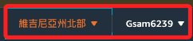
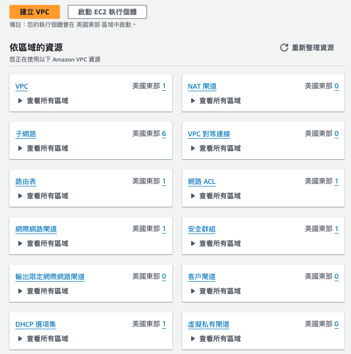

# 基本設定

 

## 登入

1. 選擇 `Sign in using root user email`

    

 

## 設定語言

1. 進入主控台後，點擊右上角齒輪圖標。

    

 

## 使用者

1. 預設區域在 `us-east-1`。

    

 

2. 預設有兩個角色。

    

 

3. 預設會有一個 VPC、六個子網路、一個路由表、一個閘道等。

    

 

___

_END：陸續補足_
