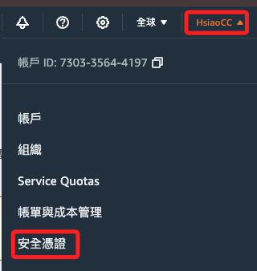
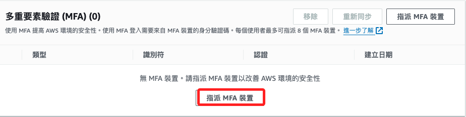
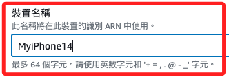
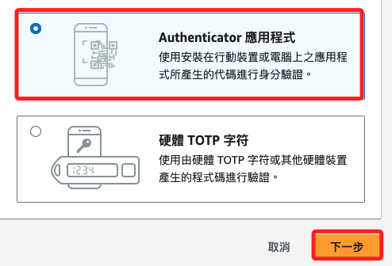
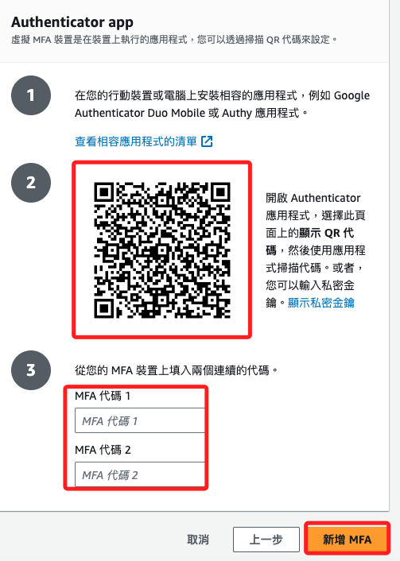
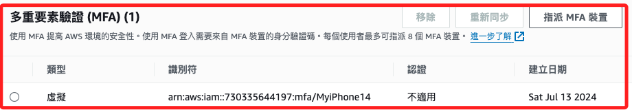

# 雙重認證

 

## 步驟

1.右上點擊 `安全憑證`。

    

 

2. 點擊 `指派 MFA 裝置`。

    

 

3. 命名裝置名稱。

    

 

4. 選擇 `Authenticator 應用程式`，接著 `下一步`。

    

 

5. 掃描 QRCode 後輸入由 APP 生成的連續密鑰兩次，就是當前與再前一次的密鑰，點擊新增 MFA。

    

 

6. 完成後顯示如下。

    

 

___

_END_