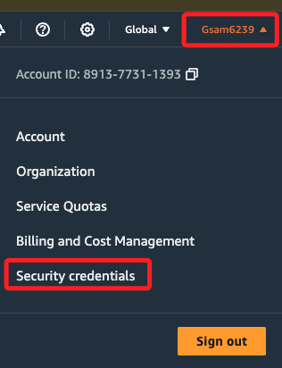
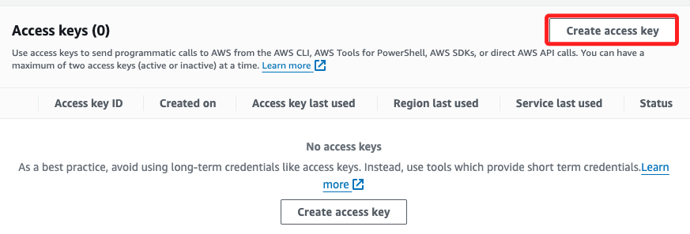
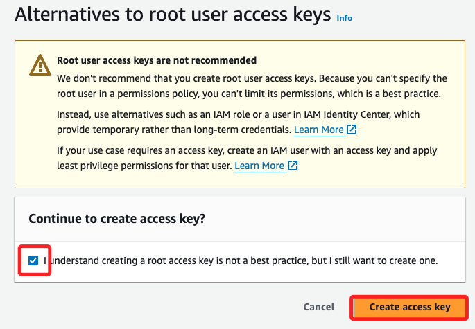
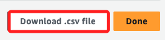
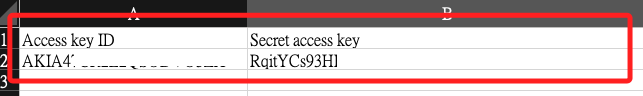

# 建立密鑰

 

## 步驟

1. 進入 AWS 主控台，展開右上角的帳號，點擊 `Security credential`。

    

 

2. 向下滑動到 `Access keys` 區塊，點擊 `Create access key`。

    

 

3. 勾選 `I understand`，點擊右下角 `Create access key`。

    

 

4. 點擊右下角 `Download .csv file`。

    

 

5. `ID` 與 `Key` 都在檔案內。

    

 

___

_END_