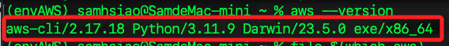
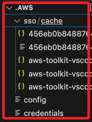
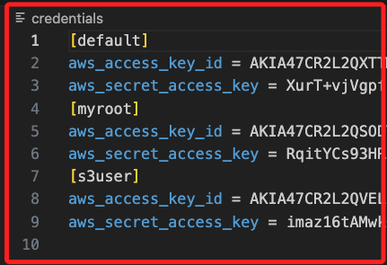
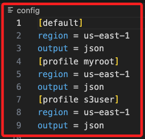
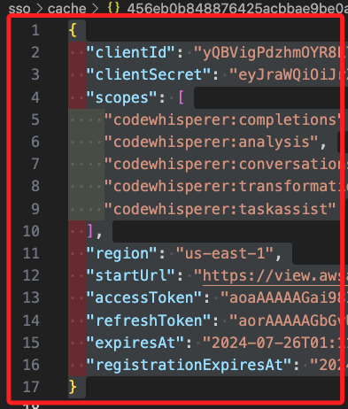

# AWS CLI

_快速設定 AWS CLI 的本地工作環境_

<br>

### 安裝

1. 開啟 [官方說明](https://docs.aws.amazon.com/cli/latest/userguide/getting-started-install.html#cliv2-linux-install)，根據操作系統選擇安裝方式。macOS 使用者可下載 `.pkg` 文件安裝，或使用 CLI 安裝。

    ```bash
    curl "https://awscli.amazonaws.com/AWSCLIV2.pkg" -o "AWSCLIV2.pkg"
    sudo installer -pkg AWSCLIV2.pkg -target /
    ```

<br>

2. 驗證安裝；特別說明，因為 AWS CLI 是用 Python 開發的，因此它需要 Python 執行環境。。

    ```bash
    aws --version
    ```

    

<br>

## 配置 AWS CLI

1. 執行以下命令配置 AWS CLI，系統會提示輸入 AWS Access Key ID、Secret Access Key、預設區域以及輸出格式；特別說明，這需要依據下載的密鑰文件進行設置，而不是在這裡建立一個帳號。

    ```bash
    aws configure
    ```

<br>

## AWS 本地配置說明

1. AWS 在本地的配置文件位置存放在 `~/.aws`，包含兩個文件及一個資料夾 `sso`；

    

<br>

2. `credentials` 文件包含多組 Access Key 和 Secret Key。

    

<br>

3. `config` 文件包含各帳號設定的區域和輸出格式。

    

<br>

4. `sso` 文件夾用於儲存 AWS SSO（Single Sign-On）配置參數，用戶可通過這些 SSO 驗證訪問 AWS 資源；其中 `clientId` 和 `clientSecret` 是應用程式的客戶端 ID 和密鑰，用於身份驗證；`scopes` 則列出 `CodeWhisperer` 提供的不同服務範圍。

    

<br>

5. 補充說明 `AWS CodeWhisperer`，這是整合在 VSCode 中的服務，主要功能是幫助開發者在編寫代碼時提供智能的代碼建議和補全，從而提高編程效率並減少錯誤。

<br>

6. 查詢當前 AWS CLI 或 SDK 的使用者的 ID 和 ARN，確保成功配置了 AWS CLI。

    ```bash
    aws sts get-caller-identity
    ```

<br>

___

_END_