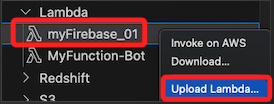

# 在 VSCode 使用 AWS

<br>

## 步驟

1. 下載 AWS Access Key 文件；參考前面小節 _建立密鑰_ 說明。

<br>

2. 使用組合鍵 `SHIFT+command+P` 開啟 _命令選擇區_，輸入 `Connect to AWS`。

    

<br>

3. 會看到幾個選項，可使用現有的連線 `profile`，或是編輯現有的憑證 `Edit Credentials`，或是建立新的連線 `Add New Connection`。

    

<br>

## 編輯憑證

1. 點擊 `Edit Credentials`。

    

<br>

2. 會開啟兩個視窗，分別是 `config`、`credentials`，手動將下載的 `.csv` 密鑰文件內容填入；特別注意，這組設定的 `default` 就是設定值的 `Profile Name`，可以修改，但必須一致。

    

<br>

3. 這兩個文件在本機的位置是 `~/.aws`，可透過指令 `ls -l ~/.aws` 進行觀察。

    

<br>

## 使用插件

1. 點擊左側插件圖標 `AWS`。

    

<br>

2. 假如還沒連線，點擊 `Select a connection`。

    

<br>

3. 點擊 `Add new connection`。

    

<br>

4. 選取 `IAM Credentials` 並點擊 `Continue`。

    

<br>

5. 任意命名如 `sam6239`，`Axxess Key` 就是 `Access key ID`，`Secret Key` 就是 `Secret access key`。

    

<br>

6. 完成後再查看 `credentials` 就會看到新增這個密鑰設定。

    

<br>

7. 假如要登出。

    

<br>

8. 假如要選取已經存在的連線 `profile`。

    

<br>

## 使用插件

1. 在桌面建立一個資料夾 `00_Lambda_Local` 備用。

    ```bash
    cd ~/Desktop && mkdir 00_Lambda_Local && cd 00_Lambda_Local && code .
    ```

<br>

2. 舉例來說，展開 `Lambda` 後，在 `myFirebase_01` 點擊右鍵，可點擊 `Download`。

    

<br>

3. 上方會展開選單，可使用當前預設的路徑，或是選擇任一路徑；這裡使用前面步驟建立的 `00_Lambda_Local `。

    

<br>

## 編輯之後

1. 若是測試寫入 Firebase Realtime Database，可修改腳本來觀察。

    

<br>

2. 編輯完成，在插件視窗中，選擇所編輯的 Lambda 並點擊右鍵，選擇 `Upload`。

    

<br>

3. 在第一個彈出選單中選擇 `Directory`。

    

<br>

4. 選擇 `No`。

    

<br>

5. 選擇資料夾後點擊 `打開`。

    

<br>

6. 彈出視窗中表示 `將立即對所選程式碼發佈為 Lambda 的 $LATEST 版本：myFirebase_01。`，點擊 `YES`。

    

<br>

7. 完成時右下角顯示 `uploaded`。

    

<br>

8. 近入 AWS 控制台，這裡是看不到壓縮的文件內容，切換到 `Test` 進行測試，完成時會顯示成功，資料庫也會更新。

    

<br>

___

_END_