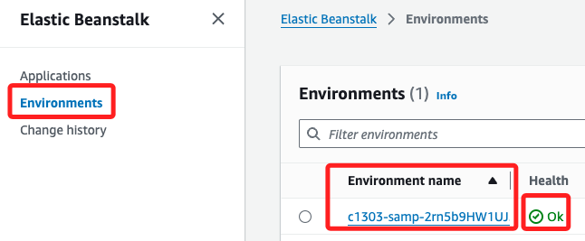

# Task 01：訪問 Elastic Beanstalk

 

## 環境確認

1. 搜尋並進入服務 `Elastic Beanstalk`。

    

 

2. 預設會進入 `Enviroments` 頁籤，Lab 已經準備好一個前綴為 `c1303-samp-` 的環境，在此先確認其狀態為 `Ok`。

    

 

3. 點擊域名連結。

    

 

4. 顯示 HTTP 404 錯誤，表示尚無應用程式在運行。

    

 

