# Task 02：部署應用

## 步驟

1.  下載官方範例文件 [tomcat.zip](https://docs.aws.amazon.com/elasticbeanstalk/latest/dg/samples/tomcat.zip) 到本地資料夾。

    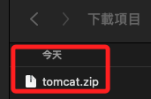

 

2. 在 Elastic Beanstalk 控制台中展開選單，點擊 `Enviroments`，然後點擊右側的 `Enviroment name` 項目下的實例。

    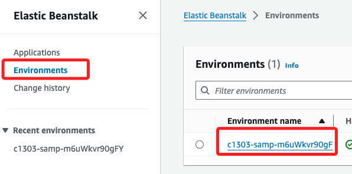

 

3. 點擊 `Upload and Deploy`。

    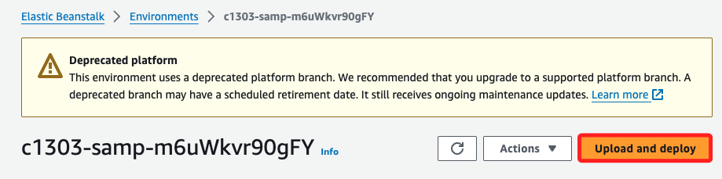

 

4. 選擇前面步驟下載到本地的壓縮文件 `tomcat.zip`，然後點擊右下角 `Deploy`。

    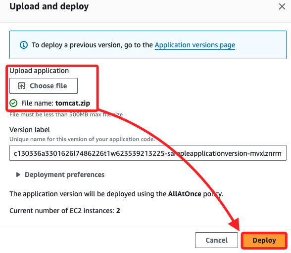

 

5. 點擊後會看到 `updating` 的訊息彈窗。

    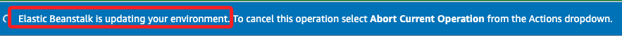

 

6. 重新回到 `Enviroments` 頁籤中，確認環境對象的狀態是不是 `OK`。

    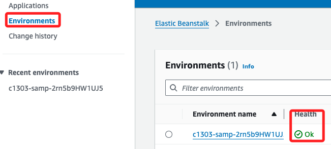

 

7. 確認後，刷新域名網頁便看到部署的範例應用程式。

    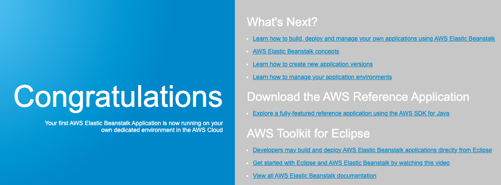

 

## 查看資源

1. 在控制台中，選擇 `Configuration`。

    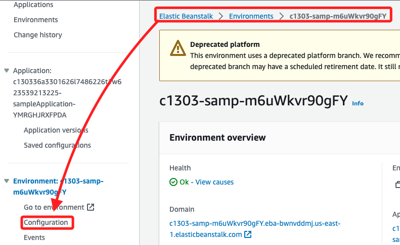

 

2. 可查看實例流量、擴展、EC2 安全群組等設置；也可以為應用程式環境添加資料庫。

    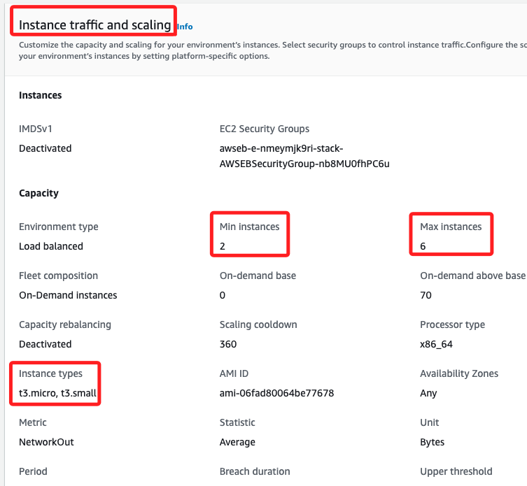

 

3. 在 `Networking and database` 可知當前並無資料庫設置；點擊右側 `Edit`。 

    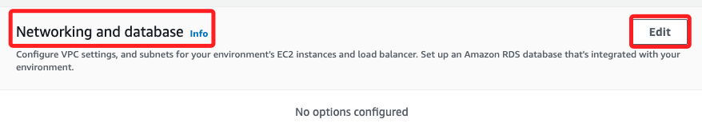

 

4. 這裡暫時不做任何設置，點擊 `Cancel`。

    

 

5. 點擊左側的 `Monitoring`。

    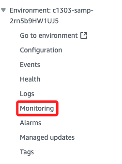

 

6. 這裡可以提供圖表來觀察 EB。

    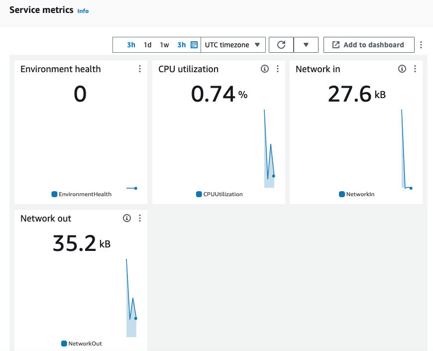

 

___

_END_