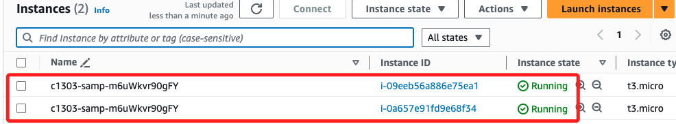

# 探索 AWS 資源

 

## 步驟

1. 前往 EC2 控制台並切換到 `Instances`，可查看由 `Elastic Beanstalk` 建立的兩個實例。

    

 

## 各類查看

_進一步探索負載均衡器和自動擴展組等資源_

 

1. 查看安全群組，會看到有一個包含了 `80` 埠。

    

 

2. 另外，教程中提到 `A load balancer that both instances belong to`；首先，`負載平衡器` 相關的安全群組通常會以 `awseb` 最為前綴來命名，在下圖中，可以看到兩個在安全群組使用了前綴 `awseb`，這就是 Elastic Beanstalk 創建的。

    

 

3. 切換到 `Load Balancers` 頁籤。

    

 

4. 切換到 `Target instances` 頁籤，可知這兩個實例已經被註冊到負載平衡器的 `Target Group` 中，這就是前面提到的 `A load balancer that both instances belong to`，負載平衡器會根據網路流量負載，將請求分配到這些 `In-service` 的實例。

    

 

5. 切換到 `Auto Scaling Groups` 頁籤。

    

 

6. 教程中描述了 `Auto Scaling group` 會根據網路負載動態擴展或縮減實例的數量；這個自動擴展組目前維持 `2` 個實例，當流量上升時，它可以自動擴展到最多 6 個實例來應對需求。

    

 

## 完成

_Submit && End Lab_

 

___

_END_