# IAM 簡介

<br>

## 說明

1. 這個 Lab 會展示這樣的架構。

    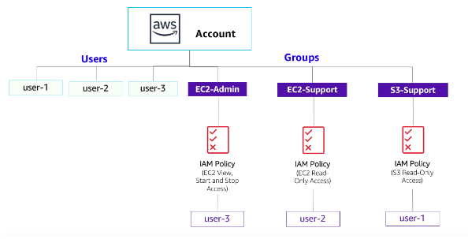

<br>

## Task 01

1. 搜尋並進入 IAM，點擊左側 `Users`，內有三個 User，分別是 `user-1`、`user-2`、`user-3`；請無視另一個 User。

    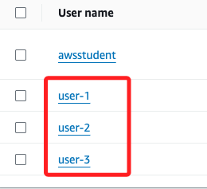

<br>

2. 點擊進入 `user-1`，觀察 `Permissions` 頁籤，可知沒有任何 permission。

    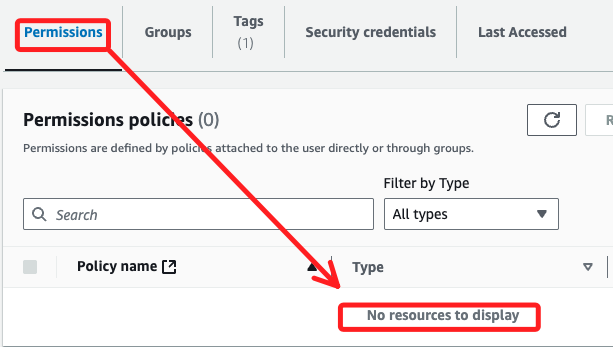

<br>

3. 點擊 `Groups`，user-1 也不隸屬任何 group。

    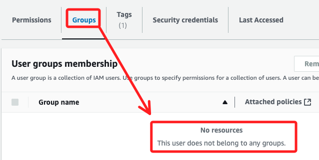

<br>

4. 點擊 `Security credentials`，user-1 有一組 `Console password`。

    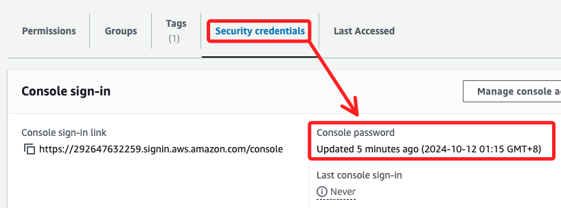

<br>

5. 在左側選擇 `User groups`，Lab 中已預設三組，分別為 `EC2-Admin`、`EC2-Support`、`S3-Support`。

    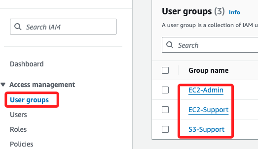

<br>

6. 點擊進入 `EC2-Support` 的鏈接。

    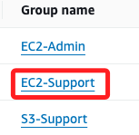

<br>

7. 切換到頁籤 `Permissions`，已經附加了一組 AWS 內建的策略 `AmazonEC2ReadOnlyAccess`；當策略被更新時，更改會立即應用於所有附加該策略的用戶和組。

    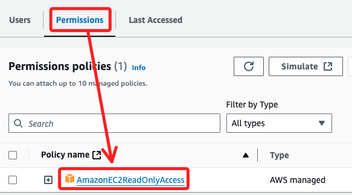

<br>

8. 點擊 `AmazonEC2ReadOnlyAccess` 策略左側的 `加號（+）` 圖標可展開查看詳細信息；點擊 `減號（-）` 考收合策略詳細信息。

    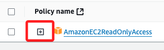

<br>

9. 策略定義了對特定 AWS 資源允許或拒絕的操作。

    ```json
    {
        "Version": "2012-10-17",
        "Statement": [
            {
                "Effect": "Allow",
                "Action": "ec2:Describe*",
                "Resource": "*"
            },
            {
                "Effect": "Allow",
                "Action": "elasticloadbalancing:Describe*",
                "Resource": "*"
            },
            {
                "Effect": "Allow",
                "Action": [
                    "cloudwatch:ListMetrics",
                    "cloudwatch:GetMetricStatistics",
                    "cloudwatch:Describe*"
                ],
                "Resource": "*"
            },
            {
                "Effect": "Allow",
                "Action": "autoscaling:Describe*",
                "Resource": "*"
            }
        ]
    }
    ```

<br>

## 關於政策

_延續之前的 Policy，IAM Policy 中 Statement 的基本結構包含三部分_

<br>

1. Effect 說明是否允許或拒絕權限。

<br>

2. Action 指定可以針對 AWS 服務（例如 cloudwatch:ListMetrics）進行的 API 調用。

<br>

3. Resource 定義了策略規則所涵蓋的實體範圍（例如特定的 Amazon S3 存儲桶或 Amazon EC2 實例，或 * 表示任何資源）。

<br>

## 回到面板中

1. 點擊左側 `User groups`，點擊進入 `S3-Support` 組，然後切換到 `Permissions`。

    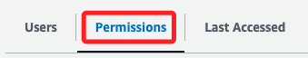

<br>

2. 該組附加預設了 `AmazonS3ReadOnlyAccess` 策略。

    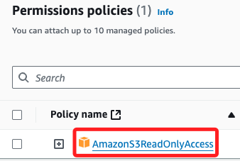

<br>

3. 同樣點擊 `加號（+）` 圖標展開查看；該策略授予對 Amazon S3 中的資源進行獲取和列出的許可權。

    ```json{
        "Version": "2012-10-17",
        "Statement": [
            {
                "Effect": "Allow",
                "Action": [
                    "s3:Get*",
                    "s3:List*",
                    "s3:Describe*",
                    "s3-object-lambda:Get*",
                    "s3-object-lambda:List*"
                ],
                "Resource": "*"
            }
        ]
    }
    ```

<br>

4. 在左側的點擊 `User groups`，進入 `EC2-Admin` 組查看 `Permissions`；該組與其他兩個組略有不同，它沒有管理策略，而是具有內聯策略 `Customer inline`，這是一個僅分配給一個用戶或組的策略，內聯策略通常用於為一次性情況應用許可權。

    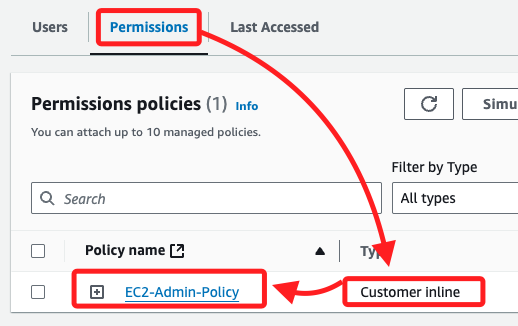

<br>

5. 該策略授予查看（描述）有關 Amazon EC2 的信息的許可權，並且還有啟動和停止實例的能力。

    ```json
    {
        "Version": "2012-10-17",
        "Statement": [
            {
                "Action": [
                    "ec2:Describe*",
                    "ec2:StartInstances",
                    "ec2:StopInstances"
                ],
                "Resource": [
                    "*"
                ],
                "Effect": "Allow"
            }
        ]
    }
    ```

<br>

## 商業場景

1. 假設公司正在擴大對 `Amazon Web Services` 的使用，並且正在使用許多 `Amazon EC2` 實例和大量 `Amazon S3` 存儲，所以要根據工作職能授予新員工訪問權限，規劃如下。

    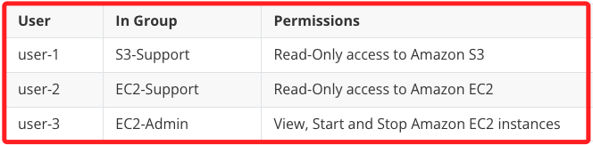

<br>

___

_END_
