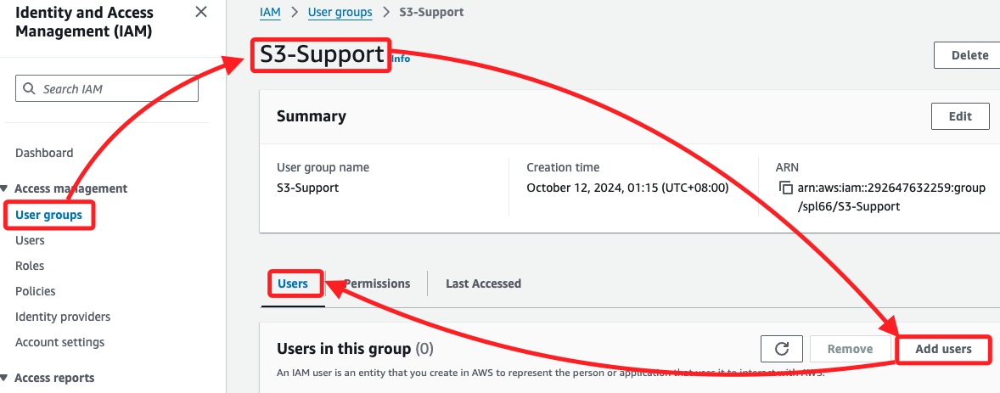
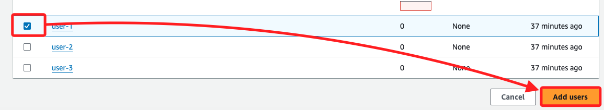
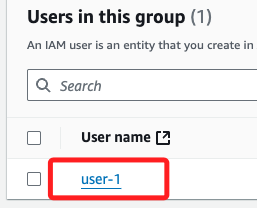
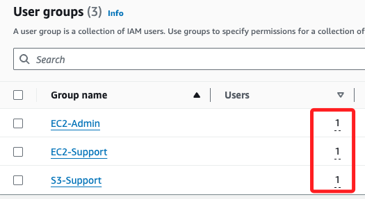

# Task 2：將用戶添加到組

_假設情境：雇用 `user-1`，將把他們添加到 S3-Support 組；忽略在此任務中出現的任何 `未授權` 錯誤，這是由於實驗帳戶具有有限的許可權，並且不會影響完成實驗的能力。_

 

## 將 `user-1` 添加到 `S3-Support` 組

1. 在左側欄切換到 `User groups`，點擊進入 `S3-Support` 組，然後在 `Users` 頁籤中點擊右上方的 `Add users`。

    

 

2. 滾動到最下方，勾選 `user-1` 後點擊右下角的 `Add users`。

    

 

3. 完成後會自動返回清當中，這時會看到 `user-1` 已被添加到該組。

    

 

4. 接著，將 `user-2` 加到 `EC2-Support` 組。

 

5. 將 `user-3` 添加到 `EC2-Admin` 組。

 

6. 回到 IAM 主控台，在左側欄點擊 `User groups`，現在每個組在用戶列中皆顯示 `1`，這是每個組中的用戶數量。

    

 

___

_END_
