# Task 3：登錄並測試用戶

_測試每個 IAM 用戶的許可權_

 

## 步驟

1. 在 IAM 主控台中，點擊左側的 Dashboard。

`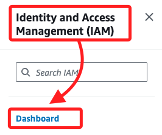

 

2. 往下滑動到 `AWS Account` 區塊，這裡有個 `Sign-in URL for IAM users in this account` 用於顯示 IAM 用戶的登錄 URL 連結；複製此鏈接。

`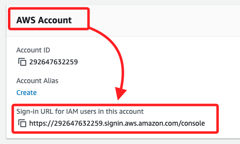

 

## 登錄到當前使用的 AWS 帳戶

1. 開啟新的無痕瀏覽視窗，貼上前面複製的網址。

 

2. 開啟頁面後，輸入用戶名 `user-1`、密碼 `Lab-Password1` 然後點擊 `Sign in`。

    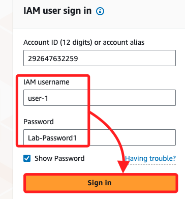

 

3. 搜索並進入 `S3` 控制台。

    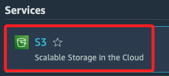

 

4. 預設會使用系統預設的語言，點擊齒輪進行切換。

    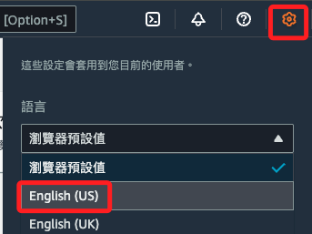

 

5. 點擊 `Buckets` 並瀏覽內容；由於當前用戶是 IAM 中 `S3-Support` 組的一部分，因此有權查看 `S3` 相關內容。

    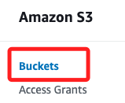

 

## 訪問 EC2

1. 搜索並進入 `EC2`。

 

2. 在左側欄點擊 `Instances`，無法看到任何實例，還會看到消息指出無權限。

    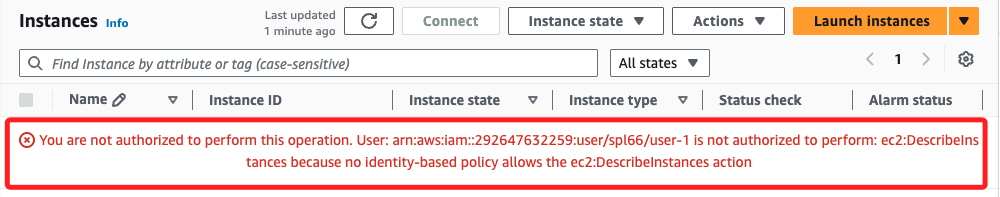

 

## 切換用戶

_可使用當前使用的無痕視窗，或開啟新的無痕視窗_

 

1. 改以 `user-2` 登錄，其他相同步驟不在贅述，使用用戶名 `user-2`、密碼 `Lab-Password2`。

    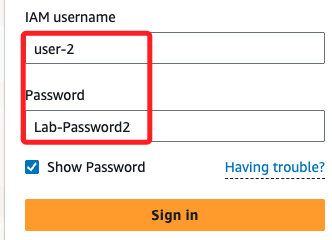

 

2. 搜索並進入 `EC2`，同樣在左側欄點擊 `Instances`；與之前不同，現在能夠看到 EC2 Instances，因為當前使用者擁有惟讀許可權。

    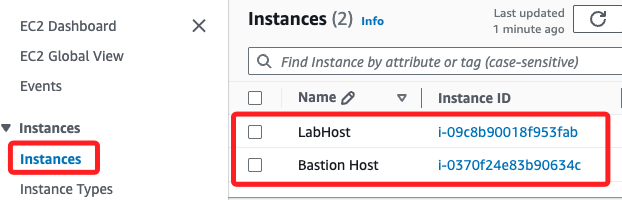

 

## 嘗試停止實例

1. 勾選 `LabHost` 實例，展開 `Actions` 後點擊 `Stop instance`。

    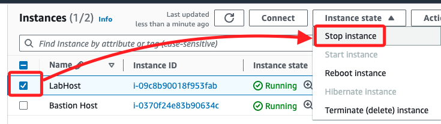

 

2. 再次點擊 `Stop`。

    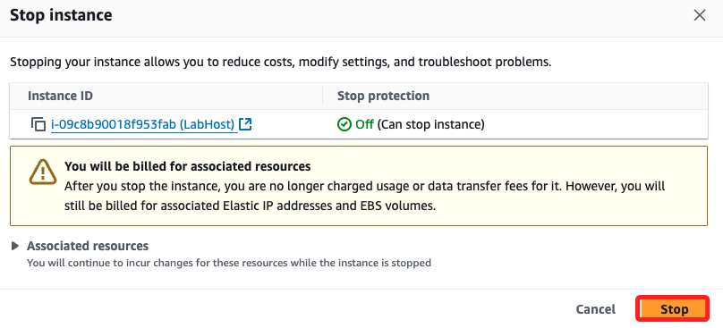

 

3. 畫面會出現錯誤消息，指出無權限執行此操作；這表明該策略僅允許查看信息，而不進行更改。

    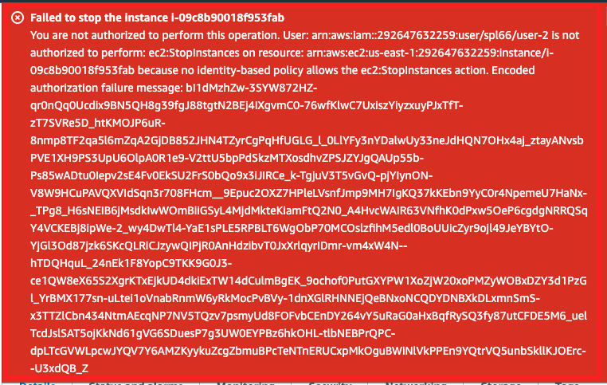

 

## 檢查 S3

1. 搜索並進入 `S3` 控制台。

 

2. 點擊 `Buckets`，會看到消息表明沒有權限列出 Buckets，因為 `user-2` 沒有訪問 Amazon S3 的許可權。

    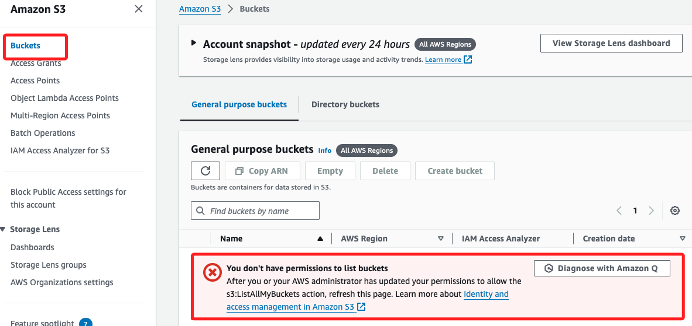

 

## 切換到 user-3

1. 相同部分不贅述，使用用戶名 `user-3`、密碼 `Lab-Password3`。

    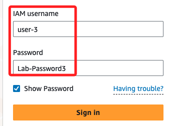

 

2. 進入EC2 控制台，並在左側欄選擇 `Instances`。

 

3. 對 `Instances` 進行停止，點擊後會顯示 `Stopping`；完成時狀態會改變為 `Stopped`。

    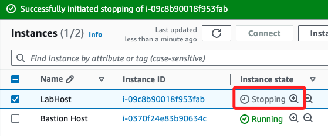

 

___

_END_