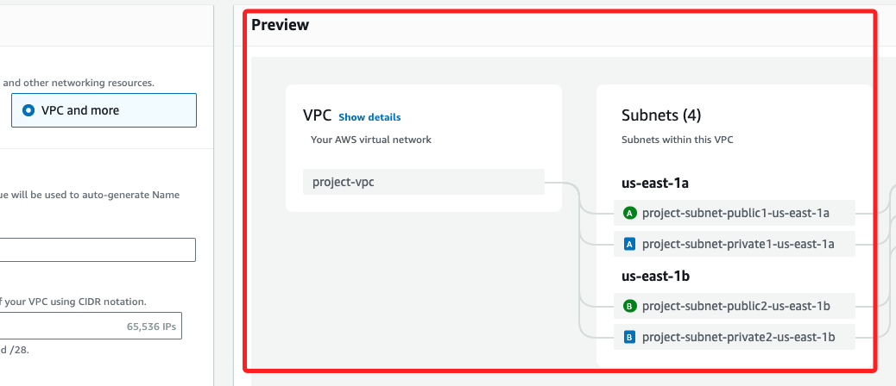
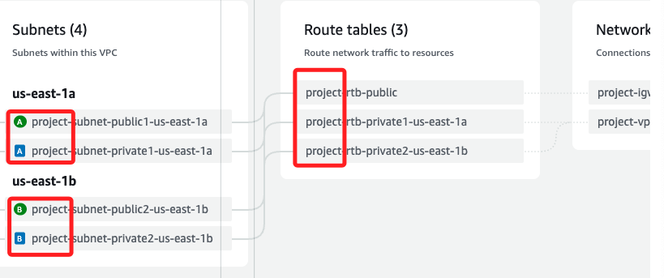
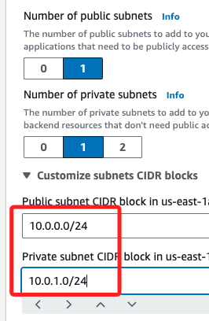
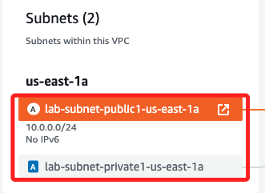
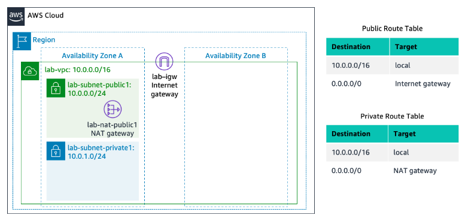

# Task 01：建立 VPC

 

## 步驟

1. 搜尋並進入服務 VPC；進入後確認所在區域為 `N. Virginia (us-east-1)`；在 Lab 環境中應該都被侷限在這個區域。

    

 

2. 點擊進入 `VPCs` 觀察一下當前的 VPCs，有兩個。

    

 

3. 點擊右上角 `Create VPC`，建立新的 VPC。

    

 

## 建立設定

1. 選擇 `VPC and more`。

    

 

2. 畫面的右側有 `Preview` 視圖，可預覽網路設施的樹狀圖。

    

 

3. 可觀察名稱都帶有前綴 `peoject`，這是預設的網路名稱，稍後將進行修改。

    

 

4. 勾選名稱自動生成 `Auto-generate`，並將預設的命名改為 `lab`；注意，右側預覽畫面中的名稱 `project-vpc` 也會更改為 `lab-vpc`，所有的前綴也會改為 `lab`。

    

 

## 設定網路

1. 選擇 `1` 個可用區 `AZs`。

    

 

2. 展開 `Customize subnets CIDR blocks` 區塊，公共子網 CIDR 設置為 `10.0.0.0/24`，私有子網 CIDR 設置為 `10.0.1.0/24`；使用滑鼠點擊正確位置後，以鍵盤輸入即可。

    

 

3. NAT 閘道設為 `1` 個可用區。

    

 

4. `VPC endpoints` 設置為 `None`。

    

 

## 預覽並檢查

_名稱如前說明已自動變更為 `lab-vpc`_

 

1. Subnets (2)。

    

 

2. Route tables (2)。

    

 

3. Network connections (2)。

    

 

4.  確認設定並點擊下方的 `Create VPC`。

    

 

5. 過程還蠻耗時的。

    

 

6. 完成後點擊 `View VPC` 進行檢視。

    

 

## 說明 IPv4 CIDR

1. 從 Details 視窗中可以看到建立的 `IPv4 CIDR` 是 `10.0.0.0/16`；這是 VPC 的 CIDR，代表 VPC 可以擁有從 `10.0.0.0` 到 `10.0.255.255` 的 IP 地址範圍。

    

 

2. 而子網是在 VPC 內劃分的小網路範圍，前面設定了 `10.0.0.0/24` 和 `10.0.1.0/24` 兩個子網的範圍，它們分別位於 VPC 的 `10.0.0.0/16` 之下，子網共享 VPC 的大範圍，但自身有各自的更小的 IP 範圍；可分別點擊並展開預覽圖中的子網來觀察這個範圍。

    

 

## 官網

___

_END_
