# Task 04：啟動 Web 伺服器

<br>

## 步驟

1. 搜尋並進入 EC2 主控台，點擊 `Launch instance`。

    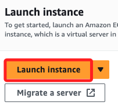

<br>

2. 命名為 `Web Server 1`。

    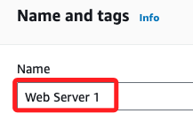

<br>

3. 密鑰對選擇 `vockey`。

    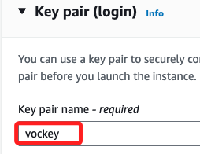

<br>

4. 接著在 `Network settings` 區塊，點擊標題右側的 `Edit`。

    

<br>

## 進入 `Network settings`

1. VPC 選擇 `lab-vpc`、子網選擇 `lab-subnet-public2`、`Auto-assign public IP` 設定為 `Enable`。

    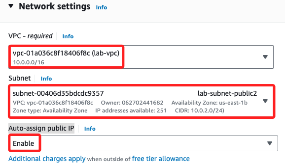

<br>

2. 防火牆 `Firewall` 切換到 `Select existing security group`，然後在選單中選擇 `Web Security Group`。

    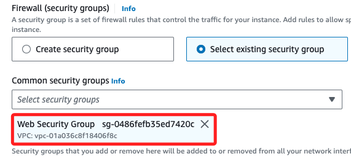

<br>

3. 展開最下方的 `Advanced details`，將以下代碼貼到 `User data` 欄位中。

    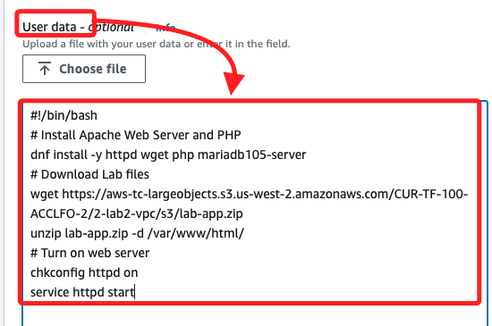

<br>

4. 完整代碼如下，可進行複製。

    ```bash
    #!/bin/bash
    dnf install -y httpd wget php mariadb105-server
    wget https://aws-tc-largeobjects.s3.us-west-2.amazonaws.com/CUR-TF-100-ACCLFO-2/2-lab2-vpc/s3/lab-app.zip
    unzip lab-app.zip -d /var/www/html/
    chkconfig httpd on
    service httpd start
    ```

<br>

5. 以上是個一般的 Bash 腳本，所以不需要勾選 `User data has already been base64 encoded`，AWS 會自動將該腳本進行 Base64 編碼並傳遞給 EC2 實例；點擊 `Launch instance` 啟動。

    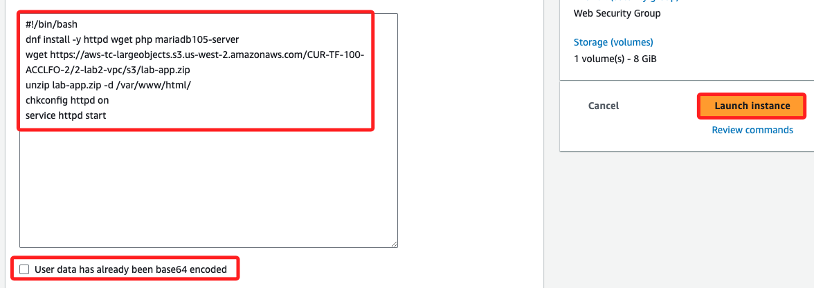

<br>

## 連接 Web 伺服器

_完成後上方彈窗會顯示實例狀態為 `Success` _

<br>

1. 在 Instances 中點擊進入實例。

    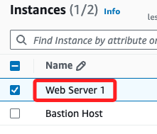

<br>

2. 複製 `Public IPv4 address`，貼在瀏覽器中進行訪問。

    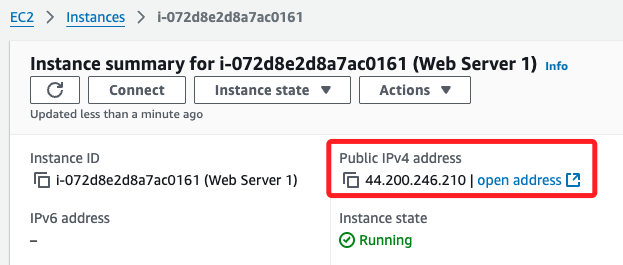

<br>

3. 顯示畫面如下。

    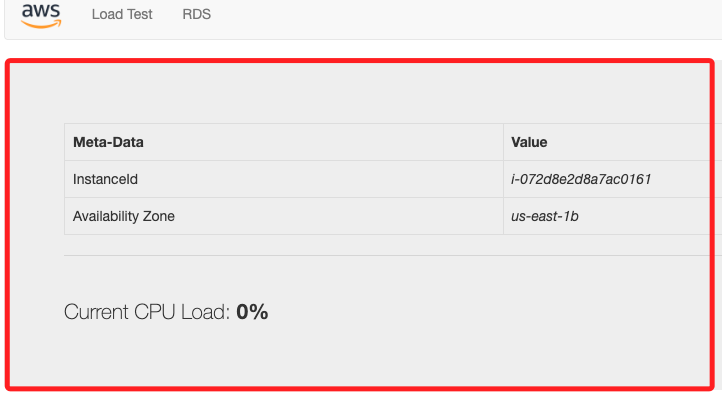

<br>

4. 以下是官方提供的 Lab 設施架構圖。

    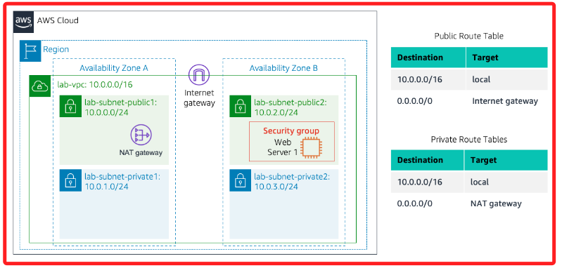

<br>

## 完成

_`Submit` & `End Lab`_

<br>

___

_END：完成 Lab2 之後，可接著做 Lab5_