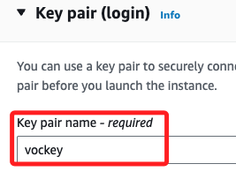
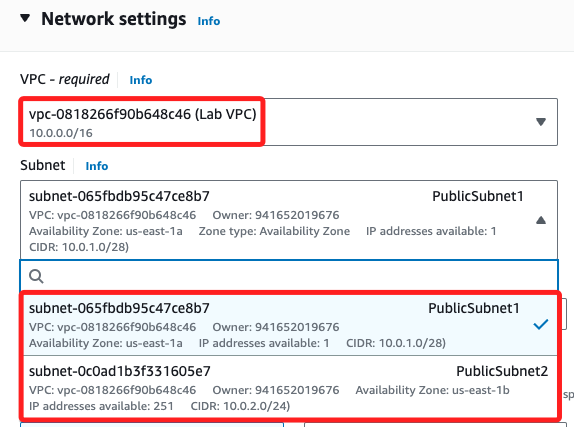
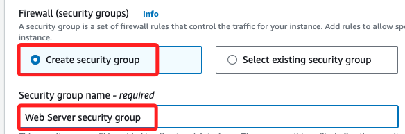
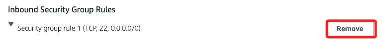
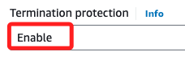
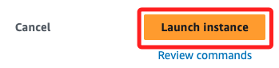

#  Task 1：啟動 Amazon EC2 實例

<br>

## 步驟

1. 搜尋並進入 `EC2` 主控台，確認當前區域為 `N. Virginia (us-east-1)`，點擊 `Launch instance`；在 Lab 中的可用區域已限制在 `us-east-1`。

<br>

2. 實例命名為 `Web Server`，`Key pair` 選擇 `vockey`；這個 Key 是 Lab 預設準備的。

    

<br>

3. 在 `Network settings` 點擊右側的 `Edit`，VPC 選用 `Lab VPC`，這是一個包含兩個公共子網的 VPC。

    

<br>

4. 在 `Firewall (security groups)` 部分選擇 `Create security group` 建立安全群組，命名為 `Web Server security group`。

    

<br>

5. 在 `Inbound Security Group Rules` 區塊點擊 `Remove`，這會移除預設的入站規則 `Inbound Security Group Rules`。

    

<br>

## `Advanced details ` 進階設置

_在設定頁面最下方_

<br>

1. 找到 `Termination protection`，展開選單並設置為 `Enable`。

    

<br>

2. 在 `User Data` 輸入以下指令腳本；這個腳本在啟動實例後，可將使用者資料傳遞給實例，而這些資料會在實例啟動後執行自動化安裝和設定任務，包含了安裝 `Apache Web` 伺服器 (httpd)、將 Web 伺服器設定為開機自動啟動、安裝完成後執行 Web 伺服器、建立一個簡單的網頁。

    ```bash
    #!/bin/bash
    dnf install -y httpd
    systemctl enable httpd
    systemctl start httpd
    echo '<html><h1>Hello From Your Web Server!</h1></html>' > /var/www/html/index.html
    ```

<br>

3. 完成後，點擊右下方的 `Launch instance`。

    

<br>

___

_END_