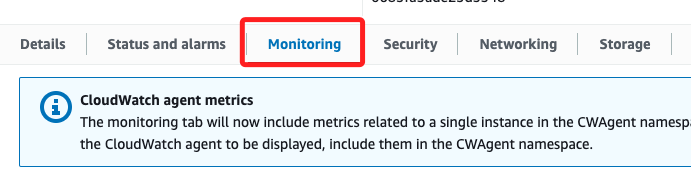
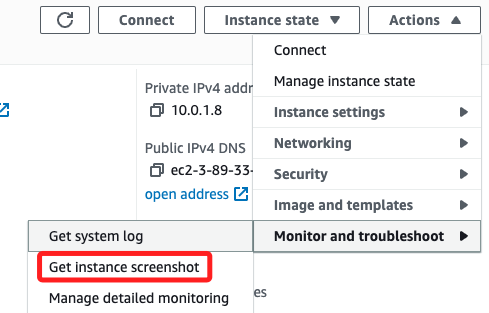

# Task 2：監控 EC2 實例

 

## 步驟

1. 進入 `Status and alarms` 頁籤可以查看 `Status checks`。

    

 

2. `Monitoring` 頁籤會顯示多項執行個體的 CloudWatch 指標。

    

 

3. 進入實例後，可展開 `Actions` 點擊 `Monitor and troubleshoot`，在 `Get system log` 查看系統日誌。

    

 

4. 另外，可以透過 `Get instance screenshot` 取得終端機的快照，藉此在不使用 SSH 連線的情況下，迅速取得實例狀態。

    

 

___

_END_