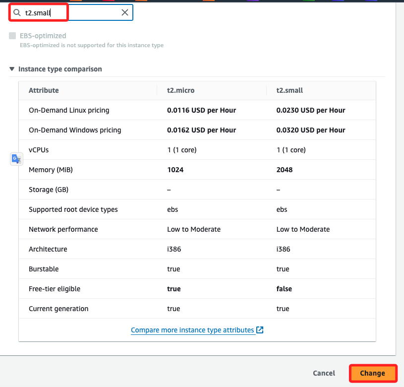
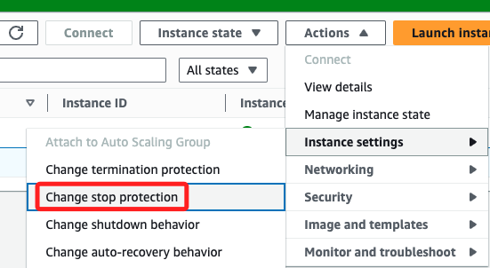
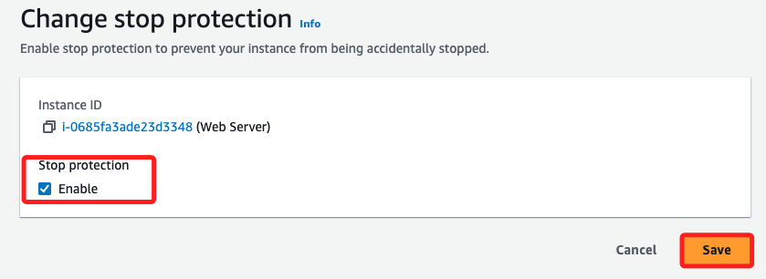
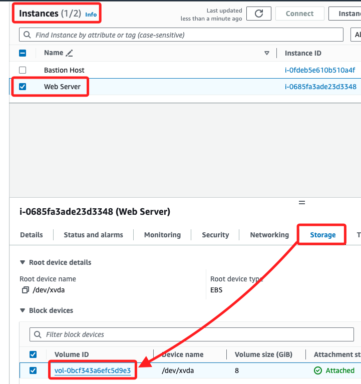
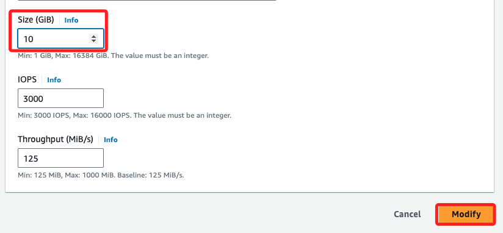
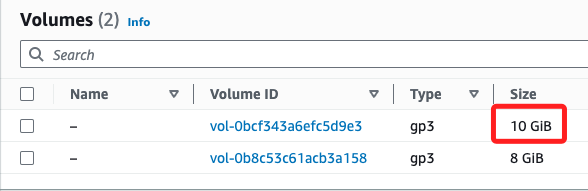

# Task 04：調整實例與 EBS 卷

1. 停止實例 `Stop instance`。

 

2. 更改實例類型為 `t2.small`。

    

 

3. 確認。

    

 

4. 停止保護。

    

 

5. 儲存。

    

 

## 調整 EBS 儲存卷

1. 切換到 `Stirage` 頁籤，點擊 `Volumn ID` 進入 Volumn。

    

 

2. 勾選並點擊 `Actions` 後選取 `Modify volumn`。

    

 

3. 增加 EBS 卷的大小到 10 GiB。

    

 

4. 刷新後查看。

    

 

5. 重新啟動實例。

 

___

_END_