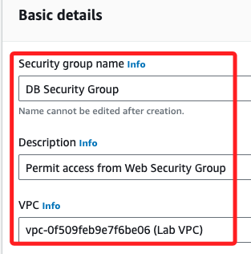

# Task 01：建立 RDS DB 安全群組

 

## 步驟

1. 在控制台搜尋並進入 `VPC`。

    

 

2. 在左側導覽中，展開 `Security` 中點擊 `Security groups`。

    

 

3. 在 `Security Groups` 清單中預設有五個安全群組。

    

 

## 設定進站規則

_允許來自 `Web Security Group` 的訪問_

 

1. 點擊右上角 `Create security group`，建立新的安全群組。

    

 

2. 配置以下設定；Security group name 設置為 `DB Security Group`、描述 Description 填入 `Permit access from Web Security Group`；VPC 部分展開選單，並選擇括號中註明 `Lab VPC` 的對象，這是 Lab 預設準備使用的。

    

 

3. 在 `Inbound rules` 中點擊 `Add rule`，設置 Type `MySQL/Aurora`，此時 Protocol 及 Port range 皆反白不可編輯，分別是 `TCP`、`3306`；

    

 

4. 展開 Source 為 `Web Security Group`。

    

 

5. 點擊右下角 `Create security group`。

    

 

___

_END_