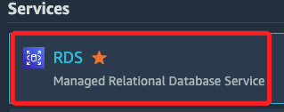
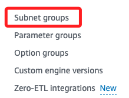
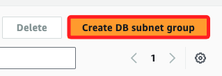
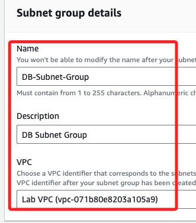
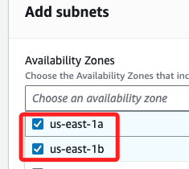
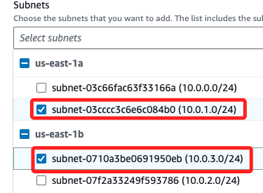

# Task 02：建立 DB 子網路群組

 

## 步驟

1. 在控制台中搜尋並進入 `RDS`。

    

 

2. 在左側欄中，點擊進入 `Subnet groups`；目前尚無任何設置。

    

 

3. 選擇 `Create DB Subnet Group`。

    

 

4. 配置以下設定，Name 設定為 `DB-Subnet-Group`、描述 Description 部分填入 `DB Subnet Group`；展開 VPC ，然後在下拉選單中選取 `Lab VPC`

    

 

5. 向下捲動至 `Add subnets` 區塊，下拉 Availability Zones 選單勾選 `us-east-1a` 和 `us-east-1b` 兩個區域。

    

 

6. Subnets 中要設置 `CIDR 範圍`，從下拉選單選取 `10.0.1.0/24` 和 `10.0.3.0/24` 的子網路。

    

 

7. 點擊右下角 `Create` 完成設置。

    

 

___

_END_