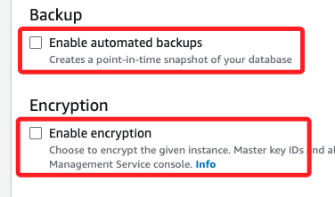
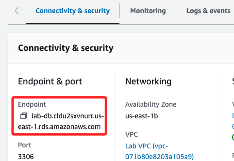

# Task 03：建立 Amazon RDS DB 實例

_同樣在 RDS_

 

## 步驟

1. 在左側欄中選擇 `Databases`，並選擇 `Create database`。

    

 

2. 選擇 `MySQL` 作為引擎。

    

 

3. 在 `Templates` 下選擇 `Dev/Test`。

    

 

4. 在 `Availability and durability` 選擇 `Multi-AZ DB instance`。

    

 

5. 接著滑動到設置 `Settings` 區塊，在 `DB instance identifier` 更名為 `lab-db`；展開 `Credentials Settings`，在 `Master username` 更名為 `main`。

    

 

6. 設定密碼，選取 `Self managed`，然後 Master password、Confirm password 都輸入 `lab-password`。

    

 

7. 在 DB instance class 區塊，切換到 `Burstable classes`，並使用預設的  `db.t3.micro`。

    

 

8. 在 `Storage` 區塊，因為教程並未明確指出要設定 `gp2` 或 `gp3`，這裡設置 Storage type 為預設的 `General Purpose SSD(gp3)`，`Allocated storage` 下修為 `20` GB；補充說明一下，在 AWS 的最新建議中，`gp3` 是更具成本效益且靈活的選擇。

    

 

9. 在 Virtual Private Cloud (VPC) 選取 `Lab VPC`。

    

 

10. 滑動到 `Existing VPC security groups` 區塊，從下拉選單中勾選 `DB Security Group`，並取消預設被勾選的 `default`。

    

 

11. 向下滾動到 `Monitoring` 區塊，取消勾選 `Enable Enhanced monitoring`。

    

 

12. 展開 `Additional configuration`，在 `Initial database name` 區塊輸入 `lab`。

    

 

13. 分別在 `Backup` 區塊取消勾選 `Enable automatic backups`， 在 `Encryption` 區塊取消 `Enable encryption` 兩個 Check Box。

    

 

14. 點擊右下角的 `Create database`。

    

 

15. 會彈出建議視窗 `Suggested add-ons for lab-db`，點擊右下角 `Close` 即可；若重複操作，這個彈窗景會出現一次。

    

 

16. 完成後會回到 `Databases` 清單中，此時狀態為 `Cereating`，需等待約三四分鐘，直到資料庫狀態顯示為 `modifying` 或 `Available`，這裡所稱的或是說會先 `modifying` 然後在那邊 `Available`，但是在 `modifying` 時即可進行下一步操作，並非兩種狀態只會出現一種。

    

 

## 查看

1. 完成後，點擊進入資料庫實例。

    

 

2. 在 `Connectivity & security` 頁籤中，複製 `Endpoint` 並儲存；

    

 

3. 補充說明前面提及的 `Modifying` 或 `Available`，假如尚未達到這兩個狀態之一，這個 `Endpoint` 會顯示空白。

    

 

___

_END_