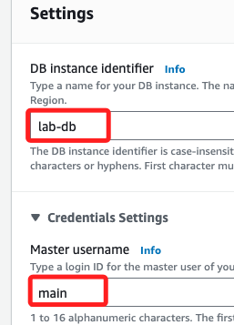
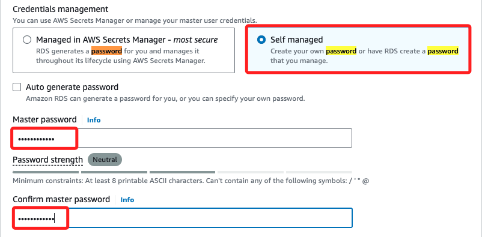
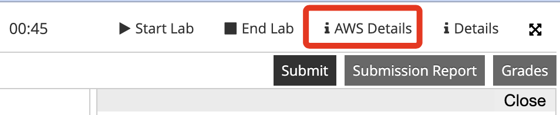
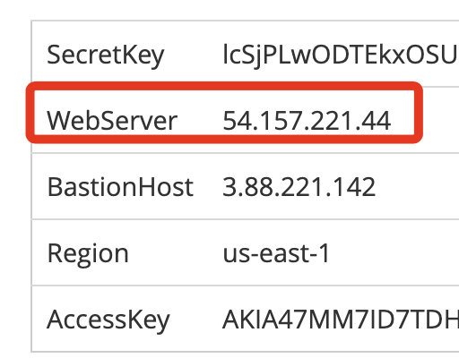
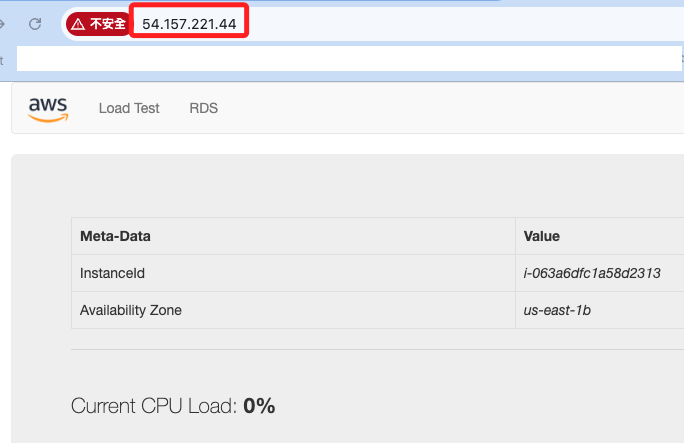

# Task 03：建立 Amazon RDS DB 實例

_同樣在 RDS_

 

## 步驟

1. 在左側欄中選擇 `Databases`，並選擇 `Create database`。

    

 

2. 選擇 `MySQL` 作為引擎。

    

 

3. 在 `Templates` 下選擇 `Dev/Test`。

    

 

4. 在 `Availability and durability` 選擇 `Multi-AZ DB instance`。

    

 

5. 接著滑動到設置 `Settings` 區塊，在 `DB instance identifier` 更名為 `lab-db`；展開 `Credentials Settings`，在 `Master username` 更名為 `main`。

    

 

6. 設定密碼，選取 `Self managed`，然後 Master password、Confirm password 都輸入 `lab-password`。

    

 

7. 在 DB instance class 區塊，切換到 `Burstable classes`，並使用預設的  `db.t3.micro`。

    

 

8. 在 `Storage` 區塊，因為教程並未明確指出要設定 `gp2` 或 `gp3`，這裡設置 Storage type 為預設的 `General Purpose SSD(gp3)`，Allocated storage 設置為 `20` GB；另外，在 AWS 的最新建議中，gp3 通常是更具成本效益且靈活的選擇。

    

 

9. 在 Virtual Private Cloud (VPC) 選取 `Lab VPC`。

    

 

10. Existing VPC security groups 下拉選單中勾選 `DB Security Group`，並取消勾選 `default`。

    

 

11. 在 `Monitoring` 區塊取消勾選 `Enable Enhanced monitoring`。

    

 

12. 展開 `Additional configuration`，在 `Backup` 區塊取消勾選 `Enable automatic backups` 及 `Enable encryption` 兩個 Check Box。

    

 

13. 點擊右下角的 `Create database`，等待約三四分鐘，直到資料庫狀態顯示為 `Available`，會先經過 initialing、modifying。

    

 
14. 完成後點擊進入資料庫實例中，預設會在 `Connectivity & security` 頁籤中，複製 `Endpoint` 並儲存；尚未完成時會顯示空白。

    

 

## 與資料庫互動

1. 從 Lab 說明頁右上角處，點擊 `! AWS Details` 展開詳細資訊。

    

 

2. 中取得 Web 伺服器的 IP 地址。

    

 

3. 在新的瀏覽器標籤中貼上該 IP 地址，並按下 Enter。

    

 

4. 在網頁應用程式中選擇 `RDS`，並配置以下設定；Endpoint 貼上之前複製的 `Endpoint`，Database 命名為 `lab`、Username `main`、Password `lab-password`；然後點擊下方的 `Submit`。

    

 

5. 應用程式會顯示資料庫正在儲存數據。

    

 

6. 然後顯示一個通訊錄應用程式。

    

 

7. 點擊 `Load Test` 可查看當前 CPU 負載率。

    

 

## 完成

_`Submit` & `Yes`_

 

___

_END_