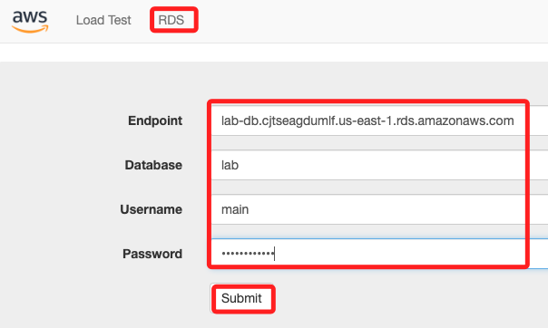
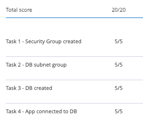
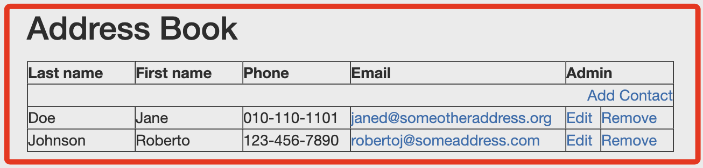
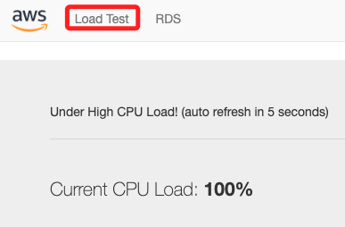

# Task 04： 與資料庫互動

 

## 步驟

1. 在 Lab 的入口網頁右上角處，點擊 `! AWS Details` 展開詳細資訊。

    

 

2. 中取得 Web 伺服器的 IP 地址。

    

 

3. 在新的瀏覽器標籤中貼上該 IP 地址，並按下 Enter。

    

 

4. 在網頁應用程式中選擇 `RDS`，並配置以下設定；Endpoint 貼上之前複製的 `Endpoint`，Database 命名為 `lab`、Username `main`、Password `lab-password`；然後點擊下方的 `Submit`。

    

 

5. 應用程式會顯示資料庫正在儲存數據。

    

 

6. 然後顯示一個通訊錄應用程式。

    

 

7. 點擊 `Load Test` 可查看當前 CPU 負載率。

    

 

## 完成

_`Submit` & `Yes`_

 

___

_END_