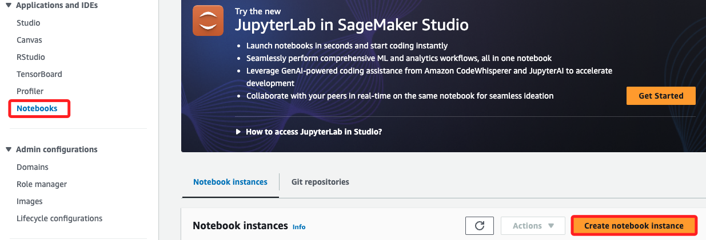
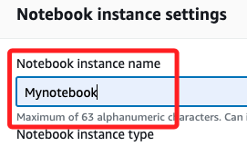
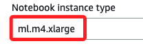
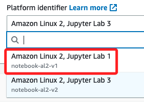
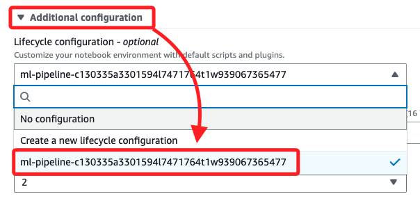

# 使用 Amazon SageMaker 建立 Jupyter Notebook

 

## 步驟

1. 登錄控制台選擇 `Amazon SageMaker`。

 

2. 展開左側選單中的 `Notebook` 區塊，選擇 `Notebook instances`，點擊 `Create notebook instance`。

    

 

3. 在 `Notebook instance name` 輸入 `Mynotebook`。

    

 

4. 從 `Notebook instance type` 下拉選單中選擇 `ml.m4.xlarge`；特別注意，這是依照 `Lab` 目的所選擇的實體規格，假如只是做一般功能測試，選擇預設的 `ml.t3.medium` 即可。

    

 

5. 將 `Platform identifier` 設置為 `notebook-al2-v1`；這是 Lab 準備好的。

    

 

## 設置 Additional configuration

_在這個 `Lab` 中已經準備好一個 `pipeline` 設置_

 

1. 展開 `Additional configuration`，在下拉選單 `Lifecycle configuration` 中選擇 `ml-pipeline`；這個 `Lifecycle` 是指自動化建立名為 `ml-pipeline` 的工作環境，包括安裝和配置所需的軟體和依賴項，確保環境啟動時已經準備好進行機器學習流水線操作。

    

 

2. 保持其他設置為預設值，點擊 `Create notebook instance`。

    

 

3. 建立後，`Notebook 實例` 的狀態會先顯示為灰色的 `Pending`，當狀態變為綠色的 `InService` 時，便可繼續進行下一步。

    

 

___

_END_