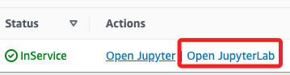

# 探索 JupyterLab 界面

_當 Notebook 實例變為 `InService` 後_

 

## 步驟

1. 點擊 `Open JupyterLab`；其中 `Jupyter` 就是指傳統的 `Jupyter Notebook`，而 `JupyterLab` 則是進階版，提供更多功能，適用於複雜的工作流程。

    

 

2. 打開預先上傳的 `PythonCheatSheet.ipynb` 筆記本文件，藉此熟悉觀察頁面。

 

___

_END_