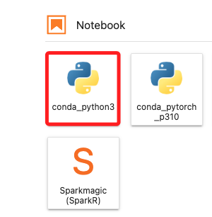
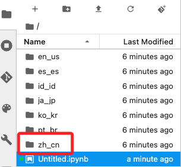
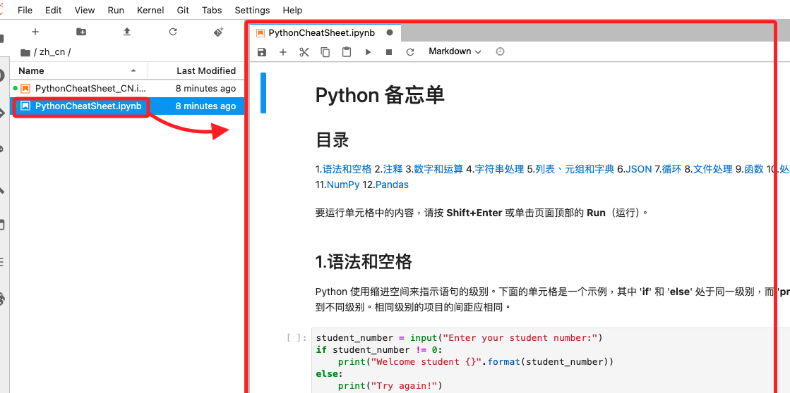

# 探索 JupyterLab 界面

_當 Notebook 實例變為 `InService` 後_

 

## 步驟

1. 點擊實例右側的 `Open JupyterLab`；其中 `Jupyter` 就是指傳統的 `Jupyter Notebook`，而 `JupyterLab` 則是進階版，提供更多功能，適用於複雜的工作流程。

    

 

2. 點擊 `conda_python3`。

    

 

## 開啟腳本

1. 在左側面板中，選取合適自己的語系，建議使用英文，這裡示範點擊簡中。

    

 

2. 點擊開啟 Lab 預先準備好的腳北 `PythonCheatSheet.ipynb`，相關基本操作可自行測試，此處不做贅述。

    

 

___

_END_