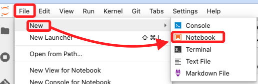

# 導入資料

<br>

## 步驟

1. 在 JupyterLab 中選擇 `File > New > Notebook` 建立一個新筆記本。

    

<br>

2. 選擇 `conda_python3` 作為 `Kernel` 運行 Python 代碼。

    

<br>

## 基礎實作

1. 在第一個單元格中輸入以下 Markdown 內容作為標題。

    ```markdown
    # Importing the data
    ```

<br>

2. 在單元格中輸入以下代碼。

    ```python
    import warnings, requests, zipfile, io
    warnings.simplefilter('ignore')
    import pandas as pd
    from scipy.io import arff
    ```

<br>

5. 在下一個單元格中輸入下載和解壓資料的代碼。

    ```python
    f_zip = 'http://archive.ics.uci.edu/ml/machine-learning-databases/00212/vertebral_column_data.zip'
    r = requests.get(f_zip, stream=True)
    Vertebral_zip = zipfile.ZipFile(io.BytesIO(r.content))
    Vertebral_zip.extractall()
    ```

<br>

6. 運行全部代碼後，點擊左側欄位上方的刷新功能圖標，則會在左側文件瀏覽器中看到以下文件：`column_2C_weka.arff`、`column_2C.dat`、`column_3C_weka.arff`、`column_3C.dat`。

<br>

7. 以下代碼可加載和查看資料。

    ```python
    data = arff.loadarff('column_2C_weka.arff')
    df = pd.DataFrame(data[0])
    df.head()
    ```

<br>

___

_END_