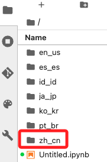
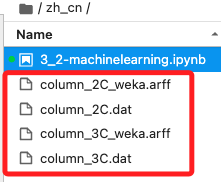

# Exploring Data

_`90629` Lab 3.2_

<br>

## 步驟說明

_啟動並進入 Lab；並對上一次 Lab 下載的椎骨數據集進行以下探索_

<br>

1. 在控制台搜尋並進入 `Amazon SageMaker`，然後在左側欄中點擊進入 Notebooks，預設會在 `Notebook instances` 頁籤中。

    

<br>

2. 等待 `MyNotebook` 實例右側尾端顯示 `InService`，點擊 `Open JupyterLab` 打開實例。

    

<br>

3. 在左側欄位中，任意點擊並進入一個語系資料夾，這裡示範點擊了 `zh-cn`。

    

<br>

4. 進入後會有一個腳本 `3_2-machinelearning.jpynb`。

    

<br>

5. 雙擊可開啟文件，預設會使用核心 `conda_python3`，若要切換可點擊核心進行選擇。

    

<br>

## 運行腳本

_從 Lab 角度來說，以上步驟就完成了，以下只是觀察一下代碼操作_

<br>

1. 這段代碼的內容是針對 `椎骨數據集（vertebral column dataset）` 進行探索性數據分析（Exploratory Data Analysis，EDA），其中並未涉及模型的訓練，僅是對數據特徵進行視覺化處理並檢視。

<br>

2. 在 UCI 數據集中，`Vertebral Column Data Set（椎骨數據集）` 也算是個常用的來源，數據集主要關於人體椎骨的解剖學數據，包含 `6` 個特徵如骨盆傾角（Pelvic incidence）、骨盆傾斜度（Pelvic tilt）、腰椎彎曲度（Lumbar lordosis angle）等，最終目標是通過這些數據來預測椎骨的健康狀態，常被用於監督式學習中的分類問題，適合用來訓練和測試分類器如邏輯迴歸、決策樹、支持向量機等。

<br>

3. 若要在本機運行，要安裝必要庫，代碼等其他內容不再贅述。

    ```bash
    pip install requests pandas seaborn
    ```

<br>

___

_END_