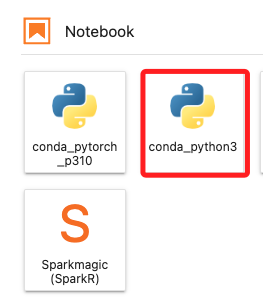
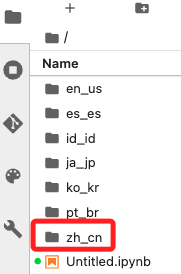
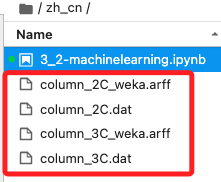
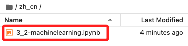
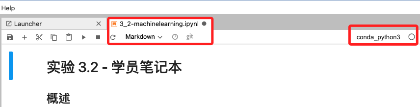

## Task 1：存取 Amazon SageMaker 中的筆記本實例

_啟動並進入 Lab；並對上一次 Lab 下載的椎骨數據集進行以下探索_

 

1. 在控制台搜尋並進入 `Amazon SageMaker`，然後在左側欄中點擊進入 Notebooks，預設會在 `Notebook instances` 頁籤中。

    

 

2. 等待 `MyNotebook` 實例右側尾端顯示 `InService`，點擊 `Open JupyterLab` 打開實例。

    

 

3. 在左側欄位中，任意點擊並進入一個語系資料夾，這裡示範點擊了 `zh-cn`。

    

 

4. 進入後會有一個腳本 `3_2-machinelearning.jpynb`。

    

 

5. 雙擊可開啟文件，預設會使用核心 `conda_python3`，若要切換可點擊核心進行選擇。

    

 

___

_END_