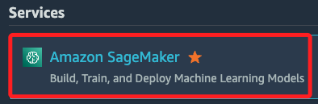
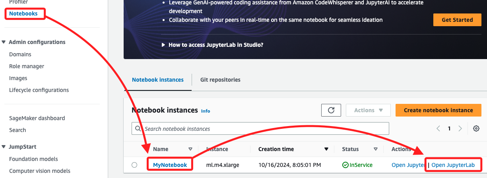

## Task 1：存取 Amazon SageMaker 中的筆記本實例

_啟動並進入 Lab_

 

## 步驟

_這個 Task 就是簡易地進入 Jupyter Notebook 環境_

1. 搜尋並進入 `Amazon SageMaker`。

    

 

2. 然後在左側欄中點擊進入 `Notebooks`，預設會在 `Notebook instances` 頁籤中，找到 Lab 準備好的實例 `MyNotebook`，接著點擊右側 `Open JupyterLab`。

    

 

___

_END_