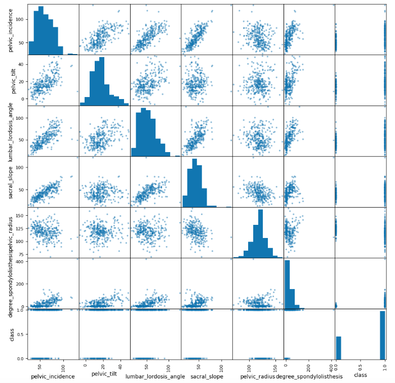

# Task 3 Extra

_這是 Task 3 的延續_

<br>

## 場景

1. 目標是在某醫療保健服務供應商中，利用機器學習技術改善骨科患者的異常檢測。

<br>

2. 任務是基於一個包含六個生物力學特徵且目標為 `正常` 或 `異常`的數據集，訓練一個機器學習模型來預測患者是否存在異常情況。

<br>

## 數據集簡介

_該數據集由 Henrique da Mota 博士在法國里昂整形外科應用研究組（GARO）實習期間所建立，數據集共分成兩個分類任務_

<br>

1. 第一個任務將患者歸類為三類，分別是 `正常` 有 `100` 名患者、`椎間盤疝` 有 `60` 名患者、`脊椎滑脫` 有 `150` 名患者。

<br>

2. 第二個任務將椎間盤疝和脊椎滑脫合併為 `異常` 一類，分類結果為 `正常` 有 `100` 名患者、`異常` 有 `210` 名患者。

<br>

## 數據屬性

_每位患者以六個生物力學特徵來表示，這些特徵依骨盆和腰椎的形狀與方向得出如下。_

<br>

1. 骨盆入射角

<br>

2. 骨盆傾斜角

<br>

3. 腰椎前凸角

<br>

4. 骶骨傾斜角

<br>

5. 骨盆半徑

<br>

6. 脊椎滑脫等級

<br>

## 實驗設置

1. 由於此解決方案分散在多個實驗模組中，首先需要導入庫。

    ```python
    import warnings, requests, zipfile, io
    warnings.simplefilter('ignore')
    import pandas as pd
    from scipy.io import arff
    ```

2. 載入數據。

    ```python
    f_zip = 'http://archive.ics.uci.edu/ml/machine-learning-databases/00212/vertebral_column_data.zip'
    r = requests.get(f_zip, stream=True)
    Vertebral_zip = zipfile.ZipFile(io.BytesIO(r.content))
    Vertebral_zip.extractall()
    ```

3. 輸出。

    ```python
    data = arff.loadarff('column_2C_weka.arff')
    df = pd.DataFrame(data[0])
    ```

<br>

4. 在左側可看到。

    

<br>

## 探索數據

1. 開始查看數據集，首先使用 `.shape` 方法來檢查行數和列數。

    ```python
    df.shape
    ```

    _輸出_

    ```bash
    (310, 7)
    ```

<br>

2. 接著獲取列的列表。

    ```python
    df.columns
    ```

    _輸出_

    ```bash
    Index(
        [
            'pelvic_incidence', 'pelvic_tilt',
            'lumbar_lordosis_angle',
            'sacral_slope', 'pelvic_radius',
            'degree_spondylolisthesis', 'class'
        ],
        dtype='object'
    )
    ```     

<br>

3. 接下來，查看各列的數據類型。

    ```python
    df.dtypes
    ```

    _輸出_

    ```bash
    pelvic_incidence            float64
    pelvic_tilt                 float64
    lumbar_lordosis_angle       float64
    sacral_slope                float64
    pelvic_radius               float64
    degree_spondylolisthesis    float64
    class                        object
    dtype: object
    ```

<br>

4. 六個生物力學特徵使用浮點數表示，目標列為分類型數據。為了進一步了解特徵分佈，可以使用 `.describe()` 查看統計數據。

    ```python
    df['pelvic_incidence'].describe()
    ```

    _輸出_

    ```bash
    count    310.000000
    mean      60.496653
    std       17.236520
    min       26.147921
    25%       46.430294
    50%       58.691038
    75%       72.877696
    max      129.834041
    Name: pelvic_incidence, dtype: float64
    ```

<br>

5. 挑戰任務：嘗試查看其他特徵的統計數據，並找出可能需要檢查的異常值。

    ```python
    df.describe()
    ```

    

<br>

6. 問題：是否存在分布不均的特徵？是否有異常值？特徵間是否存在相關性？這些問題可以透過繪圖進一步探索。

    ```python
    import matplotlib.pyplot as plt
    %matplotlib inline
    df.plot()
    ```

    

<br>

## 密度圖

_KDE_

<br>

1. 使用密度圖來繪製每個特徵的值分佈。

    ```python
    df.plot(kind='density', subplots=True, layout=(4,2), figsize=(12,12), sharex=False)
    plt.show()
    ```

    

<br>

## 深入調查 `degree_spondylolisthesis`

1. 首先繪製密度圖，觀察數據分佈。

    ```python
    df['degree_spondylolisthesis'].plot.density()
    ```

    

<br>

2. 接著使用直方圖來可視化數據。

    ```python
    df['degree_spondylolisthesis'].plot.hist()
    ```

    

<br>

3. 透過箱線圖來觀察是否存在異常值。

    ```python
    df['degree_spondylolisthesis'].plot.box()
    ```

    

<br>

4. 由箱線圖可看出數據集中存在一些異常值。這些異常值可能會影響模型的訓練，應根據後續的實驗進一步驗證。

## 目標

1. 首先查看目標類別的分布。

    ```python
    df['class'].value_counts()
    ```

    _輸出_

    ```bash
    class
    b'Abnormal'    210
    b'Normal'      100
    Name: count, dtype: int64
    ```

<br>

2. 目前分佈為約 1/3 正常，2/3 異常。接著需要將類別轉換為數值，進行機器學習模型的訓練。

    ```python
    class_mapper = {b'Abnormal': 1, b'Normal': 0}
    df['class'] = df['class'].replace(class_mapper)
    ```

<br>

## 特徵與目標的關係

1. 繪製 `degree_spondylolisthesis` 與目標的關係圖。

    ```python
    df.plot.scatter(y='degree_spondylolisthesis', x='class')
    ```

    

<br>

2. 雖然高值與異常值之間似乎存在某種關聯，但還需進一步分析其他特徵。

<br>

## 多變量可視化

1. 使用 `groupby` 與箱線圖來進行異常與正常值的比較。

    ```python
    df.groupby('class').boxplot(fontsize=20, rot=90, figsize=(20,10), patch_artist=True)
    ```

    

<br>

2. 生成相關矩陣並繪製熱圖以進一步了解特徵之間的關聯性。

    ```python
    corr_matrix = df.corr()
    corr_matrix["class"].sort_values(ascending=False)
    ```

    _輸出_

    ```bash
    class                       1.000000
    degree_spondylolisthesis    0.443687
    pelvic_incidence            0.353336
    pelvic_tilt                 0.326063
    lumbar_lordosis_angle       0.312484
    sacral_slope                0.210602
    pelvic_radius              -0.309857
    Name: class, dtype: float64
    ```


3. 繪製此數據的圖。

    ```python
    pd.plotting.scatter_matrix(df,figsize=(12,12))
    plt.show()
    ```

    

4. 透過使用 seaborn，您可以將相關性視覺化為熱圖。

    ```python
    import seaborn as sns
    fig, ax = plt.subplots(figsize=(10, 10))
    colormap = sns.color_palette("BrBG", 10)
    sns.heatmap(corr_matrix, cmap=colormap, annot=True, fmt=".2f")
    plt.show()
    ```

    

<br>

___

_END_
