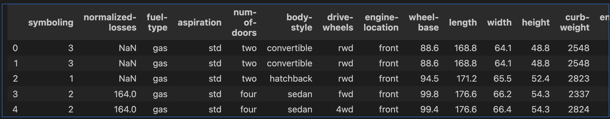
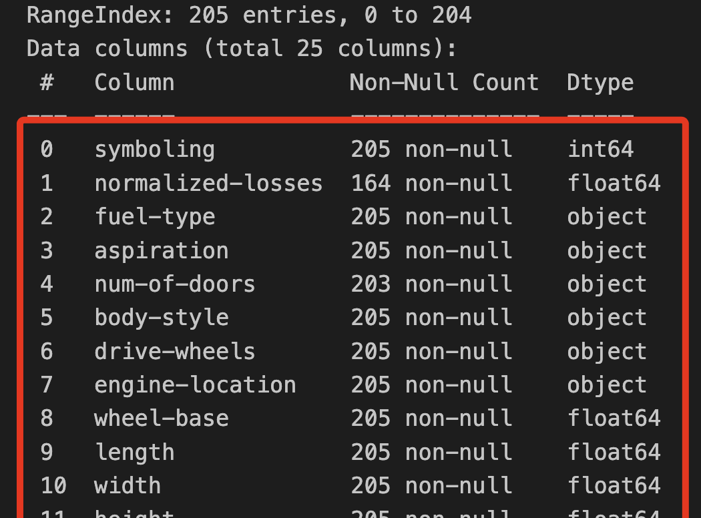
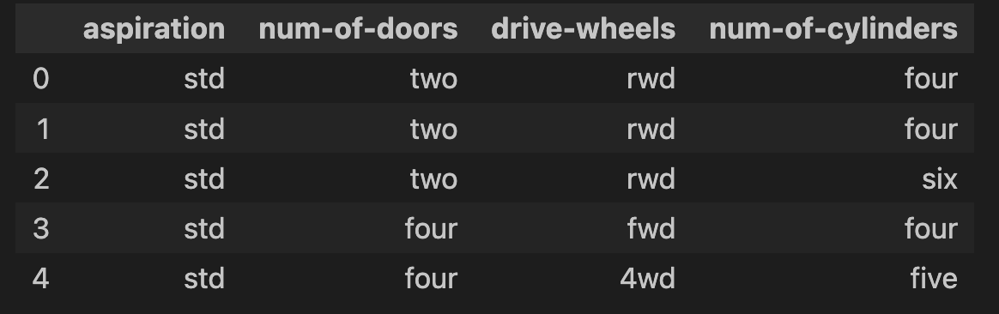
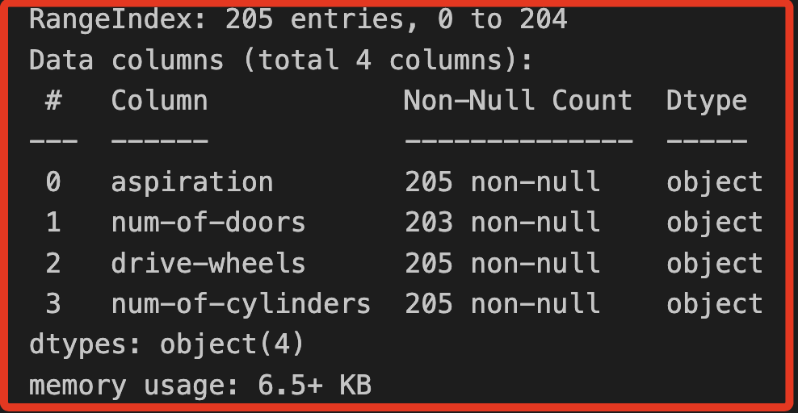
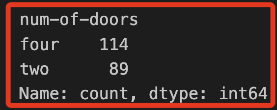
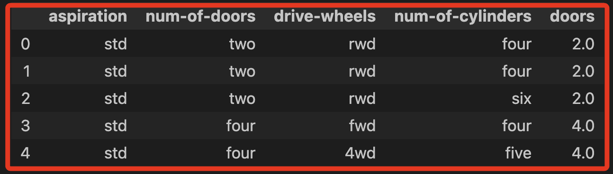
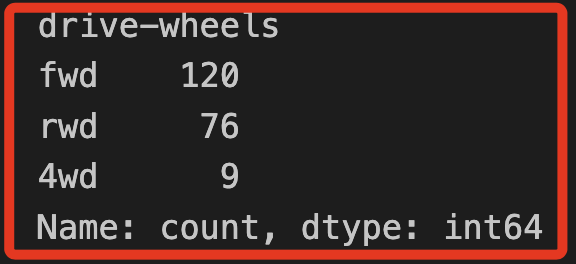
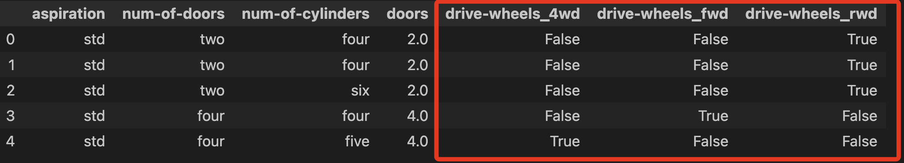
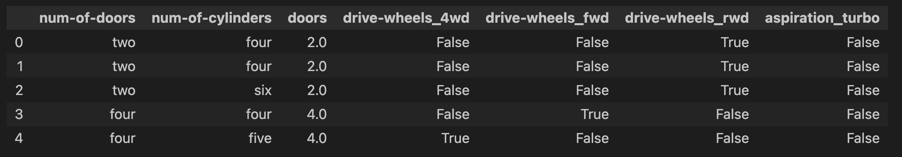

# 腳本解說

## 匯入與瀏覽數據

1. 首先，檢查數據集中的數據。

    ```python
    import pandas as pd
    # 最大烈數
    pd.set_option('display.max_rows', 500)
    # 最大欄位數
    pd.set_option('display.max_columns', 500)
    # 把寬度加大，避免自動換行
    pd.set_option('display.width', 1000)
    ```

<br>

2. 將數據集加載到 pandas DataFrame 中；因為數據不包含標題，因此在名為 `col_names` 的變數中為數據集定義欄名稱，將列表傳遞給參數 `names`。

    ```python
    url = "imports-85.csv"
    col_names=[
        'symboling','normalized-losses','fuel-type','aspiration',
        'num-of-doors','body-style','drive-wheels','engine-location',
        'wheel-base', 'length','width','height','curb-weight',
        'engine-type','num-of-cylinders','engine-size','fuel-system',
        'bore','stroke','compression-ratio','horsepower','peak-rpm',
        'city-mpg','highway-mpg','price'
    ]

    df_car = pd.read_csv(
        url, sep=',',
        names=col_names,
        na_values="?",
        header=None
    )
    ```

<br>

3. 使用 `shape` 查看行（實例）和欄（特徵）的數量。

    ```python
    df_car.shape
    ```

    ```bash
    (205, 25)
    ```

<br>

4. 使用 `head` 查看前五筆數據。

    ```python
    df_car.head(5)
    ```

    

<br>

5. 若要顯示有關欄的信息，請使用 `info` 方法。

    ```python
    df_car.info()
    ```

    

<br>

6. 查看有哪些欄。

    ```python
    df_car.columns
    ```

<br>

7. 可刪除不需要的欄；特別注意，在官方的腳本中，提取數據後先進行複製副本，然後再覆蓋原始變數 `df_car`，這是基於避免潛在錯誤的做法，並非絕對必要。

    ```python
    df_car = df_car[[
        'aspiration',
        'num-of-doors',
        'drive-wheels',
        'num-of-cylinders']
    ].copy()
    ```

<br>

7. 現在有 4 個欄，均包含文本值。

    ```python
    df_car.head()
    ```

    

<br>

8. 大多數機器學習算法要求輸入的是 `數值型` 的；其中 `num-of-cylinders` 和 `num-of-doors` 特徵具有序數值，可以將這些特徵的值轉換為對應的數值；但是，`aspiration` 和 `drive-wheels` 沒有序數值，這些特徵必須進行其他的轉換方式。

<br>

## 對序數特徵進行編碼

_在此步驟中，將使用映射器函數將序數特徵轉換為有序的數值。_

<br>

1. 從 DataFrame 中獲取新的欄類型。

    ```python
    df_car.info()
    ```

    

<br>

2. 使用 `value_counts` 統計 `num-of-doors` 的 Value 出現的頻率，也就是個別內容的累計次數。

    ```python
    df_car['num-of-doors'].value_counts()
    ```

    

<br>

3. 此特徵只有兩個值 `two` 和 `four`，使用字典建立 `映射器`。

    ```python
    door_mapper = {
        "two": 2,
        "four": 4
    }
    ```

<br>

4. 然後使用 pandas 的 `replace` 方法對 `num-of-doors` 欄生成一個新的數值型欄位。

    ```python
    df_car['doors'] = df_car["num-of-doors"].replace(door_mapper)
    ```

<br>

5. 顯示 DataFrame 時，可以在右側看到新的欄，它包含 `門` 數量的數字表示。

    ```python
    df_car.head()
    ```

    

<br>

## 重複前面步驟轉換變數

1. 對 `num-of-cylinders` 欄重複該過程。

    ```python
    df_car['num-of-cylinders'].value_counts()
    ```

<br>

2. 建立 `映射器`。

    ```python
    cylinder_mapper = {
        "two":2,
        "three":3,
        "four":4,
        "five":5,
        "six":6,
        "eight":8,
        "twelve":12
    }
    ```

<br>

3. 使用 `replace` 方法套用 `映射器`。

    ```python
    df_car['cylinders'] = df_car['num-of-cylinders'].replace(
        cylinder_mapper
    )
    df_car.head()
    ```

<br>

## one-hot 編碼

_統計學中的 `虛擬變數`_

<br>

1. 使用 pandas 的 `get_dummies` 方法對 `無序分類數據` 進行編碼；根據屬性描述存在以下的值。

    ```bash
    aspiration：標準、渦輪。
    drive-wheels：四輪驅動、前輪驅動、後輪驅動。
    ```

<br>

2. 假如直接將變數 `drive-wheels` 進行映射為 `4wd = 1`、`fwd = 2` 和 `rwd = 3`，可能在機器學習過程中讓模型誤判這些值是有順序的，因為這樣的簡單映射為它們引入了順序；正確的轉換策略是將原始特徵中的每個值轉換為 `二元特徵`，這個過程在機器學習中通常被稱為 `one-hot 編碼`，也就是統計學中的 `虛擬變量`。

<br>

## 對 `無序分類數據` 進行編碼

1. 根據屬性描述，`drive-wheels` 具有三個可能的值。

    ```python
    df_car['drive-wheels'].value_counts()
    ```

    

<br>

2. 使用 `get_dummies` 方法向 DataFrame 添加新的二元特徵。

    ```python
    df_car = pd.get_dummies(df_car, columns=['drive-wheels'])
    ```

<br>

3. 可在右側看到三個新的 Column，這些二元特徵，能夠以數字方式表示這些信息，無需考慮順序；特別注意，雖然 pandas 在顯示時可能使用布林值 False 和 True，但這些值在底層實際上是數字 `0` 和 `1`，因此它們仍可用於機器學習模型或其他需要數字輸入的算法。

    ```python
    df_car.head()
    ```

    

<br>

## 重複前面的步驟

_不贅述_

<br>

1. 檢查將 `aspiration` 欄並編碼為兩個 `二元特徵`。

    ```python
    df_car['aspiration'].value_counts()
    df_car = pd.get_dummies(df_car, columns=['aspiration'], drop_first=True)
    df_car.head()
    ```

    

<br>

## 挑戰任務

_返回本實驗的開頭，並將其他欄添加到數據集中。將如何對每個欄的值進行編碼？ 更新代碼以引入一些其他特徵。_

<br>

___

_END_