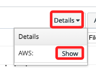
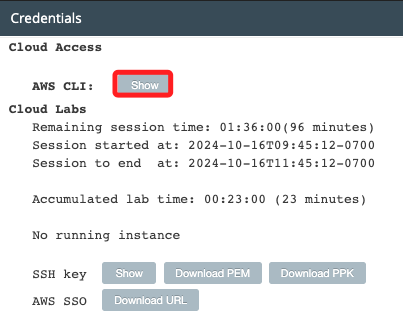
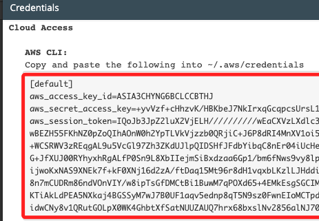
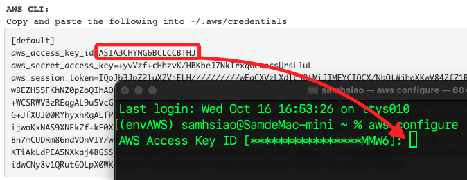
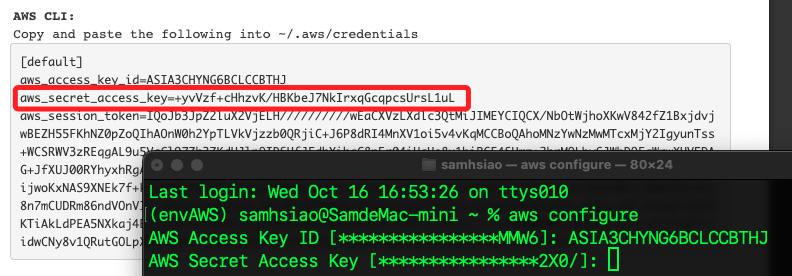
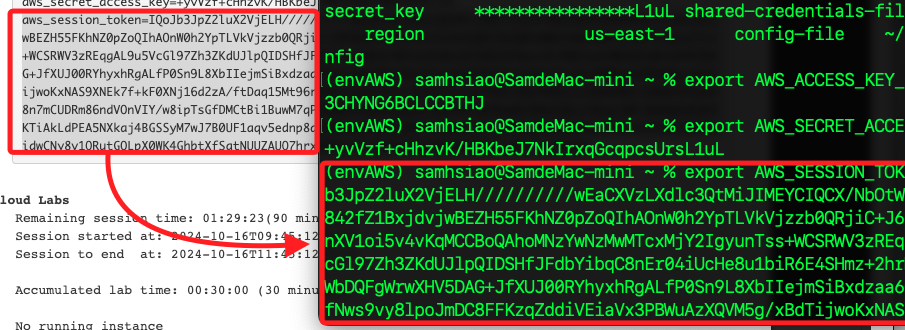
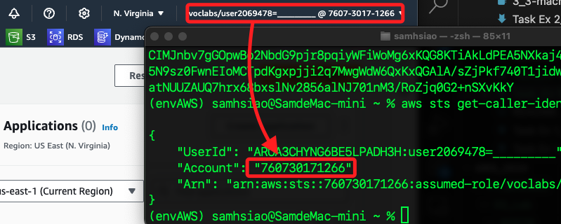

# 本地環境設定

<br>

## 步驟說明

1. 當運行 Lab 的 `boto3`，必須設置 `AWS Configure`。

<br>

2. 進入 Lab 首頁點擊 `Details` > `Show` 查看。

    

<br>

3. 點擊 `Show`。

    

<br>

4. 複製。

    

<br>

5. 開啟終端機運行指令。

    ```bash
    aws configure
    ```

<br>

6. 輸入 `ID`。

    

<br>

7. 輸入 `Key`。

    

<br>

8. 手動設定 Token。

    ```bash
    export=<複製-TOKEN-貼上>
    ```

    

<br>

9. 透過指令查詢當前登入的使用者。

    ```bash
    aws sts get-caller-identity
    ```

    

<br>

___

_END_