# Lab 5 Facial Recognition

_使用 Amazon SageMaker 的 Jupyter Notebook，以及 Amazon Rekognition 進行臉部辨識_

<br>

##  Lab 目標

1. 建立 Amazon Rekognition 自訂臉部集合。

<br>

2. 將影像加入自訂集合。

<br>

3. 偵測影像中的已知臉孔。

<br>

## 步驟

1. 進入主控台，搜尋並進入 `SageMaker`。

    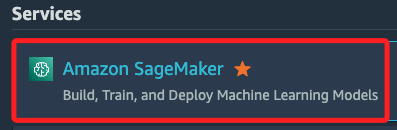

<br>

2. 在左側欄中點選 `Notebooks`。

    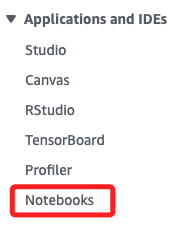

<br>

3. 清單中有名為 `MyNotebook` 的 notebook 實例，點選右側的 `Open JupyterLab` 以開啟 JupyterLab 環境。

    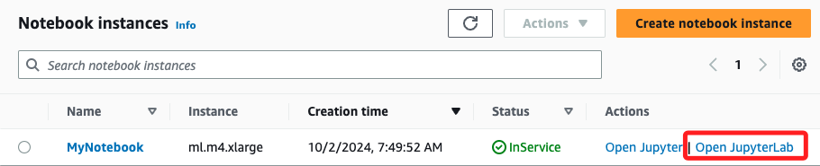

<br>

4. 進入 `JupyterLab` 環境後，選擇合適語系的資料夾，這裡我選擇 `zh_cn`，點擊進入。

    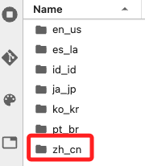

<br>

5. 其中僅有一個腳本 `en_us/05-facedetection.ipynb`，點擊後顯示內容在右側。

    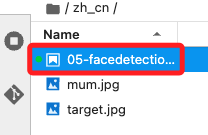

<br>

6. 右上角可檢視當前使用核心，若需調整可點擊進行切換。

    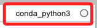

<br>

## 腳本操作與講解

_範例腳本會建立一個自訂的 Amazon Rekognition 臉部集合，並將影像加入該集合並完成臉部偵測_

<br>

1. 導入模組。

    ```python
    # 從 skimage 套件中匯入 io 模組，處理影像讀取
    from skimage import io
    # 匯入 rescale 函式用來縮放影像
    from skimage.transform import rescale
    # 繪圖模組用於顯示影像
    from matplotlib import pyplot as plt
    # 匯入 boto3 與 AWS 服務進行互動
    import boto3
    # 進行數值計算與矩陣操作
    import numpy as np
    # 從 PIL 套件匯入處理影像與繪製
    from PIL import Image, ImageDraw, ImageColor, ImageOps
    ```

<br>

2. 建立 `Rekognition` 集合。

    ```python
    # 使用 boto3 建立 Rekognition 的客戶端
    client = boto3.client('rekognition')

    # 定義集合 ID 並命名 'Collection'
    collection_id = 'Collection'

    # 使用 Rekognition API 建立一個臉部集合
    response = client.create_collection(CollectionId=collection_id)

    # 輸出集合的 ARN 唯一標識
    print('Collection ARN: ' + response['CollectionArn'])

    # 輸出請求的狀態碼，確認 API 請求是否成功
    print('Status Code:' + str(response['StatusCode']))

    # 提示已完成操作
    print('Done ...')
    ```

<br>

3. 讀取並顯示指定圖片。

    ```python
    # 圖片
    filename = "mum.jpg"
    # 讀取
    faceimage = io.imread(filename)
    # 顯示
    plt.imshow(faceimage)
    ```

    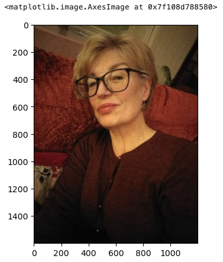

<br>

4. 在前一個步驟中，必須確保影像尺寸小於 `4096 x 4096`，若大於這個尺寸，必須對影響加以處理，這裡示範縮小為 `50%`，並儲存覆蓋原圖片。

    ```python
    # 縮小為 50%
    # constant 模式會用固定的值來填充那些超出邊界的像素
    # 預設的填充值為 0，也就是黑色
    faceimage = rescale(faceimage, 0.50, mode='constant')
    # 存檔覆蓋
    io.imsave(filename, faceimage)
    ```

<br>

5. 將圖像加入集合。

    ```python
    # 將檔案名稱設定為 ExternalImageId
    # 這將用於標識該影像在 Rekognition 中的索引
    externalimageid = filename

    # 打開影像檔案，以二進位方式讀取影像資料
    with open(filename, "rb") as fimage:
        # 使用 Rekognition 的 index_faces 方法來將臉部影像索引到指定的集合
        response = client.index_faces(
            # 指定集合 ID
            CollectionId=collection_id,
            # 將影像轉換為二進位資料以便上傳
            Image={"Bytes": fimage.read()},
            # 使用檔案名稱作為影像的 ExternalImageId
            ExternalImageId=externalimageid,
            # 最大偵測的臉部數量為 1
            MaxFaces=1,
            # 自動品質過濾，用來過濾出清晰的臉部
            QualityFilter="AUTO",
            # 偵測所有可用屬性（如情緒、年齡範圍等）
            DetectionAttributes=["ALL"],
        )

    # 顯示該影像的結果
    print("Results for " + filename)

    # 列出已成功索引的臉部
    print("Faces indexed:")
    for faceRecord in response["FaceRecords"]:
        # 顯示臉部的 Face ID
        print("  Face ID: " + faceRecord["Face"]["FaceId"])
        # 顯示臉部位置的邊界框
        print("  Location: {}".format(faceRecord["Face"]["BoundingBox"]))

    # 列出未能索引的臉部
    print("Faces not indexed:")
    for unindexedFace in response["UnindexedFaces"]:
        # 顯示未索引臉部的位置邊界框
        print(" Location: {}".format(unindexedFace["FaceDetail"]["BoundingBox"]))
        # 列出未能索引的原因（例如影像品質差）
        print(" Reasons:")
        for reason in unindexedFace["Reasons"]:
            # 列出每個原因
            print("   " + reason)
    ```

    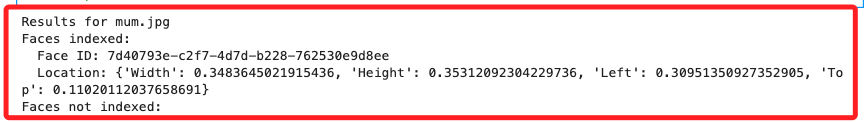

<br>

6. 查看邊界框。

    ```python
    img = Image.open(filename)
    imgWidth, imgHeight = img.size

    draw = ImageDraw.Draw(img)
    for faceRecord in response["FaceRecords"]:
        box = faceRecord["Face"]["BoundingBox"]
        left = imgWidth * box["Left"]
        top = imgHeight * box["Top"]
        width = imgWidth * box["Width"]
        height = imgHeight * box["Height"]

        points = (
            (left, top),
            (left + width, top),
            (left + width, top + height),
            (left, top + height),
            (left, top),
        )

        draw.line(points, fill="#00d400", width=15)

    plt.imshow(img)
    ```

    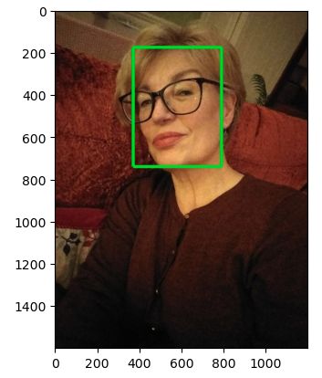

<br>

7. 列出集合中所偵測到的臉部。

    ```python
    # 每次列出臉部資訊的最大結果數為 2
    maxResults = 2

    # 初始化臉部計數器
    faces_count = 0

    # 初始化迴圈控制變數，當還有下一頁結果時保持為 True
    tokens = True

    # 使用 list_faces 方法列出集合中的臉部
    response = client.list_faces(
        CollectionId=collection_id,
        # 限制最大回傳結果為 maxResults
        MaxResults=maxResults
    )

    # 輸出集合中臉部的相關訊息
    print("Faces in collection " + collection_id)

    # 使用 while 迴圈來處理所有結果頁數
    while tokens:

        # 從回應中取得臉部資料
        faces = response["Faces"]

        # 迴圈列出每個臉部的詳細資訊
        for face in faces:
            # 輸出臉部的完整資訊
            print(face)
            # 計算已列出的臉部數量
            faces_count += 1

        # 檢查是否有下一頁結果（由 NextToken 表示）
        if "NextToken" in response:
            # 如果有下一頁，取得 NextToken
            nextToken = response["NextToken"]
            # 使用 NextToken 繼續請求下一頁的臉部資料
            response = client.list_faces(
                CollectionId=collection_id,
                NextToken=nextToken,
                MaxResults=maxResults
            )
        else:
            # 如果沒有 NextToken，將 tokens 設為 False 結束迴圈
            tokens = False
    ```

    _得到以下的結果_

    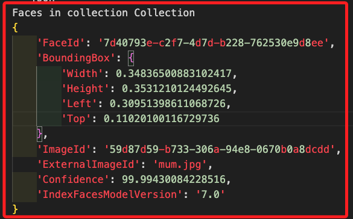

<br>

8. 使用集合來查詢指定圖片中的臉部。

    ```python
    # 指定檢測目標
    targetfilename = "target.jpg"
    # 開啟
    targetimage = Image.open(targetfilename)
    # 顯示圖片
    plt.imshow(targetimage)
    ```

    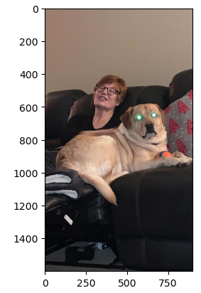

<br>

9. 調用函數對目標圖片進行匹配檢測。

    ```python
    # 設定臉部匹配的相似度門檻值為 70%
    threshold = 70
    # 設定最多回傳的匹配臉部數量為 2
    maxFaces = 2

    # 打開目標影像檔案，以二進位方式讀取影像資料
    with open(targetfilename, "rb") as timage:
        # 針對目標影像，在集合中搜尋匹配的臉部
        response2 = client.search_faces_by_image(
            # 指定要搜尋的集合
            CollectionId=collection_id,
            # 讀取影像並將其轉為二進位格式
            Image={"Bytes": timage.read()},
            # 設定相似度閾值
            FaceMatchThreshold=threshold,
            # 限制最多回傳的匹配臉部數量
            MaxFaces=maxFaces,
        )

    # 取得回應中的匹配臉部資料
    faceMatches = response2["FaceMatches"]
    # 輸出匹配臉部的相關資訊
    print("Matching faces")
    # 迴圈列出每個匹配的臉部資料
    for match in faceMatches:
        # 輸出臉部的 FaceId
        print("FaceId:" + match["Face"]["FaceId"])
        # 輸出臉部相似度，並格式化為小數點後兩位
        print(
            "Similarity: " + "{:.2f}".format(match["Similarity"]) + "%"
        )
        # 輸出臉部的 ExternalImageId（即上傳時指定的外部影像 ID）
        print("ExternalImageId: " + match["Face"]["ExternalImageId"])
        # 輸出空行，方便閱讀
        print()
    ```

    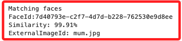

<br>

10. 在發現的臉部繪製邊界框。

    ```python
    # 取得目標影像的寬度和高度
    imgWidth, imgHeight = targetimage.size
    # 建立 ImageDraw 物件，允許在影像上繪圖
    draw = ImageDraw.Draw(targetimage)
    # 從搜尋結果中提取搜尋到的臉部邊界框資訊
    box = response2["SearchedFaceBoundingBox"]
    # 計算臉部邊界框在影像中的左邊位置，根據影像寬度與比例計算
    left = imgWidth * box["Left"]
    # 計算臉部邊界框在影像中的頂部位置，根據影像高度與比例計算
    top = imgHeight * box["Top"]
    # 計算臉部邊界框的寬度，根據影像寬度與比例計算
    width = imgWidth * box["Width"]
    # 計算臉部邊界框的高度，根據影像高度與比例計算
    height = imgHeight * box["Height"]
    # 定義臉部邊界框的四個角點坐標，這些點將形成一個矩形框
    points = (
        # 左上角
        (left, top),
        # 右上角
        (left + width, top),
        # 右下角
        (left + width, top + height),
        # 左下角
        (left, top + height),
        # 返回左上角，完成閉合矩形
        (left, top),
    )

    # 使用綠色線條繪製矩形框，寬度為 15 像素
    draw.line(points, fill="#00d400", width=15)

    # 顯示帶有繪製框線的目標影像
    plt.imshow(targetimage)
    ```

    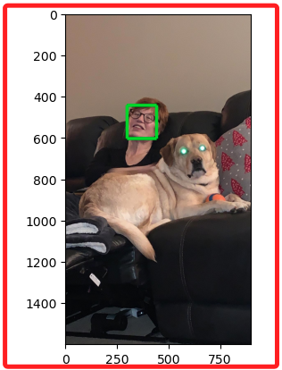

<br>

## 刪除集合

1. 完成以上步驟後，要刪除集合避免佔用資源產生費用。

    ```python
    # 集合 ID
    print("Attempting to delete collection " + collection_id)
    # 初始化狀態碼變數，預設為 0
    status_code = 0

    # 嘗試刪除集合
    try:
        # 刪除指定的集合
        response = client.delete_collection(
            CollectionId=collection_id
        )
        # 取得回應中的狀態碼，確認刪除操作是否成功
        status_code = response["StatusCode"]
        # 如果成功
        print("All done!")
        # 輸出狀態碼
        print(status_code)
    # 捕捉錯誤
    except ClientError as e:
        # 錯誤類型 "ResourceNotFoundException" 表示集合不存在
        if e.response["Error"]["Code"] == "ResourceNotFoundException":
            print("The collection " + collection_id + " was not found ")
        else:
            # 如果是其他錯誤
            print("Error other than Not Found occurred: " + e.response["Error"]["Message"])
        # 將 HTTP 狀態碼儲存在 status_code 中
        status_code = e.response["ResponseMetadata"]["HTTPStatusCode"]
    ```

    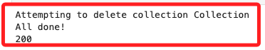

<br>

2. 特別說明，雖然 Rekognition 的 Collection 是屬於服務的一部分，不過目前在主控台中，無法直接透過介面查看或管理，需使用 CLI 或是 SDK 進行操作。

<br>

3. 使用指令在終端機中查詢。

    ```bash
    aws rekognition list-collections
    ```
    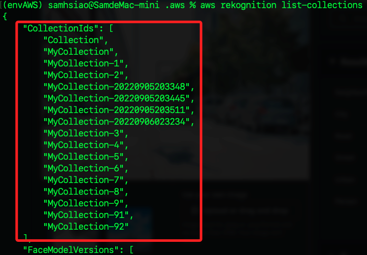

<br>

4. 使用 SDK（boto3）查詢。

    ```python
    import boto3

    # 使用 boto3 建立 Rekognition 客戶端
    client = boto3.client("rekognition")
    # 列出所有臉部集合
    response = client.list_collections()
    # 顯示所有已建立的集合 ID
    print("Collections in your AWS account:")
    for collection_id in response["CollectionIds"]:
        print(collection_id)
    ```

    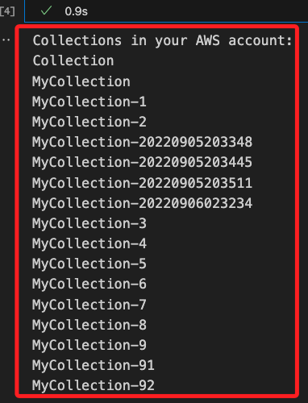

<br>

## 刪除集合

_使用 CLI 及 SDK_

<br>

1. 使用 CLI 刪除指定的集合如 `MyCollection-20220905203348`。

    ```bash
    aws rekognition delete-collection --collection-id MyCollection-20220905203348
    ```

    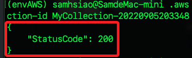

<br>

2. 使用 SDK 進行刪除指定集合，如 `MyCollection-20220905203445`。

    ```python
    import boto3
    from botocore.exceptions import ClientError

    # 使用 boto3 建立 Rekognition 客戶端
    client = boto3.client('rekognition')

    # 定義要刪除的集合 ID
    collection_id = 'MyCollection-20220905203445'

    # 嘗試刪除集合
    try:
        response = client.delete_collection(
            CollectionId=collection_id
        )
        status_code = response['StatusCode']
        print(f"Collection {collection_id} deleted successfully.")
        print(f"Status Code: {status_code}")
    except ClientError as e:
        if e.response['Error']['Code'] == 'ResourceNotFoundException':
            print(f"The collection {collection_id} does not exist.")
        else:
            print(
                f"Error deleting collection: "
                f"{e.response['Error']['Message']}"
            )
    ```

    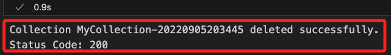

<br>

3. 使用 SDK 批次刪除集合。

    ```bash
    import boto3
    from botocore.exceptions import ClientError

    # 使用 boto3 建立 Rekognition 客戶端
    client = boto3.client('rekognition')

    # 列出所有集合
    response = client.list_collections()
    collections = response['CollectionIds']

    # 迴圈遍歷每個集合並刪除
    for collection_id in collections:
        try:
            print(f"Deleting collection: {collection_id}")
            client.delete_collection(CollectionId=collection_id)
            print(f"Collection {collection_id} deleted successfully.")
        except ClientError as e:
            if e.response['Error']['Code'] == 'ResourceNotFoundException':
                print(f"The collection {collection_id} does not exist.")
            else:
                print(f"Error deleting collection {collection_id}: {e.response['Error']['Message']}")

    # 如果有多頁結果，處理下一頁（適用於集合數量較多的情況）
    while 'NextToken' in response:
        response = client.list_collections(NextToken=response['NextToken'])
        collections = response['CollectionIds']
        for collection_id in collections:
            try:
                print(f"Deleting collection: {collection_id}")
                client.delete_collection(CollectionId=collection_id)
                print(f"Collection {collection_id} deleted successfully.")
            except ClientError as e:
                if e.response['Error']['Code'] == 'ResourceNotFoundException':
                    print(f"The collection {collection_id} does not exist.")
                else:
                    print(f"Error deleting collection {collection_id}: {e.response['Error']['Message']}")
                    
    print("All collections deleted.")
    ```

<br>

4. 若要使用 CLI，必須多行指令。

    ```bash
    # 列出所有集合並將結果存入一個變數
    collections=$(aws rekognition list-collections --query "CollectionIds[]" --output text)

    # 使用迴圈遍歷每個集合並刪除
    for collection in $collections; do
    echo "Deleting collection: $collection"
    aws rekognition delete-collection --collection-id $collection
    done

    echo "All collections deleted."
    ```

<br>

5. 補充說明，進行操作前可透過 CLI 先確認使用者帳號，避免操作後在主控台查看時並未正確配對。

    ```python
    import boto3

    # 使用 boto3 建立 IAM 客戶端
    client = boto3.client('sts')

    # 取得當前使用者的帳戶資訊
    response = client.get_caller_identity()

    # 顯示帳戶相關資訊
    print("Account ID: " + response["Account"])
    print("User ARN: " + response["Arn"])
    print("User ID: " + response["UserId"])
    ```

    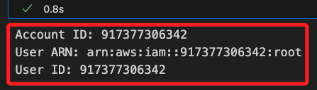

<br>

## 結束

_點選 `End Lab` 並選擇 `Yes` 確認結束 Lab ，看到 `DELETE has been initiated` 訊息後，可以關閉該訊息框。_

<br>

___

_END_