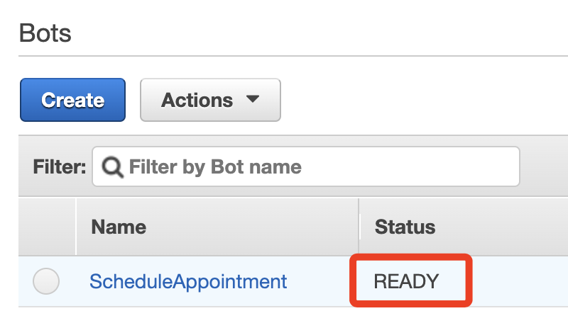
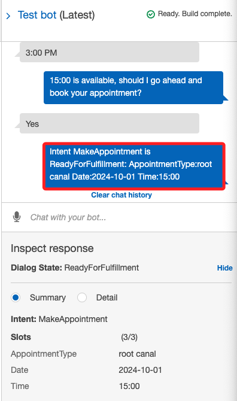
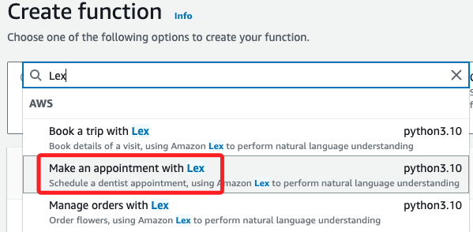
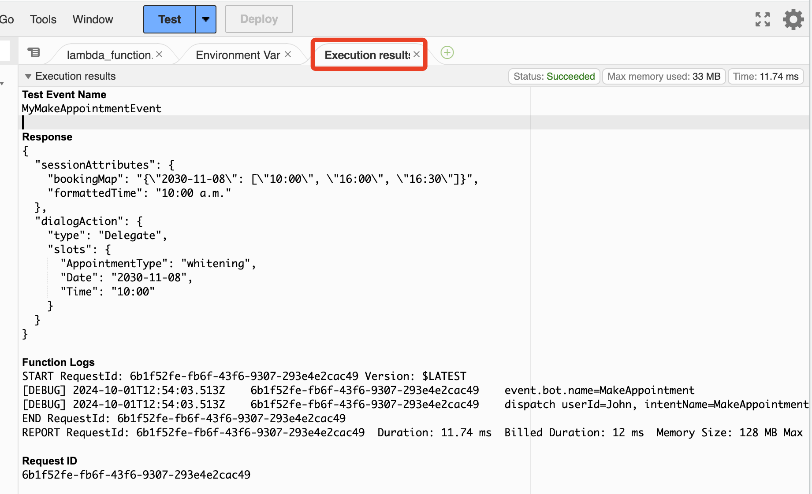
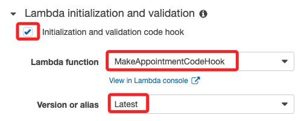
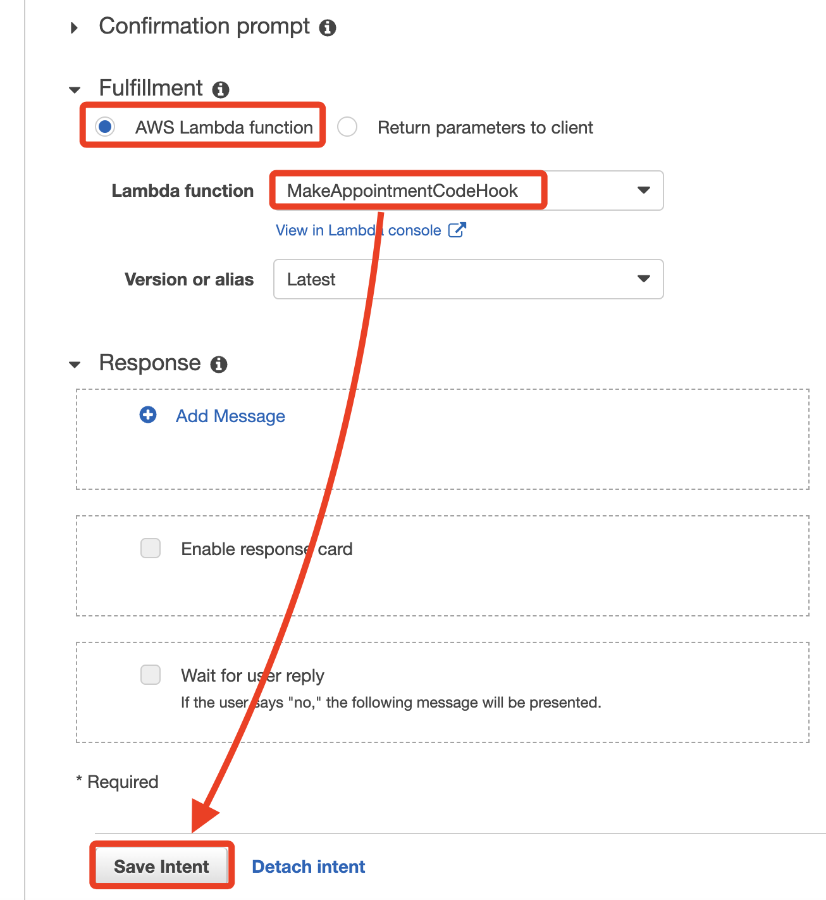

# Amazon Lex Guided Lab: Natural Language Processing

_以下是本實驗的官方說明步驟，可完成 Amazon Lex 聊天機器人搭建，與使用者進行互動以預約牙科診療。_


## 實驗概述

1. 使用 Amazon Lex 的 ScheduleAppointment 範本建立並測試一個聊天機器人。

2. 建立並測試 AWS Lambda 函數與 Lex 整合，處理初始化、驗證和執行請求。

3. 配置 MakeAppointment 意圖，使用 Lambda 函數作為程式鉤子。

4. 在 Amazon S3 上建立並托管靜態網頁來運行聊天機器人，與聊天機器人進行互動。

## 建立 Amazon Lex 聊天機器人

1. 登入 AWS Management Console，選擇 Amazon Lex 服務。

2. 選擇 Get Started，然後點擊左側的回到 V1 Console。


3. 選擇 Create。


4. 選擇 ScheduleAppointment 範本。


5. 選擇語言為 English (US)，然後選擇 No 適用於 COPPA，點擊 Create。


## 測試聊天機器人

1. 當聊天機器人狀態顯示 `Ready` 時，可進一步進行測試。



2. 在右側 `Test bot` 框使用以下測試訊息，確認測試結果是否顯示預約成功訊息。

```bash
"I would like to make an appointment"
"A root canal"
"5/1/2020"
"4:00 PM"
"Yes"
```




## 建立 AWS Lambda 函數

1. 在 AWS Management Console 中，選擇 Lambda。

2. 點擊 Create a function，選擇 `Use a blueprint`。

3. 搜尋 Lex，選擇 `Make an appointment with Lex` 範本。



4. 函數名稱輸入 `MakeAppointmentCodeHook`。

5. 選擇 `Create a new role from AWS policy templates`，並命名角色為 `myLexrole`。

6. 建立函數，並檢視 Python 程式碼。

## 測試 Lambda 函數

1. 點擊 Test。

2. 輸入事件名稱 `MyMakeAppointmentEvent`，然後點擊 `Save` 後進行 `Test`。

3. 確認 Execution result: succeeded 並檢查詳細結果。



## 更新聊天機器人意圖

1. 返回 Amazon Lex 服務，選擇你在步驟 1 中建立的機器人；切記要回到 `V1`。

2. 先點擊 `Edit`。


3. 展開 `Lambda initialization and validation` 部分，勾選 `Initialization and validation code hook`，並選擇 `MakeAppointmentCodeHook` 函數。



4. 在 `Fulfillment` 部分，選擇 `Lambda` 函數 `MakeAppointmentCodeHook`，並保存意圖。



## 構建並測試機器人

1. 點擊 Build 來構建機器人，構建完成後，測試以下互動。

2. `Make an appointment`。

3. 選擇 `root canal`。

4. 選擇時間，確認預約。

5. 構建成功後，點擊 `Publish` 並設置 `別名`。

## 設置 Amazon Cognito 身份池

1. 在 AWS Management Console 中，選擇 `Cognito`，在左側選擇 `Identity pools`，並選擇 `Create identity pool`。

2. 選擇 `Guest access`，並命名身份池 `myidentitypool`，建立身份池。

3. 記下 IdentityPoolID，稍後會使用。

## 修改 IAM 角色權限

1. 在 AWS Management Console 中，選擇 `IAM`，找到身份池角色 `myidentitypoolrole`。

2. 點擊 Add permissions，並附加 AmazonLexReadOnly 和 AmazonLexRunBotsOnly 政策。

## 建立 S3 存儲桶

1. 在 AWS Management Console 中，選擇 S3 並建立存儲桶。

2. 上傳範例網頁檔案 index.html 和 error.html。

3. 在 Static website hosting 部分啟用靜態網站托管，設置 index.html 和 error.html。

## 更新並測試網頁

1. 編輯範例網頁檔案，加入 IdentityPoolID、botAlias 和 botName。

2. 上傳更新的 HTML 檔案至 S3 存儲桶。

3. 修改存儲桶政策，允許公共讀取權限，並設置網頁訪問 URL。

## 實驗總結


