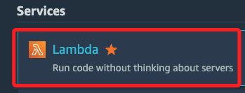

# Lab 6

_Amazon Lex Guided Lab: Natural Language Processing；以下是本實驗的官方說明步驟，可完成 Amazon Lex 聊天機器人搭建，與使用者進行互動以預約牙科診療；相關說明可參考官方文件 [Getting Started with Amazon Lex](https://docs.aws.amazon.com/lex/latest/dg/getting-started.html)。_

<br>

## 專案涵蓋服務項目

1. 使用 `Amazon Lex` 的 `ScheduleAppointment` 範本建立並測試一個聊天機器人。

<br>

2. 建立並測試 `AWS Lambda` 函數與 `Lex` 整合，處理初始化、驗證和執行請求。

<br>

3. 配置 `MakeAppointment` 意圖，使用 `Lambda` 函數作為程式鉤子。

<br>

4. 在 `Amazon S3` 上建立並托管靜態網頁來運行聊天機器人，與聊天機器人進行互動。

<br>

## 建立 Amazon Lex 聊天機器人

1. 登入 AWS Management Console，選擇 `Amazon Lex` 服務。

    

<br>

2. 進入 `Amazon Lex` 主控台後，先點擊左側欄位最下方的 `Return to the V1 console`。

    

<br>

3. 點擊 `Create`。

    

<br>

4. 選擇 `ScheduleAppointment`，這是一個範本。

    

<br>

5. Bot name 使用預設的 `ScheduleAppointment` 即可。

    

<br>

6. 選擇語言為 `English (US)`，然後在 `COPPA` 部分選擇 `No` 即可；`COPPA` 是指 `兒童網絡隱私保護法（Children's Online Privacy Protection Act）`，這是一部美國法律，旨在保護13歲以下兒童在互聯網上的隱私和安全，這裡選擇 `NO` 表示應用不是針對 13 歲以下的兒童所設計的。

    

<br>

7. 點擊 `Create`。

    

<br>

8. 應用程式會開始 Buile。

    

<br>

9. 彈窗出現代表完成。

    

<br>

## 測試聊天機器人

1. 若回到清單，當聊天機器人狀態顯示 `Ready` 表示可進一步進行測試，點擊便可進入。

    

<br>

2. 展開右側 `Test Chatbot` 功能欄位，在對話框中依序輸入以下測試訊息，用以確認測試結果是否顯示預約成功訊息。

    ```bash
    "I would like to make an appointment"
    "A root canal"
    "10/1/2024"
    "3:00 PM"
    "Yes"
    ```

    

<br>

3. 點擊 `Detail` 可查看詳細的訊息內容。

    

<br>

## 建立 AWS Lambda 函數

1. 在主控台中搜尋並進入 `Lambda`。

    

<br>

2. 點擊 `Create a function`，選擇 `Use a blueprint`；這些是預先設計好的 `模板（blueprint）`，包含常見的功能代碼和配置，可快速開始構建 Lambda 函數，並與其他 AWS 服務集成，無需從頭開始編寫代碼。

    

<br>

3. 展開 `Blueprint name` 選單並搜尋 `Lex`，選擇 `Make an appointment with Lex` 範本。

    

<br>

4. 函數名稱輸入 `MakeAppointmentCodeHook`；選擇 `Create a new role from AWS policy templates`，並命名角色為 `myLexrole`。

    

<br>

5. 點擊 `Create function`。

    

<br>

6. 完成一個簡單的 Lambda 架構。

    

<br>

## 測試 Lambda 函數

1. 點擊 `Test`。

    

<br>

2. 輸入事件名稱 `MyMakeAppointmentEvent`，然後點擊右下角的 `Save`。

    

<br>

3. 再次點擊 `Test`，檢視頁籤 `Execution result` 中的內容；若有錯誤會顯示 `Error` 等資訊。

    

<br>

## 更新聊天機器人意圖

_`意圖` 是機器人用來理解和處理用戶需求的主要邏輯單位，表示用戶想要達到的目標或請求；`更新意圖` 所指就是 `修改槽位（Slots）`、更改回應、調整對話流、新增或更改 Fulfillment 等操作；更新意圖的目的是讓機器人能更好地理解和回應用戶的需求，或者適應應用程序的新要求或功能變更。_

<br>

1. 返回 `Lex` 服務，選擇前面步驟建立的機器人；若是從 `Lex` 主控台返回，記要要先點擊左側的 `Return to the V1 console` 才會看到對應的機器人。

<br>

2. 進入機器人後，先點擊畫面上方的 `Edit`。

    

<br>

3. 展開 `Lambda initialization and validation` 部分，勾選 `Initialization and validation code hook`，並選擇 `MakeAppointmentCodeHook` 函數，另外一定要選擇版本。

    

<br>

4. 在 `Fulfillment` 部分，選擇 `Lambda` 函數 `MakeAppointmentCodeHook`，並保存意圖；`Fulfillment` 是指當 `Lex 聊天機器人` 成功收集到所需的資訊並完成用戶的請求時，最終執行的動作，也就是機器人回應過程的最後一步，用來處理用戶的請求。

    

<br>

## 構建並測試機器人

1. 不同於之前自動進行的 `Build`，這裡要手動點擊 `Build` 構建機器人，完成時會出現彈窗通知。

    

<br>

2. 確認以上步驟已經完成，在右側對話中輸入 `Make an appointment`，然後選擇 `root canal`。

    

<br>

3. 選擇預約的時間後，點擊 `yes` 確認預約。

<br>

    

<br>

4. 構建成功後，點擊 `Publish`；點擊後退出現彈窗。

    

<br>

5. 設置機器人版本的 `別名` 例如 `MyBot`，這個名稱在後面步驟編輯腳本內容時還會用到，可稍做紀錄；`別名` 用於對特定版本機器人建立易於識別的名稱，這將有利於管理和部署機器人；再次點擊 `Publish`，完成時點擊 `Close` 關閉彈窗即可。

    

<br>

## 設置 Amazon Cognito 身份池

_管理應用程序的用戶身份驗證、授權和用戶數據同步，可用於快速構建和管理應用的身份管理功能，確保應用可以安全地管理和訪問資源。_

<br>

1. 在主控台中，搜尋並進入 `Cognito`。

    

<br>

2. 在左側選擇 `Identity pools`，並選擇 `Create identity pool`。

    

<br>

3. 選擇 `Guest access` 並點擊 `Next`。

    

<br>

4. 在 `IAM role name` 中命名為 `myidentitypoolrole`，接著點擊 `Next`。

    

<br>

5. `Identity pool name` 命名為 `myidentitypool`，點擊右下角 `Next`。

    

<br>

6. 接下來接使用預設值，然後滑動到最下方點擊 `Create identity pool`。

    

<br>

7. 記下 `IdentityPoolID` 備用。

    

<br>

## 修改 IAM 角色權限

1. 在主控台中，搜尋並進入 `IAM`。

    

<br>

2. 進入 `Roles`，搜尋 `myidentitypoolrole` 並點擊進入。

    

<br>

3. 預設僅有一個 Policy。

    

<br>

4. 展開 `Add permissions` 並點擊 `Attach policies`。

    

<br>

5. 依序附加 `AmazonLexReadOnly` 和 `AmazonLexRunBotsOnly` 政策。

    

<br>

6. 完成時可以看到清單中多了兩個 Policies。

    

<br>

## 關於權限錯誤訊息

1. 此時下方會出現紅色警告，表明當前用戶缺少執行 `access-analyzer:ListPolicyGenerations` 操作的權限。

    

<br>

2. 特別強調，這個錯誤並不會阻止手動添加策略，只有在需要 `Access Analyzer` 來生成或檢查策略的安全性時將無法執行這些操作；在此可予以忽略，並不影響後續操作。

<br>

## 建立 S3 存儲桶

_託管靜態網頁來運行聊天機器人_

<br>

1. 在主控台中，搜尋並進入 `S3`。

    

<br>

2. [下載](https://aws-tc-largeobjects.s3-us-west-2.amazonaws.com/CUR-TF-200-ACMLFO-1/lab-6/202011/en_us/lab6.zip) AWS 官方教程中的壓縮檔，解壓縮後在資料夾中會有兩個超文本 `index.html` 及 `error.html`。

    

<br>

3. 在 S3 主頁中點擊右側 `Create bucket`。

    

<br>

4. 依據教程，任意命名以前綴加六個隨機數字，這裡是 `lexlab6-241002`；然後就可以點擊最下方的 `Create bucket`。

    

<br>

## 上傳文件

1. 點擊進入建立好的 S3，然後點擊 `Upload`。

    

<br>

2. 點擊 `Add files`，選取兩個範例網頁檔案 `index.html` 和 `error.html`；記得點擊右下角的 `Upload`。

    

<br>

3. 完成後點擊 `Close`。

    

<br>

4. 切換到 `Properties` 頁籤。

    

<br>

5. 滑動到 `Static website hosting`，點擊 `Edit`。

    

<br>

6. 首先啟用靜態網站托管。

    

<br>

7. 在 `Index document` 及 `Error document` 部分分別輸入 `index.html` 和 `error.html`；然後點擊右下角的 `Save changes`。

    

<br>

## 更新並測試網頁

_在本地進行文件編輯然後重新上傳_

<br>

1. 編輯範例網頁檔案，找到 `144` 行，將前面步驟複製備用的 `ARN` 貼上替換。

    

<br>

2. 在 `185、186` 行，分別替換為自己的機器人別名與名稱；這可在 Lex 清單中查詢；完成後儲存文件並重新上傳。

    

<br>

3. 切換到 `Permissions` 頁籤。

    

<br>

4. 在 `Block public access (bucket settings)` 區塊點擊 `Edit`。

    

<br>

5. 取消勾選 `Block`，然後點擊 `Save changes`。

    

<br>

6. 編輯 `Bucket policy`，貼上以下代碼，其中 `example.com` 要更換為自己的 S3 的名稱，例如前面所命名的 `lexlab6-241002`；然後點擊 `Save changes`。

    ```json
    {
        "Version": "2012-10-17",
        "Statement": [
            {
                "Sid": "PublicReadGetObject",
                "Effect": "Allow",
                "Principal": "*",
                "Action": [
                    "s3:GetObject"
                ],
                "Resource": [
                    "arn:aws:s3:::lexlab6-241002/*"
                ]
            }
        ]
    }
    ```

<br>

7. 完成時顯示如下。

    

<br>

8. 再次切換到 `Properties` 頁籤，滑動到下方的 `Static website hosting`，複製並訪問這個網頁。

    

<br>

9. 顯示如下，可嘗試進行對話。

    

<br>

10. 與之前對話相同，依此會完成預約程序。

    

<br>

___

_END_


