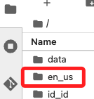

# Lab 2.1

<br>

## Task 1：Accessing SageMaker

1. 進入 SageMaker，點擊 `Notebooks`，找到名稱前綴為 `CFNNotebookInstance-` 的實例，然後點選該列右側的 `Open JupyterLab`。

    

<br>

## Task 2：Opening your JupyterLab notebook

1. 點擊進入 `en_us`。

    

<br>

2. 點擊開啟 `lab-2-1.ipynb` 文件。

    

<br>

3. 先選 `conda_python3`；教程未提及要選什麼。

    

<br>

## 運行腳本

1. 安裝套件。

```bash
python -m pip install scikit-learn sagemaker botocore nltk --upgrade
```

## 關於手動下載 NLTK

1. 參考 [網址](https://www.nltk.org/nltk_data/)。

2. 使用代碼下載。

```python

```

## 關於 Lab AWS CLI

1. 在 AWS Details 中複製所需資訊貼在以下腳本上。

```python
import os
import boto3

# 設置臨時憑證為環境變數
os.environ['AWS_ACCESS_KEY_ID'] = ''
os.environ['AWS_SECRET_ACCESS_KEY'] = ''
os.environ['AWS_SESSION_TOKEN'] = ''

# 創建一個 boto3 客戶端
s3 = boto3.client('s3')

# 測試連接 (例如，列出 S3 存儲桶)
response = s3.list_buckets()
print(response)

import sagemaker

# Call the LinearLearner estimator object
linear_classifier = sagemaker.LinearLearner(
    role=sagemaker.get_execution_role(),
    instance_count=1,
    instance_type='ml.m4.xlarge',
    predictor_type='binary_classifier'
)
```


___

_END_
