# Lab 2.1

_使用 SageMaker 內建的機器學習模型 `LinearLearner` 來預測 `評論數據集` 中的 `isPositive` 欄位。_

<br>

## 商業場景介紹

1. 假設一家線上零售公司希望從客戶回饋中自動檢測負面評論。公司提供了一個數據集，其中包含已經標記為正面或負面的評論。

<br>

2. 本次 Lab 的目標是使用機器學習模型來訓練這個數據集，並利用該模型來預測新評論的情感。

<br>

## 關於此數據集

_`AMAZON-REVIEW-DATA-CLASSIFICATION.csv`_

<br>

1. 數據集包含實際的 `產品評論`，這些評論包括文本數據和數字數據，每條評論都被標記為正面 (1) 或負面 (0)。

    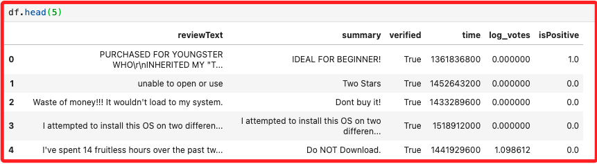

<br>

## 數據集欄位

_也就是特徵_

<br>

1. reviewText：評論的文本。

2. summary：評論的摘要。

3. verified：評論是否來自實際購買的客戶，以 `verified` 的 `True` 或 `False` 表示。

4. time：資料的時間戳。

5. log_votes：經對數調整後的投票數，計算式為 `log(1+votes)`，取對數是為了減少極端值的影響。

6. isPositive：評論為正面或負面，分別以 `1` 與 `0` 表示。

<br>

## 步驟

_以下代碼將以這 `10` 個步驟依序進行_

<br>

1. 讀取數據集；

2. 進行探索性數據分析；

3. 文本處理，移除停用詞和詞幹提取；

4. 將資料集拆分為 `訓練集`、`驗證集` 和 `測試集` 三個集合；

5. 使用 `Pipeline` 和 `ColumnTransformer` 處理數據；

6. 使用 SageMaker 內建算法訓練分類器；

7. 評估模型；

8. 將模型部署到端點；

9. 測試端點；

10. 清理模型資源。

<br>

## 讀取數據

1. 安裝並升級所需套件；在 `.ipynb` 腳本的 CELL 中，可透過魔法指令 `!` 或 `%` 下達終端機指令。

    ```python
    !pip install --upgrade pip
    !pip install --upgrade scikit-learn
    !pip install --upgrade sagemaker
    !pip install --upgrade botocore
    !pip install --upgrade awscli
    ```

<br>

2. 安裝過程會出現一些錯誤訊息，主要包含兩個部分，一是套件 `pandas` 和 `numpy` 的版本衝突，二是缺少 `mkl-fft` 套件；可不予理會，遇到問題再回頭處理。

    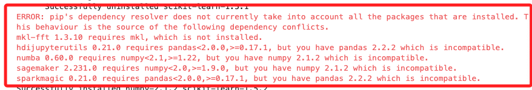

<br>

3. 若想安裝缺少的套件，可運行以下指令。

    ```bash
    pip install mkl-fft
    ```

<br>

4. 若想依照 pip 指定的適配版本進行安裝，可運行以下指令。

    ```bash
    pip install numpy==1.21 pandas==1.3.3
    ```

<br>

5. 比較合適的方式還是建立虛擬環境，載此不做贅述。

<br>

## 關於資料缺漏

**_特別說明，部分範例代碼在初次運行時出現錯誤所以進行了排除，後來 AWS 可能修正過腳本而不再出錯，這裡僅保留作爲參考經。_**

<br>

1. **_僅供參考_**；假如出現 `punkt` 或 `punkt_tab` 文件缺漏的錯誤提示，可自行使用 `requests` 和 `zipfile` 下載並解壓縮文件；下載的資源是 `NLP` 中的 `標記化` 工具，用來進行句子和詞語的切分。

    ```python
    import requests
    import zipfile
    import os

    # 自訂下載文件的函數
    def download_and_unzip(url, extract_to='.'):
        local_filename = url.split('/')[-1]
        
        # 下載文件
        with requests.get(url, stream=True) as r:
            r.raise_for_status()
            with open(local_filename, 'wb') as f:
                for chunk in r.iter_content(chunk_size=8192): 
                    if chunk:
                        f.write(chunk)
        
        # 解壓縮文件
        with zipfile.ZipFile(local_filename, 'r') as zip_ref:
            zip_ref.extractall(extract_to)
        
        # 刪除壓縮文件
        os.remove(local_filename)

    # 文件下載的 URL
    punkt_url = "https://raw.githubusercontent.com/nltk/nltk_data/gh-pages/packages/tokenizers/punkt.zip"
    punkt_tab_url = "https://raw.githubusercontent.com/nltk/nltk_data/gh-pages/packages/tokenizers/punkt_tab.zip"

    # 調用自訂函數執行下載並解壓縮
    download_and_unzip(punkt_url)
    download_and_unzip(punkt_tab_url)

    print("下載並解壓縮完成。")
    ```

    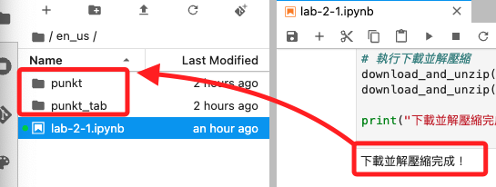

<br>

2. 設定 `NLTK` 資源的路徑，使用本地目錄 `punkt` 和 `punkt_tab`。

    ```python
    import nltk

    # 手動設置 nltk 資源的路徑
    nltk.data.path.append('./punkt')

    # 確認是否正確添加
    print(nltk.data.path)
    ```

    _輸出_

    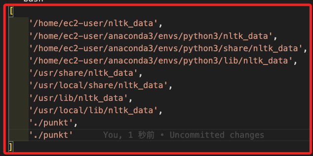

<br>

## 開始進行

3. 讀取數據集。

    ```python
    import pandas as pd

    # 這是 Lab 預設準備的數據
    df = pd.read_csv(
        '../data/AMAZON-REVIEW-DATA-CLASSIFICATION.csv'
    )
    # 觀察數據
    print('數據集的形狀為：', df.shape)
    df.head(5)
    ```

    

<br>

4. 顯示更完整的數據。

    ```python
    # 顯示更多文本數據
    pd.set_option('display.max_colwidth', None)
    df.head()
    ```

    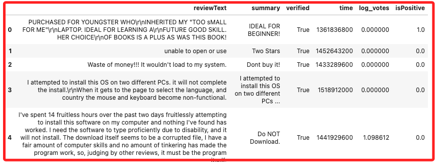
    ```

<br>

5. 查詢具體條目。

    ```python
    print(df.loc[[580]])
    ```

    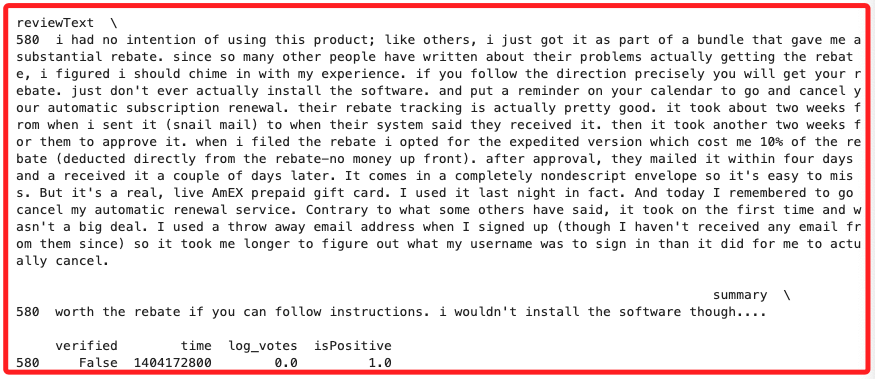

<br>

6. 檢查數據類型。

    ```python
    df.dtypes
    ```

    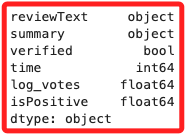

<br>

## 進行探索性數據分析

1. 查看資料集的目標分佈。

    ```python
    df['isPositive'].value_counts()
    ```

    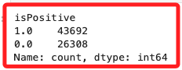

<br>

2. 交換正負分類值，這是因為重點是搜尋原始標記為 `0` 的負面評論，然而 `Linear Learner` 模型預設是針對標記為 `1` 進行，所以將負面評論的標記從改為 1、正面評論改為 0，這可讓模型的調整過程更加順利。

    ```python
    df = df.replace({0:1, 1:0})
    df['isPositive'].value_counts()
    ```

    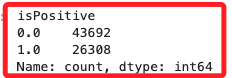

<br>

3. 檢查缺失值。

    ```python
    df.isna().sum()
    ```

    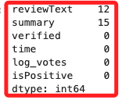

<br>

## 文本處理

_移除停用詞和詞幹提取_

<br>

1. 代碼。

    ```python
    import nltk
    # nltk.download('punkt')
    nltk.download('stopwords')
    ```

<br>

2. 設定停用詞。

    ```python
    import re
    from nltk.corpus import stopwords
    from nltk.stem import SnowballStemmer
    from nltk.tokenize import word_tokenize

    stop = stopwords.words('english')

    excluding = [
        'against', 'not', 'don', 'don\'t','ain', 'are',
        'aren\'t', 'could', 'couldn\'t','did', 'didn\'t',
        'does', 'doesn\'t', 'had', 'hadn\'t', 'has', 'hasn\'t',
        'have', 'haven\'t', 'is', 'isn\'t', 'might',
        'mightn\'t', 'must', 'mustn\'t', 'need', 'needn\'t',
        'should', 'shouldn\'t', 'was', 'wasn\'t', 'were',
        'weren\'t', 'won\'t', 'would', 'wouldn\'t'
    ]

    # 新停用詞列表
    stopwords = [word for word in stop if word not in excluding]
    ```

<br>

3. 滾雪球詞幹分析器會將單詞進行 `詞幹化（Stemming）` 處理，例如 `walking` 會被詞幹化為 `walk`；`詞幹` 就是通過去掉單詞的 `詞綴` 並還原為其基本形式。

    ```python
    snow = SnowballStemmer('english')
    ```

4. 對資料做進一步處理，包含將缺失值替換為空字串、將文字轉換為小寫、刪除任何頭尾空格、刪除任何多餘的空格和製表符、刪除所有 HTML 標記；細節如下。

    ```python
    def process_text(texts): 
        final_text_list=[]
        for sent in texts:
            if isinstance(sent, str) == False:
                sent = ''
                
            filtered_sentence=[]
            
            sent = sent.lower() 
            sent = sent.strip() 
            sent = re.sub('\s+', ' ', sent) 
            sent = re.compile('<.*?>').sub('', sent)
            
            for w in word_tokenize(sent):
                if(not w.isnumeric()) and (len(w)>2) and (w not in stopwords):  
                    filtered_sentence.append(snow.stem(w))
            final_string = " ".join(filtered_sentence) 
            final_text_list.append(final_string)
            
        return final_text_list
    ```

<br>

## 分拆訓練、驗證和測試集

1. 使用 `sklearn` 提供的函數進行分拆。

    ```python
    from sklearn.model_selection import train_test_split

    X_train, X_val, y_train, y_val = train_test_split(
        df[['reviewText', 'summary', 'time', 'log_votes']],
        df['isPositive'], test_size=0.20, shuffle=True, 
        random_state=324
    )

    X_val, X_test, y_val, y_test = train_test_split(
        X_val,
        y_val,
        test_size=0.5,
        shuffle=True,
        random_state=324
    )
    ```

<br>

2. 定義分拆後的數據集。

    ```python
    print('處理 reviewText 欄位')
    X_train['reviewText'] = process_text(X_train['reviewText'].tolist())
    X_val['reviewText'] = process_text(X_val['reviewText'].tolist())
    X_test['reviewText'] = process_text(X_test['reviewText'].tolist())

    print('處理 summary 欄位')
    X_train['summary'] = process_text(X_train['summary'].tolist())
    X_val['summary'] = process_text(X_val['summary'].tolist())
    X_test['summary'] = process_text(X_test['summary'].tolist())
    ```

<br>

## 使用管道和 ColumnTransformer 處理數據

_在開始訓練模型之前，需要對數據進行一些預處理，這些步驟對於訓練模型和推理都非常重要。_

<br>

1. 透過定義 `pipeline` 將不同的處理步驟有序地執行，對於不同的欄位，可以建立不同的管道進行處理。

<br>

1. 對於數值特徵，使用 `numerical_processor` 進行 `MinMaxScaler` 的縮放，這個步驟對於某些算法是重要的。

<br>

3. 對於 `文本特徵`，使用 `CountVectorizer()` 將 `文本欄位` 轉換為 `特徵向量`，代碼中設置了兩個 `CountVectorizer`，分別作用於兩個文本特徵 `summary` 和 `reviewText`。

<br>

4. 這些不同的預處理操作會被放入一個 `ColumnTransformer` 中，最終再放入一個完整的管道；這樣無論在訓練或推理階段，都可以自動對數據進行正確的處理。

<br>

5. 設置模型的輸入特徵和目標變量。

    ```python
    # 定義數值特徵，這些數值特徵將作為模型的輸入
    numerical_features = ['time', 'log_votes']
    # 定義文本特徵
    text_features = ['summary', 'reviewText']
    # 將數值和文本特徵合併，得到模型的全部輸入特徵
    model_features = numerical_features + text_features
    # 定義模型的目標變量，也就是要預測的標籤
    model_target = 'isPositive'
    ```

<br>

6. 對數據集中的數值與文本特徵進行預處理，並將它們轉換成模型可以使用的格式，`fit_transform` 對訓練集進行預處理，並應用到訓練數據中；`transform` 對驗證集和測試集進行相同的轉換，保持與訓練集一致的處理方式。

    ```python
    from sklearn.impute import SimpleImputer
    from sklearn.preprocessing import MinMaxScaler
    from sklearn.feature_extraction.text import CountVectorizer
    from sklearn.pipeline import Pipeline
    from sklearn.compose import ColumnTransformer

    '''定義 COLUMN_TRANSFORMER'''

    # 數值特徵的預處理
    numerical_processor = Pipeline([
        ('num_imputer', SimpleImputer(strategy='mean')),
        ('num_scaler', MinMaxScaler()) 
    ])

    # 文本特徵 1 的預處理
    text_processor_0 = Pipeline([(
        'text_vect_0',
        CountVectorizer(binary=True, max_features=50)
    )])

    # 文本特徵 2 的預處理
    text_processor_1 = Pipeline([(
        'text_vect_1',
        CountVectorizer(binary=True, max_features=150)
    )])

    # 將所有預處理步驟組合到一個 ColumnTransformer 中
    data_preprocessor = ColumnTransformer([
        ('numerical_pre', numerical_processor, numerical_features),
        ('text_pre_0', text_processor_0, text_features[0]),
        ('text_pre_1', text_processor_1, text_features[1])
    ])

    '''準備數據'''

    print(
        '數據集處理前的形狀: ',
        X_train.shape,
        X_val.shape,
        X_test.shape
    )

    X_train = data_preprocessor.fit_transform(X_train).toarray()
    X_val = data_preprocessor.transform(X_val).toarray()
    X_test = data_preprocessor.transform(X_test).toarray()

    print(
        '數據集處理後的形狀: ',
        X_train.shape,
        X_val.shape,
        X_test.shape
    )
    ```

<br>

7. 輸出 `訓練集 X_train` 的第一個樣本；前面的數值 `0.7561223` 是針對 `數值特徵` 進行標準化後的結果。

    ```python
    print(X_train[0])
    ```

    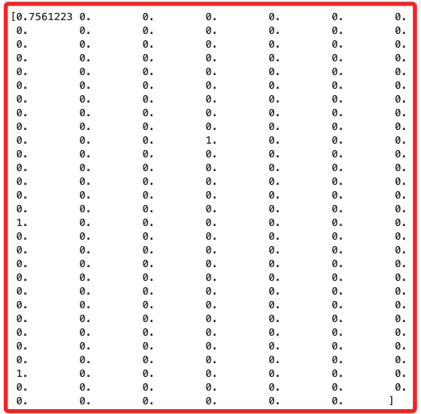

<br>

## 使用 SageMaker 內建算法訓練分類器

_使用 SageMaker 的 `LinearLearner()` 算法，設定以下選項_

<br>

1. 權限：使用當前環境的 AWS IAM 角色進行設定。

<br>

2. 計算能力：使用 `train_instance_count` 和 `train_instance_type` 參數來選擇實例。此範例使用 `ml.m4.xlarge` 執行資源進行訓練。

<br>

3. 模型類型：使用 `binary_classifier` 進行二分類問題的預測。如果問題是多分類問題，則可以使用 `multiclass_classifier`。

<br>

4. 這是 SageMaker 的內建演算法，用於 `線性分類` 和 `回歸模型` 的訓練；這段代碼是初始化一個使用線性學習演算法的分類器，並配置該模型的執行環境與資源，為後續的模型訓練作準備。

    ```python
    import sagemaker

    # 呼叫 LinearLearner 估計器
    linear_classifier = sagemaker.LinearLearner(
        role=sagemaker.get_execution_role(),
        instance_count=1,
        instance_type='ml.m4.xlarge',
        predictor_type='binary_classifier'
    )
    ```

    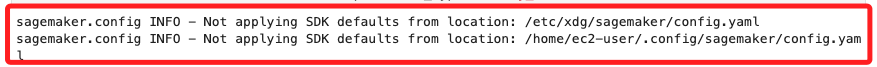

<br>

5. 代碼中的 `record_set()` 函數用於將數據轉換為 `SageMaker` 格式，如此便可以便可在 SageMaker 中進行訓練、驗證和測試；每個數據集會被設置到指定的 `channel` 中，也就是 `訓練`、`驗證` 或 `測試` 頻道。

    ```python
    train_records = linear_classifier.record_set(
        X_train.astype('float32'),
        y_train.values.astype('float32'),
        channel='train'
    )

    val_records = linear_classifier.record_set(
        X_val.astype('float32'),
        y_val.values.astype('float32'),
        channel='validation'
    )

    test_records = linear_classifier.record_set(
        X_test.astype('float32'),
        y_test.values.astype('float32'),
        channel='test'
    )
    ```

<br>

6. 使用 `fit()` 函數將數據傳遞給分佈式的 `隨機梯度下降 (SGD) 算法`；這個過程約要 `3-4` 分鐘。

    ```python
    linear_classifier.fit(
        [train_records, val_records, test_records],
        logs=False
    )
    ```

<br>

## 評估模型

1. 可使用 SageMaker 的分析工具來獲取模型的測試集性能指標，而不需要部署模型。SageMaker 提供了許多訓練過程中的指標，這些指標有助於模型調整的工作；對於 `二分類` 的問題可選擇以下指標。

    ```bash
    1. objective_loss：二分類問題的平均邏輯損失值。

    2. binary_classification_accuracy：模型在數據集上的最終準確率。

    3. precision：模型正類預測的精度。

    4. recall：模型正類預測的召回率。

    5. binary_f_beta：precision 和 recall 的調和平均數。
    ```

<br>

2. 在這個範例中關心的是正確的預測數，因此使用 `binary_classification_accuracy` 指標最為合適。

    ```python
    sagemaker.analytics.TrainingJobAnalytics(
        linear_classifier._current_job_name, 
        metric_names=[
            'test:binary_classification_accuracy'
        ]
    ).dataframe()
    ```

<br>

3. 模型的準確率在 `0.85` 左右，這代表模型約 `85%` 的時間能夠正確預測評論情感。

    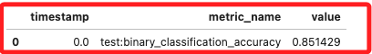

<br>

## 將模型部署到端點

1. 將模型部署到另一個實例中；部署的端點可與其他 AWS 服務一起使用，例如 `Lambda` 和 `API Gateway`。此過程約要 `7-8` 分鐘。

    ```python
    linear_classifier_predictor = linear_classifier.deploy(
        initial_instance_count=1,
        instance_type='ml.c5.large'
    )
    ```

    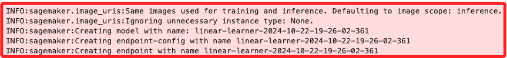

<br>

## 測試端點

1. 模型部署後，可將測試數據發送到端點，並從中獲取預測結果；特別注意代碼中的斷行。

    ```python
    import numpy as np

    # 以 25 條數據為一批次進行預測
    prediction_batches = [
        linear_classifier_predictor.predict(batch)
        for batch in np.array_split(
            X_test.astype('float32'), 25
        )
    ]

    # 獲取預測結果列表
    print([
        pred.label['score'].float32_tensor.values[0]
        for pred in prediction_batches[0]
    ])
    ```

    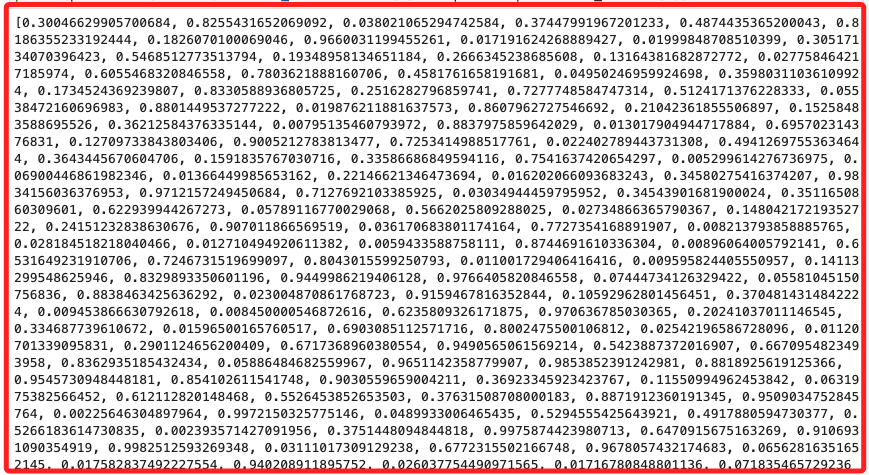

<br>

## 清理模型資源

1. 當不再需要使用模型端點時，可運行以下命令進行刪除，尤其是使用自己的 AWS 帳戶，端點持續存在會產生費用。

    ```python
    linear_classifier_predictor.delete_endpoint()
    ```

    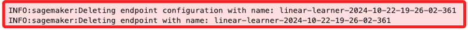

<br>

___

_END_
