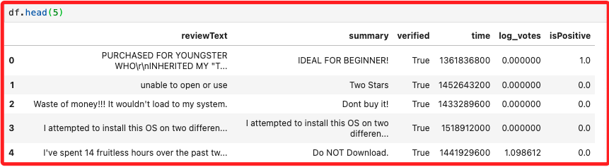
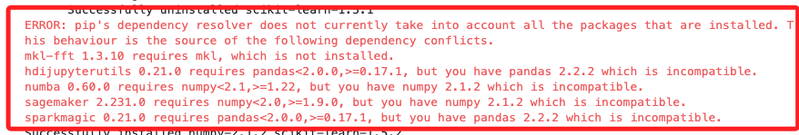
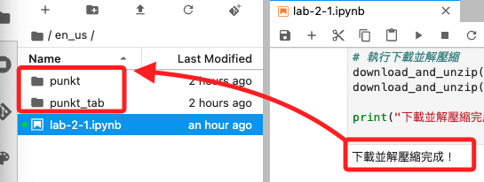
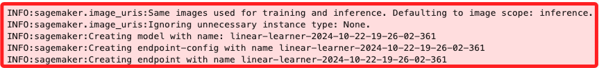
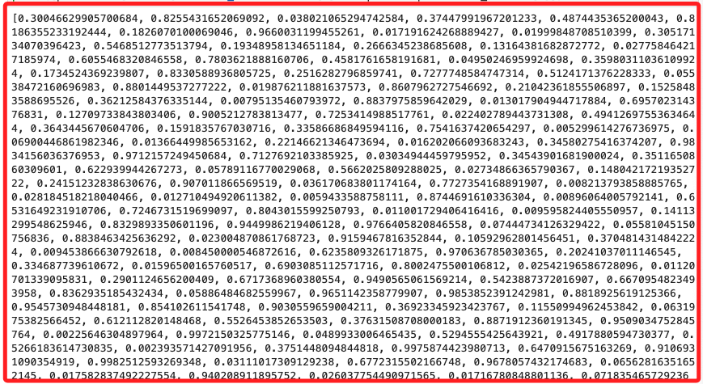

# Lab 2.1

_使用 SageMaker 內建的機器學習模型 `LinearLearner` 來預測 `評論數據集` 中的 `isPositive` 欄位。_

<br>

## 商業場景介紹

1. 假設一家線上零售公司希望從客戶回饋中自動檢測負面評論。公司提供了一個數據集，其中包含已經標記為正面或負面的評論。

<br>

2. 本次 Lab 的目標是使用機器學習模型來訓練這個數據集，並利用該模型來預測新評論的情感。

<br>

## 關於此數據集

_`AMAZON-REVIEW-DATA-CLASSIFICATION.csv`_

<br>

1. 數據集包含實際的 `產品評論`，這些評論包括文本數據和數字數據，每條評論都被標記為正面 (1) 或負面 (0)。

   

<br>

## 數據集欄位

_也就是特徵_

<br>

1. reviewText：評論的文本。
2. summary：評論的摘要。
3. verified：評論是否來自實際購買的客戶，以 `verified` 的 `True` 或 `False` 表示。
4. time：資料的時間戳。
5. log_votes：經對數調整後的投票數，計算式為 `log(1+votes)`，取對數是為了減少極端值的影響。
6. isPositive：評論為正面或負面，分別以 `1` 與 `0` 表示。

<br>

## 步驟

_以下代碼將以這 `10` 個步驟依序進行_

<br>

1. 讀取數據集；
2. 進行探索性數據分析；
3. 文本處理，移除停用詞和詞幹提取；
4. 將資料集拆分為 `訓練集`、`驗證集` 和 `測試集` 三個集合；
5. 使用 `Pipeline` 和 `ColumnTransformer` 處理數據；
6. 使用 SageMaker 內建算法訓練分類器；
7. 評估模型；
8. 將模型部署到端點；
9. 測試端點；
10. 清理模型資源。

<br>

## 讀取數據

1. 安裝並升級所需套件；在 `.ipynb` 腳本的 CELL 中，可透過魔法指令 `!` 或 `%` 下達終端機指令。

   ```python
   !pip install --upgrade pip
   !pip install --upgrade scikit-learn
   !pip install --upgrade sagemaker
   !pip install --upgrade botocore
   !pip install --upgrade awscli
   ```

<br>

2. 安裝過程會出現一些錯誤訊息，主要包含兩個部分，一是套件 `pandas` 和 `numpy` 的版本衝突，二是缺少 `mkl-fft` 套件；可不予理會，遇到問題再回頭處理。

   

<br>

3. 若想安裝缺少的套件，可運行以下指令。

   ```bash
   pip install mkl-fft
   ```

<br>

4. 若想依照 pip 指定的適配版本進行安裝，可運行以下指令。

   ```bash
   pip install numpy==1.21 pandas==1.3.3
   ```

<br>

5. 比較合適的方式還是建立虛擬環境，載此不做贅述。

<br>

## 關於資料缺漏

**_特別說明，部分範例代碼在初次運行時出現錯誤所以進行了排除，後來 AWS 可能修正過腳本而不再出錯，這裡僅保留作爲參考經。_**

<br>

1. **_僅供參考_**；假如出現 `punkt` 或 `punkt_tab` 文件缺漏的錯誤提示，可自行使用 `requests` 和 `zipfile` 下載並解壓縮文件；下載的資源是 `NLP` 中的 `標記化` 工具，用來進行句子和詞語的切分。

   ```python
   import requests
   import zipfile
   import os

   # 自訂下載文件的函數
   def download_and_unzip(url, extract_to='.'):
       local_filename = url.split('/')[-1]

       # 下載文件
       with requests.get(url, stream=True) as r:
           r.raise_for_status()
           with open(local_filename, 'wb') as f:
               for chunk in r.iter_content(chunk_size=8192): 
                   if chunk:
                       f.write(chunk)

       # 解壓縮文件
       with zipfile.ZipFile(local_filename, 'r') as zip_ref:
           zip_ref.extractall(extract_to)

       # 刪除壓縮文件
       os.remove(local_filename)

   # 文件下載的 URL
   punkt_url = "https://raw.githubusercontent.com/nltk/nltk_data/gh-pages/packages/tokenizers/punkt.zip"
   punkt_tab_url = "https://raw.githubusercontent.com/nltk/nltk_data/gh-pages/packages/tokenizers/punkt_tab.zip"

   # 調用自訂函數執行下載並解壓縮
   download_and_unzip(punkt_url)
   download_and_unzip(punkt_tab_url)

   print("下載並解壓縮完成。")
   ```

   

<br>

2. 設定 `NLTK` 資源的路徑，使用本地目錄 `punkt` 和 `punkt_tab`。

   ```python
   import nltk

   # 手動設置 nltk 資源的路徑
   nltk.data.path.append('./punkt')

   # 確認是否正確添加
   print(nltk.data.path)
   ```

   _輸出_

   

<br>

## 讀取數據集

_開始進行_

<br>

1. 讀取並觀察 Lab 預先準備的數據集 `AMAZON-REVIEW-DATA-CLASSIFICATION.csv`。

   ```python
   import pandas as pd

   df = pd.read_csv(
       '../data/AMAZON-REVIEW-DATA-CLASSIFICATION.csv'
   )

   print('數據集的形狀為：', df.shape)
   ```

<br>

2. 依據結果可知數據集有 70,000 列，列也就是樣本數，還有 6 欄位，而欄位就是特徵數；特別注意列與欄在繁簡的翻譯是剛好相反的。

   ```bash
   The shape of the dataset is: (70000, 6)
   ```

<br>

3. 查看前五筆輸出。

   ```python
   df.head(5)
   ```

   

<br>

4. 顯示更完整的數據，參數 `display.max_colwidth` 指定單元格中可顯示文本的最大寬度，設為 `None` 表示 `無限制`，也就是 `完整顯示所有文本`，不會被截斷。

   ```python
   pd.set_option('display.max_colwidth', None)
   df.head()
   ```

   

<br>

5. 查詢具體條目。

   ```python
   print(df.loc[[580]])
   ```

   

<br>

6. 檢查數據類型；`dtypes` 是 `pandas` 的屬性。

   ```python
   df.dtypes
   ```

   

<br>

## 進行探索性數據分析

1. 查看資料集指定欄位的 `分佈`，或稱為 `頻率` 或 `次數`。

   ```python
   df['isPositive'].value_counts()
   ```

   

<br>

2. 交換正負向評論的 `標籤值`，因為任務的重點是搜尋原始標籤為 `0` 的負面評論，但 `Linear Learner` 模型預設是針對標籤為 `1` 進行分類，因此將負面評論的標籤改為 `1`，正面評論改為 `0`，以便讓模型的訓練和調整過程更加順利。

   ```python
   df = df.replace({0:1, 1:0})
   df['isPositive'].value_counts()
   ```

   

<br>

3. 透過計算 `isna` 出現的頻率來檢查缺失值；這裡並未提示如何處理缺失值，暫時擱置無妨。

   ```python
   df.isna().sum()
   ```

   

<br>

## 文本處理

_移除停用詞和詞幹提取_

<br>

1. 從 `nltk` 資料庫下載兩個資源，`punkt` 是 `分詞器`，用來將文字分割成一個個單詞或標點符號；`stopwords` 是 `停用詞的列表`，例如 `the`、`is` 等，這些詞在自然語言處理任務中的分析價值很低，可進行移除。

   ```python
   import nltk
   nltk.download('punkt')
   nltk.download('stopwords')
   ```

<br>

2. 從 `NLTK` 載入指定語言為 `英文` 的停用詞列表，並在設定排除項目後，建立新的停用詞列表。

   ```python
   import nltk, re
   from nltk.corpus import stopwords
   from nltk.stem import SnowballStemmer
   from nltk.tokenize import word_tokenize

   # 從 NLTK 提供的英文停用詞庫中載入一個預設的停用詞列表
   stop = stopwords.words('english')

   # 定義例外列表，這些詞在情感分析中可能具有重要意義。
   excluding = [
       'against', 'not', 'don', 'don\'t','ain', 'are',
       'aren\'t', 'could', 'couldn\'t','did', 'didn\'t',
       'does', 'doesn\'t', 'had', 'hadn\'t', 'has', 'hasn\'t',
       'have', 'haven\'t', 'is', 'isn\'t', 'might',
       'mightn\'t', 'must', 'mustn\'t', 'need', 'needn\'t',
       'should', 'shouldn\'t', 'was', 'wasn\'t', 'were',
       'weren\'t', 'won\'t', 'would', 'wouldn\'t'
   ]

   # 新的停用詞列表
   stopwords = [word for word in stop if word not in excluding]
   ```

<br>

3. 透過 `滾雪球詞幹分析器` 進行詞幹提取，或稱為 `詞幹化（Stemming）`，例如將 `walking` 詞幹化為 `walk`；也就是通過去掉單詞的 `詞綴` 將其還原為基本型態；特別注意，詞幹化主要針對像英文這類屈折語系比較有效，中文的語意通常是由不同的字組合構成詞語，因此詞幹化並不適用於中文的自然語言處理。

   ```python
   snow = SnowballStemmer('english')
   ```
4. 自訂處理字串的函數，功能包含將缺失值替換為空字串、將文字轉換為小寫、刪除任何頭尾空格、刪除任何多餘的空格和製表符、刪除所有 HTML 標記；封裝的用意無非就是重用，代碼如下不做贅述。

   ```python
   def process_text(texts): 
       final_text_list=[]
       for sent in texts:
           if isinstance(sent, str) == False:
               sent = ''

           filtered_sentence=[]

           sent = sent.lower() 
           sent = sent.strip() 
           sent = re.sub('\s+', ' ', sent) 
           sent = re.compile('<.*?>').sub('', sent)

           for w in word_tokenize(sent):
               if(not w.isnumeric()) and (len(w)>2) and (w not in stopwords):  
                   filtered_sentence.append(snow.stem(w))
           final_string = " ".join(filtered_sentence) 
           final_text_list.append(final_string)

       return final_text_list
   ```

<br>

## 分拆訓練、驗證和測試集

1. 使用 `sklearn` 提供的函數進行分拆；先將資料集分成 `訓練集` 和 `驗證集`，再進一步將 `驗證集` 分成 `驗證集` 和 `測試集`，這樣的流程可確保模型有獨立的資料來進行測試，而不影響訓練和驗證過程。

   ```python
   from sklearn.model_selection import train_test_split

   # 第一次分拆：將資料集拆分為訓練集和驗證集
   X_train, X_val, y_train, y_val = train_test_split(
       # 選擇要用來訓練模型的特徵欄位
       df[['reviewText', 'summary', 'time', 'log_votes']],
       # 目標欄位，也就是是否為正面評論
       df['isPositive'],
       # 將 20% 的資料保留為驗證集，也就是 80% 做為訓練集
       test_size=0.20,
       # 將資料打亂順序後再進行分割
       shuffle=True,
       # 設定隨機種子，保證結果的可重現性
       random_state=324
   )

   # 第二次分拆，將驗證集再分割為驗證集與測試集
   X_val, X_test, y_val, y_test = train_test_split(
       # 使用第一次分割中剩下的驗證集資料
       X_val,
       # 對應的標籤
       y_val,
       # 將剩下的 50% 資料保留為測試集，其餘作為驗證集
       test_size=0.5,
       # 同樣將資料打亂
       shuffle=True,
       # 設定相同的隨機種子
       random_state=324
   )
   ```

<br>

2. 將分拆後的 `訓練集`、`驗證集` 和 `測試集` 中的 `reviewText` 和 `summary` 欄位進行文本處理，通過 `process_text()` 函數對這些文本數據進行 `分詞`、`去停用詞`、`詞幹化` 等操作。

   ```python
   print('處理 reviewText 欄位')

   # 將訓練集中的 reviewText 欄位轉換為列表後進行文本處理
   X_train['reviewText'] = process_text(
       # 轉換為列表
       X_train['reviewText'].tolist()
   )

   # 將驗證集中的 reviewText 欄位轉換為列表後，進行文本處理
   X_val['reviewText'] = process_text(
       X_val['reviewText'].tolist()
   )

   # 將測試集中的 reviewText 欄位轉換為列表後，進行文本處理
   X_test['reviewText'] = process_text(
       X_test['reviewText'].tolist()
   )

   print('處理 summary 欄位')

   # 將訓練集中的 summary 欄位轉換為列表後，進行文本處理
   X_train['summary'] = process_text(
       X_train['summary'].tolist()
   )

   # 將驗證集中的 summary 欄位轉換為列表後，進行文本處理
   X_val['summary'] = process_text(
       X_val['summary'].tolist()
   )

   # 將測試集中的 summary 欄位轉換為列表後，進行文本處理
   X_test['summary'] = process_text(
       X_test['summary'].tolist()
   )
   ```

<br>

## 使用管道和 ColumnTransformer 處理數據

_在開始訓練模型之前，需要對數據進行一些預處理，這些步驟對於訓練模型和推理都非常重要。_

<br>

1. 透過定義 `pipeline` 將不同的處理步驟有序地執行，對於不同的欄位，可以建立不同的管道進行處理。

<br>

1. 對於數值特徵，使用 `numerical_processor` 進行 `MinMaxScaler` 的縮放，這個步驟對於某些算法是重要的。

<br>

3. 對於 `文本特徵`，使用 `CountVectorizer()` 將 `文本欄位` 轉換為 `特徵向量`，代碼中設置了兩個 `CountVectorizer`，分別作用於兩個文本特徵 `summary` 和 `reviewText`。

<br>

4. 這些不同的預處理操作會被放入一個 `ColumnTransformer` 中，最終再放入一個完整的管道；這樣無論在訓練或推理階段，都可以自動對數據進行正確的處理。

<br>

5. 設置模型的輸入特徵和目標變量。

   ```python
   # 定義數值特徵，這些數值特徵將作為模型的輸入
   numerical_features = ['time', 'log_votes']
   # 定義文本特徵
   text_features = ['summary', 'reviewText']
   # 將數值和文本特徵合併，得到模型的全部輸入特徵
   model_features = numerical_features + text_features
   # 定義模型的目標變量，也就是要預測的標籤
   model_target = 'isPositive'
   ```

<br>

6. 對數據集中的數值與文本特徵進行預處理，並將它們轉換成模型可以使用的格式，`fit_transform` 對訓練集進行預處理，並應用到訓練數據中；`transform` 對驗證集和測試集進行相同的轉換，保持與訓練集一致的處理方式。

   ```python
   from sklearn.impute import SimpleImputer
   from sklearn.preprocessing import MinMaxScaler
   from sklearn.feature_extraction.text import CountVectorizer
   from sklearn.pipeline import Pipeline
   from sklearn.compose import ColumnTransformer

   '''定義 COLUMN_TRANSFORMER'''

   # 數值特徵的預處理
   numerical_processor = Pipeline([
       ('num_imputer', SimpleImputer(strategy='mean')),
       ('num_scaler', MinMaxScaler()) 
   ])

   # 文本特徵 1 的預處理
   text_processor_0 = Pipeline([(
       'text_vect_0',
       CountVectorizer(binary=True, max_features=50)
   )])

   # 文本特徵 2 的預處理
   text_processor_1 = Pipeline([(
       'text_vect_1',
       CountVectorizer(binary=True, max_features=150)
   )])

   # 將所有預處理步驟組合到一個 ColumnTransformer 中
   data_preprocessor = ColumnTransformer([
       ('numerical_pre', numerical_processor, numerical_features),
       ('text_pre_0', text_processor_0, text_features[0]),
       ('text_pre_1', text_processor_1, text_features[1])
   ])

   '''準備數據'''

   print(
       '數據集處理前的形狀: ',
       X_train.shape,
       X_val.shape,
       X_test.shape
   )

   X_train = data_preprocessor.fit_transform(X_train).toarray()
   X_val = data_preprocessor.transform(X_val).toarray()
   X_test = data_preprocessor.transform(X_test).toarray()

   print(
       '數據集處理後的形狀: ',
       X_train.shape,
       X_val.shape,
       X_test.shape
   )
   ```

<br>

7. 輸出 `訓練集 X_train` 的第一個樣本；前面的數值 `0.7561223` 是針對 `數值特徵` 進行標準化後的結果。

   ```python
   print(X_train[0])
   ```

   

<br>

## 使用 SageMaker 內建算法訓練分類器

1. 使用 SageMaker 的 `LinearLearner()` 算法需進行參數設定，包含角色、實例規格、模型類型等，以下代碼設定使用 `ml.m4.xlarge` 進行訓練；`LinearLearner()` 是 SageMaker 內建的演算法，適用於 `線性分類` 和 `回歸模型` 的訓練。

<br>

2. 模型類型的選擇要適配要解決的問題，這個情境是進行 `二分類問題` 的預測，所以使用 `binary_classifier`；如果是 `多分類問題` 可使用 `multiclass_classifier`。

<br>

3. 以下這段代碼初始化一個使用 `線性學習演算法` 的分類器，並配置模型的執行環境與資源，為後續的模型訓練作準備。

   ```python
   import sagemaker

   # 呼叫 LinearLearner 估計器
   linear_classifier = sagemaker.LinearLearner(
       # 使用當前環境的角色
       role=sagemaker.get_execution_role(),
       # 訓練使用的實例數量
       instance_count=1,
       # 訓練使用的實例規格
       instance_type='ml.m4.xlarge',
       # 模型類型
       predictor_type='binary_classifier'
   )
   ```

   

<br>

4. 因為 `SageMaker` 內建的算法要求數據以特定的格式進行處理，所以接下來使用 `record_set()` 函數將數據轉換為 `SageMaker` 支援的格式，轉換後便可將數據發送到不同的 `channel` 中，分別用於 `訓練`、`驗證` 和 `測試`。每個數據集會被對應到適合的 `channel`，確保 `SageMaker` 能夠正確使用這些數據來進行後續的模型訓練和評估。

   ```python
   train_records = linear_classifier.record_set(
       X_train.astype('float32'),
       y_train.values.astype('float32'),
       channel='train'
   )

   val_records = linear_classifier.record_set(
       X_val.astype('float32'),
       y_val.values.astype('float32'),
       channel='validation'
   )

   test_records = linear_classifier.record_set(
       X_test.astype('float32'),
       y_test.values.astype('float32'),
       channel='test'
   )
   ```

<br>

5. 使用 `fit()` 函數將數據傳遞給分佈式的 `隨機梯度下降 (SGD) 算法`；這個過程約要 `3-4` 分鐘。

   ```python
   linear_classifier.fit(
       [train_records, val_records, test_records],
       logs=False
   )
   ```

   

<br>

## 評估模型

1. 可使用 SageMaker 的分析工具來獲取模型的測試集性能指標，而不需要部署模型。SageMaker 提供了許多訓練過程中的指標，這些指標有助於模型調整的工作；對於 `二分類` 的問題可選擇以下指標。

   ```bash
   1. objective_loss：二分類問題的平均邏輯損失值。

   2. binary_classification_accuracy：模型在數據集上的最終準確率。

   3. precision：模型正類預測的精度。

   4. recall：模型正類預測的召回率。

   5. binary_f_beta：precision 和 recall 的調和平均數。
   ```

<br>

2. 在這個範例中關心的是正確的預測數，因此使用 `binary_classification_accuracy` 指標最為合適。

   ```python
   sagemaker.analytics.TrainingJobAnalytics(
       linear_classifier._current_job_name, 
       metric_names=[
           'test:binary_classification_accuracy'
       ]
   ).dataframe()
   ```

<br>

3. 模型的準確率在 `0.85` 左右，這代表模型約 `85%` 的時間能夠正確預測評論情感。

   

<br>

## 將模型部署到端點

1. 將模型部署到另一個實例中；部署的端點可與其他 AWS 服務一起使用，例如 `Lambda` 和 `API Gateway`。此過程約要 `7-8` 分鐘。

   ```python
   linear_classifier_predictor = linear_classifier.deploy(
       initial_instance_count=1,
       instance_type='ml.c5.large'
   )
   ```

   

<br>

## 測試端點

1. 模型部署後，可將測試數據發送到端點，並從中獲取預測結果；特別注意代碼中的斷行。

   ```python
   import numpy as np

   # 以 25 條數據為一批次進行預測
   prediction_batches = [
       linear_classifier_predictor.predict(batch)
       for batch in np.array_split(
           X_test.astype('float32'), 25
       )
   ]

   # 獲取預測結果列表
   print([
       pred.label['score'].float32_tensor.values[0]
       for pred in prediction_batches[0]
   ])
   ```

   

<br>

## 清理模型資源

1. 當不再需要使用模型端點時，可運行以下命令進行刪除，尤其是使用自己的 AWS 帳戶，端點持續存在會產生費用。

   ```python
   linear_classifier_predictor.delete_endpoint()
   ```

   

<br>

---

_END_
