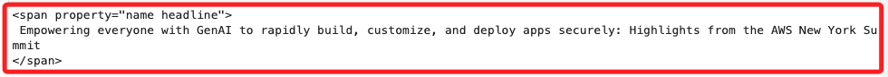
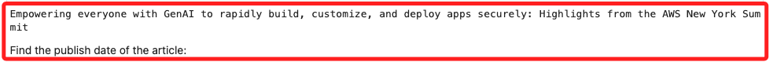
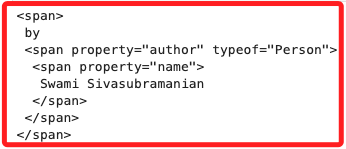
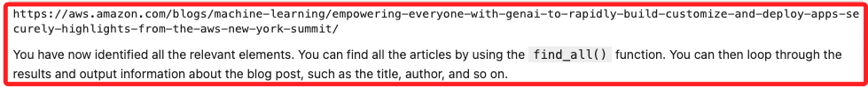
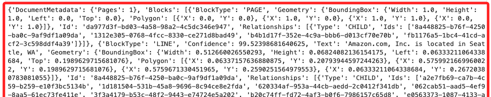
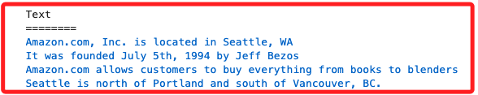
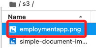
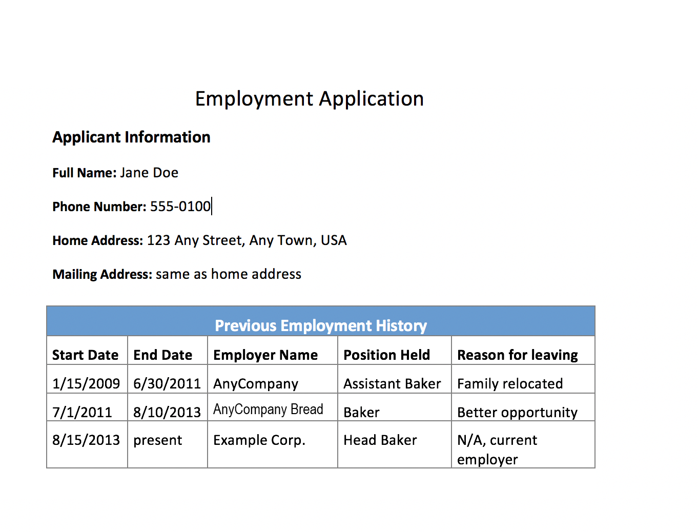
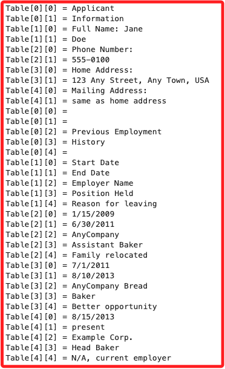

# 代碼解析

_其實這就是個普通的爬蟲腳本，使用 `Beautiful Soup` 和 `Amazon Textract` 從網頁和圖片中提取文本，並將結果轉換為 `pandas`。_

<br>

## 開發環境

1. 升級並安裝所需的套件，其中 `textract-trp` 是 `Amazon Textract` 的 Python 模組，用於處理 `Textract` 生成的提取結果，例如表格或表單；`Textract` 是 AWS 提供的 OCR 工具，可以從文件中自動提取結構化數據。

    ```python
    # 升級並安裝所需的套件
    !pip install --upgrade pip
    !pip install --upgrade sagemaker
    !pip install --upgrade beautifulsoup4
    !pip install --upgrade html5lib
    !pip install --upgrade requests
    !pip install --upgrade textract-trp
    ```

<br>

## 從網頁中提取訊息

1. 使用 `Beautiful Soup` 來提取文章的標題、作者、摘要、發佈日期和超鏈接，提取的文本可用於後續的 NLP 任務，如主題提取、情感分析、文本轉語音或翻譯。

    ```python
    from bs4 import BeautifulSoup
    import requests
    ```

<br>

## 請求網頁並加載到 BeautifulSoup

1. 使用 `requests` 庫請求網頁，並確認 HTTP 狀態碼為 `200`。

    ```python
    page = requests.get('https://aws.amazon.com/blogs/machine-learning/')
    page.status_code
    ```

    _輸出_

    ```bash
    200
    ```

<br>

2. 將頁面內容加載到 `soup` 中。

    ```python
    soup = BeautifulSoup(page.content, 'html.parser')
    ```

<br>

3. 使用 `soup.prettify()` 查看頁面的完整內容。

    ```python
    print(soup.prettify())
    ```

<br>

4. 根據輸出找到文章的標題，可知標題在 `soup.article.h2.span` 中。

    ```python
    print(soup.article.h2.span.prettify())
    ```

    _結果_

    

<br>

## 提取標題、日期、摘要和作者

1. 提取標題的純文本，使用 `.text` 屬性。

    ```python
    print(soup.article.h2.span.text)
    ```

    _輸出_

    

<br>

2. 提取發佈日期。

    ```python
    print(soup.article.time.text)
    ```

    _輸出_

    ```bash
    10 JUL 2024
    ```

<br>

3. 提取文章摘要。

    ```python
    print(soup.article.section.p.text)
    ```

    _輸出_

    ```bash
    See how AWS is democratizing generative AI with innovations like Amazon Q Apps to make AI apps from prompts, Amazon Bedrock upgrades to leverage more data sources, new techniques to curtail hallucinations, and AI skills training.
    ```

<br>

4. 提取第一位作者的名字。

    ```python
    print(soup.article.footer.span.prettify())
    ```

    _結果_

    

<br>

5. 提取文章的完整超鏈接。

    ```python
    print(soup.article.div.a['href'])
    ```

    _輸出_

    

<br>

## 使用 `find_all()` 提取所有文章信息

1. 可以使用 `find_all()` 方法提取頁面中的所有文章，並提取標題、作者、日期、摘要和超鏈接。

    ```python
    for article in soup.find_all('article'):
        print('==========================================')
        print(article.h2.span.text)
        authors = article.footer.find_all('span', {"property":"author"})
        print('by', end=' ')
        for author in authors:
            if author.span != None:
                print(author.span.text, end=', ')
        print(f'on {article.time.text}')
        print(article.section.p.text)
        print(article.div.a['href'])
    ```

<br>

2. 可將這些信息添加到一個陣列中，然後存入 pandas 資料框。

    ```python
    blog_posts = []
    for article in soup.find_all('article'):
        authors = article.footer.find_all('span', {"property":"author"})
        author_text = []
        for author in authors:
            if author.span != None:
                author_text.append(author.span.text)
        blog_posts.append([article.h2.span.text, ', '.join(author_text), article.time.text, article.section.p.text, article.div.a['href'] ])
        
    df = pd.DataFrame(blog_posts, columns=['title','authors','published','summary','link'])
    ```

<br>

3. 將發佈日期轉換為 `datetime` 格式。

    ```python
    df['published'] = pd.to_datetime(df['published'], format='%d %b %Y')
    ```

<br>

4. 調整 pandas 顯示的欄位寬度，並顯示前五行。

    ```python
    pd.options.display.max_rows
    pd.set_option('display.max_colwidth', None)
    df.head()
    ```

<br>

## 從圖片中提取文本

1. 使用 `Amazon Textract` 從圖片中提取文本。

    ```python
    import boto3
    ```

<br>

2. 設置 S3 儲存桶的名稱和圖片的文件名。

    ```python
    s3BucketName = "c133864a3391488l8075554t1w388111502021-labbucket-6fafswxet9kr"
    documentName = "lab31/simple-document-image.jpg"
    ```

<br>

3. 使用 Amazon Textract 的 API 提取圖片中的文本。

    ```python
    # Amazon Textract 客戶端
    textract = boto3.client('textract')

    # 調用 Amazon Textract
    response = textract.detect_document_text(
        Document={
            'S3Object': {
                'Bucket': s3BucketName,
                'Name': documentName
            }
        })

    print(response)
    ```

    

<br>

4. 從 `Blocks` 列表中提取文本信息。

    ```python
    # 輸出文本
    print("\nText\n========")
    text = ""
    for item in response["Blocks"]:
        if item["BlockType"] == "LINE":
            print ('\033[94m' +  item["Text"] + '\033[0m')
            text = text + " " + item["Text"]
    ```

    

<br>

5. 更換新的圖片文件名。

    ```python
    # 新文件名
    documentName = "lab31/employmentapp.png"
    ```

<br>

6. 檔案位置。

    

    _圖片如下_

    

<br>

7. 調用 Textract 分析圖片中的表格數據。

    ```python
    response = textract.analyze_document(
        Document={
            'S3Object': {
                'Bucket': s3BucketName,
                'Name': documentName
            }
        },
        FeatureTypes=["TABLES"])
    ```

<br>

8. 使用 `trp` 解析 Textract 提取的表格數據。

    ```python
    from trp import Document
    doc = Document(response)

    for page in doc.pages:
        for table in page.tables:
            for r, row in enumerate(table.rows):
                for c, cell in enumerate(row.cells):
                    print("Table[{}][{}] = {}".format(r, c, cell.text))
    ```

    

<br>

## 修改代碼

1. 安裝套件。

    ```bash
    pip install pytesseract opencv-python
    ```

<br>

2. 代碼。

    ```python
    '''匯入必要的模組'''
    # 用於 OCR 文本識別
    import pytesseract
    # 用於圖片處理
    import cv2
    # 用於讀取圖片
    from PIL import Image
    # 用於將數據轉為 DataFrame
    import pandas as pd

    # 設定 pytesseract 路徑
    # 如果 pytesseract 沒有預設安裝在環境中，需要指定路徑
    pytesseract.pytesseract.tesseract_cmd = r'/opt/homebrew/bin/tesseract'

    # 從本地加載 employmentapp.png 圖片
    # 使用本地圖片路徑
    img_path = "images/employmentapp.png"
    img = Image.open(img_path)

    # 使用 pytesseract 對表格進行文字提取
    text = pytesseract.image_to_string(img)

    # 打印提取的文字
    print("提取的文字內容：")
    print(text)

    # 假設提取的表格數據是以換行符和制表符分隔的，將其轉換為表格格式
    # 這裡假設表格數據每一行用換行符分隔，列數據用制表符分隔
    # 按行分割文本
    rows = text.split('\n')
    # 每行按制表符分割
    table_data = [row.split('\t') for row in rows] 

    # 將數據轉換為 DataFrame 進行結構化處理
    df = pd.DataFrame(table_data)

    # 打印處理後的 DataFrame
    print("\n轉換為 DataFrame 後的表格數據：")
    print(df)

    # 將 DataFrame 保存為 CSV 文件
    df.to_csv('extracted_table.csv', index=False)

    print("表格數據已提取並保存為 'extracted_table.csv'。")
    ```

<br>

___

_END_