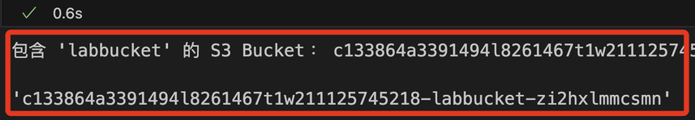
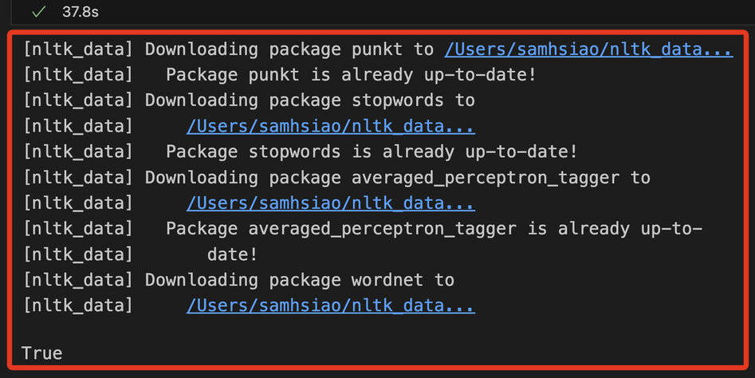
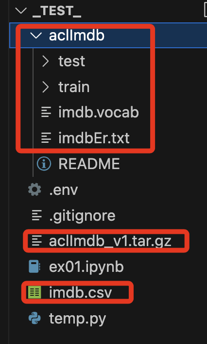
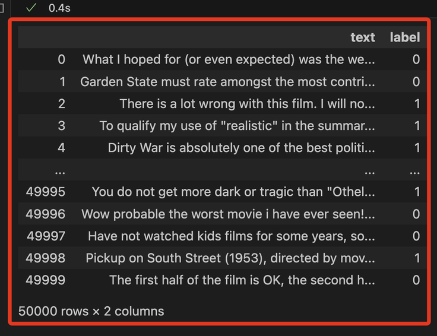
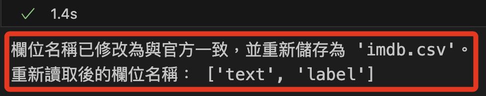
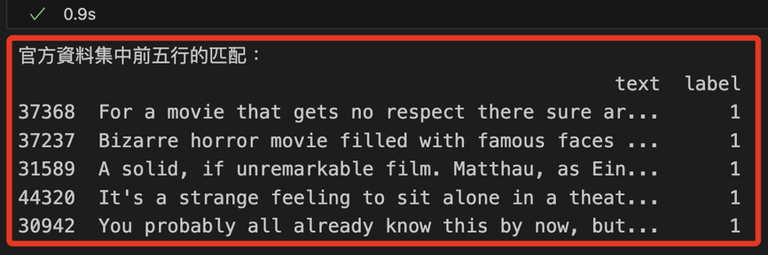
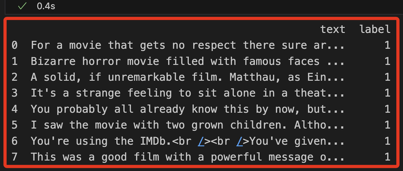

# Lab 4.1：實作 Sentiment Analysis

_Version: 02.14.2023_

<br>

## 說明

1. 此 Lab 對 `IMDB` 資料集進行情緒分析，目的是訓練一個機器學習模型，用於分析電影評論的情緒，並能夠對評論進行推理，判斷其為正面還是負面。

<br>

2. 使用包含 50,000 條已標記為正面或負面的電影評論文本資料集，該資料集發布於 2011 年 6 月，詳細資訊可參考 [連結](http://ai.stanford.edu/~amaas/data/sentiment/)。

<br>

3. 特別說明，此資料集的情緒標籤，1 表示正面、0 表示負面。

<br>

## 步骤

1. 安裝套件。

<br>

2. 讀取資料集。

<br>

3. 執行探索性資料分析。

<br>

4. 執行第一次傳遞：最低程度的處理。

<br>

5. 執行第二次傳遞：標準化文本。

<br>

6. 優化超參數。

<br>

7. 使用 BlazingText。

<br>

8. 使用 Amazon Comprehend。

<br>

## 本地開發

_若在本地開發_

<br>

1. 建立新的虛擬環境。

```bash
cd ~/Documents/PythonVenv && python -m venv envAWS2
code ~/.zshrc 
```

<br>

2. 套用變更。

```bash
source ~/.zshrc
```

<br>

3. 建立專案資料夾。

```bash
mkdir -p ~/Desktop/_test_ && cd ~/Desktop/_test_
touch ex01.ipynb .env .gitignore
code .
```

<br>

4. 在 `.env` 貼上 Lab 首頁的 `AWS CLI` 內容不包含 `[default]` 部分。

<br>

5. 緊接著在 `.env` 下方貼上以下內容，完成 AWS CLI 設置。

```bash
AWS_ACCESS_KEY_ID=${aws_access_key_id}
AWS_SECRET_ACCESS_KEY=${aws_secret_access_key}
AWS_SESSION_TOKEN=${aws_session_token}
AWS_DEFAULT_REGION=us-east-1
```

<br>

## 安装套件

1. 在筆記本中可使用魔法方法安裝套件。

```python
!pip install --upgrade pip
!pip install --upgrade boto3
!pip install --upgrade scikit-learn
!pip install --upgrade sagemaker
!pip install --upgrade nltk
!pip install --upgrade seaborn
```

<br>

2. 在本地運行則建議在終端機中安裝。

```bash
python -m pip install --upgrade pip awscli boto3 scikit-learn  nltk seaborn python-dotenv
```

<br>

3. 載入環境變數。

```python
from dotenv import load_dotenv
import os

# 載入 .env 文件
load_dotenv()
```


<br>

4. 驗證帳號。

```python
import boto3

# 初始化 STS 客戶端
sts_client = boto3.client('sts')

# 獲取當前帳戶的 Account ID
account_id = sts_client.get_caller_identity()["Account"]
print("當前的 Account ID:", account_id)
```


<br>

## 關於 Sagemaker 本地運作

_諸多限制_

1. 安裝以下套件才可以在本地環境中使用 SDK 指定角色，以便在本地環境中使用 SageMaker 提供的各種功能並與服務互動。

```bash
python -m pip install sagemaker
```

<br>

2. 導入 `sagemaker` 關於 `Lab` 的庫；從輸出的訊息可知知 SDK 沒有從這些位置應用預設配置，不影響 SDK 的正常運行，可以忽略這些資訊。

```python
import sagemaker
from sagemaker.estimator import Estimator
from sagemaker import get_execution_role
```


<br>

3. 在雲端運作時，可直接指定角色，將以下代碼替為指定角色。

```python
role = "<arn:aws:iam::XX-共12碼-XXX:role/自己的-SageMaker-執行角色>"
```

<br>

4. 基於自動化的角度，可透過函數取得角色來執行；特別注意，這只在 SageMaker notebook 執行環境中適用。

```python
role = get_execution_role()
```

<br>

5. 訊息顯示 `SageMaker SDK` 在嘗試獲取角色詳細資訊時出現警告，特別注意，這不會阻止函數返回角色的 ARN，儘管顯示 `Couldn't call 'get_role'` 的警告，但依然成功返回了 `arn:aws:iam::211125745218:role/voclabs`；推測可忽略警告，至少截至目前並不影響程式正常運作。


<br>

## 查詢

_S3 Bucket、IAM Roles_

<br>

1. 列出名稱中包含 labbucket 的 S3 bucket。

```python
import boto3

# 初始化 S3 客戶端
s3_client = boto3.client('s3')

# 列出所有 S3 buckets 並篩選名稱包含 'labbucket' 的
try:
    response = s3_client.list_buckets()
    # 只取出第一個名稱包含 'labbucket' 的 S3 bucket，若無則返回 None
    bucket_name = next((bucket['Name'] for bucket in response['Buckets'] if 'labbucket' in bucket['Name']), None)

    # 顯示結果
    if bucket_name:
        print("包含 'labbucket' 的 S3 Bucket：", bucket_name)
    else:
        print("找不到包含 'labbucket' 的 S3 Bucket。")
except Exception as e:
    print(f"發生錯誤: {e}")

bucket_name
```



<br>

2. 查詢有哪些 Roles。

```python
import boto3

# 初始化 IAM 客戶端
iam_client = boto3.client('iam')

# 列出所有 IAM 角色的名稱
try:
    roles = iam_client.list_roles()
    print("帳戶中的 IAM 角色名稱：")
    for role in roles['Roles']:
        print(role['RoleName'])
except Exception as e:
    print(f"發生錯誤: {e}")
```


## 撰寫腳本

1. 導入主要庫並下載 NLTK。

```python
import boto3
import os, io, struct
import numpy as np
import pandas as pd
from sklearn.metrics import(
    roc_auc_score, 
    roc_curve, 
    auc, 
    confusion_matrix
)
import seaborn as sns
import matplotlib.pyplot as plt
from datetime import datetime

import nltk
nltk.download('punkt')
nltk.download('stopwords')
nltk.download('averaged_perceptron_tagger')
nltk.download('wordnet')
```



<br>

## 自訂輔助函數

1. 以下函數可用於繪製混淆矩陣並計算其他關鍵指標。

```python
def plot_confusion_matrix(test_labels, target_predicted):
    # 計算混淆矩陣
    matrix = confusion_matrix(test_labels, target_predicted)
    # 將混淆矩陣轉換為 DataFrame 格式
    df_confusion = pd.DataFrame(matrix)
    # 設定顏色圖的配色方案
    colormap = sns.color_palette("BrBG", 10)
    # 繪製熱力圖，並顯示數值
    sns.heatmap(df_confusion, annot=True, fmt='.2f', cbar=None, cmap=colormap)
    # 設定圖表的標題
    plt.title("Confusion Matrix")
    # 自動調整佈局
    plt.tight_layout()
    # 設定 y 軸標籤為 "True Class"（真實類別）
    plt.ylabel("True Class")
    # 設定 x 軸標籤為 "Predicted Class"（預測類別）
    plt.xlabel("Predicted Class")
    # 顯示圖表
    plt.show()

def print_metrics(test_labels, target_predicted_binary):
    # 計算混淆矩陣並解壓縮成 TN, FP, FN, TP
    TN, FP, FN, TP = confusion_matrix(test_labels, target_predicted_binary).ravel()
    # 計算靈敏度、命中率、召回率或真陽性率
    Sensitivity = float(TP)/(TP+FN)*100
    # 計算特異性或真陰性率
    Specificity = float(TN)/(TN+FP)*100
    # 計算精確度或正陽性預測值
    Precision = float(TP)/(TP+FP)*100
    # 計算陰性預測值
    NPV = float(TN)/(TN+FN)*100
    # 計算錯誤率或假陽性率
    FPR = float(FP)/(FP+TN)*100
    # 計算假陰性率
    FNR = float(FN)/(TP+FN)*100
    # 計算錯誤發現率
    FDR = float(FP)/(TP+FP)*100
    # 計算整體準確率
    ACC = float(TP+TN)/(TP+FP+FN+TN)*100

    '''個相輸出'''
    # 靈敏度或 TPR
    print(f"Sensitivity or TPR: {Sensitivity}%")    
    # 特異性或 TNR
    print(f"Specificity or TNR: {Specificity}%") 
    # 精確度
    print(f"Precision: {Precision}%")   
    # 陰性預測值
    print(f"Negative Predictive Value: {NPV}%")  
    # 假陽性率
    print(f"False Positive Rate: {FPR}%") 
    # 假陰性率
    print(f"False Negative Rate: {FNR}%")  
    # 錯誤發現率
    print(f"False Discovery Rate: {FDR}%" )
    # 整體準確率
    print(f"Accuracy: {ACC}%")
```

## 手動下載數據集

_IMDB 的數據集並非以 `imdb.csv` 的形式直接提供。_

<br>

1. 下載並將資料組合轉換成 `CSV` 格式；程式碼生成的 `imdb.csv` 包含兩列 `review` 和 `sentiment`，分別記錄 `評論文本` 與 `正面或負面的標記`，這樣的格式可用於情緒分析任務；特別注意，手動下載後的原始數據集在欄位名稱上與 Lab 提供的不同，這在後續步驟會進行轉換。

```python
import os
import urllib.request
import tarfile
import pandas as pd

# 定義下載 URL 和資料夾名稱
url = "http://ai.stanford.edu/~amaas/data/sentiment/aclImdb_v1.tar.gz"
data_dir = "aclImdb"

# 下載 IMDB 資料集
if not os.path.exists("aclImdb_v1.tar.gz"):
    print("Downloading IMDB dataset...")
    urllib.request.urlretrieve(url, "aclImdb_v1.tar.gz")
    print("Download complete.")

# 解壓縮資料集
if not os.path.exists(data_dir):
    print("Extracting IMDB dataset...")
    with tarfile.open("aclImdb_v1.tar.gz", "r:gz") as tar_ref:
        tar_ref.extractall(".")
    print("Extraction complete.")

# 準備資料並轉換為 CSV 格式
data = {"review": [], "sentiment": []}

# 讀取資料夾中的檔案並標記正面/負面
for split in ["train", "test"]:
    for sentiment in ["pos", "neg"]:
        folder_path = os.path.join(data_dir, split, sentiment)
        # 檢查資料夾是否存在
        if os.path.exists(folder_path):
            for filename in os.listdir(folder_path):
                file_path = os.path.join(folder_path, filename)
                with open(file_path, "r", encoding="utf-8") as file:
                    review = file.read()
                    # 正面為 1，負面為 0
                    label = 1 if sentiment == "pos" else 0 
                    data["review"].append(review)
                    data["sentiment"].append(label)

# 轉換為 DataFrame 並存成 CSV
df = pd.DataFrame(data)
df.to_csv("imdb.csv", index=False)
print("CSV file 'imdb.csv' created successfully.")
```


<br>

## 讀取數據集

1. 若在雲端執行，預設會將資料集存放在 `'../data/imdb.csv'`；在本地運行時，可存放在根目錄，並修正路徑如下。

```python
df = pd.read_csv('imdb.csv', header=0)
df
```


<br>

2. 在本地專案路徑中可看到添加一個目錄、三個文件，其中 `imdb.csv` 便是經過轉換後的新資料集。



<br>

## 比較並觀察數據

1. 為了觀察官方數據與自行下載數據的差異，這裡將範例資料集文件上傳並命名為 `imdb_0.csv`；可看出數據內容與欄位不一樣，但格式是相同的。

```python
df = pd.read_csv('imdb_0.csv', header=0)
df
```



<br>

2. 列出兩個數據的欄位名稱。

```python
imdb_lab_df = pd.read_csv("imdb_0.csv", header=None)
imdb_generated_df = pd.read_csv("imdb.csv", header=None)

print(imdb_lab_df.head())
print(imdb_generated_df.head())
```


<br>

3. 由前述步驟可知，官方數據集的欄位名稱是 `text` 和 `label`；以下將 `imdb.csv` 的欄位名稱修改與官方資料集一致。

```python
# 讀取自行下載並轉換的數據集
imdb_generated_df = pd.read_csv("imdb.csv")

# 將欄位名稱重命名為官方格式
imdb_generated_df.rename(
    columns={"review": "text", "sentiment": "label"},
    inplace=True
)

# 將更改後的 DataFrame 儲存回 CSV
imdb_generated_df.to_csv("imdb.csv", index=False)

print("欄位名稱已修改為與官方一致，並重新儲存為 'imdb.csv'。")
```



<br>

4. 比對數據，提取自行下載的數據集前五筆進行查詢，比對該筆數據是否存在於官方資料集中，並明確指出是資料集的哪一筆；此步驟用已確認是否僅僅是排序問題。

```python
import pandas as pd

# 讀取兩個數據集
imdb_generated_df = pd.read_csv("imdb.csv")
imdb_lab_df = pd.read_csv("imdb_0.csv")

# 取出自行下載的數據集前五筆資料
first_five_rows = imdb_generated_df.head(5)

# 建立一個空的列表來儲存匹配的結果
matches = []

# 遍歷前五筆資料，逐筆與官方數據集比對
for index, row in first_five_rows.iterrows():
    match = imdb_lab_df[
        (imdb_lab_df['text'] == row['text']) & 
        (imdb_lab_df['label'] == row['label'])
    ]
    # 如果有匹配到的行，將匹配結果加入列表
    if not match.empty:
        matches.append(match)

# 如果找到匹配的行，將所有匹配的行合併成 DataFrame 並顯示
if matches:
    matched_df = pd.concat(matches)
    print("官方資料集中前五行的匹配：")
    print(matched_df)
else:
    print("在官方數據集中找不到與前五筆資料匹配的行。")
```



<br>

## 探索數據

_以下是官方範例中探索數據的代碼_

<br>

1. 查看前面 `8` 筆。

```python
def show_eight_rows(df):
    return df.head(8)    

# 確保數據正確，再次讀入
df = pd.read_csv("imdb.csv")

print(show_eight_rows(df))
```



2. 查看數據結構。

```python
def show_data_shape(df):
    return df.shape

print(show_data_shape(df))
```


3. 資料中正面和負面實例數量。

```python
def show_data_instances(df):
    # 重新讀取 imdb.csv
    df = pd.read_csv("imdb.csv")
    return df['label'].value_counts()

print(show_data_instances(df))
```


4. 檢查遺漏缺失值。

```python
def show_missing_values(df):
    return df.isna().sum()
    

print(show_missing_values(df))
```


## 運行第一次傳遞

_最低程度的處理_


1. 導入 `NLTK` 和 `re`。

```python
import nltk, re
from nltk.corpus import stopwords
from nltk.stem import SnowballStemmer
from nltk.tokenize import word_tokenize
```

2. 拆分資料集，使資料集的 `80％` 用於訓練，用於驗證和測試的各佔 `10%`。

```python
from sklearn.model_selection import train_test_split

def split_data(df):

    train, test_and_validate = train_test_split(
        df,
        test_size=0.2,
        shuffle=True,
        random_state=324
    )
    test, validate = train_test_split(
        test_and_validate,
        test_size=0.5,
        shuffle=True,
        random_state=324
    )

    return train, validate, test
```

3. 檢查是否正確拆分資料集。

```python
train, validate, test = split_data(df)
print(train.shape)
print(test.shape)
print(validate.shape)
```


## 組裝處理管道

1. 為文字資料組裝基本的處理管道。

```python
%%time

from sklearn.feature_extraction.text import CountVectorizer
from sklearn.pipeline import Pipeline
from sklearn.compose import ColumnTransformer

text_features = ['text']
model_target = 'label'

text_processor_0 = Pipeline([(
    'text_vect_0', 
    CountVectorizer(max_features=500)
)])

data_preprocessor = ColumnTransformer([(
    'text_pre_0', 
    text_processor_0, 
    text_features[0]
)])

print(
    'Datasets shapes before processing: ', 
    train.shape, 
    validate.shape, 
    test.shape
)
train_matrix = data_preprocessor.fit_transform(train)
test_matrix = data_preprocessor.transform(test)
validate_matrix = data_preprocessor.transform(validate)
print(
    'Datasets shapes after processing: ', 
    train_matrix.shape, 
    validate_matrix.shape, 
    test_matrix.shape
)
```


2. 要訓練模型，必須以正確的格式將資料上載到 S3。XGBoost 使用逗號分隔值 (CSV) 檔案。

```python
s3_resource = boto3.Session().resource('s3')

def upload_s3_csv(filename, folder, X_train, y_train, is_test=False):
    csv_buffer = io.StringIO()
    features = [t.toarray().astype('float32').flatten().tolist() for t in X_train]
    if is_test:
        temp_list = features
    else:
        temp_list = np.insert(features, 0, y_train['label'], axis=1)
    np.savetxt(csv_buffer, temp_list, delimiter=',' )
    s3_resource.Bucket(bucket).Object(os.path.join(prefix, folder, filename)).put(Body=csv_buffer.getvalue())
```

3. 官方腳本中會指定一個 Bucket，但這是會變動的。

```python
bucket = 'c133864a3391494l8261467t1w637423426529-labbucket-hcjcbnnncwhe'
```

4. 改寫為自動化步驟取得 Bucket 名稱。

```python
import boto3

# 初始化 S3 客戶端
s3 = boto3.client('s3')

# 列出所有的 S3 buckets
response = s3.list_buckets()

# 篩選出名稱中包含 'labbucket' 的 buckets
labbucket_buckets = [bucket['Name'] for bucket in response['Buckets'] if 'labbucket' in bucket['Name']]

# 顯示結果
if labbucket_buckets:
    print("包含 'labbucket' 的 S3 Buckets：")
    for name in labbucket_buckets:
        print(name)
else:
    print("找不到包含 'labbucket' 的 S3 Buckets。")
```

5. 设置此传递的文件名。

```python
prefix='lab41'
train_file='train-pass1.csv'
validate_file='validate-pass1.csv'
test_file='test-pass1.csv'
```

5. 将训练数据集、验证数据集和测试数据集上载到 Amazon S3。

```python
upload_s3_csv(train_file, 'train', train_matrix, train)
upload_s3_csv(validate_file, 'validate', validate_matrix, validate)
upload_s3_csv(test_file, 'test', test_matrix, test, True)
```

## 训练 XGBoost 模型

1. 创建一个 `Estimator` 並使用参数。


```python
import sagemaker
from sagemaker.image_uris import retrieve
container = retrieve(
    'xgboost',
    boto3.Session().region_name,'1.0-1'
)
s3_output_location = f's3://{bucket}/{prefix}/output/'

hyperparams = {
    "num_round":"42",
    "eval_metric": "error",
    "objective": "binary:logistic",
    "silent" : 1
}

xgb_model=sagemaker.estimator.Estimator(
    container,
    role=sagemaker.get_execution_role(),
    instance_count=1,
    instance_type='ml.m5.2xlarge',
    output_path=s3_output_location,
    hyperparameters=hyperparams,
    sagemaker_session=sagemaker.Session()
)
```


2. 设置两个数据通道。一个数据通道用于训练模型的训练数据。另一个数据通道用于生成绩效指标的验证数据。


```python
train_channel = sagemaker.inputs.TrainingInput(
    f's3://{bucket}/{prefix}/train/{train_file}',
    content_type='text/csv'
)

validate_channel = sagemaker.inputs.TrainingInput(
    f's3://{bucket}/{prefix}/validate/{validate_file}',
    content_type='text/csv'
)

data_channels = {
    'train': train_channel, 
    'validation': validate_channel
}
```

## 魔術命令`%%time`

1. 在 Jupyter Notebook 中的作用是計時並顯示該 cell 執行的時間。`%%time` 用於測量整個 cell 的執行時間，包括程式碼的運行時間和資料處理時間。它會顯示 `CPU time`，這是處理器花費的時間，另外是 `Wall time`，這是從 cell 開始執行到結束所經過的實際時間，包含所有的等待時間。

```python
%%time
# 這裡是一些程式碼
result = [i 實作 2 for i in range(1000000)]
```

2. 執行完此 cell 後，Jupyter Notebook 會顯示這段程式碼的執行時間。`%%time` 只能用於 cell 的第一行，並且會計時整個 cell 的執行。如果只想計時單行程式碼，可以使用 `%time`。

## 训练模型

1. 这个步骤可能需要花几分钟的时间。

```python
%%time

xgb_model.fit(inputs=data_channels, logs=False, job_name='xgb-pass1-'+datetime.now().strftime("%m-%d-%Y-%H-%M-%S"))
```

    ```bash
    INFO:sagemaker:Creating training-job with name: xgb-pass1-11-05-2024-18-35-04
    ```

2. 显示来自当前 XGBoost 任务的指标。

```python
sagemaker.analytics.TrainingJobAnalytics(
    xgb_model._current_job_name, 
    metric_names = ['train:error','validation:error']
).dataframe()
```

3. 初始结果似乎没有帮助。使用 __test__ 数据集计算更多指标。

```python
%%time

upload_s3_csv('batch-in.csv', 'batch-in', test_matrix, test, True)
batch_X_file='batch-in.csv'
batch_output = f's3://{bucket}/{prefix}/batch-out/'
batch_input = f's3://{bucket}/{prefix}/batch-in/{batch_X_file}'

xgb_transformer = xgb_model.transformer(
    instance_count=1,
    instance_type='ml.m5.2xlarge',
    strategy='MultiRecord',
    assemble_with='Line',
    output_path=batch_output
)

xgb_transformer.transform(
    data=batch_input,
    data_type='S3Prefix',
    content_type='text/csv',
    split_type='Line',
    job_name='xgboost-pass1'
)
xgb_transformer.wait(logs=False)
```

    ```bash
    INFO:sagemaker:Creating model with name: sagemaker-xgboost-2024-11-05-18-37-38-633
    INFO:sagemaker:Creating transform job with name: xgboost-pass1
    ```


4. S3。
```python
s3 = boto3.client('s3')
obj = s3.get_object(
    Bucket=bucket, 
    Key=f'{prefix}/batch-out/batch-in.csv.out'
)
target_predicted = pd.read_csv(
    io.BytesIO(obj['Body'].read()),sep=',',
    names=['class']
)

def binary_convert(x):
    threshold = 0.5
    if x > threshold:
        return 1
    else:
        return 0

target_predicted_binary = target_predicted['class'].apply(binary_convert)
```

5. 之後說明。

```python
plot_confusion_matrix(test['label'], target_predicted_binary)
```

6. 之後說明。
```python
print_metrics(test['label'], target_predicted_binary)
```

## 第二次传递：标准化文本


1. 可删除所有非索引字，但可能想保留可能影响情绪的非索引字，例如 __not__ 或 __don't__。


```python
# Get a list of stopwords from the NLTK library
stop = stopwords.words('english')

def remove_stopwords(stopwords):
    # Implement this function
    excluding = ['against', 'not', 'don', 'don\'t','ain', 'are', 'aren\'t']
    ### BEGIN_SOLUTION
    excluding = ['against', 'not', 'don', 'don\'t','ain', 'are', 'aren\'t', 'could', 'couldn\'t',
             'did', 'didn\'t', 'does', 'doesn\'t', 'had', 'hadn\'t', 'has', 'hasn\'t', 
             'have', 'haven\'t', 'is', 'isn\'t', 'might', 'mightn\'t', 'must', 'mustn\'t',
             'need', 'needn\'t','should', 'shouldn\'t', 'was', 'wasn\'t', 'were', 
             'weren\'t', 'won\'t', 'would', 'wouldn\'t']
    ### END_SOLUTION
    return [word for word in stop if word not in excluding]

# New stopword list
stopwords = remove_stopwords(stop)

```

## 添加清理步骤

1. 更新以下 `clean` 函数，以完成删除前导空格和尾随空格、删除任何 HTML 标记。

```python
snow = SnowballStemmer('english')
def clean(sent):
    # Implement this function
    sent = sent.lower()
    sent = re.sub('\s+', ' ', sent)
    ### BEGIN_SOLUTION
    sent = sent.strip()
    sent = re.compile('<.*?>').sub('',sent)
    ### END_SOLUTION
    filtered_sentence = []
    
    for w in word_tokenize(sent):
        # You are applying custom filtering here. Feel free to try different things.
        # Check if it is not numeric, its length > 2, and it is not in stopwords
        if(not w.isnumeric()) and (len(w)>2) and (w not in stopwords):  
            # Stem and add to filtered list
            filtered_sentence.append(snow.stem(w))
    final_string = " ".join(filtered_sentence) #final string of cleaned words
    return final_string
```

2. 使用之前创建的函数创建新的测试、验证和测试 DataFrame。

```python
# Uncomment the next line and implement the function call to split_data
#train, validate, test = 

### BEGIN_SOLUTION
train, validate, test = split_data(df)
### END_SOLUTION

print(train.shape)
print(test.shape)
print(validate.shape)
```

3. 管道已更新，以包含对之前定义的来自 `CountVectorizer`的 `clean`函数的调用。此函数需要更长的运行时间。


```python
%%time

from sklearn.feature_extraction.text import CountVectorizer
from sklearn.pipeline import Pipeline
from sklearn.compose import ColumnTransformer

text_features = ['text']
model_target = 'label'

text_processor_0 = Pipeline([
    ('text_vect_0', CountVectorizer(preprocessor=clean, max_features=500))
])

data_preprocessor = ColumnTransformer([
    ('text_pre_0', text_processor_0, text_features[0])
])

print('Datasets shapes before processing: ', train.shape, validate.shape, test.shape)
train_matrix = data_preprocessor.fit_transform(train)
test_matrix = data_preprocessor.transform(test)
validate_matrix = data_preprocessor.transform(validate)
print('Datasets shapes after processing: ', train_matrix.shape, validate_matrix.shape, test_matrix.shape)
```

4. 设置此传递的文件名。


```python
prefix='lab41'
train_file='train_pass2.csv'
validate_file='validate_pass2.csv'
test_file='test_pass2.csv'
```

## 将文件上载到 S3

1. 使用之前的代码将新文件上载到 Amazon S3。

```python
upload_s3_csv(train_file, 'train', train_matrix, train)
upload_s3_csv(validate_file, 'validate', validate_matrix, validate)
upload_s3_csv(test_file, 'test', test_matrix, test, True)
```

## 创建估算器并设置数据通道

1. 使用之前的代码设置估算器和数据通道。

```python
%%time

container = retrieve('xgboost',boto3.Session().region_name,'1.0-1')

hyperparams={
    "num_round":"42",
    "eval_metric": "error",
    "objective": "binary:logistic",
    "silent" : 1
}

xgb_model=sagemaker.estimator.Estimator(
    container,
    sagemaker.get_execution_role(),
    instance_count=1,
    instance_type='ml.m5.2xlarge',
    output_path=s3_output_location,
    hyperparameters = hyperparams,
    sagemaker_session=sagemaker.Session()
)

train_channel = sagemaker.inputs.TrainingInput(
    f's3://{bucket}/{prefix}/train/{train_file}',
    content_type='text/csv'
)

validate_channel = sagemaker.inputs.TrainingInput(
    f's3://{bucket}/{prefix}/validate/{validate_file}',
    content_type='text/csv'
)

data_channels = {
    'train': train_channel, 
    'validation': validate_channel
}

xgb_model.fit(
    inputs=data_channels, 
    logs=False, 
    job_name='xgb-pass2-'+datetime.now()\
        .strftime("%m-%d-%Y-%H-%M-%S")
)
```

2. 後補。

```python
sagemaker.analytics.TrainingJobAnalytics(
    xgb_model._current_job_name, 
    metric_names = ['train:error','validation:error']
).dataframe()
```

## 创建批处理转换器任务

1. 使用之前的代码创建一个转换器任务。

```python
%%time

xgb_transformer = xgb_model.transformer(
    instance_count=1,
    instance_type='ml.m5.2xlarge',
    strategy='MultiRecord',
    assemble_with='Line',
    output_path=batch_output
)

xgb_transformer.transform(
    data=batch_input,
    data_type='S3Prefix',
    content_type='text/csv',
    split_type='Line')

xgb_transformer.wait(logs=False)
```

2. 後補。

```python
s3 = boto3.client('s3')
obj = s3.get_object(
    Bucket=bucket, 
    Key="{}/batch-out/{}".\
        format(prefix,'batch-in.csv.out')
)
target_predicted = pd.read_csv(
    io.BytesIO(obj['Body'].read()),
    sep=',',
    names=['class']
)

def binary_convert(x):
    threshold = 0.5
    if x > threshold:
        return 1
    else:
        return 0

target_predicted_binary = target_predicted['class'].apply(binary_convert)
```

3. 後補。

```python
plot_confusion_matrix(test['label'], target_predicted_binary)
```

4. 後補。

```python
print_metrics(test['label'], target_predicted_binary)
```

5. 将创建一个超参数优化任务来优化模型。

## 创建估算器用于优化

1. 第一步是创建一个估算器用于优化。取消注释并完成以下估算器代码。

```python
# xgb = sagemaker.estimator.Estimator(....)
xgb = sagemaker.estimator.Estimator(
    container,
    role=sagemaker.get_execution_role(), 
    # make sure you have limit set for these instances
    instance_count= 1,
    instance_type='ml.m5.2xlarge', 
    output_path=f's3://{bucket}/{prefix}/output',
    sagemaker_session=sagemaker.Session()
)
```

2. 後補。

```python
xgb.set_hyperparameters(
    eval_metric='error',
    objective='binary:logistic',
    num_round=42,
    silent=1
)
```

## 创建超参数范围

1. 使用 [XGBoost 优化文档](https://docs.aws.amazon.com/sagemaker/latest/dg/xgboost-tuning.html)，将超参数范围添加到以下单元格中。


```python
from sagemaker.tuner import IntegerParameter, CategoricalParameter, ContinuousParameter, HyperparameterTuner

hyperparameter_ranges = {'alpha': ContinuousParameter(0,1000)}

hyperparameter_ranges = {
    'alpha': ContinuousParameter(0, 1000),
    'min_child_weight': ContinuousParameter(0, 120),
    'subsample': ContinuousParameter(0.5, 1),
    'eta': ContinuousParameter(0.1, 0.5),  
    'num_round': IntegerParameter(1,4000)
}
```

## 指定目标指标

1. 针对二元分类问题将 `objective_metric_name`和 `objective_type`更新为适当的值。

```python
objective_metric_name = '<INSERT_VALUE_HERE>'
objective_type = '<INSERT_VALUE_HERE>'

### BEGIN_SOLUTION
objective_metric_name = 'validation:error'
objective_type = 'Minimize'
### END_SOLUTION
```

2. 创建超参数优化任务。

```python
tuner = HyperparameterTuner(
    xgb,
    objective_metric_name,
    hyperparameter_ranges,
    # Set this to 10 or above depending upon budget & available time.
    max_jobs=10,
    max_parallel_jobs=1,
    objective_type=objective_type,
    early_stopping_type='Auto',
)
```

3. 运行优化任务。请注意，此任务可能需要大约 60 分钟的时间。

```python
%%time
tuner.fit(
    inputs=data_channels, 
    include_cls_metadata=False, 
    wait=False
)
```

4. 如果想在等待期间尝试第 7 节，请不要运行下一个单元格，而是转到第 7 节。

```python
tuner.wait()
```

5. 优化任务完成后，您可以查看来自优化任务的指标。

```python
from pprint import pprint
from sagemaker.analytics import HyperparameterTuningJobAnalytics

tuner_analytics = HyperparameterTuningJobAnalytics(
    tuner.latest_tuning_job.name,
    sagemaker_session=sagemaker.Session()
)

df_tuning_job_analytics = tuner_analytics.dataframe()

# Sort the tuning job analytics by the final metrics value
df_tuning_job_analytics.sort_values(
    by=['FinalObjectiveValue'],
    inplace=True,
    ascending=False if tuner.objective_type == "Maximize" else True
)

# Show detailed analytics for the top 20 models
df_tuning_job_analytics.head(20)
```
## 使用最佳超参数任务

1. 优化任务完成后，您可以从 實作HyperparameterTuner實作 对象中找到最佳优化任务。

```python
attached_tuner = HyperparameterTuner.attach(tuner.latest_tuning_job.name, sagemaker_session=sagemaker.Session())
best_training_job = attached_tuner.best_training_job()
```

2. 後補。

```python
from sagemaker.estimator import Estimator
algo_estimator = Estimator.attach(best_training_job)

best_algo_model = algo_estimator.create_model(
    env={'SAGEMAKER_DEFAULT_INVOCATIONS_ACCEPT':"text/csv"}
)
```

3. 通过数据处理管道运行测试数据，以测试模型。

```python
%%time
from sklearn.feature_extraction.text import CountVectorizer
from sklearn.pipeline import Pipeline
from sklearn.compose import ColumnTransformer

text_features = ['text']
model_target = 'label'

text_processor_0 = Pipeline([(
    'text_vect_0', 
    CountVectorizer(
        preprocessor=clean, max_features=500
    )
)])

data_preprocessor = ColumnTransformer([(
    'text_pre_0', 
    text_processor_0, 
    text_features[0]
)])

print('Datasets shapes before processing: ', train.shape, validate.shape, test.shape)
train_matrix = data_preprocessor.fit_transform(train)
test_matrix = data_preprocessor.transform(test)
validate_matrix = data_preprocessor.transform(validate)
print(
    'Datasets shapes after processing: ', 
    train_matrix.shape, 
    validate_matrix.shape, 
    test_matrix.shape
)
```

4. 使用来自超参数优化任务的最佳算法，以使用批处理转换的测试数据。

```python
%%time
upload_s3_csv('batch-in.csv', 'batch-in', test_matrix, test, True)

batch_output = f's3://{bucket}/{prefix}/batch-out/'
batch_input = f's3://{bucket}/{prefix}/batch-in/{batch_X_file}'

xgb_transformer = best_algo_model.transformer(
    instance_count=1,
    instance_type='ml.m5.2xlarge',
    strategy='MultiRecord',
    assemble_with='Line',
    output_path=batch_output
)
xgb_transformer.transform(
    data=batch_input,
    data_type='S3Prefix',
    content_type='text/csv',
    split_type='Line'
)
xgb_transformer.wait(logs=False)
```

5. 处理结果以计算类。

```python
s3 = boto3.client('s3')
obj = s3.get_object(
    Bucket=bucket, 
    Key=f'{prefix}/batch-out/batch-in.csv.out'
)
target_predicted = pd.read_csv(
    io.BytesIO(obj['Body'].read()),
    sep=',',
    names=['class']
)

def binary_convert(x):
    threshold = 0.5
    if x > threshold:
        return 1
    else:
        return 0

target_predicted_binary = target_predicted['class'].apply(binary_convert)

```

6. 绘制混淆矩阵并打印指标。

```python
plot_confusion_matrix(test['label'], target_predicted_binary)
```

7. 後補。

```python
print_metrics(test['label'], target_predicted_binary)
```

## 使用 BlazingText

_将使用 BlazingText，这是一种内置的 Amazon SageMaker 算法。BlazingText 可以在不做修改的情况下执行分类。将为 BlazingText 重新格式化数据。然后，将使用数据训练算法并将结果与之前的模型进行比较。_


1. 首先，获取算法容器。


```python
import sagemaker
from sagemaker.image_uris import retrieve

container = retrieve(
    'blazingtext',
    boto3.Session().region_name,"latest"
)
```

2. 为训练、验证和测试数据配置前缀。

```python
import io
    
prefix='lab41'
train_file='blazing_train.txt'
validate_file='blazing_validate.txt'
test_file='blazing_test.txt'
```

3. 提醒自己数据是什么样的。

```python
train.head()
```


4. BlazingText 需要采用以下格式的数据：

```bash
`__label__1` Caught this movie on the tube on a Sunday...
```

5. 以下两个单元格将 DataFrame 转换为正确的格式，然后将它们上载到 Amazon S3。

```python
blazing_text_buffer = io.StringIO()
train.to_string(buf=blazing_text_buffer, columns=['label','text'], header=False, index=False, formatters=
                         {'label': '__label__{}'.format})
s3r = boto3.resource('s3')
s3r.Bucket(bucket).Object(os.path.join(prefix, 'blazing', train_file)).put(Body=blazing_text_buffer.getvalue())
```

6. 後補。

```python
blazing_text_buffer = io.StringIO()
validate.to_string(
    buf=blazing_text_buffer, 
    columns=['label','text'], 
    header=False, 
    index=False, 
    formatters={'label': '__label__{}'.format}
)
s3r.Bucket(bucket).Object(
    os.path.join(prefix, 'blazing', validate_file)
).put(
    Body=blazing_text_buffer.getvalue()
)
```

## BlazingText 估算器

1. 通过指定缺失值来取消注释并完成估算器代码。

```python
bt_model = sagemaker.estimator.Estimator(
    container,
    sagemaker.get_execution_role(), 
    instance_count=1, 
    instance_type='ml.c4.4xlarge',
    volume_size = 30,
    max_run = 360000,
    input_mode= 'File',
    output_path=s3_output_location,
    sagemaker_session=sagemaker.Session()
)

```

2. 使用以下超参数。

```python
bt_model.set_hyperparameters(
    mode="supervised",
    epochs=10,
    min_count=2,
    learning_rate=0.05,
    vector_dim=10,
    early_stopping=True,
    patience=4,
    min_epochs=5,
    word_ngrams=2
)
```

3. 设置训练通道和验证通道。

```python
train_channel = sagemaker.inputs.TrainingInput(
    f's3://{bucket}/{prefix}/blazing/{train_file}',
    content_type='text/csv')

validate_channel = sagemaker.inputs.TrainingInput(
    f's3://{bucket}/{prefix}/blazing/{validate_file}',
    content_type='text/csv')

data_channels_3 = {
    'train': train_channel, 
    'validation': validate_channel
}
```

## 开始训练任务

1. 输入以下代码开始训练任务。（这个步骤可能需要花几分钟的时间。）

```python
%%time

bt_model.fit(inputs=data_channels_3, logs=False)
```

2. 训练任务完成后，请查看训练指标。

```python
sagemaker.analytics.TrainingJobAnalytics(
    bt_model._current_job_name, 
    metric_names = ['train:accuracy','validation:accuracy']
).dataframe()
```

3.  後補。

```python
pd.options.display.max_rows
pd.set_option('display.max_colwidth', None)
```

4. 後補。


```python
bt_test = test.copy()
bt_test.head()
```

5. 将数据集格式化为 BlazingText 所需的格式。

```python
# bt_test['text'].str.strip()
bt_test.replace(r'\\n','', regex=True, inplace = True)
bt_test.rename(columns={'text':'source'}, inplace=True)
bt_test.drop(columns='label', inplace=True)
```

6. 後補。

```python
print(bt_test.head().to_json(orient="records", lines=True))
```

7. 将文件上载到 Amazon S3。

```python
bt_file = 'bt_input.json'
blazing_text_buffer = io.StringIO()
bt_test.to_json(path_or_buf=blazing_text_buffer, orient="records", lines=True)
```

8. 後補。

```python
s3r.Bucket(bucket).Object(os.path.join(prefix, 'blazing', bt_file)).put(Body=blazing_text_buffer.getvalue())

```

9. 後補。


```python
batch_output = f's3://{bucket}/{prefix}/blazing/'
batch_input = f's3://{bucket}/{prefix}/blazing/{bt_file}'
```

10. 对测试数据使用批处理转换器。

```python
%%time
bt_transformer = bt_model.transformer(
    instance_count=1,
    instance_type='ml.m5.2xlarge',
   strategy='MultiRecord',
   assemble_with='Line',
   output_path=batch_output
)

bt_transformer.transform(
    data=batch_input,
    data_type='S3Prefix',
    content_type='application/jsonlines',
    split_type='Line'
)

bt_transformer.wait(logs=True)
```

11. 检索来自 Amazon S3 的结果。

```python
obj = s3.get_object(
    Bucket=bucket, 
    Key=f'{prefix}/blazing/bt_input.json.out'
)
```

12. 後補。

```python
target_predicted = pd.read_json(
    io.BytesIO(obj['Body'].read()),
    lines=True
)
```

13. 後補。

```python
target_predicted.head()
```

14. 重新格式化结果，以便计算混淆矩阵和指标。

```python
def binary_convert(label):
    label = label[0].replace('__label__','')
    return int(label)

target_predicted_binary = target_predicted['label'].apply(binary_convert)
```

15. 後補。

```python
plot_confusion_matrix(test['label'], target_predicted_binary)
```

16. 後補。

```python
print_metrics(test['label'], target_predicted_binary)
```

## 使用Comprehend


在本节中，您将使用 Amazon Comprehend 来计算情绪。Amazon Comprehend 为您提供了正面和负面的结果，还显示了中立和喜忧参半的结果。Amazon Comprehend 是一项托管的服务，在使用它之前需要较少的文本处理。您无需处理本节中的任何文本。

查看  `test` DataFrame 中的数据是什么样的。


```python
test.head()
```

Amazon Comprehend 的使用可以像 API 调用一样简单直接。

以下单元格输出了来自 Amazon Comprehend 的前五个结果。


```python
import boto3
import json

comprehend = boto3.client(service_name='comprehend')
for n in range(5):
    text = test.iloc[n]['text']
    response = comprehend.detect_sentiment(Text=text, LanguageCode='en')
    sentiment = response['Sentiment']
    print(f'{sentiment} - {text}')

```

您可以启动预测任务来处理多个项目。必须将输入格式化为每行的单个输入，然后上载到 Amazon S3。文本的最大大小为 5120，因此 `str.slice(0,5000)`函数用于修剪长文本。


```python
# Upload test file minus label to S3
def upload_comprehend_s3_csv(filename, folder, dataframe):
    csv_buffer = io.StringIO()
    
    dataframe.to_csv(csv_buffer, header=False, index=False )
    s3_resource.Bucket(bucket).Object(os.path.join(prefix, folder, filename)).put(Body=csv_buffer.getvalue())

comprehend_file = 'comprehend_input.csv'
upload_comprehend_s3_csv(comprehend_file, 'comprehend', test['text'].str.slice(0,5000))
test_url = f's3://{bucket}/{prefix}/comprehend/{comprehend_file}'
print(f'Uploaded input to {test_url}')
```

数据上载到 Amazon S3 后，您可以使用 `start_sentiment_detection_jon`函数开始任务。


### 挑战：配置 Amazon Comprehend 任务参数

在下一个单元格中，配置 Amazon Comprehend 任务参数。
– 在__input_data_config__中 - 
  –實作S3Uri實作：将 *`<S3_INPUT_GOES_HERE> `* 替换为之前定义的 `test_uri`
  –實作InputFormat實作：将 *`<INPUT_FORMAT_GOES_HERE> `* 替换为 `ONE_DOC_PER_LINE`
– 在__output_data config__ 中-  
  –實作S3Uri實作：将 *`<S3_OUTPUT_GOES_HERE> `* 替换为 `s3_output_location`
  –實作data_access_role_arn實作：将 *`arn:aws:iam::637423426529:role/service-role/c133864a3391494l8261467t1w-ComprehendDataAccessRole-qUxYBBIu9EvW `* 替换为*Lab详细信息*文件中的 Amazon Resource Name (ARN)


```python
input_data_config={
    'S3Uri': 'S3_INPUT_GOES_HERE',
    'InputFormat': 'INPUT_FORMAT_GOES_HERE'
},

output_data_config={
    'S3Uri': 'S3_OUTPUT_GOES_HERE'
},
data_access_role_arn = 'arn:aws:iam::637423426529:role/service-role/c133864a3391494l8261467t1w-ComprehendDataAccessRole-qUxYBBIu9EvW'

### BEGIN_SOLUTION
input_data_config={
    'S3Uri': test_url,
    'InputFormat': 'ONE_DOC_PER_LINE'
}
output_data_config={
    'S3Uri': s3_output_location
}
data_access_role_arn = 'arn:aws:iam::637423426529:role/service-role/c133864a3391494l8261467t1w-ComprehendDataAccessRole-qUxYBBIu9EvW'
### END_SOLUTION
```

现在，您已定义了任务参数，可以开始情绪检测任务。


```python
response = comprehend.start_sentiment_detection_job(
    InputDataConfig=input_data_config,
    OutputDataConfig=output_data_config,
    DataAccessRoleArn=data_access_role_arn,
    JobName='movie_sentiment',
    LanguageCode='en'
)

print(response['JobStatus'])
```

以下单元格将循环进行，直到任务结束。（这个步骤可能需要花几分钟的时间。）


```python
%%time
import time
job_id = response['JobId']
while True:
    job_status=(comprehend.describe_sentiment_detection_job(JobId=job_id))
    if job_status['SentimentDetectionJobProperties']['JobStatus'] in ['COMPLETED','FAILED']:
        break            
    else:
        print('.', end='')
    time.sleep(15)
print((comprehend.describe_sentiment_detection_job(JobId=job_id))['SentimentDetectionJobProperties']['JobStatus'])
```

任务完成后，您可以通过调用 `describe_sentiment_detection_job`函数返回任务的详细信息。


```python
output=(comprehend.describe_sentiment_detection_job(JobId=job_id))
print(output)
```

在 實作OutputDataConfig實作 部分，您应该会看到 `S3Uri`。提取该 URI 将为您提供必须从 Amazon S3 下载的文件。您可以使用结果来计算指标，方式与使用算法计算批处理转换结果的方式相同。


```python
comprehend_output_file = output['SentimentDetectionJobProperties']['OutputDataConfig']['S3Uri']
comprehend_bucket, comprehend_key = comprehend_output_file.replace("s3://", "").split("/", 1)

s3r = boto3.resource('s3')
s3r.meta.client.download_file(comprehend_bucket, comprehend_key, 'output.tar.gz')

# Extract the tar file
import tarfile
tf = tarfile.open('output.tar.gz')
tf.extractall()
```

应将提取的文件命名为 __output__。阅读此文件中的行。


```python
import json
data = ''
with open ('output', "r") as myfile:
    data = myfile.readlines()
```

将这些行添加到数组中。


```python
results = []
for line in data:
    json_data = json.loads(line)
    results.append([json_data['Line'],json_data['Sentiment']])
```

将数组转换为 Pandas DataFrame。


```python
c = pd.DataFrame.from_records(results, index='index', columns=['index','sentiment'])
c.head()
```

结果包含 實作NEGATIVE實作（负面）、實作POSITIVE實作（正面）、實作NEUTRAL實作（中立）和 實作MIXED實作（喜忧参半），而不是数值。要将这些结果与测试数据进行比较，可将它们映射到数值，如以下单元格所示。返回结果中的索引也是无序的。 `sort_index`函数应解决这个问题。


```python
class_mapper = {'NEGATIVE':0, 'POSITIVE':1, 'NEUTRAL':2, 'MIXED':3}
c['sentiment']=c['sentiment'].replace(class_mapper)
c = c.sort_index()
c.head()
```


```python
# Build list to compare for Amazon Comprehend
test_2 = test.reset_index()
test_3 = test_2.sort_index()
test_labels = test_3.iloc[:,2]
```

您可以使用 `plot_confusion_matrix`函数显示混淆矩阵。由于 Amazon Comprehend 的结果还包含__mixed__ 和 __neutral__，因此图表会有所不同。


```python
plot_confusion_matrix(test_labels, c['sentiment'])
```

用于打印指标的现有函数无法正常工作，因为您的数据维度太多。以下代码单元格将计算相同的值。


```python
cm = confusion_matrix(test_labels, c['sentiment'])

TN = cm[0,0]
FP = cm[0,1]
FN = cm[1,0]
TP = cm[1,1]

Sensitivity  = float(TP)/(TP+FN)*100
# Specificity or true negative rate
Specificity  = float(TN)/(TN+FP)*100
# Precision or positive predictive value
Precision = float(TP)/(TP+FP)*100
# Negative predictive value
NPV = float(TN)/(TN+FN)*100
# Fall out or false positive rate
FPR = float(FP)/(FP+TN)*100
# False negative rate
FNR = float(FN)/(TP+FN)*100
# False discovery rate
FDR = float(FP)/(TP+FP)*100
# Overall accuracy
ACC = float(TP+TN)/(TP+FP+FN+TN)*100

print(f"Sensitivity or TPR: {Sensitivity}%")    
print(f"Specificity or TNR: {Specificity}%") 
print(f"Precision: {Precision}%")   
print(f"Negative Predictive Value: {NPV}%")  
print( f"False Positive Rate: {FPR}%") 
print(f"False Negative Rate: {FNR}%")  
print(f"False Discovery Rate: {FDR}%" )
print(f"Accuracy: {ACC}%") 
```

# 恭喜！

您已经完成了本Lab内容，现在可以按照Lab指南中的说明结束本Lab内容。

*©2023 Amazon Web Services, Inc. 或其联属公司。保留所有权利。未经 Amazon Web Services, Inc. 事先书面许可，不得复制或转载本文的部分或全部内容。禁止因商业目的复制、出借或出售本文。所有商标均为各自所有者的财产。*

