# Lab 4.1：實作情感分析 Sentiment Analysis

_Version: 02.14.2023_

<br>

## 說明

1. 這個 Lab 使用 `IMDB` 資料集進行情緒分析，目的是訓練一個機器學習模型，用於分析電影評論的情緒，並能夠對評論進行推理，判斷其為正面還是負面。

<br>

2. 資料集中包含 `50,000` 條已標記為正面或負面的電影評論的文本，發布於 `2011/06`，詳細資訊可參考 [連結](http://ai.stanford.edu/~amaas/data/sentiment/)；點擊畫面中的連結可下載。

    

<br>

3. 另外，此資料集的情緒標籤，`1` 表示正面、`0` 表示負面。

<br>

## 步骤概述

1. 安裝套件。

<br>

2. 讀取資料集。

<br>

3. 執行探索性資料分析。

<br>

4. 執行第一次傳遞：最低程度的處理。

<br>

5. 執行第二次傳遞：標準化文本。

<br>

6. 優化超參數。

<br>

7. 使用 BlazingText。

<br>

8. 使用 Amazon Comprehend。

<br>

## 開始

_主要在本地進行開發，部分作業必須在雲端操作_

<br>

1. 避免版本衝突，建立新的虛擬環境；並啟動 VSCode 編輯環境變數。

    ```bash
    cd ~/Documents/PythonVenv && python -m venv envAWS2
    code ~/.zshrc 
    ```

<br>

2. 寫入並儲存路徑後，套用變更。

    ```bash
    source ~/.zshrc
    ```

<br>

3. 在桌面建立專案資料夾 `_test_`，並添加預設文件後，啟動 VSCode。

    ```bash
    mkdir -p ~/Desktop/_test_ && cd ~/Desktop/_test_
    touch ex01.ipynb .env .gitignore
    echo ".env" >> .gitignore
    code .
    ```

<br>

4. 在 `.env` 貼上 Lab 首頁的 `AWS CLI` 內容不包含 `[default]` 部分。

    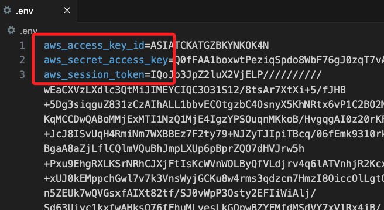

<br>

5. 緊接著在 `.env` 下方貼上以下內容，完成 AWS CLI 設置。

    ```bash
    AWS_ACCESS_KEY_ID=${aws_access_key_id}
    AWS_SECRET_ACCESS_KEY=${aws_secret_access_key}
    AWS_SESSION_TOKEN=${aws_session_token}
    AWS_DEFAULT_REGION=us-east-1
    ```

<br>

6. 假如在終端機中運行，則在貼上 AWS CIL 相關資料後，運行以下指令。

    ```bash
    export AWS_ACCESS_KEY_ID=$aws_access_key_id
    export AWS_SECRET_ACCESS_KEY=$aws_secret_access_key
    export AWS_SESSION_TOKEN=$aws_session_token
    ```

<br>

## 安装套件

_可在筆記本或是終端機中執行_

<br>

1. 在筆記本中可使用魔法方法安裝套件。

    ```python
    !pip install --upgrade pip
    !pip install --upgrade boto3
    !pip install --upgrade scikit-learn
    !pip install --upgrade sagemaker
    !pip install --upgrade nltk
    !pip install --upgrade seaborn
    ```

<br>

2. 在本地運行則建議在終端機中安裝。

    ```bash
    python -m pip install --upgrade pip awscli boto3 scikit-learn  nltk seaborn python-dotenv
    ```

<br>

## 準備工作

_編輯腳本_

<br>

1. 載入環境變數。

    ```python
    from dotenv import load_dotenv
    import os

    # 載入 .env 文件
    load_dotenv()
    ```

    

<br>

2. 驗證帳號，這個帳號每次重啟 Lab 之後是會變動的，務必確保輸出的帳號與 Lab 取得相同，藉此確認 `.env` 設置正確。

    ```python
    import boto3

    # 初始化 STS 客戶端
    sts_client = boto3.client('sts')

    # 獲取當前帳戶的 Account ID
    account_id = sts_client.get_caller_identity()["Account"]
    print("當前的 Account ID:", account_id)
    ```

    

<br>

## 在本地運作 Sagemaker

_特別注意，在本地運行 `Sagemaker` 會有諸多限制，以下會試圖繞過限制來進行運作。_

<br>

1. 安裝套件。

    ```bash
    python -m pip install sagemaker
    ```

<br>

2. 導入 `sagemaker` 與 `Lab` 操作有關的庫；從輸出的訊息可知， `SDK` 沒有從這些位置應用預設配置，但這不影響 `SDK` 的正常運行，可以忽略這些資訊；特別注意，這在 Lab 運行也會顯示相同訊息。

    ```python
    import sagemaker
    from sagemaker.estimator import Estimator
    from sagemaker import get_execution_role
    ```

    

<br>

## 指定角色

1. 在雲端運作時，可直接指定角色，將以下代碼替為指定角色並寫在 CELL 中即可。

    ```python
    role = "<arn:aws:iam::XX-共12碼-XXX:role/自己的-SageMaker-執行角色>"
    ```

<br>

2. 基於自動化的考量，在雲端可透過函數取得角色並存入變數中；特別注意，這只在雲端 SageMaker notebook 環境中適用，本地調用這個函數得到的會是 Lab 角色，而不是針對 SageMaker 賦予的角色。

    ```python
    role = get_execution_role()
    role
    ```

<br>

3. 在本地運行會顯示警告，雖然依舊返回角色的 ARN，但這並非 Lab 賦予權限的 Role；換句話說，當前取得的角色並非運行本行案所虛要的，之後會另做處理，這裡先說明這個狀況。

    ```bash
    role_local = get_execution_role()
    role_local
    ```

    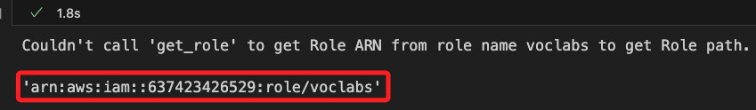

<br>

## 查詢並取得設置

_S3 Bucket、IAM Roles_

<br>

1. 取得名稱中包含 `labbucket` 的 S3 bucket，並存入變數 `bucket_name` 中，這將應用於後續的代碼中；特別注意，因為官方範例使用的變數名稱是 `bucket`，這裡同時保留了 `bucket_name` 並存入 `bucket`，一方面是對應官方範例，二方面是避免錯誤覆蓋時可進行恢復。

    ```python
    import boto3

    # 初始化 S3 客戶端
    s3_client = boto3.client('s3')

    # 列出所有 S3 buckets 並篩選名稱包含 'labbucket' 的
    try:
        response = s3_client.list_buckets()
        # 只取出第一個名稱包含 'labbucket' 的 S3 bucket，若無則返回 None
        bucket_name = next((bucket['Name'] for bucket in response['Buckets'] if 'labbucket' in bucket['Name']), None)

        # 顯示結果
        if bucket_name:
            print("包含 'labbucket' 的 S3 Bucket：", bucket_name)
        else:
            print("找不到包含 'labbucket' 的 S3 Bucket。")
    except Exception as e:
        print(f"發生錯誤: {e}")

    # 配合官方範例，將命名為 `bucket`
    bucket = bucket_name
    bucket
    ```

    

<br>

2. 關於這個 Bucket，可進入 S3 主控台查看。

    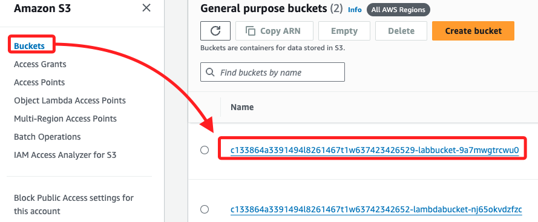

<br>

3. 查詢有哪些 Roles，前面步驟曾取得的就是其中的 `voclabs`。

    ```python
    # 初始化 IAM 客戶端
    iam_client = boto3.client('iam')

    # 列出所有 IAM 角色的名稱
    try:
        roles = iam_client.list_roles()
        print("帳戶中的 IAM 角色名稱：")
        for role in roles['Roles']:
            print(role['RoleName'])
    except Exception as e:
        print(f"發生錯誤: {e}")
    ```

    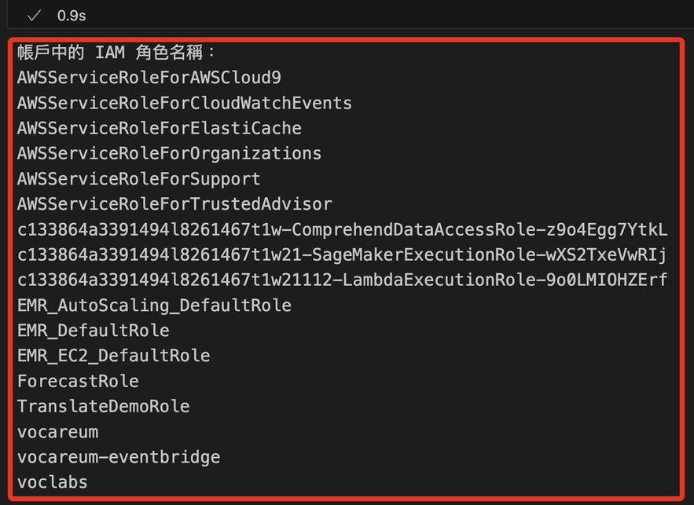

<br>

4. 同樣在 IAM 主控台中也可查看到這些 Roles。

    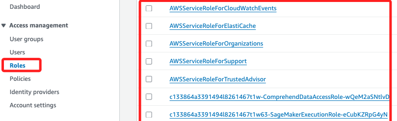

<br>

5. 檢查指定 Bucket 中是否有資料夾或文件。

    ```python
    def list_s3_structure(bucket_name, prefix='', level=0):
        s3_client = boto3.client('s3')
        result = s3_client.list_objects_v2(
            Bucket=bucket_name, Prefix=prefix, Delimiter='/'
        )
        # 根據層級縮進
        indent = '    ' * level
        has_content = False

        # 列出資料夾
        if 'CommonPrefixes' in result:
            has_content = True
            for folder in result['CommonPrefixes']:
                # 顯示資料夾名稱
                print(
                    f"{indent}📁 {folder['Prefix'].split('/')[-2]}"
                )
                # 遞歸列出子資料夾
                list_s3_structure(
                    bucket_name, 
                    prefix=folder['Prefix'], 
                    level=level + 1
                )

        # 列出文件
        if 'Contents' in result:
            has_content = True
            for file in result['Contents']:
                # 避免重複顯示資料夾的 key
                if file['Key'] != prefix:
                    # 顯示文件名稱
                    print(f"{indent}📄 {file['Key'].split('/')[-1]}")

        # 如果沒有內容，則輸出通知
        if not has_content and level == 0:
            print(f"Bucket '{bucket_name}' 中沒有任何內容。")

    # 調用
    list_s3_structure(bucket_name)
    ```

    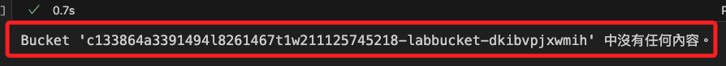

<br>

## 撰寫腳本

1. 導入主要庫並下載 NLTK。

    ```python
    # 文件、輸入輸出和數據結構
    import os, io, struct
    import numpy as np
    import pandas as pd
    from sklearn.metrics import (
        # 計算 ROC AUC 分數
        roc_auc_score,
        # 計算 ROC 曲線的座標
        roc_curve,
        # 計算 AUC 值
        auc,
        # 計算混淆矩陣
        confusion_matrix
    )
    # 用於數據視覺化的庫
    import seaborn as sns
    import matplotlib.pyplot as plt
    # 用於處理日期和時間的庫
    from datetime import datetime

    # 匯入 NLTK 庫以進行自然語言處理
    import nltk

    '''下載 NLTK 資料集'''
    # 下載句子分割所需的資料集
    nltk.download('punkt')
    # 下載停用詞列表
    nltk.download('stopwords')
    # 下載詞性標註器
    nltk.download('averaged_perceptron_tagger')
    # 下載 WordNet 詞典
    nltk.download('wordnet')
    ```

    

<br>

2. 可進入檔案系統中查看，位置在 `~/nltk_data`；`corpora` 中存放各種語料庫，也就是大量的文本數據集；`sentiment` 存放與情感分析相關的模型或資料集；`taggers` 包含各種標註器模型，例如詞性標註器；`tokenizers` 包含各種分詞器，這些工具可將文本切分為詞彙或句子。

    

<br>

## 自訂輔助函數

_這在之後會調用_

<br>

1. 繪製混淆矩陣的熱力圖。

    ```python
    def plot_confusion_matrix(test_labels, target_predicted):
        # 計算混淆矩陣
        matrix = confusion_matrix(test_labels, target_predicted)
        # 將混淆矩陣轉換為 DataFrame 格式
        df_confusion = pd.DataFrame(matrix)
        # 設定顏色圖的配色方案
        colormap = sns.color_palette("BrBG", 10)
        # 繪製熱力圖，並顯示數值
        sns.heatmap(df_confusion, annot=True, fmt='.2f', cbar=None, cmap=colormap)
        # 設定圖表的標題
        plt.title("Confusion Matrix")
        # 自動調整佈局
        plt.tight_layout()
        # 設定 y 軸標籤為 "True Class"（真實類別）
        plt.ylabel("True Class")
        # 設定 x 軸標籤為 "Predicted Class"（預測類別）
        plt.xlabel("Predicted Class")
        # 顯示圖表
        plt.show()
    ```

<br>

2. 計算和輸出模型的性能指標。

    ```python
    def print_metrics(test_labels, target_predicted_binary):
        # 計算混淆矩陣並解壓縮成 TN, FP, FN, TP
        TN, FP, FN, TP = confusion_matrix(test_labels, target_predicted_binary).ravel()
        # 計算靈敏度、命中率、召回率或真陽性率
        Sensitivity = float(TP)/(TP+FN)*100
        # 計算特異性或真陰性率
        Specificity = float(TN)/(TN+FP)*100
        # 計算精確度或正陽性預測值
        Precision = float(TP)/(TP+FP)*100
        # 計算陰性預測值
        NPV = float(TN)/(TN+FN)*100
        # 計算錯誤率或假陽性率
        FPR = float(FP)/(FP+TN)*100
        # 計算假陰性率
        FNR = float(FN)/(TP+FN)*100
        # 計算錯誤發現率
        FDR = float(FP)/(TP+FP)*100
        # 計算整體準確率
        ACC = float(TP+TN)/(TP+FP+FN+TN)*100

        '''個相輸出'''
        # 靈敏度或 TPR
        print(f"Sensitivity or TPR: {Sensitivity}%")    
        # 特異性或 TNR
        print(f"Specificity or TNR: {Specificity}%") 
        # 精確度
        print(f"Precision: {Precision}%")   
        # 陰性預測值
        print(f"Negative Predictive Value: {NPV}%")  
        # 假陽性率
        print(f"False Positive Rate: {FPR}%") 
        # 假陰性率
        print(f"False Negative Rate: {FNR}%")  
        # 錯誤發現率
        print(f"False Discovery Rate: {FDR}%" )
        # 整體準確率
        print(f"Accuracy: {ACC}%")
    ```

<br>

## 手動下載數據集

_IMDB 的數據集並非以 `imdb.csv` 的形式直接提供，官方範例是直接預先準備好的，這裡手動進行載並加以處理。_

<br>

1. 下載並將資料組合轉換成 `CSV` 格式；程式碼生成的 `imdb.csv` 包含兩列 `review` 和 `sentiment`，分別記錄 `評論文本` 與 `正面或負面的標記`，這樣的格式可用於情緒分析任務；特別注意，手動下載後的原始數據集在欄位名稱上與 Lab 提供的不同，這在後續步驟會進行轉換。

    ```python
    import urllib.request
    import tarfile

    # 定義下載 URL 和資料夾名稱
    url = "http://ai.stanford.edu/~amaas/data/sentiment/aclImdb_v1.tar.gz"
    data_dir = "aclImdb"

    # 下載 IMDB 資料集
    if not os.path.exists("aclImdb_v1.tar.gz"):
        print("Downloading IMDB dataset...")
        urllib.request.urlretrieve(url, "aclImdb_v1.tar.gz")
        print("Download complete.")

    # 解壓縮資料集
    if not os.path.exists(data_dir):
        print("Extracting IMDB dataset...")
        with tarfile.open("aclImdb_v1.tar.gz", "r:gz") as tar_ref:
            tar_ref.extractall(".")
        print("Extraction complete.")

    # 準備資料並轉換為 CSV 格式
    data = {"review": [], "sentiment": []}

    # 讀取資料夾中的檔案並標記正面/負面
    for split in ["train", "test"]:
        for sentiment in ["pos", "neg"]:
            folder_path = os.path.join(data_dir, split, sentiment)
            # 檢查資料夾是否存在
            if os.path.exists(folder_path):
                for filename in os.listdir(folder_path):
                    file_path = os.path.join(folder_path, filename)
                    with open(file_path, "r", encoding="utf-8") as file:
                        review = file.read()
                        # 正面為 1，負面為 0
                        label = 1 if sentiment == "pos" else 0 
                        data["review"].append(review)
                        data["sentiment"].append(label)

    # 轉換為 DataFrame 並存成 CSV
    df = pd.DataFrame(data)
    df.to_csv("imdb.csv", index=False)
    print("CSV file 'imdb.csv' created successfully.")
    ```

    

<br>

2. 在本地專案路徑中可看到添加一個目錄、三個文件，其中 `imdb.csv` 便是經過轉換後的新資料集；特別注意，在雲端環境中，資料集被存放在 `'../data/imdb.csv'` 路徑中。

    

<br>

## 讀取數據集

1. 讀取並顯示資料；特別注意，在這裡已經將數據存入 `df`，資料表有兩個欄位，分別是 `review` 及 `sentiment`。

    ```python
    df = pd.read_csv('imdb.csv', header=0)
    df
    ```

    

<br>

## 比較並觀察數據

_與範例數據集比較_

<br>

1. 可自動化生成官方範例文件的連結。

    ```python
    # 獲取 SageMaker 客戶端
    sagemaker_client = boto3.client('sagemaker')

    # 獲取所有 Notebook 實例
    notebook_instances = sagemaker_client.list_notebook_instances()

    # 獲取當前 Notebook 實例名稱
    # 假設只存在一個 Notebook 實例，您可以根據需要進行修改
    notebook_instance_name = \
        notebook_instances['NotebookInstances'][0]['NotebookInstanceName']

    # 設定 AWS 區域
    aws_region = boto3.Session().region_name

    # 設定路徑和檔案名稱
    folder_path = 'data'
    file_name = 'imdb.csv'

    # 自動生成網址
    s3_url = \
        f"https://{notebook_instance_name}.notebook."\
        f"{aws_region}.sagemaker.aws/lab/tree/{folder_path}/{file_name}"

    # 輸出生成的 URL
    print("生成的 CSV 文件網址:", s3_url)
    ```

    

<br>

2. 點擊連結可進入 Lab 查看數據集，點擊右鍵下載到本地；補充說明，這也是快速進入 Sagemaker 的路徑。

    

<br>

3. 為了比對官方數據與自行下載數據是否存在差異，接著將下載的文件更名為 `imdb_0.csv` 後拖曳進入專案資料夾中。

    

<br>

4. 透過代碼觀察，結果顯示數據的內容與欄位不一樣，但格式是相同的，並且資料筆數 `50,000` 也相同。

    ```python
    df_0 = pd.read_csv('imdb_0.csv', header=0)
    df_0
    ```

    

<br>

5. 列出兩個數據的欄位名稱，結果顯示官方數據集的欄位名稱是 `text` 和 `label`，而下載數據集的欄位是 `review`、`sentiment`。

    ```python
    print(df.head())
    print(df_0.head())
    ```

    

<br>

6. 將下載數據集 `imdb.csv` 的欄位名稱修改與官方資料集一致。

    ```python
    # 將欄位名稱重命名為官方格式
    df.rename(
        columns={"review": "text", "sentiment": "label"},
        inplace=True
    )

    # 將更改後的 DataFrame 儲存回 CSV
    df.to_csv("imdb.csv", index=False)

    print("欄位名稱已修改為與官方一致，並重新儲存為 'imdb.csv'。")

    # 重新讀取更新後的文件
    df = pd.read_csv("imdb.csv")
    print("重新讀取後的欄位名稱：", df.columns.tolist())
    ```

    

<br>

7. 比對數據，提取自行下載的數據集前五筆進行查詢，比對該筆數據是否存在於官方資料集中，並明確指出是資料集的哪一筆；此步驟用已確認是否僅僅是排序問題。

    ```python
    # 重新讀取更新後的數據集
    df = pd.read_csv("imdb.csv")

    # 取出自行下載的數據集前五筆資料
    first_five_rows = df.head(5)

    # 建立一個空的列表來儲存匹配結果
    matches = []

    # 遍歷前五筆資料，逐筆與官方數據集比對
    for index, row in first_five_rows.iterrows():
        match = df_0[
            (df_0['text'] == row['text']) & 
            (df_0['label'] == row['label'])
        ]
        # 如果匹配到數據，將結果加入列表
        if not match.empty:
            matches.append(match)

    # 顯示匹配的列
    if matches:
        matched_df = pd.concat(matches)
        print("前五筆數據在官方數據集中的列：")
        print(matched_df)
    else:
        print("在官方數據集中找不到與前五筆資料匹配的列。")
    ```

    

<br>

## 探索數據

_以下是官方範例中探索數據的代碼，可運行操作。_

<br>

1. 查看前面 `8` 筆。

    ```python
    def show_eight_rows(df):
        return df.head(8)    

    print(show_eight_rows(df))
    ```

    

<br>

2. 查看數據結構。

    ```python
    def show_data_shape(df):
        return df.shape

    print(show_data_shape(df))
    ```

    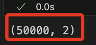

<br>

3. 資料中正面和負面實例數量；可自行替換文件名稱來查看範例文件的內容。

    ```python
    def show_data_instances(df):
        return df['label'].value_counts()

    print(show_data_instances(df))
    ```

    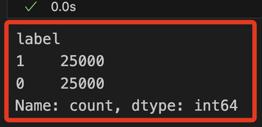

<br>

4. 檢查遺漏缺失值。

    ```python
    def show_missing_values(df):
        return df.isna().sum()
        

    print(show_missing_values(df))
    ```

    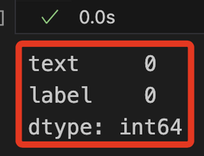

<br>

## 運行第一次傳遞

_最低程度的處理_

<br>

1. 導入 `NLTK` 和 `re`。

    ```python
    import re
    from nltk.corpus import stopwords
    from nltk.stem import SnowballStemmer
    from nltk.tokenize import word_tokenize
    ```

<br>

2. 拆分資料集，將資料集中 `80％` 數據用於訓練，另外用於驗證與測試的各佔 `10%`。

    ```python
    # train_test_split 用於資料集的分割
    from sklearn.model_selection import train_test_split

    def split_data(df):

        # 將資料集分割為訓練集、測試、驗證集
        train, test_and_validate = train_test_split(
            # 要分割的資料集
            df,
            # 這是 `測試+驗證` 的比例
            test_size=0.2,
            # 分割前是否隨機打亂資料
            shuffle=True,
            # 設定隨機種子，這可用於重現分割結果
            random_state=324
        )
        
        # 將 `測試集` 再分割為 `測試集` 和 `驗證集`
        test, validate = train_test_split(
            # 要分割的資料集
            test_and_validate,
            # 將集合分割兩部分各佔 `50%`，即測試和驗證各佔整體 `10%`
            test_size=0.5,
            shuffle=True,
            random_state=324
        )
        # 返回三個子集
        return train, validate, test
    ```

<br>

3. 調用前一個步驟建立的函數，將數據拆分為三個資料子集 `train`、`validate`、`test`，並透過 `shape` 屬性查看拆分後的數據結構。

    ```python
    train, validate, test = split_data(df)
    print(train.shape)
    print(test.shape)
    print(validate.shape)
    ```

    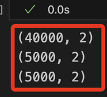

<br>

4. 檢查欄位存在性；基於數據是經過轉換的，這裡做一次檢查確保資料無誤。

    ```python
    # 定義要檢查的欄位名稱
    required_columns = ['text', 'label']

    # 檢查每個資料集是否包含所需的欄位
    for name, dataset in zip(
        ['Train', 'Validate', 'Test'], 
        [train, validate, test]
    ):
        missing_columns = [
            col for col in required_columns if col not in dataset.columns
        ]
        
        if not missing_columns:
            print(f"{name} 資料集包含所有所需的欄位: {required_columns}")
        else:
            print(f"{name} 資料集缺少以下欄位: {missing_columns}")
    ```

    

<br>

## 關於魔術命令 `%%time`

_以下步驟開始會使用到，在此先做個補充說明_

<br>

1. 在 `Jupyter Notebook` 中可透過該指令對該 cell 的執行進行計時，除可測量整個 cell 的執行時間，也會顯示 `CPU time` 處理器花費的時間，另外 `Wall time` 則是從 cell 開始執行到結束所經過的實際時間，包含所有的等待時間。

    ```python
    %%time
    # 這裡是一些程式碼
    ```

<br>

2. 執行完此 cell 後，Jupyter Notebook 會顯示這段程式碼的執行時間。`%%time` 只能用於 cell 的第一行，並且會計時整個 cell 的執行。如果只想計時單行程式碼，可以使用 `%time`。

<br>

## 組裝 `processing pipeline`

_`處理管道` 就是將數據處理步驟連接在一起的方式，使其可簡化數據流的管理和操作；其中包含多個處理步驟如數據清洗、轉換、特徵提取等，然後將其鏈接起來形成一個整體流程。_

<br>

1. 對文本數據進行特徵提取和預處理，以便將其轉換為機器學習模型可以接受的格式。

    ```python
    %%time

    # 導入文本特徵提取的 CountVectorizer
    from sklearn.feature_extraction.text import CountVectorizer
    # 導入 Pipeline，用於將多個處理步驟串聯
    from sklearn.pipeline import Pipeline
    # 導入 ColumnTransformer，用於選擇和轉換特定的列
    from sklearn.compose import ColumnTransformer

    # 定義文本特徵的名稱
    text_features = ['text']
    # 定義模型的目標變量名稱
    model_target = 'label'

    # 建立文本處理管道，包括 CountVectorizer 以提取文本特徵
    text_processor_0 = Pipeline([(
        'text_vect_0', 
        # 設置最大特徵數為 500
        CountVectorizer(max_features=500)
    )])

    # 定義數據預處理器，將文本處理管道應用於指定的文本特徵列
    data_preprocessor = ColumnTransformer([(
        'text_pre_0', 
        text_processor_0, 
        # 應用於 'text' 欄位
        text_features[0]
    )])

    # 輸出處理前的數據集形狀
    print(
        'Datasets shapes before processing: ', 
        train.shape, 
        validate.shape, 
        test.shape
    )

    # 擬合訓練數據並轉換成數值矩陣
    train_matrix = data_preprocessor.fit_transform(train)
    # 對測試數據進行轉換
    test_matrix = data_preprocessor.transform(test)
    # 對驗證數據進行轉換
    validate_matrix = data_preprocessor.transform(validate)

    # 輸出處理後的數據集形狀
    print(
        'Datasets shapes after processing: ', 
        train_matrix.shape, 
        validate_matrix.shape, 
        test_matrix.shape
    )
    ```

    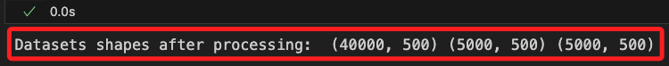

<br>

## 在雲端自訂上傳函數

_這是在雲端所使用的函數_

<br>

1. 因為要訓練模型，必須以正確的格式將資料上載到 S3，XGBoost 使用 `CSV` 檔案。

    ```python
    # 初始化 S3 資源
    s3_resource = boto3.Session().resource('s3')

    # 定義上傳 CSV 文件的函數
    def upload_s3_csv(
        filename, folder, X_train, y_train, is_test=False
    ):
        # 建立一個 StringIO 對象，作為 CSV 的緩衝區
        csv_buffer = io.StringIO()
        
        # 將特徵矩陣轉換為 float32 類型，並展平為列表格式
        features = [
            t.toarray().astype('float32').flatten().tolist() 
            for t in X_train
        ]
        
        # 檢查是否為測試集
        if is_test:
            # 如果是測試集，直接使用特徵
            temp_list = features
        else:
            # 如果不是測試集，將標籤添加到特徵的第一列
            temp_list = np.insert(
                features, 0, y_train['label'], axis=1
            )
        
        # 將數據保存為 CSV 格式到緩衝區
        np.savetxt(csv_buffer, temp_list, delimiter=',')
        
        # 使用 S3 資源將 CSV 上傳至指定的 S3 Bucket 和文件路徑
        s3_resource.Bucket(bucket).Object(
            # 將文件路徑組合
            os.path.join(prefix, folder, filename)
        # 將 CSV 數據作為文件內容上傳
        ).put(Body=csv_buffer.getvalue())
    ```

<br>

2. 在官方範例中，對於上傳使用硬編碼指定了 Bucket，但這是會變動的，每次啟動 Lab 都會有新的值。

    ```python
    bucket = 'c133864a3391494l8261467t1w637423426529-labbucket-hcjcbnnncwhe'
    ```

<br>

3. 所以將前面步驟自動化步驟取得 Bucket 名稱 `bucket_name` 傳給 `bucket`；這在之前已經做過一次，但避免因為運行上一個代碼而覆蓋了資料；這裡可觀察輸出 `bucket` 的是否正確。

    ```python
    bucket = bucket_name
    bucket
    ```

<br>

4. 設置這次傳遞的文件名稱；特別注意，這是在 Lab 操作時所做的設置，在本地運行時將略作修改以便區分，這會在後續步驟進行。

    ```python
    prefix='lab41'
    train_file='train-pass1.csv'
    validate_file='validate-pass1.csv'
    test_file='test-pass1.csv'
    ```

<br>

5. 假如在雲端運行，可調用函數將數據上傳到 S3。

    ```python
    upload_s3_csv(train_file, 'train', train_matrix, train)
    upload_s3_csv(validate_file, 'validate', validate_matrix, validate)
    upload_s3_csv(test_file, 'test', test_matrix, test, True)
    ```

<br>

## 在本地運行

_首先進行一個簡單的測試，確認這樣的方式可以在當前權限限制下寫入 S3_

<br>

1. 若在本地運行，對設定略作修改如下；檔名不變，`prefix` 更改為 `lab41_local`。

    ```python
    prefix='lab41_local'
    train_file='train-pass1.csv'
    validate_file='validate-pass1.csv'
    test_file='test-pass1.csv'
    ```

<br>

## 關於權限說明

1. 特別注意，Lab 所賦予的角色不具備直接寫入數據至 S3 的權限，要獲得寫入權限，必須透過 `SageMaker` 的 `get_execution_role` 函數來取得該角色的 ARN，並在 `SageMaker` 環境中運行該函數；若在本地環境執行將返回 Lab 角色的 ARN，而不是 SageMaker 的 ARN，這將限制本地環境對 S3 的存取權限。

<br>

2. 針對上述情況，接下來將使用 `Presigned URL` 來處理檔案上傳，此方法需透過在 `SageMaker` 環境中使用具有必要權限的 ARN 所生成的 `Presigned URL` 來完成上傳，這樣做可以在無法修改 IAM 設置且無法獲得 `PutObject` 權限的情況下，透過本地的 Jupyter Notebook 成功上傳檔案至 S3；這個變通的解決方案讓使用者能夠在有限的權限環境中進行檔案操作。

<br>

3. 這個生成的 `Presigned URL` 在特定時間內有效，可依據需求設定的有效期限為幾分鐘至幾小時。

<br>

## 測試上傳數據到 S3

_在雲端操作_

<br>

1. 在 _雲端_ 開啟新的筆記本，在彈窗中選擇核心為 `conda_python3`。

    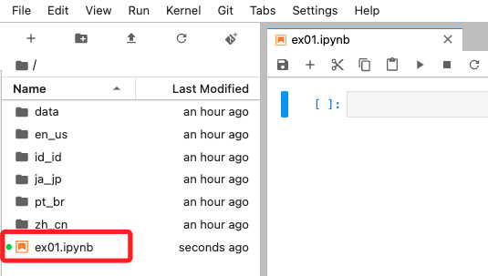

<br>

2. 建立預簽名 URL，第一步先取得 bucket 名稱；特別注意，這是在雲端運行。

    ```python
    import boto3

    # 初始化 S3 客戶端
    s3_client = boto3.client('s3')

    # 列出所有 S3 buckets 並篩選名稱包含 'labbucket' 的
    try:
        response = s3_client.list_buckets()
        # 只取出第一個名稱包含 'labbucket' 的 S3 bucket，若無則返回 None
        bucket_name = next((bucket['Name'] for bucket in response['Buckets'] if 'labbucket' in bucket['Name']), None)

        # 顯示結果
        if bucket_name:
            print("包含 'labbucket' 的 S3 Bucket：", bucket_name)
        else:
            print("找不到包含 'labbucket' 的 S3 Bucket。")
    except Exception as e:
        print(f"發生錯誤: {e}")

    # 配合官方範例，將命名為 `bucket`
    bucket = bucket_name
    bucket
    ```

    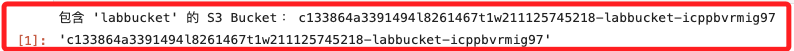

<br>

3. 自動將前一個步驟取得的 bucket 名稱生成預簽名 URL，另外 `key` 設置為文件名稱 `test.txt`，代表上傳後的文件將以該名稱存放在 Bucket 的根目錄中。

    ```python
    # 指定文件名稱
    s3_file_path = "test.txt"

    # 生成預簽名 URL，有效期設定為 1 小時
    presigned_url = s3_client.generate_presigned_url(
        'put_object',
        Params={
            'Bucket': bucket_name, 
            'Key': s3_file_path
        },
        # 設置 URL 有效期（秒）
        ExpiresIn=3600
    )

    print("預簽名 URL:", presigned_url)
    ```

    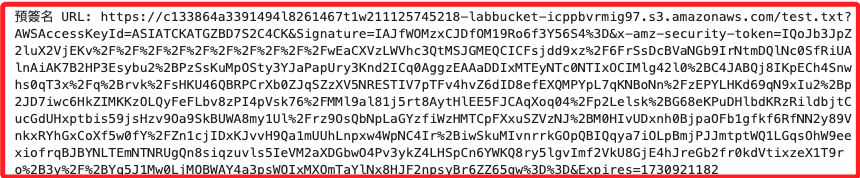

<br>

4. 將預簽名 URL 寫入文件 pre_url.txt。

    ```python
    with open("pre_url.txt", "w") as file:
        file.write(presigned_url)

    print("已生成預簽名 URL 並儲存至 pre_url.txt 文件。")
    ```

    

<br>

5. 上傳 pre_url.txt 至 S3，這是為了要讓本地進行讀取或下載。

    ```python
    with open("pre_url.txt", "rb") as file_data:
        s3_client.upload_fileobj(
            file_data, 
            bucket_name, 
            "pre_url.txt"
        )

    print("已成功將 pre_url.txt 上傳至 S3。")
    ```

    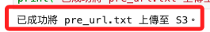

<br>

6. 進入 Bucket 中確認文件已經寫入。

    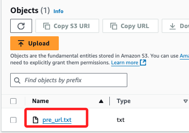

<br>

7. 在本地調用之前建立的函數 `list_s3_structure()` 查詢。

    

<br>

## 取得 S3 的預簽名

_回到本地繼續操作_

<br>

1. 在本機查看 S3 中所儲存的 `Presigned URL`。

    ```python
    import requests

    pre_url_file_key = 'pre_url.txt'

    # 取得 S3 中指定文件物件
    response = s3_client.get_object(
        Bucket=bucket_name, 
        Key=pre_url_file_key
    )
    # 讀出內容並儲存為變數 presigned_url
    presigned_url = response['Body'].read().decode('utf-8')

    # 輸出查看
    print(presigned_url)
    ```

    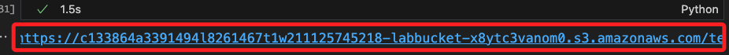

<br>

2. 在當前路徑中建立 `test.txt` 文件，並將字串 `測試預簽名 URL` 寫入其中。

    ```python
    with open("test.txt", "w", encoding="utf-8") as file:
        file.write("測試預簽名 URL")

    print("文件 test.txt 已成功創建並寫入內容。")
    ```

    

<br>

3. 使用 `requests` 庫，通過 `Presigned URL` 將文件上傳至 S3。

    ```python
    # 本地文件路徑
    local_file_path = "test.txt"

    # 使用預簽名 URL 上傳文件
    with open(local_file_path, 'rb') as file_data:
        response = requests.put(
            presigned_url,
            data=file_data
        )

    # 確認上傳結果
    if response.status_code == 200:
        print("文件成功上傳至 S3")
    else:
        print("上傳失敗，狀態碼：", response.status_code)
        print("錯誤內容：", upload_response.text)
    ```

    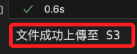

<br>

4. 進入 S3 查看是否確實寫入，確認完成代表以上程序是正確的。

    

<br>

5. 可透過腳本查詢當前 S3 中完整的樹狀結構；與之前指定 Bucket 不同，這是查詢整個 S3 的結構。

    ```python
    def list_s3_bucket_structure(bucket_name):
        s3 = boto3.resource('s3')
        bucket = s3.Bucket(bucket_name)
        print(f"Bucket: {bucket_name}")
        
        has_objects = False
        for obj in bucket.objects.all():
            print(" └── ", obj.key)
            has_objects = True

        if not has_objects:
            print(" └── <此 bucket 為空>")


    buckets = s3_client.list_buckets()["Buckets"]

    if buckets:
        for bucket in buckets:
            list_s3_bucket_structure(bucket["Name"])
    else:
        print("當前為空的：沒有任何 S3 bucket")
    ```

    

<br>

## 正式上傳數據到 S3

_回到雲端；確認以上步驟可完成文件的寫入，以下正式建立預簽名 URL 來寫入數據集。_

<br>

1. 建立四個預簽名 URL 並寫入到 Bucket 文件中。 

    ```python
    import os

    # 定義 Bucket 名稱和路徑
    prefix = 'lab41_local'
    train_file = 'train-pass1.csv'
    validate_file = 'validate-pass1.csv'
    test_file = 'test-pass1.csv'
    batch_in_file = 'batch-in.csv'

    def create_presigned_url(bucket, prefix, filename):
        # 生成預簽名 URL，有效期設定為 1 小時
        presigned_url = s3_client.generate_presigned_url(
            'put_object',
            Params={
                'Bucket': bucket, 
                'Key': os.path.join(prefix, filename)
            },
            # 設置 URL 有效期（秒）
            ExpiresIn=3600  
        )
        return presigned_url

    # 創建預簽名 URL
    urls = {
        'train_file': create_presigned_url(
            bucket_name, prefix, train_file
        ),
        'validate_file': create_presigned_url(
            bucket_name, prefix, validate_file
        ),
        'test_file': create_presigned_url(
            bucket_name, prefix, test_file
        ),
        'batch_in_file': create_presigned_url(
            bucket_name, prefix, batch_in_file
        )
    }

    # 將預簽名 URL 寫入到 pre_url.txt
    s3_client.put_object(
        Bucket=bucket_name,
        Key='pre_url.txt',
        # 將 URL 轉換為字串格式
        Body=str(urls)  
    )

    print("預簽名 URL 已成功寫入到 pre_url.txt")
    ```

    

<br>

## 回到本地電腦 

1. 讀取 S3 中的 `pre_url.txt` 並取其中的 `預簽名 URL`；解析前的完整 JSON 格式內容如下。

    ```python
    response = s3_client.get_object(
        Bucket=bucket_name, 
        Key=pre_url_file_key
    )
    response
    ```

    

<br>

2. 解析其中的預簽名網址；可讀出四個鍵值對。

    ```python
    presigned_urls = eval(response['Body'].read().decode('utf-8'))
    presigned_urls
    ```

    

<br>

3. 使用 `預簽名 URL` 上傳數據，約略需要一分鐘；特別注意，預簽名中的 `batch_in_file` 至此尚未用到；另外，在此還進行了 `型別轉換` 以確保標籤為 `整數類型`；最重要的，同時將 `label` 移到第一欄，確保模型訓練時可識別到正確的標籤，完成後上傳到 S3。

    ```python
    from sklearn.feature_extraction.text import TfidfVectorizer
    import io

    # 設置向量化器，設定最大特徵數目
    vectorizer = TfidfVectorizer(max_features=500)

    # 向量化訓練、驗證和測試數據
    train_matrix = vectorizer.fit_transform(train['text'])
    validate_matrix = vectorizer.transform(validate['text'])
    test_matrix = vectorizer.transform(test['text'])

    # 將向量化的數據轉換為 DataFrame，並附加標籤列
    train_df = pd.DataFrame(
        train_matrix.toarray(),
        columns=vectorizer.get_feature_names_out()
    )
    train_df['label'] = train['label'].values

    validate_df = pd.DataFrame(
        validate_matrix.toarray(), 
        columns=vectorizer.get_feature_names_out()
    )
    validate_df['label'] = validate['label'].values

    test_df = pd.DataFrame(
        test_matrix.toarray(), 
        columns=vectorizer.get_feature_names_out()
    )
    test_df['label'] = test['label'].values

    # 確認標籤列為整數類型
    train_df['label'] = train_df['label'].astype(int)
    validate_df['label'] = validate_df['label'].astype(int)
    test_df['label'] = test_df['label'].astype(int)

    # 將 label 列移動到第一欄
    train_df = train_df[
        ['label'] + [col for col in train_df.columns if col != 'label']
    ]
    validate_df = validate_df[
        ['label'] + [col for col in validate_df.columns if col != 'label']
    ]
    test_df = test_df[
        ['label'] + [col for col in test_df.columns if col != 'label']
    ]

    # 上傳函數：使用預簽名 URL 覆蓋上傳文件
    def save_csv_to_url(dataframe, url):
        # 將 DataFrame 儲存為 CSV 格式
        csv_buffer = io.StringIO()
        dataframe.to_csv(csv_buffer, index=False)

        # 使用預簽名 URL 上傳 CSV 文件
        response = requests.put(url, data=csv_buffer.getvalue())
        
        if response.status_code == 200:
            print(f"文件成功上傳至 S3：{url}")
        else:
            print(
                f"上傳失敗，狀態碼：{response.status_code}, 錯誤內容：{response.text}"
            )

    # 覆蓋上傳數據集
    save_csv_to_url(train_df, presigned_urls['train_file'])
    save_csv_to_url(validate_df, presigned_urls['validate_file'])
    save_csv_to_url(test_df, presigned_urls['test_file'])
    ```

    

<br>

4. 確認 label 列在每個 DataFrame 中的位置，這對於後續的 `fit` 步驟來說很重要。

    ```python
    print("訓練集 label 欄位置:", list(train_df.columns).index('label'))
    print("驗證集 label 欄位置:", list(validate_df.columns).index('label'))
    print("測試集 label 欄位置:", list(test_df.columns).index('label'))
    ```

    

<br>

## 查看上傳現況

1. 再次透過代碼查詢 S3 中的物件，這次會顯示物件的容量大小。

    ```python
    # 查詢 bucket 中的物件
    response = s3_client.list_objects_v2(Bucket=bucket_name)

    # 檢查 bucket 是否有內容
    if 'Contents' in response:
        print(f"Bucket '{bucket_name}' 中的物件：")
        for obj in response['Contents']:
            print(f" - {obj['Key']} (大小: {obj['Size']} bytes)")
    else:
        print(f"Bucket '{bucket_name}' 為空或不存在任何物件。")
    ```

    

<br>

2. 進入 S3 查看這個子資料夾 `lab41_local`，確實已將三個數據集上傳。

    

<br>

## 訓練之前

_進入雲端環境；因為在接下來的步驟中需要調用 `get_execution_role()`，所以必須在 Sagemaker 中運行。_

<br>

1. 取得 ARN 並寫入 S3 Bucket 文件 `arn_data.txt`，這是用於在本地讀取用的。

    ```python
    import sagemaker

    # 初始化 SageMaker 和 STS 客戶端
    sagemaker_session = sagemaker.Session()
    sts_client = boto3.client('sts')

    # 獲取當前帳戶的角色 ARN
    role_arn = sagemaker.get_execution_role()

    # 輸出角色 ARN
    print("SageMaker Notebook 中的角色 ARN:", role_arn)

    # 將角色 ARN 寫入到 S3 中的文件
    bucket_name = bucket
    s3_file_key = 'arn_data.txt'

    # 上傳 ARN 到 S3
    s3_client = boto3.client('s3')
    s3_client.put_object(
        Bucket=bucket_name,
        Key=s3_file_key,
        Body=role_arn
    )

    print(
        f"角色 ARN 已寫入到 S3 中的 {bucket_name}/{s3_file_key}"
    )
    ```

    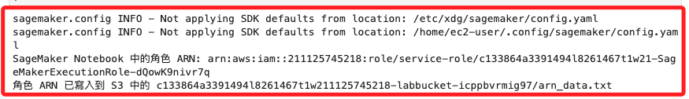

<br>

2. 完成後，在 Bucket 中可看到 `arn_data.txt`，這便是儲存了 ARN 資訊的文件。

    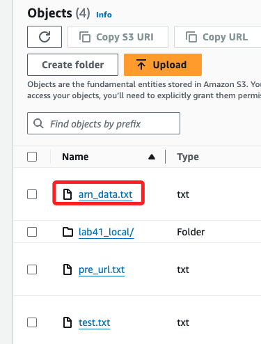

<br>

## 回到本地電腦

1. 在本地讀取 S3 中的 `arn_data.txt` 文件，並將內容寫入變數 `arn` 中。

    ```python
    s3_file_key = 'arn_data.txt'

    # 讀取 S3 中的 arn_data.txt 文件
    response = s3_client.get_object(
        Bucket=bucket_name, Key=s3_file_key
    )

    # 將文件內容讀取到變數 arn 中
    role_arn = response['Body'].read().decode('utf-8')

    # 輸出獲取的 ARN
    print("讀取的角色 ARN:", role_arn)
    ```

    

<br>

2. 查看角色的附加政策。

    ```python
    from botocore.exceptions import ClientError

    def list_role_policies(role_arn):
        # 獲取角色名稱
        role_name = role_arn.split('/')[-1]
        iam_client = boto3.client('iam')

        try:
            # 獲取角色的附加政策
            policies = iam_client.list_attached_role_policies(RoleName=role_name)
            print(f"角色 {role_name} 附加的政策:")
            
            # 儲存政策 ARN 的列表
            policy_arns = []
            
            for policy in policies['AttachedPolicies']:
                print(
                    f"- {policy['PolicyName']} (ARN: {policy['PolicyArn']})"
                )
                # 將政策 ARN 儲存到列表中
                policy_arns.append(policy['PolicyArn'])
            
            # 返回政策 ARN 列表
            return policy_arns

        except ClientError as e:
            print(f"獲取角色政策時出現錯誤: {e}")
            return None

    # 調用函數並獲取政策 ARN
    policy_arns = list_role_policies(role_arn)

    # 輸出政策 ARN
    if policy_arns:
        print("獲取到的政策 ARN:")
        for arn in policy_arns:
            print(arn)
    ```

    

<br>

3. 將內容存入 JSON 文件中便於觀察；其中第一個政策允許所有 SageMaker 操作、允許所有 SageMaker Geospatial 操作、涵蓋了多種 S3 操作包括讀取和寫入、允許將角色傳遞給 AWS 服務；不過第一個政策並沒有明確列出對 Amazon Comprehend 或 Textract 的權限。

    ```python
    import json

    policy_arn = policy_arns[0]
    policy = iam_client.get_policy(PolicyArn=policy_arn)
    policy_version = iam_client.get_policy_version(
        PolicyArn=policy_arn,
        VersionId=policy['Policy']['DefaultVersionId']
    )

    # 取得 policy 文件內容
    policy_document = policy_version['PolicyVersion']['Document']

    # 將 policy 文件內容保存到 policy_1.json
    with open('policy_1.json', 'w') as file:
        json.dump(policy_document, file, indent=4)

    print(policy_document)
    ```

<br>

4. 第二個政策允許所有 Amazon Comprehend 操作、允許 S3 讀取操作、允許獲取角色和傳遞角色的權限，另外也對 Amazon Comprehend 和 Textract 直接授權。

    ```python
    policy_arn = policy_arns[1]
    policy = iam_client.get_policy(PolicyArn=policy_arn)
    policy_version = iam_client.get_policy_version(
        PolicyArn=policy_arn,
        VersionId=policy['Policy']['DefaultVersionId']
    )

    # 取得 policy 文件內容
    policy_document = policy_version['PolicyVersion']['Document']

    # 將 policy 文件內容保存到 policy_1.json
    with open('policy_2.json', 'w') as file:
        json.dump(policy_document, file, indent=4)

    print(policy_version['PolicyVersion']['Document'])
    ```

<br>

5. 觀察本地角色，並不具備相關權限。

    ```python
    role_arn_local = sagemaker.get_execution_role()
    print(f'本地的角色：{role_arn_local}')
    list_role_policies(role_arn_local)
    ```

    

<br>

## 準備訓練

1. 安裝 `libomp`，在本地運行機器學習相關專案時，這個庫會在需要多線程並行計算的情況下被自動調用，例如使用 `XGBoost`、`Scikit-Learn` 或是 `TensorFlow` 等套件時。

    ```bash
    brew install libomp
    ```

<br>

2. `libomp` 是一個系統級的庫，可透過以下指令查看安裝狀況。

    ```bash
    brew info libomp
    ```

    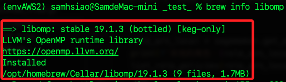

<br>

3. 安裝套件 `xgboost`。

    ```bash
    pip install xgboost
    ```

<br>

4. 驗證安裝。

    ```python
    import xgboost as xgb

    # 輸出 XGBoost 的版本
    print(xgb.__version__)
    ```

    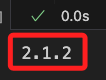

<br>

## 觀察 libomp 運作

_先略過_

<br>

## 建立 XGBoost 模型估計器 `Estimator` 

_Gradient Boosting 演算法_

<br>

1. 導入庫。 

    ```python
    from sagemaker.image_uris import retrieve
    import xgboost as xgb
    ```

<br>

2. 建立估計器所需一般參數；首先設定容器，並將容器版本改為 `1.2-2`。

    ```python
    container = retrieve(
        'xgboost',
        boto3.Session().region_name, 
        # '1.0-1'
        '1.2-2'
    )
    ```

<br>

3. 設置 S3 輸出路徑，特別注意，這個輸出目錄無需設置預簽名 URL。 

    ```python
    s3_output_location = f's3://{bucket_name}/{prefix}/output/'
    ```

<br>

4. 建立估計器的超參數，對於官方範例進行了一些修正；主要是移除 `silent` 參數，因為從 `XGBoost 1.0` 版本起，`silent` 參數已被移除，並由 `verbosity` 參數取代，這是用於設置日誌輸出級別，若使用 `silent` 會導致 `KeyError`；另外，改變評估指標，將 `eval_metric` 改為 `logloss`，這部分僅僅是測試，之後可改回來。

    ```python
    hyperparams = {
        "num_round": "42",
        "eval_metric": "logloss",
        #"eval_metric": "error",
        "objective": "binary:logistic",
        # "silent": 1,
        # 0: silent, 1: warning, 2: info, 3: debug
        "verbosity": 1,
        # 設定隨機種子
        "seed": 42
    }
    ```

<br>

5. 建立 XGBoost 估計器。

    ```python
    xgb_model = sagemaker.estimator.Estimator(
        container,
        role=role_arn,
        instance_count=1,
        instance_type='ml.m5.2xlarge',
        output_path=s3_output_location,
        hyperparameters=hyperparams,
        sagemaker_session=sagemaker.Session()
    )
    ```

<br>

## 建立數據輸入管道

_先確認文件可訪問，然後建立管道_

<br>

1. 檢查文件確實可訪問。

    ```python
    from botocore.exceptions import ClientError

    def check_s3_file_exists(bucket_name, key):
        s3_client = boto3.client('s3')
        try:
            s3_client.head_object(Bucket=bucket_name, Key=key)
            return True
        except ClientError as e:
            if e.response['Error']['Code'] == '404':
                print(f"文件不存在: s3://{bucket_name}/{key}")
                return False
            else:
                print(f"無法訪問文件: s3://{bucket_name}/{key}, 錯誤: {e}")
                return False

    # 設定 S3 存儲桶和路徑
    prefix = 'lab41_local'
    train_file = 'train-pass1.csv'
    validate_file = 'validate-pass1.csv'

    # 檢查訓練和驗證文件
    train_key = f"{prefix}/{train_file}"
    validate_key = f"{prefix}/{validate_file}"

    print("檢查 S3 文件...")
    train_exists = check_s3_file_exists(bucket_name, train_key)
    validate_exists = check_s3_file_exists(bucket_name, validate_key)

    # 結果
    if train_exists:
        print(f"訓練文件可訪問: s3://{bucket_name}/{train_key}")
    if validate_exists:
        print(f"驗證文件可訪問: s3://{bucket_name}/{validate_key}")
    ```

    

<br>

2. 設定輸入管道 `data_channels`；包含兩個數據管道，分別是 `訓練資料` 與 `驗證資料`；官方範例分別將兩個數據文件放入 `train` 及 `validate` 之中，這裡暫時先放在 `prefix`。

    ```python
    train_channel = sagemaker.inputs.TrainingInput(
        # f's3://{bucket}/{prefix}/train/{train_file}',
        f's3://{bucket_name}/{prefix}/{train_file}',
        content_type='text/csv'
    )

    validate_channel = sagemaker.inputs.TrainingInput(
        # f's3://{bucket}/{prefix}/validate/{validate_file}',
        f's3://{bucket_name}/{prefix}/{validate_file}',
        content_type='text/csv'
    )
    # 組合為參數
    data_channels = {
        'train': train_channel, 
        'validation': validate_channel
    }
    ```

<br>

## 訓練模型

1. 調用 `fit` 進行模型調適，這個步驟需要一點時間。

    ```python
    %%time

    xgb_model.fit(
        inputs=data_channels, 
        logs=False, 
        job_name='xgb-pass1-'+datetime.now().\
            strftime("%m-%d-%Y-%H-%M-%S")
    )
    ```

    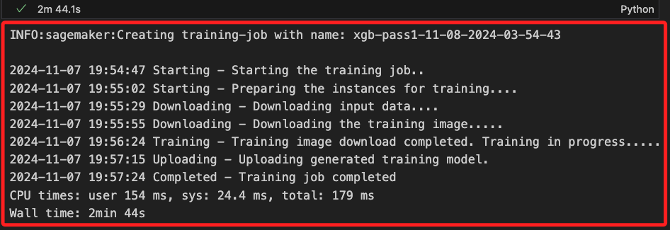

<br>

2. 在這有個地方值得注意，雖然並未建立 `Output` 的預簽名 URL，但在 `fit` 的時候，寫入並無權限問題。

    

<br>

3. 點擊進入，可看到以 `job_name` 命名的子目錄。

    

<br>

4. 查詢結構。

    ```python
    import boto3

    def list_s3_structure(bucket_name, prefix=''):
        s3_client = boto3.client('s3')
        result = s3_client.list_objects_v2(
            Bucket=bucket_name, Prefix=prefix, Delimiter='/'
        )
        
        # 列出資料夾
        if 'CommonPrefixes' in result:
            print("資料夾:")
            for folder in result['CommonPrefixes']:
                print(f"- {folder['Prefix']}")
                # 遞歸列出子資料夾
                list_s3_structure(bucket_name, prefix=folder['Prefix'])

        # 列出文件
        if 'Contents' in result:
            print("文件:")
            for file in result['Contents']:
                print(f"- {file['Key']}")

    # 調用
    list_s3_structure(bucket_name)
    ```

<br>

## 接下來

1. 顯示來自目前 XGBoost 任務的指標。

```python
sagemaker.analytics.TrainingJobAnalytics(
    xgb_model._current_job_name, 
    metric_names = ['train:error','validation:error']
).dataframe()
```

4. 初始結果似乎沒有幫助。使用 __test__ 資料集計算更多指標。

```python
%%time

upload_s3_csv('batch-in.csv', 'batch-in', test_matrix, test, True)
batch_X_file='batch-in.csv'
batch_output = f's3://{bucket}/{prefix}/batch-out/'
batch_input = f's3://{bucket}/{prefix}/batch-in/{batch_X_file}'

xgb_transformer = xgb_model.transformer(
    instance_count=1,
    instance_type='ml.m5.2xlarge',
    strategy='MultiRecord',
    assemble_with='Line',
    output_path=batch_output
)

xgb_transformer.transform(
    data=batch_input,
    data_type='S3Prefix',
    content_type='text/csv',
    split_type='Line',
    job_name='xgboost-pass1'
)
xgb_transformer.wait(logs=False)
```

5. S3。
```python
s3 = boto3.client('s3')
obj = s3.get_object(
    Bucket=bucket, 
    Key=f'{prefix}/batch-out/batch-in.csv.out'
)
target_predicted = pd.read_csv(
    io.BytesIO(obj['Body'].read()),sep=',',
    names=['class']
)

def binary_convert(x):
    threshold = 0.5
    if x > threshold:
        return 1
    else:
        return 0

target_predicted_binary = target_predicted['class'].apply(binary_convert)
```

6. 之後說明。

```python
plot_confusion_matrix(test['label'], target_predicted_binary)
```

7. 之後說明。
```python
print_metrics(test['label'], target_predicted_binary)
```

## 第二次传递：标准化文本


1. 可删除所有非索引字，但可能想保留可能影响情绪的非索引字，例如 __not__ 或 __don't__。


```python
# Get a list of stopwords from the NLTK library
stop = stopwords.words('english')

def remove_stopwords(stopwords):
    # Implement this function
    excluding = ['against', 'not', 'don', 'don\'t','ain', 'are', 'aren\'t']
    ### BEGIN_SOLUTION
    excluding = ['against', 'not', 'don', 'don\'t','ain', 'are', 'aren\'t', 'could', 'couldn\'t',
             'did', 'didn\'t', 'does', 'doesn\'t', 'had', 'hadn\'t', 'has', 'hasn\'t', 
             'have', 'haven\'t', 'is', 'isn\'t', 'might', 'mightn\'t', 'must', 'mustn\'t',
             'need', 'needn\'t','should', 'shouldn\'t', 'was', 'wasn\'t', 'were', 
             'weren\'t', 'won\'t', 'would', 'wouldn\'t']
    ### END_SOLUTION
    return [word for word in stop if word not in excluding]

# New stopword list
stopwords = remove_stopwords(stop)

```

## 添加清理步骤

1. 更新以下 `clean` 函数，以完成删除前导空格和尾随空格、删除任何 HTML 标记。

```python
snow = SnowballStemmer('english')
def clean(sent):
    # Implement this function
    sent = sent.lower()
    sent = re.sub('\s+', ' ', sent)
    ### BEGIN_SOLUTION
    sent = sent.strip()
    sent = re.compile('<.*?>').sub('',sent)
    ### END_SOLUTION
    filtered_sentence = []
    
    for w in word_tokenize(sent):
        # You are applying custom filtering here. Feel free to try different things.
        # Check if it is not numeric, its length > 2, and it is not in stopwords
        if(not w.isnumeric()) and (len(w)>2) and (w not in stopwords):  
            # Stem and add to filtered list
            filtered_sentence.append(snow.stem(w))
    final_string = " ".join(filtered_sentence) #final string of cleaned words
    return final_string
```

2. 使用之前创建的函数创建新的测试、验证和测试 DataFrame。

```python
# Uncomment the next line and implement the function call to split_data
#train, validate, test = 

### BEGIN_SOLUTION
train, validate, test = split_data(df)
### END_SOLUTION

print(train.shape)
print(test.shape)
print(validate.shape)
```

3. 管道已更新，以包含对之前定义的来自 `CountVectorizer`的 `clean`函数的调用。此函数需要更长的运行时间。


```python
%%time

from sklearn.feature_extraction.text import CountVectorizer
from sklearn.pipeline import Pipeline
from sklearn.compose import ColumnTransformer

text_features = ['text']
model_target = 'label'

text_processor_0 = Pipeline([
    ('text_vect_0', CountVectorizer(preprocessor=clean, max_features=500))
])

data_preprocessor = ColumnTransformer([
    ('text_pre_0', text_processor_0, text_features[0])
])

print('Datasets shapes before processing: ', train.shape, validate.shape, test.shape)
train_matrix = data_preprocessor.fit_transform(train)
test_matrix = data_preprocessor.transform(test)
validate_matrix = data_preprocessor.transform(validate)
print('Datasets shapes after processing: ', train_matrix.shape, validate_matrix.shape, test_matrix.shape)
```

4. 设置此传递的文件名。


```python
prefix='lab41'
train_file='train_pass2.csv'
validate_file='validate_pass2.csv'
test_file='test_pass2.csv'
```

## 将文件上载到 S3

1. 使用之前的代码将新文件上载到 Amazon S3。

```python
upload_s3_csv(train_file, 'train', train_matrix, train)
upload_s3_csv(validate_file, 'validate', validate_matrix, validate)
upload_s3_csv(test_file, 'test', test_matrix, test, True)
```

## 创建估算器并设置数据通道

1. 使用之前的代码设置估算器和数据通道。

```python
%%time

container = retrieve('xgboost',boto3.Session().region_name,'1.0-1')

hyperparams={
    "num_round":"42",
    "eval_metric": "error",
    "objective": "binary:logistic",
    "silent" : 1
}

xgb_model=sagemaker.estimator.Estimator(
    container,
    sagemaker.get_execution_role(),
    instance_count=1,
    instance_type='ml.m5.2xlarge',
    output_path=s3_output_location,
    hyperparameters = hyperparams,
    sagemaker_session=sagemaker.Session()
)

train_channel = sagemaker.inputs.TrainingInput(
    f's3://{bucket}/{prefix}/train/{train_file}',
    content_type='text/csv'
)

validate_channel = sagemaker.inputs.TrainingInput(
    f's3://{bucket}/{prefix}/validate/{validate_file}',
    content_type='text/csv'
)

data_channels = {
    'train': train_channel, 
    'validation': validate_channel
}

xgb_model.fit(
    inputs=data_channels, 
    logs=False, 
    job_name='xgb-pass2-'+datetime.now()\
        .strftime("%m-%d-%Y-%H-%M-%S")
)
```

2. 後補。

```python
sagemaker.analytics.TrainingJobAnalytics(
    xgb_model._current_job_name, 
    metric_names = ['train:error','validation:error']
).dataframe()
```

## 创建批处理转换器任务

1. 使用之前的代码创建一个转换器任务。

```python
%%time

xgb_transformer = xgb_model.transformer(
    instance_count=1,
    instance_type='ml.m5.2xlarge',
    strategy='MultiRecord',
    assemble_with='Line',
    output_path=batch_output
)

xgb_transformer.transform(
    data=batch_input,
    data_type='S3Prefix',
    content_type='text/csv',
    split_type='Line')

xgb_transformer.wait(logs=False)
```

2. 後補。

```python
s3 = boto3.client('s3')
obj = s3.get_object(
    Bucket=bucket, 
    Key="{}/batch-out/{}".\
        format(prefix,'batch-in.csv.out')
)
target_predicted = pd.read_csv(
    io.BytesIO(obj['Body'].read()),
    sep=',',
    names=['class']
)

def binary_convert(x):
    threshold = 0.5
    if x > threshold:
        return 1
    else:
        return 0

target_predicted_binary = target_predicted['class'].apply(binary_convert)
```

3. 後補。

```python
plot_confusion_matrix(test['label'], target_predicted_binary)
```

4. 後補。

```python
print_metrics(test['label'], target_predicted_binary)
```

5. 将创建一个超参数优化任务来优化模型。

## 创建估算器用于优化

1. 第一步是创建一个估算器用于优化。取消注释并完成以下估算器代码。

```python
# xgb = sagemaker.estimator.Estimator(....)
xgb = sagemaker.estimator.Estimator(
    container,
    role=sagemaker.get_execution_role(), 
    # make sure you have limit set for these instances
    instance_count= 1,
    instance_type='ml.m5.2xlarge', 
    output_path=f's3://{bucket}/{prefix}/output',
    sagemaker_session=sagemaker.Session()
)
```

2. 後補。

```python
xgb.set_hyperparameters(
    eval_metric='error',
    objective='binary:logistic',
    num_round=42,
    silent=1
)
```

## 创建超参数范围

1. 使用 [XGBoost 优化文档](https://docs.aws.amazon.com/sagemaker/latest/dg/xgboost-tuning.html)，将超参数范围添加到以下单元格中。


```python
from sagemaker.tuner import IntegerParameter, CategoricalParameter, ContinuousParameter, HyperparameterTuner

hyperparameter_ranges = {'alpha': ContinuousParameter(0,1000)}

hyperparameter_ranges = {
    'alpha': ContinuousParameter(0, 1000),
    'min_child_weight': ContinuousParameter(0, 120),
    'subsample': ContinuousParameter(0.5, 1),
    'eta': ContinuousParameter(0.1, 0.5),  
    'num_round': IntegerParameter(1,4000)
}
```

## 指定目标指标

1. 针对二元分类问题将 `objective_metric_name`和 `objective_type`更新为适当的值。

```python
objective_metric_name = '<INSERT_VALUE_HERE>'
objective_type = '<INSERT_VALUE_HERE>'

### BEGIN_SOLUTION
objective_metric_name = 'validation:error'
objective_type = 'Minimize'
### END_SOLUTION
```

2. 创建超参数优化任务。

```python
tuner = HyperparameterTuner(
    xgb,
    objective_metric_name,
    hyperparameter_ranges,
    # Set this to 10 or above depending upon budget & available time.
    max_jobs=10,
    max_parallel_jobs=1,
    objective_type=objective_type,
    early_stopping_type='Auto',
)
```

3. 运行优化任务。请注意，此任务可能需要大约 60 分钟的时间。

```python
%%time
tuner.fit(
    inputs=data_channels, 
    include_cls_metadata=False, 
    wait=False
)
```

4. 如果想在等待期间尝试第 7 节，请不要运行下一个单元格，而是转到第 7 节。

```python
tuner.wait()
```

5. 优化任务完成后，您可以查看来自优化任务的指标。

```python
from pprint import pprint
from sagemaker.analytics import HyperparameterTuningJobAnalytics

tuner_analytics = HyperparameterTuningJobAnalytics(
    tuner.latest_tuning_job.name,
    sagemaker_session=sagemaker.Session()
)

df_tuning_job_analytics = tuner_analytics.dataframe()

# Sort the tuning job analytics by the final metrics value
df_tuning_job_analytics.sort_values(
    by=['FinalObjectiveValue'],
    inplace=True,
    ascending=False if tuner.objective_type == "Maximize" else True
)

# Show detailed analytics for the top 20 models
df_tuning_job_analytics.head(20)
```
## 使用最佳超参数任务

1. 优化任务完成后，您可以从 實作HyperparameterTuner實作 对象中找到最佳优化任务。

```python
attached_tuner = HyperparameterTuner.attach(tuner.latest_tuning_job.name, sagemaker_session=sagemaker.Session())
best_training_job = attached_tuner.best_training_job()
```

2. 後補。

```python
from sagemaker.estimator import Estimator
algo_estimator = Estimator.attach(best_training_job)

best_algo_model = algo_estimator.create_model(
    env={'SAGEMAKER_DEFAULT_INVOCATIONS_ACCEPT':"text/csv"}
)
```

3. 通过数据处理管道运行测试数据，以测试模型。

```python
%%time
from sklearn.feature_extraction.text import CountVectorizer
from sklearn.pipeline import Pipeline
from sklearn.compose import ColumnTransformer

text_features = ['text']
model_target = 'label'

text_processor_0 = Pipeline([(
    'text_vect_0', 
    CountVectorizer(
        preprocessor=clean, max_features=500
    )
)])

data_preprocessor = ColumnTransformer([(
    'text_pre_0', 
    text_processor_0, 
    text_features[0]
)])

print('Datasets shapes before processing: ', train.shape, validate.shape, test.shape)
train_matrix = data_preprocessor.fit_transform(train)
test_matrix = data_preprocessor.transform(test)
validate_matrix = data_preprocessor.transform(validate)
print(
    'Datasets shapes after processing: ', 
    train_matrix.shape, 
    validate_matrix.shape, 
    test_matrix.shape
)
```

4. 使用来自超参数优化任务的最佳算法，以使用批处理转换的测试数据。

```python
%%time
upload_s3_csv('batch-in.csv', 'batch-in', test_matrix, test, True)

batch_output = f's3://{bucket}/{prefix}/batch-out/'
batch_input = f's3://{bucket}/{prefix}/batch-in/{batch_X_file}'

xgb_transformer = best_algo_model.transformer(
    instance_count=1,
    instance_type='ml.m5.2xlarge',
    strategy='MultiRecord',
    assemble_with='Line',
    output_path=batch_output
)
xgb_transformer.transform(
    data=batch_input,
    data_type='S3Prefix',
    content_type='text/csv',
    split_type='Line'
)
xgb_transformer.wait(logs=False)
```

5. 处理结果以计算类。

```python
s3 = boto3.client('s3')
obj = s3.get_object(
    Bucket=bucket, 
    Key=f'{prefix}/batch-out/batch-in.csv.out'
)
target_predicted = pd.read_csv(
    io.BytesIO(obj['Body'].read()),
    sep=',',
    names=['class']
)

def binary_convert(x):
    threshold = 0.5
    if x > threshold:
        return 1
    else:
        return 0

target_predicted_binary = target_predicted['class'].apply(binary_convert)

```

6. 绘制混淆矩阵并打印指标。

```python
plot_confusion_matrix(test['label'], target_predicted_binary)
```

7. 後補。

```python
print_metrics(test['label'], target_predicted_binary)
```

## 使用 BlazingText

_将使用 BlazingText，这是一种内置的 Amazon SageMaker 算法。BlazingText 可以在不做修改的情况下执行分类。将为 BlazingText 重新格式化数据。然后，将使用数据训练算法并将结果与之前的模型进行比较。_


1. 首先，获取算法容器。


```python
import sagemaker
from sagemaker.image_uris import retrieve

container = retrieve(
    'blazingtext',
    boto3.Session().region_name,"latest"
)
```

2. 为训练、验证和测试数据配置前缀。

```python
import io
    
prefix='lab41'
train_file='blazing_train.txt'
validate_file='blazing_validate.txt'
test_file='blazing_test.txt'
```

3. 提醒自己数据是什么样的。

```python
train.head()
```


4. BlazingText 需要采用以下格式的数据：

```bash
`__label__1` Caught this movie on the tube on a Sunday...
```

5. 以下两个单元格将 DataFrame 转换为正确的格式，然后将它们上载到 Amazon S3。

```python
blazing_text_buffer = io.StringIO()
train.to_string(buf=blazing_text_buffer, columns=['label','text'], header=False, index=False, formatters=
                         {'label': '__label__{}'.format})
s3r = boto3.resource('s3')
s3r.Bucket(bucket).Object(os.path.join(prefix, 'blazing', train_file)).put(Body=blazing_text_buffer.getvalue())
```

6. 後補。

```python
blazing_text_buffer = io.StringIO()
validate.to_string(
    buf=blazing_text_buffer, 
    columns=['label','text'], 
    header=False, 
    index=False, 
    formatters={'label': '__label__{}'.format}
)
s3r.Bucket(bucket).Object(
    os.path.join(prefix, 'blazing', validate_file)
).put(
    Body=blazing_text_buffer.getvalue()
)
```

## BlazingText 估算器

1. 通过指定缺失值来取消注释并完成估算器代码。

```python
bt_model = sagemaker.estimator.Estimator(
    container,
    sagemaker.get_execution_role(), 
    instance_count=1, 
    instance_type='ml.c4.4xlarge',
    volume_size = 30,
    max_run = 360000,
    input_mode= 'File',
    output_path=s3_output_location,
    sagemaker_session=sagemaker.Session()
)

```

2. 使用以下超参数。

```python
bt_model.set_hyperparameters(
    mode="supervised",
    epochs=10,
    min_count=2,
    learning_rate=0.05,
    vector_dim=10,
    early_stopping=True,
    patience=4,
    min_epochs=5,
    word_ngrams=2
)
```

3. 设置训练通道和验证通道。

```python
train_channel = sagemaker.inputs.TrainingInput(
    f's3://{bucket}/{prefix}/blazing/{train_file}',
    content_type='text/csv')

validate_channel = sagemaker.inputs.TrainingInput(
    f's3://{bucket}/{prefix}/blazing/{validate_file}',
    content_type='text/csv')

data_channels_3 = {
    'train': train_channel, 
    'validation': validate_channel
}
```

## 开始训练任务

1. 输入以下代码开始训练任务。（这个步骤可能需要花几分钟的时间。）

```python
%%time

bt_model.fit(inputs=data_channels_3, logs=False)
```

2. 训练任务完成后，请查看训练指标。

```python
sagemaker.analytics.TrainingJobAnalytics(
    bt_model._current_job_name, 
    metric_names = ['train:accuracy','validation:accuracy']
).dataframe()
```

3.  後補。

```python
pd.options.display.max_rows
pd.set_option('display.max_colwidth', None)
```

4. 後補。


```python
bt_test = test.copy()
bt_test.head()
```

5. 将数据集格式化为 BlazingText 所需的格式。

```python
# bt_test['text'].str.strip()
bt_test.replace(r'\\n','', regex=True, inplace = True)
bt_test.rename(columns={'text':'source'}, inplace=True)
bt_test.drop(columns='label', inplace=True)
```

6. 後補。

```python
print(bt_test.head().to_json(orient="records", lines=True))
```

7. 将文件上载到 Amazon S3。

```python
bt_file = 'bt_input.json'
blazing_text_buffer = io.StringIO()
bt_test.to_json(path_or_buf=blazing_text_buffer, orient="records", lines=True)
```

8. 後補。

```python
s3r.Bucket(bucket).Object(os.path.join(prefix, 'blazing', bt_file)).put(Body=blazing_text_buffer.getvalue())

```

9. 後補。


```python
batch_output = f's3://{bucket}/{prefix}/blazing/'
batch_input = f's3://{bucket}/{prefix}/blazing/{bt_file}'
```

10. 对测试数据使用批处理转换器。

```python
%%time
bt_transformer = bt_model.transformer(
    instance_count=1,
    instance_type='ml.m5.2xlarge',
   strategy='MultiRecord',
   assemble_with='Line',
   output_path=batch_output
)

bt_transformer.transform(
    data=batch_input,
    data_type='S3Prefix',
    content_type='application/jsonlines',
    split_type='Line'
)

bt_transformer.wait(logs=True)
```

11. 检索来自 Amazon S3 的结果。

```python
obj = s3.get_object(
    Bucket=bucket, 
    Key=f'{prefix}/blazing/bt_input.json.out'
)
```

12. 後補。

```python
target_predicted = pd.read_json(
    io.BytesIO(obj['Body'].read()),
    lines=True
)
```

13. 後補。

```python
target_predicted.head()
```

14. 重新格式化结果，以便计算混淆矩阵和指标。

```python
def binary_convert(label):
    label = label[0].replace('__label__','')
    return int(label)

target_predicted_binary = target_predicted['label'].apply(binary_convert)
```

15. 後補。

```python
plot_confusion_matrix(test['label'], target_predicted_binary)
```

16. 後補。

```python
print_metrics(test['label'], target_predicted_binary)
```

## 使用Comprehend


在本节中，您将使用 Amazon Comprehend 来计算情绪。Amazon Comprehend 为您提供了正面和负面的结果，还显示了中立和喜忧参半的结果。Amazon Comprehend 是一项托管的服务，在使用它之前需要较少的文本处理。您无需处理本节中的任何文本。

查看  `test` DataFrame 中的数据是什么样的。


```python
test.head()
```

Amazon Comprehend 的使用可以像 API 调用一样简单直接。

以下单元格输出了来自 Amazon Comprehend 的前五个结果。


```python
import boto3
import json

comprehend = boto3.client(service_name='comprehend')
for n in range(5):
    text = test.iloc[n]['text']
    response = comprehend.detect_sentiment(Text=text, LanguageCode='en')
    sentiment = response['Sentiment']
    print(f'{sentiment} - {text}')

```

您可以启动预测任务来处理多个项目。必须将输入格式化为每行的单个输入，然后上载到 Amazon S3。文本的最大大小为 5120，因此 `str.slice(0,5000)`函数用于修剪长文本。


```python
# Upload test file minus label to S3
def upload_comprehend_s3_csv(filename, folder, dataframe):
    csv_buffer = io.StringIO()
    
    dataframe.to_csv(csv_buffer, header=False, index=False )
    s3_resource.Bucket(bucket).Object(os.path.join(prefix, folder, filename)).put(Body=csv_buffer.getvalue())

comprehend_file = 'comprehend_input.csv'
upload_comprehend_s3_csv(comprehend_file, 'comprehend', test['text'].str.slice(0,5000))
test_url = f's3://{bucket}/{prefix}/comprehend/{comprehend_file}'
print(f'Uploaded input to {test_url}')
```

数据上载到 Amazon S3 后，您可以使用 `start_sentiment_detection_jon`函数开始任务。


### 挑战：配置 Amazon Comprehend 任务参数

在下一个单元格中，配置 Amazon Comprehend 任务参数。
– 在__input_data_config__中 - 
  –實作S3Uri實作：将 *`<S3_INPUT_GOES_HERE> `* 替换为之前定义的 `test_uri`
  –實作InputFormat實作：将 *`<INPUT_FORMAT_GOES_HERE> `* 替换为 `ONE_DOC_PER_LINE`
– 在__output_data config__ 中-  
  –實作S3Uri實作：将 *`<S3_OUTPUT_GOES_HERE> `* 替换为 `s3_output_location`
  –實作data_access_role_arn實作：将 *`arn:aws:iam::637423426529:role/service-role/c133864a3391494l8261467t1w-ComprehendDataAccessRole-qUxYBBIu9EvW `* 替换为*Lab详细信息*文件中的 Amazon Resource Name (ARN)


```python
input_data_config={
    'S3Uri': 'S3_INPUT_GOES_HERE',
    'InputFormat': 'INPUT_FORMAT_GOES_HERE'
},

output_data_config={
    'S3Uri': 'S3_OUTPUT_GOES_HERE'
},
data_access_role_arn = 'arn:aws:iam::637423426529:role/service-role/c133864a3391494l8261467t1w-ComprehendDataAccessRole-qUxYBBIu9EvW'

### BEGIN_SOLUTION
input_data_config={
    'S3Uri': test_url,
    'InputFormat': 'ONE_DOC_PER_LINE'
}
output_data_config={
    'S3Uri': s3_output_location
}
data_access_role_arn = 'arn:aws:iam::637423426529:role/service-role/c133864a3391494l8261467t1w-ComprehendDataAccessRole-qUxYBBIu9EvW'
### END_SOLUTION
```

现在，您已定义了任务参数，可以开始情绪检测任务。


```python
response = comprehend.start_sentiment_detection_job(
    InputDataConfig=input_data_config,
    OutputDataConfig=output_data_config,
    DataAccessRoleArn=data_access_role_arn,
    JobName='movie_sentiment',
    LanguageCode='en'
)

print(response['JobStatus'])
```

以下单元格将循环进行，直到任务结束。（这个步骤可能需要花几分钟的时间。）


```python
%%time
import time
job_id = response['JobId']
while True:
    job_status=(comprehend.describe_sentiment_detection_job(JobId=job_id))
    if job_status['SentimentDetectionJobProperties']['JobStatus'] in ['COMPLETED','FAILED']:
        break            
    else:
        print('.', end='')
    time.sleep(15)
print((comprehend.describe_sentiment_detection_job(JobId=job_id))['SentimentDetectionJobProperties']['JobStatus'])
```

任务完成后，您可以通过调用 `describe_sentiment_detection_job`函数返回任务的详细信息。


```python
output=(comprehend.describe_sentiment_detection_job(JobId=job_id))
print(output)
```

在 實作OutputDataConfig實作 部分，您应该会看到 `S3Uri`。提取该 URI 将为您提供必须从 Amazon S3 下载的文件。您可以使用结果来计算指标，方式与使用算法计算批处理转换结果的方式相同。


```python
comprehend_output_file = output['SentimentDetectionJobProperties']['OutputDataConfig']['S3Uri']
comprehend_bucket, comprehend_key = comprehend_output_file.replace("s3://", "").split("/", 1)

s3r = boto3.resource('s3')
s3r.meta.client.download_file(comprehend_bucket, comprehend_key, 'output.tar.gz')

# Extract the tar file
import tarfile
tf = tarfile.open('output.tar.gz')
tf.extractall()
```

应将提取的文件命名为 __output__。阅读此文件中的行。


```python
import json
data = ''
with open ('output', "r") as myfile:
    data = myfile.readlines()
```

将这些行添加到数组中。


```python
results = []
for line in data:
    json_data = json.loads(line)
    results.append([json_data['Line'],json_data['Sentiment']])
```

将数组转换为 Pandas DataFrame。


```python
c = pd.DataFrame.from_records(results, index='index', columns=['index','sentiment'])
c.head()
```

结果包含 實作NEGATIVE實作（负面）、實作POSITIVE實作（正面）、實作NEUTRAL實作（中立）和 實作MIXED實作（喜忧参半），而不是数值。要将这些结果与测试数据进行比较，可将它们映射到数值，如以下单元格所示。返回结果中的索引也是无序的。 `sort_index`函数应解决这个问题。


```python
class_mapper = {'NEGATIVE':0, 'POSITIVE':1, 'NEUTRAL':2, 'MIXED':3}
c['sentiment']=c['sentiment'].replace(class_mapper)
c = c.sort_index()
c.head()
```


```python
# Build list to compare for Amazon Comprehend
test_2 = test.reset_index()
test_3 = test_2.sort_index()
test_labels = test_3.iloc[:,2]
```

您可以使用 `plot_confusion_matrix`函数显示混淆矩阵。由于 Amazon Comprehend 的结果还包含__mixed__ 和 __neutral__，因此图表会有所不同。


```python
plot_confusion_matrix(test_labels, c['sentiment'])
```

用于打印指标的现有函数无法正常工作，因为您的数据维度太多。以下代码单元格将计算相同的值。


```python
cm = confusion_matrix(test_labels, c['sentiment'])

TN = cm[0,0]
FP = cm[0,1]
FN = cm[1,0]
TP = cm[1,1]

Sensitivity  = float(TP)/(TP+FN)*100
# Specificity or true negative rate
Specificity  = float(TN)/(TN+FP)*100
# Precision or positive predictive value
Precision = float(TP)/(TP+FP)*100
# Negative predictive value
NPV = float(TN)/(TN+FN)*100
# Fall out or false positive rate
FPR = float(FP)/(FP+TN)*100
# False negative rate
FNR = float(FN)/(TP+FN)*100
# False discovery rate
FDR = float(FP)/(TP+FP)*100
# Overall accuracy
ACC = float(TP+TN)/(TP+FP+FN+TN)*100

print(f"Sensitivity or TPR: {Sensitivity}%")    
print(f"Specificity or TNR: {Specificity}%") 
print(f"Precision: {Precision}%")   
print(f"Negative Predictive Value: {NPV}%")  
print( f"False Positive Rate: {FPR}%") 
print(f"False Negative Rate: {FNR}%")  
print(f"False Discovery Rate: {FDR}%" )
print(f"Accuracy: {ACC}%") 
```

# 恭喜！

您已经完成了本Lab内容，现在可以按照Lab指南中的说明结束本Lab内容。

*©2023 Amazon Web Services, Inc. 或其联属公司。保留所有权利。未经 Amazon Web Services, Inc. 事先书面许可，不得复制或转载本文的部分或全部内容。禁止因商业目的复制、出借或出售本文。所有商标均为各自所有者的财产。*

