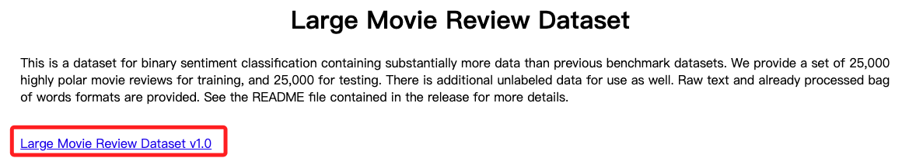

# Lab 4.1：實作情感分析 Sentiment Analysis

_Version: 02.14.2023_

 

## 說明

1. 這個 Lab 使用 `IMDB` 資料集進行情緒分析，目的是訓練一個機器學習模型，用於分析電影評論的情緒，並能夠對評論進行推理，判斷其為正面還是負面。

 

2. 資料集中包含 `50,000` 條已標記為正面或負面的電影評論的文本，發布於 `2011/06`，詳細資訊可參考 [連結](http://ai.stanford.edu/~amaas/data/sentiment/)；點擊畫面中的連結可下載。

    

 

3. 另外，此資料集的情緒標籤，`1` 表示正面、`0` 表示負面。

 

## 步骤概述

1. 安裝套件。

 

2. 讀取資料集。

 

3. 執行探索性資料分析。

 

4. 執行第一次傳遞：最低程度的處理。

 

5. 執行第二次傳遞：標準化文本。

 

6. 優化超參數。

 

7. 使用 BlazingText。

 

8. 使用 Amazon Comprehend。

 

___

_接下來進行實作_