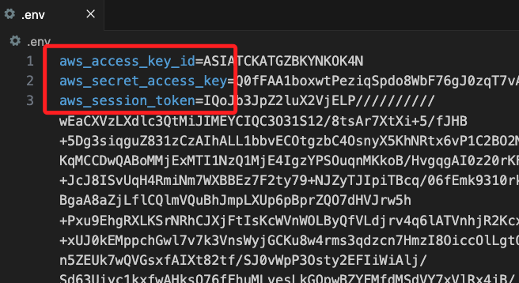

# Lab 4.1

_前置作業_

<br>

## 環境配置

_主要在本地進行開發，部分作業必須在雲端操作_

<br>

1. 避免版本衝突，建立新的虛擬環境 `envAWS2`；並啟動 VSCode 編輯環境變數。

    ```bash
    cd ~/Documents/PythonVenv && python -m venv envAWS2
    code ~/.zshrc 
    ```

<br>

2. 寫入並儲存路徑後，套用變更。

    ```bash
    source ~/.zshrc
    ```

<br>

3. 在桌面建立專案資料夾 `_test_`，並添加預設文件後，啟動 VSCode。

    ```bash
    mkdir -p ~/Desktop/_test_ && cd ~/Desktop/_test_
    touch ex01.ipynb .env .gitignore
    echo ".env" >> .gitignore
    code .
    ```

<br>

4. 在 `.env` 貼上 Lab 首頁的 `AWS CLI` 內容不包含 `[default]` 部分。

    

<br>

5. 緊接著在 `.env` 下方貼上以下內容，完成 AWS CLI 設置。

    ```bash
    AWS_ACCESS_KEY_ID=${aws_access_key_id}
    AWS_SECRET_ACCESS_KEY=${aws_secret_access_key}
    AWS_SESSION_TOKEN=${aws_session_token}
    AWS_DEFAULT_REGION=us-east-1
    ```

<br>

6. 假如在終端機中運行，則在貼上 AWS CIL 相關資料後，運行以下指令。

    ```bash
    export AWS_ACCESS_KEY_ID=$aws_access_key_id
    export AWS_SECRET_ACCESS_KEY=$aws_secret_access_key
    export AWS_SESSION_TOKEN=$aws_session_token
    ```

<br>

## 安装套件

_可在筆記本或是終端機中執行_

<br>

1. 在筆記本中可使用魔法方法安裝套件。

    ```python
    !pip install --upgrade pip
    !pip install --upgrade boto3
    !pip install --upgrade scikit-learn
    !pip install --upgrade sagemaker
    !pip install --upgrade nltk
    !pip install --upgrade seaborn
    ```

<br>

2. 在本地運行則建議在終端機中安裝。

    ```bash
    python -m pip install --upgrade pip awscli boto3 scikit-learn  nltk seaborn python-dotenv
    ```

<br>

3. 在本地運行 Sagemaker 必須安裝套件。

    ```python
    python -m pip install sagemaker
    ```

<br>

___

_接下個步驟_