# Lab 4.1

_實作_

<br>

## 準備工作

_編輯腳本_

<br>

1. 載入環境變數；每次重新實作都要重啟核心載入環境變數。

    ```python
    from dotenv import load_dotenv
    import os

    # 載入 .env 文件
    load_dotenv()
    ```

    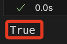

<br>

2. 驗證帳號，務必確認輸出的帳號與 Lab 取得相同，藉此驗證 `.env` 設置正確。

    ```python
    import boto3

    # 初始化 STS 客戶端
    sts_client = boto3.client('sts')

    # 獲取當前帳戶的 Account ID
    account_id = sts_client.get_caller_identity()["Account"]
    print("當前的 Account ID:", account_id)
    ```

    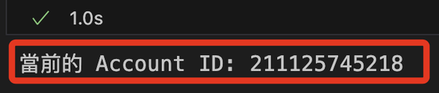

<br>

## 在本地運作 Sagemaker

_特別注意，在本地運行 `Sagemaker` 會有諸多限制，以下會試圖繞過限制來進行運作。_

<br>

1. 導入 `sagemaker` 與 `Lab` 操作有關的庫；從輸出的訊息可知， `SDK` 沒有從這些位置應用預設配置，但這不影響 `SDK` 的正常運行，可以忽略這些資訊；特別注意，這在 Lab 運行也會顯示相同訊息。

    ```python
    import sagemaker
    from sagemaker.estimator import Estimator
    from sagemaker import get_execution_role
    ```

    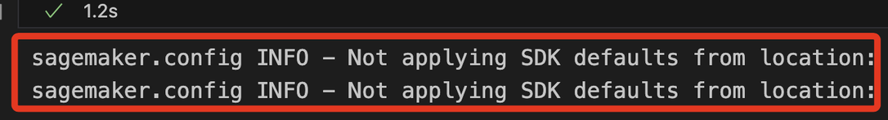

<br>

## 指定角色

1. 在雲端運作時，可直接指定角色，將以下代碼替為指定角色並寫在 CELL 中即可。

    ```python
    role = "<arn:aws:iam::XX-共12碼-XXX:role/自己的-SageMaker-執行角色>"
    ```

<br>

2. 基於自動化的考量，在雲端可透過函數取得角色並存入變數中；特別注意，這只在雲端 SageMaker notebook 環境中適用，本地調用這個函數得到的會是 Lab 角色，而不是針對 SageMaker 賦予的角色。

    ```python
    role = get_execution_role()
    role
    ```

<br>

3. 在本地運行會顯示警告，雖然依舊返回角色的 ARN，但這並非 Lab 賦予權限的 Role；換句話說，當前取得的角色並非運行本行案所虛要的，之後會另做處理，這裡先說明這個狀況。

    ```bash
    role_local = get_execution_role()
    role_local
    ```

    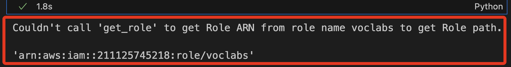

<br>

## 查詢並取得設置

_S3 Bucket、IAM Roles_

<br>

1. 取得名稱中包含 `labbucket` 的 S3 bucket，並存入變數 `bucket_name` 中，這將應用於後續的代碼中；特別注意，因為官方範例使用的變數名稱是 `bucket`，這裡同時保留了 `bucket_name` 並存入 `bucket`，一方面是對應官方範例，二方面是避免錯誤覆蓋時可進行恢復。

    ```python
    import boto3

    # 初始化 S3 客戶端
    s3_client = boto3.client('s3')

    # 列出所有 S3 buckets 並篩選名稱包含 'labbucket' 的
    try:
        response = s3_client.list_buckets()
        # 只取出第一個名稱包含 'labbucket' 的 S3 bucket，若無則返回 None
        bucket_name = next((bucket['Name'] for bucket in response['Buckets'] if 'labbucket' in bucket['Name']), None)

        # 顯示結果
        if bucket_name:
            print("包含 'labbucket' 的 S3 Bucket：", bucket_name)
        else:
            print("找不到包含 'labbucket' 的 S3 Bucket。")
    except Exception as e:
        print(f"發生錯誤: {e}")

    # 配合官方範例，將命名為 `bucket`
    bucket = bucket_name
    bucket
    ```

    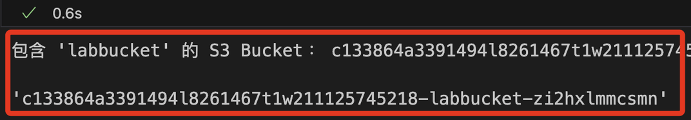

<br>

2. 關於這個 Bucket，可進入 S3 主控台查看。

    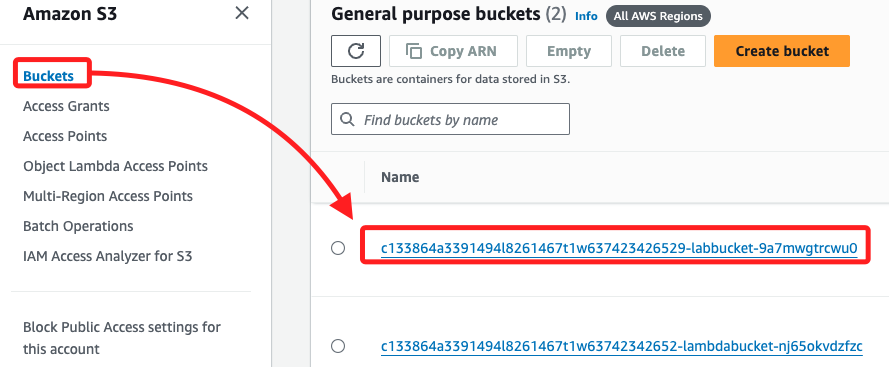

<br>

3. 檢查指定 Bucket 中是否有資料夾或文件。

    ```python
    def list_s3_structure(bucket_name, prefix='', level=0):
        s3_client = boto3.client('s3')
        result = s3_client.list_objects_v2(
            Bucket=bucket_name, Prefix=prefix, Delimiter='/'
        )
        # 根據層級縮進
        indent = '    ' * level
        has_content = False

        # 列出資料夾
        if 'CommonPrefixes' in result:
            has_content = True
            for folder in result['CommonPrefixes']:
                # 顯示資料夾名稱
                print(
                    f"{indent}📁 {folder['Prefix'].split('/')[-2]}"
                )
                # 遞歸列出子資料夾
                list_s3_structure(
                    bucket_name, 
                    prefix=folder['Prefix'], 
                    level=level + 1
                )

        # 列出文件
        if 'Contents' in result:
            has_content = True
            for file in result['Contents']:
                # 避免重複顯示資料夾的 key
                if file['Key'] != prefix:
                    # 顯示文件名稱
                    print(f"{indent}📄 {file['Key'].split('/')[-1]}")

        # 如果沒有內容，則輸出通知
        if not has_content and level == 0:
            print(f"Bucket '{bucket_name}' 中沒有任何內容。")

    # 調用
    list_s3_structure(bucket_name)
    ```

    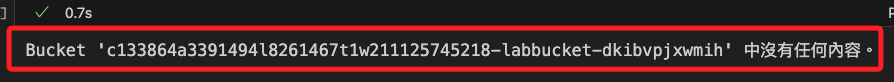

<br>

4. 查詢有哪些 Roles，前面步驟曾取得的就是其中的 `voclabs`。

    ```python
    # 初始化 IAM 客戶端
    iam_client = boto3.client('iam')

    # 列出所有 IAM 角色的名稱
    try:
        roles = iam_client.list_roles()
        print("帳戶中的 IAM 角色名稱：")
        for role in roles['Roles']:
            print(role['RoleName'])
    except Exception as e:
        print(f"發生錯誤: {e}")
    ```

    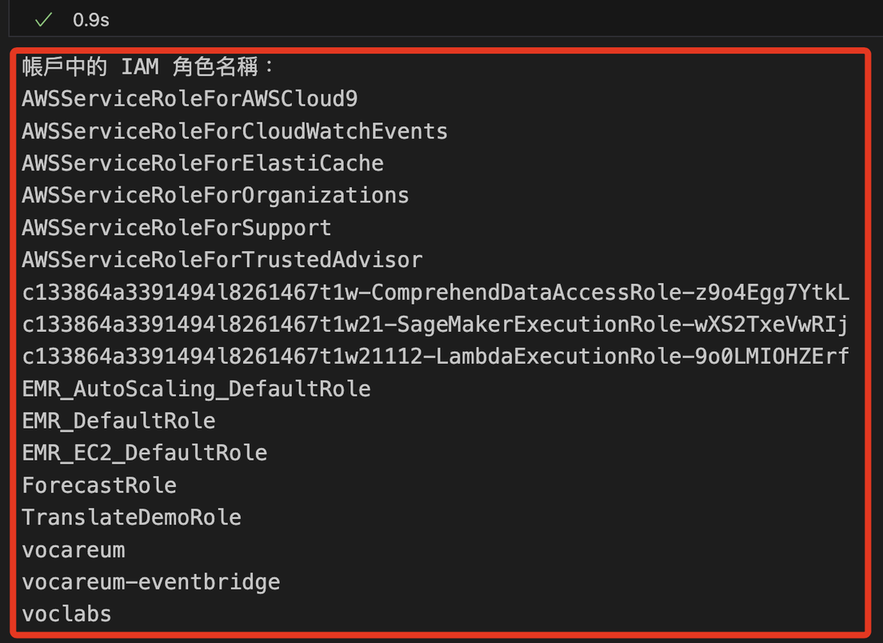

<br>

5. 同樣在 IAM 主控台中也可查看到這些 Roles。

    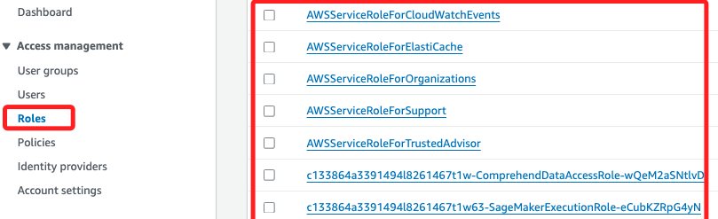

<br>

## 導入主要庫

1. 導入庫並下載 NLTK。

    ```python
    # 文件、輸入輸出和數據結構
    import os, io, struct
    import numpy as np
    import pandas as pd
    from sklearn.metrics import (
        # 計算 ROC AUC 分數
        roc_auc_score,
        # 計算 ROC 曲線的座標
        roc_curve,
        # 計算 AUC 值
        auc,
        # 計算混淆矩陣
        confusion_matrix
    )
    # 用於數據視覺化的庫
    import seaborn as sns
    import matplotlib.pyplot as plt
    # 用於處理日期和時間的庫
    from datetime import datetime

    # 匯入 NLTK 庫以進行自然語言處理
    import nltk

    '''下載 NLTK 資料集'''
    # 下載句子分割所需的資料集
    nltk.download('punkt')
    # 下載停用詞列表
    nltk.download('stopwords')
    # 下載詞性標註器
    nltk.download('averaged_perceptron_tagger')
    # 下載 WordNet 詞典
    nltk.download('wordnet')
    ```

    

<br>

2. 可進入檔案系統中查看，位置在 `~/nltk_data`；`corpora` 中存放各種語料庫，也就是大量的文本數據集；`sentiment` 存放與情感分析相關的模型或資料集；`taggers` 包含各種標註器模型，例如詞性標註器；`tokenizers` 包含各種分詞器，這些工具可將文本切分為詞彙或句子。

    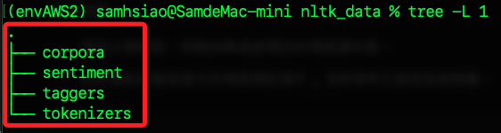

<br>

## 自訂輔助函數

_這在之後會調用_

<br>

1. 繪製混淆矩陣的熱力圖。

    ```python
    def plot_confusion_matrix(test_labels, target_predicted):
        # 計算混淆矩陣
        matrix = confusion_matrix(test_labels, target_predicted)
        # 將混淆矩陣轉換為 DataFrame 格式
        df_confusion = pd.DataFrame(matrix)
        # 設定顏色圖的配色方案
        colormap = sns.color_palette("BrBG", 10)
        # 繪製熱力圖，並顯示數值
        sns.heatmap(df_confusion, annot=True, fmt='.2f', cbar=None, cmap=colormap)
        # 設定圖表的標題
        plt.title("Confusion Matrix")
        # 自動調整佈局
        plt.tight_layout()
        # 設定 y 軸標籤為 "True Class"（真實類別）
        plt.ylabel("True Class")
        # 設定 x 軸標籤為 "Predicted Class"（預測類別）
        plt.xlabel("Predicted Class")
        # 顯示圖表
        plt.show()
    ```

<br>

2. 計算和輸出模型的性能指標。

    ```python
    def print_metrics(test_labels, target_predicted_binary):
        # 計算混淆矩陣並解壓縮成 TN, FP, FN, TP
        TN, FP, FN, TP = confusion_matrix(test_labels, target_predicted_binary).ravel()
        # 計算靈敏度、命中率、召回率或真陽性率
        Sensitivity = float(TP)/(TP+FN)*100
        # 計算特異性或真陰性率
        Specificity = float(TN)/(TN+FP)*100
        # 計算精確度或正陽性預測值
        Precision = float(TP)/(TP+FP)*100
        # 計算陰性預測值
        NPV = float(TN)/(TN+FN)*100
        # 計算錯誤率或假陽性率
        FPR = float(FP)/(FP+TN)*100
        # 計算假陰性率
        FNR = float(FN)/(TP+FN)*100
        # 計算錯誤發現率
        FDR = float(FP)/(TP+FP)*100
        # 計算整體準確率
        ACC = float(TP+TN)/(TP+FP+FN+TN)*100

        '''個相輸出'''
        # 靈敏度或 TPR
        print(f"Sensitivity or TPR: {Sensitivity}%")    
        # 特異性或 TNR
        print(f"Specificity or TNR: {Specificity}%") 
        # 精確度
        print(f"Precision: {Precision}%")   
        # 陰性預測值
        print(f"Negative Predictive Value: {NPV}%")  
        # 假陽性率
        print(f"False Positive Rate: {FPR}%") 
        # 假陰性率
        print(f"False Negative Rate: {FNR}%")  
        # 錯誤發現率
        print(f"False Discovery Rate: {FDR}%" )
        # 整體準確率
        print(f"Accuracy: {ACC}%")
    ```

<br>

## 手動下載數據集

_IMDB 的數據集並非以 `imdb.csv` 的形式直接提供，官方範例是直接預先準備好的，這裡手動進行載並加以處理。_

<br>

1. 下載並將資料組合轉換成 `CSV` 格式；程式碼生成的 `imdb.csv` 包含兩列 `review` 和 `sentiment`，分別記錄 `評論文本` 與 `正面或負面的標記`，這樣的格式可用於情緒分析任務；特別注意，手動下載後的原始數據集在欄位名稱上與 Lab 提供的不同，這在後續步驟會進行轉換。

    ```python
    import urllib.request
    import tarfile

    # 定義下載 URL 和資料夾名稱
    url = "http://ai.stanford.edu/~amaas/data/sentiment/aclImdb_v1.tar.gz"
    data_dir = "aclImdb"

    # 下載 IMDB 資料集
    if not os.path.exists("aclImdb_v1.tar.gz"):
        print("Downloading IMDB dataset...")
        urllib.request.urlretrieve(url, "aclImdb_v1.tar.gz")
        print("Download complete.")

    # 解壓縮資料集
    if not os.path.exists(data_dir):
        print("Extracting IMDB dataset...")
        with tarfile.open("aclImdb_v1.tar.gz", "r:gz") as tar_ref:
            tar_ref.extractall(".")
        print("Extraction complete.")

    # 準備資料並轉換為 CSV 格式
    data = {"review": [], "sentiment": []}

    # 讀取資料夾中的檔案並標記正面/負面
    for split in ["train", "test"]:
        for sentiment in ["pos", "neg"]:
            folder_path = os.path.join(data_dir, split, sentiment)
            # 檢查資料夾是否存在
            if os.path.exists(folder_path):
                for filename in os.listdir(folder_path):
                    file_path = os.path.join(folder_path, filename)
                    with open(file_path, "r", encoding="utf-8") as file:
                        review = file.read()
                        # 正面為 1，負面為 0
                        label = 1 if sentiment == "pos" else 0 
                        data["review"].append(review)
                        data["sentiment"].append(label)

    # 轉換為 DataFrame 並存成 CSV
    df = pd.DataFrame(data)
    df.to_csv("imdb.csv", index=False)
    print("CSV file 'imdb.csv' created successfully.")
    ```

    

<br>

2. 在本地專案路徑中可看到添加一個目錄、三個文件，其中 `imdb.csv` 便是經過轉換後的新資料集；特別注意，在雲端環境中，資料集被存放在 `'../data/imdb.csv'` 路徑中。

    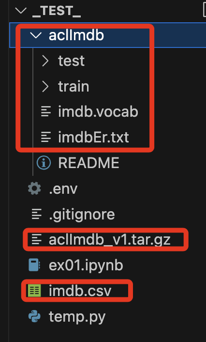

<br>

## 讀取數據集

1. 讀取並顯示資料；特別注意，在這裡已經將數據存入 `df`，資料表有兩個欄位，分別是 `review` 及 `sentiment`。

    ```python
    df = pd.read_csv('imdb.csv', header=0)
    df
    ```

    

<br>

## 快速進入 Sagemaker

_生成連結快速進入，並下載範例數據進行比較_

<br>

1. 可自動化生成官方範例文件的連結。

    ```python
    # 獲取 SageMaker 客戶端
    sagemaker_client = boto3.client('sagemaker')

    # 獲取所有 Notebook 實例
    notebook_instances = sagemaker_client.list_notebook_instances()

    # 獲取當前 Notebook 實例名稱
    # 假設只存在一個 Notebook 實例，您可以根據需要進行修改
    notebook_instance_name = \
        notebook_instances['NotebookInstances'][0]['NotebookInstanceName']

    # 設定 AWS 區域
    aws_region = boto3.Session().region_name

    # 設定路徑和檔案名稱
    folder_path = 'data'
    file_name = 'imdb.csv'

    # 自動生成網址
    s3_url = \
        f"https://{notebook_instance_name}.notebook."\
        f"{aws_region}.sagemaker.aws/lab/tree/{folder_path}/{file_name}"

    # 輸出生成的 URL
    print("生成的 CSV 文件網址:", s3_url)
    ```

    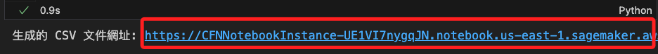

<br>

2. 打開連結可快速進入 Lab，在數據集點擊右鍵下載到本地。

    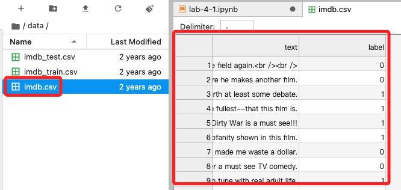

<br>

3. 為了比對官方數據與自行下載數據是否存在差異，接著將下載的文件更名為 `imdb_0.csv` 後拖曳進入專案資料夾中。

    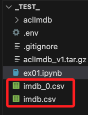

<br>

4. 透過代碼觀察，結果顯示數據的內容與欄位不一樣，但格式是相同的，並且資料筆數 `50,000` 也相同。

    ```python
    df_0 = pd.read_csv('imdb_0.csv', header=0)
    df_0
    ```

    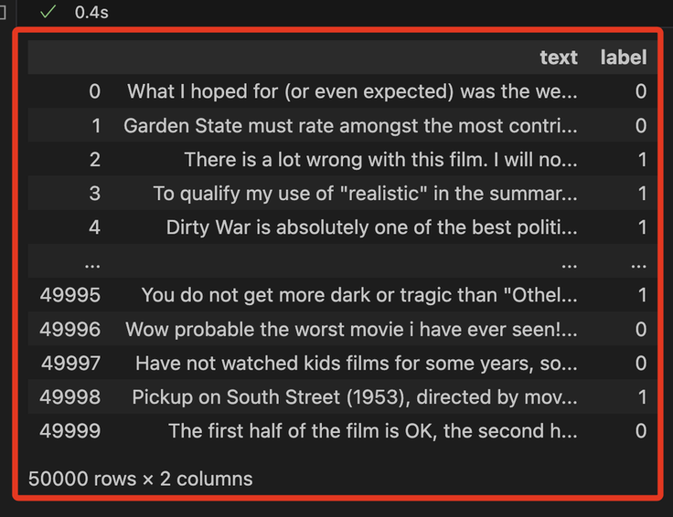

<br>

5. 列出兩個數據的欄位名稱，結果顯示官方數據集的欄位名稱是 `text` 和 `label`，而下載數據集的欄位是 `review`、`sentiment`。

    ```python
    print(df.head())
    print(df_0.head())
    ```

    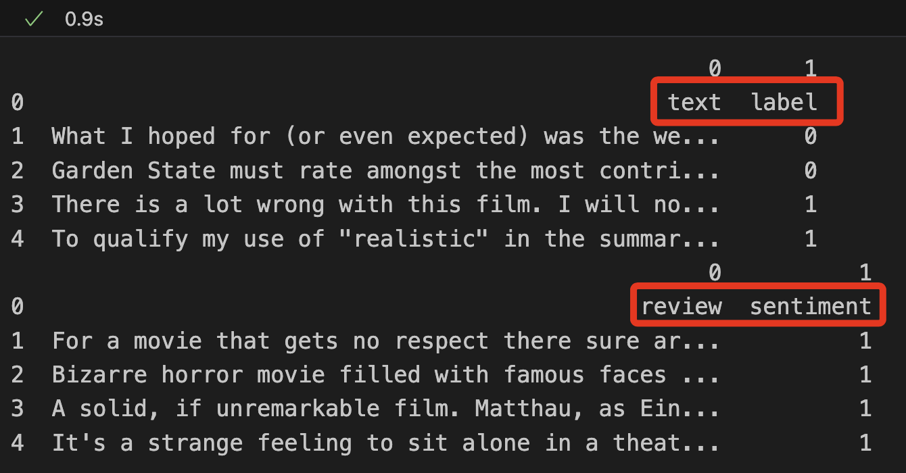

<br>

6. 將下載數據集 `imdb.csv` 的欄位名稱修改與官方資料集一致。

    ```python
    # 將欄位名稱重命名為官方格式
    df.rename(
        columns={"review": "text", "sentiment": "label"},
        inplace=True
    )

    # 將更改後的 DataFrame 儲存回 CSV
    df.to_csv("imdb.csv", index=False)

    print("欄位名稱已修改為與官方一致，並重新儲存為 'imdb.csv'。")

    # 重新讀取更新後的文件
    df = pd.read_csv("imdb.csv")
    print("重新讀取後的欄位名稱：", df.columns.tolist())
    ```

    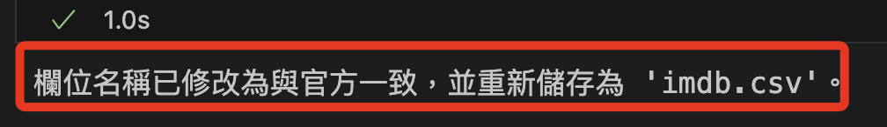

<br>

7. 比對數據，提取自行下載的數據集前五筆進行查詢，比對該筆數據是否存在於官方資料集中，並明確指出是資料集的哪一筆；此步驟用已確認是否僅僅是排序問題。

    ```python
    # 重新讀取更新後的數據集
    df = pd.read_csv("imdb.csv")

    # 取出自行下載的數據集前五筆資料
    first_five_rows = df.head(5)

    # 建立一個空的列表來儲存匹配結果
    matches = []

    # 遍歷前五筆資料，逐筆與官方數據集比對
    for index, row in first_five_rows.iterrows():
        match = df_0[
            (df_0['text'] == row['text']) & 
            (df_0['label'] == row['label'])
        ]
        # 如果匹配到數據，將結果加入列表
        if not match.empty:
            matches.append(match)

    # 顯示匹配的列
    if matches:
        matched_df = pd.concat(matches)
        print("前五筆數據在官方數據集中的列：")
        print(matched_df)
    else:
        print("在官方數據集中找不到與前五筆資料匹配的列。")
    ```

    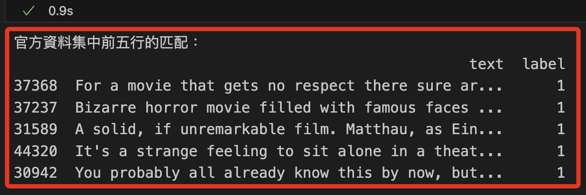

<br>

## 探索數據

_以下是官方範例中探索數據的代碼，可運行操作。_

<br>

1. 查看前面 `8` 筆。

    ```python
    def show_eight_rows(df):
        return df.head(8)    

    print(show_eight_rows(df))
    ```

    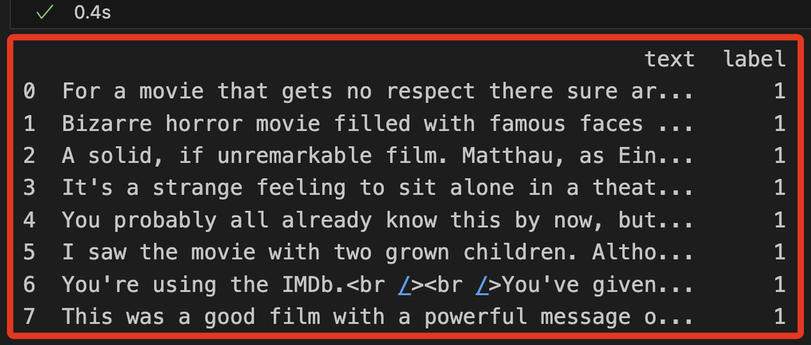

<br>

2. 查看數據結構。

    ```python
    def show_data_shape(df):
        return df.shape

    print(show_data_shape(df))
    ```

    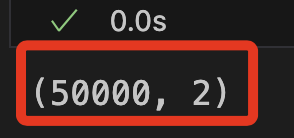

<br>

3. 資料中正面和負面實例數量；可自行替換文件名稱來查看範例文件的內容。

    ```python
    def show_data_instances(df):
        return df['label'].value_counts()

    print(show_data_instances(df))
    ```

    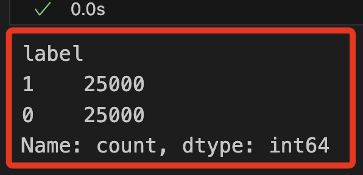

<br>

4. 檢查遺漏缺失值。

    ```python
    def show_missing_values(df):
        return df.isna().sum()
        

    print(show_missing_values(df))
    ```

    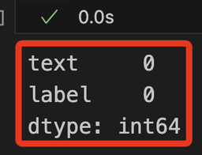

<br>

___

_繼續下一階段_