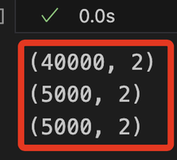
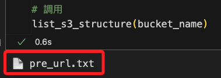

# Lab 4.1

_最基本的操作，旨在訓練出一個分類模型，從而觀察文本處理對結果的影響。_

<br>

## 初步流程

1. 導入 `NLTK` 和 `re`。

    ```python
    import re
    from nltk.corpus import stopwords
    from nltk.stem import SnowballStemmer
    from nltk.tokenize import word_tokenize
    ```

<br>

2. 自訂義拆分資料集的函數，將資料集中 `80％` 數據用於訓練，另外用於驗證與測試的各佔 `10%`。

    ```python
    # train_test_split 用於資料集的分割
    from sklearn.model_selection import train_test_split

    def split_data(df):

        # 將資料集分割為訓練集、測試、驗證集
        train, test_and_validate = train_test_split(
            # 要分割的資料集
            df,
            # 這是 `測試+驗證` 的比例
            test_size=0.2,
            # 分割前是否隨機打亂資料
            shuffle=True,
            # 設定隨機種子，這可用於重現分割結果
            random_state=324
        )
        
        # 將 `測試集` 再分割為 `測試集` 和 `驗證集`
        test, validate = train_test_split(
            # 要分割的資料集
            test_and_validate,
            # 將集合分割兩部分各佔 `50%`，即測試和驗證各佔整體 `10%`
            test_size=0.5,
            shuffle=True,
            random_state=324
        )
        # 返回三個子集
        return train, validate, test
    ```

<br>

3. 調用自訂函數將數據拆分為三個資料子集 `train`、`validate`、`test`，並透過 `shape` 屬性查看拆分後的數據結構。

    ```python
    # 拆分
    train, validate, test = split_data(df)
    
    # 查看
    print(train.shape)
    print(test.shape)
    print(validate.shape)
    ```

    

<br>

4. 檢查欄位存在性；基於數據是經過轉換的，這裡做一次檢查確保資料無誤。

    ```python
    # 定義要檢查的欄位名稱
    required_columns = ['text', 'label']

    # 檢查每個資料集是否包含所需的欄位
    for name, dataset in zip(
        ['Train', 'Validate', 'Test'], 
        [train, validate, test]
    ):
        missing_columns = [
            col for col in required_columns if col not in dataset.columns
        ]
        
        if not missing_columns:
            print(f"{name} 資料集包含所有所需的欄位: {required_columns}")
        else:
            print(f"{name} 資料集缺少以下欄位: {missing_columns}")
    ```

    

<br>

## 關於魔術命令 `# %%time`

_以下步驟開始會使用到，在此先做個補充說明_

<br>

1. 在 `Jupyter Notebook` 中可透過該指令對該 cell 的執行進行計時，除可測量整個 cell 的執行時間，也會顯示 `CPU time` 處理器花費的時間，另外 `Wall time` 則是從 cell 開始執行到結束所經過的實際時間，包含所有的等待時間。

    ```python
    # %%time
    # 這裡是一些程式碼
    ```

<br>

2. 執行完此 cell 後，Jupyter Notebook 會顯示這段程式碼的執行時間。`# %%time` 只能用於 cell 的第一行，並且會計時整個 cell 的執行。如果只想計時單行程式碼，可以使用 `%time`。

<br>

## 組裝 `processing pipeline`

_`處理管道` 就是將數據處理步驟連接在一起的方式，使其可簡化數據流的管理和操作；其中包含多個處理步驟如數據清洗、轉換、特徵提取等，然後將其鏈接起來形成一個整體流程；以下對文本數據進行特徵提取和預處理，以便將其轉換為機器學習模型可以接受的格式。_

<br>

1. 導入必要庫。

    ```python
    # %%time
    # 導入文本特徵提取的 CountVectorizer
    from sklearn.feature_extraction.text import CountVectorizer
    # 導入 Pipeline，用於將多個處理步驟串聯
    from sklearn.pipeline import Pipeline
    # 導入 ColumnTransformer，用於選擇和轉換特定的列
    from sklearn.compose import ColumnTransformer
    ```

<br>

2. 建立管道，自訂名稱 `text_vect_0`，這個名稱可作為管道中辨識步驟所用。

    ```python
    # 定義文本特徵的名稱
    text_features = ['text']
    # 定義模型的目標變量名稱
    model_target = 'label'

    # 建立文本處理管道，包括 CountVectorizer 以提取文本特徵
    text_processor_0 = Pipeline([(
        'text_vect_0', 
        # 設置最大特徵數為 500
        CountVectorizer(max_features=500)
    )])
    ```

<br>

3. 建立預處理器，自訂名稱 `text_pre_0`。

    ```python
    # 定義數據預處理器，將文本處理管道應用於指定的文本特徵列
    data_preprocessor = ColumnTransformer([(
        'text_pre_0', 
        text_processor_0, 
        # 應用於 'text' 欄位
        text_features[0]
    )])
    ```

<br>

4. 輸出處理前的數據集形狀。

    ```python
    print(
        'Datasets shapes before processing: ', 
        train.shape, 
        validate.shape, 
        test.shape
    )
    ```

    

<br>

5. 進行數據轉換。

    ```python
    # 擬合並轉換訓練數據為數值矩陣
    train_matrix = data_preprocessor.fit_transform(train)
    # 對測試數據進行轉換
    test_matrix = data_preprocessor.transform(test)
    # 對驗證數據進行轉換
    validate_matrix = data_preprocessor.transform(validate)
    ```

<br>

6. 查看處理後的數據集形狀。

    ```python
    print(
        'Datasets shapes after processing: ', 
        train_matrix.shape, 
        validate_matrix.shape, 
        test_matrix.shape
    )
    ```

    

<br>

## 查詢 Pipeline 和 ColumnTransformer

_透過上述自訂名稱查詢 Pipeline 和 ColumnTransformer 中的元件_

<br>

1. 查詢 `Pipeline` 中的元件。

    ```python
    # 取得 Pipeline 中名稱為 'text_vect_0' 的步驟
    vectorizer = text_processor_0.named_steps['text_vect_0']
    print(vectorizer)
    ```

    

<br>

2. 查詢 `ColumnTransformer` 中的元件，輸出的是一個 `data_preprocessor`。

    ```python
    # 取得 ColumnTransformer 中名稱為 'text_pre_0' 的步驟
    text_transformer = data_preprocessor.named_transformers_['text_pre_0']
    print(text_transformer)
    ```

    

<br>

3. 可透過查詢到的元件修改其屬性，以下步驟是修改 CountVectorizer 的參數。

    ```python
    # 修改 CountVectorizer 的最大特徵數
    text_processor_0.named_steps['text_vect_0'].set_params(max_features=1000)
    ```

    

<br>

4. 記得再改回來。

    ```python
    text_processor_0.named_steps['text_vect_0'].set_params(max_features=500)
    ```

<br>

## 從 Sagemaker 寫入 S3

_這在雲端操作；因為訓練模型需要使用儲存在 S3 中 `CSV` 格式的數據集，所以在 Sagemaker 自訂函數處理相關工作，這是雲端對雲端的操作；這部分僅作說明不實作。_

<br>

1. 自訂寫入 S3 的函數。

    ```python
    import boto3

    # 初始化 S3 資源
    s3_resource = boto3.Session().resource('s3')

    # 定義上傳 CSV 文件的函數
    def upload_s3_csv(
        filename, folder, X_train, y_train, is_test=False
    ):
        # 建立一個 StringIO 對象，作為 CSV 的緩衝區
        csv_buffer = io.StringIO()
        
        # 將特徵矩陣轉換為 float32 類型，並展平為列表格式
        features = [
            t.toarray().astype('float32').flatten().tolist() 
            for t in X_train
        ]
        
        # 檢查是否為測試集
        if is_test:
            # 如果是測試集，直接使用特徵
            temp_list = features
        else:
            # 如果不是測試集，將標籤添加到特徵的第一列
            temp_list = np.insert(
                features, 0, y_train['label'], axis=1
            )
        
        # 將數據保存為 CSV 格式到緩衝區
        np.savetxt(csv_buffer, temp_list, delimiter=',')
        
        # 使用 S3 資源將 CSV 上傳至指定的 S3 Bucket 和文件路徑
        s3_resource.Bucket(bucket).Object(
            # 將文件路徑組合
            os.path.join(prefix, folder, filename)
        # 將 CSV 數據作為文件內容上傳
        ).put(Body=csv_buffer.getvalue())
    ```

<br>

2. 在官方範例中，對於上傳使用硬編碼指定了 Bucket，但這是會變動的，每次啟動 Lab 都會有新的值。

    ```python
    bucket = 'c133864a3391494l8261467t1w637423426529-labbucket-hcjcbnnncwhe'
    ```

<br>

3. 所以將前面步驟自動化步驟取得 Bucket 名稱 `bucket_name` 傳給 `bucket`；這在之前已經做過一次，但避免因為運行上一個代碼而覆蓋了資料；這裡可觀察輸出 `bucket` 的是否正確。

    ```python
    bucket = bucket_name
    bucket
    ```

<br>

4. 設置這次傳遞的文件名稱；特別注意，這是在 Lab 操作時所做的設置，在本地運行時將略作修改以便區分，這會在後續步驟進行。

    ```python
    prefix='lab41'
    train_file='train-pass1.csv'
    validate_file='validate-pass1.csv'
    test_file='test-pass1.csv'
    ```

<br>

5. 假如在雲端運行，可調用函數將數據上傳到 S3。

    ```python
    upload_s3_csv(train_file, 'train', train_matrix, train)
    upload_s3_csv(validate_file, 'validate', validate_matrix, validate)
    upload_s3_csv(test_file, 'test', test_matrix, test, True)
    ```

<br>

## 關於權限說明

_進行以下操作前，先説明 Lab 的權限規範_

<br>

1. 特別注意，Lab 所賦予的角色不具備直接寫入數據至 S3 的權限，要獲得寫入權限，必須透過 `SageMaker` 的 `get_execution_role` 函數來取得該角色的 ARN，並在 `SageMaker` 環境中運行該函數；若在本地環境執行將返回 Lab 角色的 ARN，而不是 SageMaker 的 ARN，這將限制本地環境對 S3 的存取權限。

<br>

2. 針對上述情況，接下來將使用 `Presigned URL` 來處理檔案上傳，此方法需透過在 `SageMaker` 環境中使用具有必要權限的 ARN 所生成的 `Presigned URL` 來完成上傳，這樣做可以在無法修改 IAM 設置且無法獲得 `PutObject` 權限的情況下，透過本地的 Jupyter Notebook 成功上傳檔案至 S3；這個變通的解決方案讓使用者能夠在有限的權限環境中進行檔案操作。

<br>

3. 這個生成的 `Presigned URL` 在特定時間內有效，可依據需求設定的有效期限為幾分鐘至幾小時。

<br>

## 建立預簽名 URL

_在雲端操作_

<br>

1. 在 Sagemaker 中建立新的 `.ipynb` 腳本，核心選擇 `conda_python3`。

    

<br>

2. 第一步先取得 `bucket` 名稱，這樣可使代碼具備自動化重用性。

    ```python
    import boto3

    # 初始化 S3 客戶端
    s3_client = boto3.client('s3')

    # 列出所有 S3 buckets 並篩選名稱包含 'labbucket' 的
    try:
        response = s3_client.list_buckets()
        # 只取出第一個名稱包含 'labbucket' 的 S3 bucket，若無則返回 None
        bucket_name = next((bucket['Name'] for bucket in response['Buckets'] if 'labbucket' in bucket['Name']), None)

        # 顯示結果
        if bucket_name:
            print("包含 'labbucket' 的 S3 Bucket：", bucket_name)
        else:
            print("找不到包含 'labbucket' 的 S3 Bucket。")
    except Exception as e:
        print(f"發生錯誤: {e}")

    # 配合官方範例，將命名為 `bucket`
    bucket = bucket_name
    bucket
    ```

    

<br>

3. 將前一個步驟取得的 bucket 名稱生成 `預簽名 URL`，另外 `key` 設置為文件名稱 `test.txt`，代表上傳後的文件將以該名稱存放在 Bucket 的根目錄中。

    ```python
    # 指定文件名稱
    s3_file_path = "test.txt"

    # 生成預簽名 URL，有效期設定為 1 小時
    presigned_url = s3_client.generate_presigned_url(
        'put_object',
        Params={
            'Bucket': bucket_name, 
            'Key': s3_file_path
        },
        # 設置 URL 有效期（秒）
        ExpiresIn=3600
    )

    print("預簽名 URL:", presigned_url)
    ```

    

<br>

4. 將 `預簽名 URL` 寫入文件 `pre_url.txt`。

    ```python
    with open("pre_url.txt", "w") as file:
        file.write(presigned_url)

    print("已生成預簽名 URL 並儲存至 pre_url.txt 文件。")
    ```

    

<br>

5. 將 `pre_url.txt` 儲存至 S3 Bucket，這是為了要讓本地進行讀取或下載。

    ```python
    with open("pre_url.txt", "rb") as file_data:
        s3_client.upload_fileobj(
            file_data, 
            bucket_name, 
            "pre_url.txt"
        )

    print("已成功將 pre_url.txt 上傳至 S3。")
    ```

    

<br>

6. 進入 Bucket 中確認文件已經寫入。

    

<br>

## 突破限制寫入 S3

_回到本地操作，先進行一個簡單的測試，確認可繞過在當前限制寫入 S3_

<br>

1. 設定路徑參數；在本地運行的部分對參數略作修改，檔名不變，`prefix` 部分添加尾綴作為識別 `lab41_local`。

    ```python
    prefix='lab41_local'
    train_file='train-pass1.csv'
    validate_file='validate-pass1.csv'
    test_file='test-pass1.csv'
    ```

<br>

2. 調用之前建立的函數 `list_s3_structure()` 查詢。

    ```python
    list_s3_structure(bucket_name)
    ```

    `

<br>

3. 取得 S3 的 `Presigned URL`。

    ```python
    import requests

    pre_url_file_key = 'pre_url.txt'

    # 取得 S3 中指定文件物件
    response = s3_client.get_object(
        Bucket=bucket_name, 
        Key=pre_url_file_key
    )
    # 讀出內容並儲存為變數 presigned_url
    presigned_url = response['Body'].read().decode('utf-8')

    # 輸出查看
    print(presigned_url)
    ```

    

<br>

4. 在當前路徑中建立 `test.txt` 文件，並將字串 `測試預簽名 URL` 寫入其中。

    ```python
    with open("test.txt", "w", encoding="utf-8") as file:
        file.write("測試預簽名 URL")

    print("文件 test.txt 已成功創建並寫入內容。")
    ```

    

<br>

5. 使用 `requests` 庫，通過 `Presigned URL` 將文件上傳至 S3。

    ```python
    # 本地文件路徑
    local_file_path = "test.txt"

    # 使用預簽名 URL 上傳文件
    with open(local_file_path, 'rb') as file_data:
        response = requests.put(
            presigned_url,
            data=file_data
        )

    # 確認上傳結果
    if response.status_code == 200:
        print("文件成功上傳至 S3")
    else:
        print("上傳失敗，狀態碼：", response.status_code)
        print("錯誤內容：", upload_response.text)
    ```

    

<br>

6. 進入 S3 查看是否確實寫入，確認完成代表以上程序是正確的。

    

<br>

7. 建立一個新的函數，查詢當前 S3 中完整的樹狀結構；與之前指定 Bucket 不同，這是查詢整個 S3 的結構。

    ```python
    def list_s3_bucket_structure(bucket_name):
        s3 = boto3.resource('s3')
        bucket = s3.Bucket(bucket_name)
        print(f"Bucket: {bucket_name}")
        
        has_objects = False
        for obj in bucket.objects.all():
            print(" └── ", obj.key)
            has_objects = True

        if not has_objects:
            print(" └── <此 bucket 為空>")


    buckets = s3_client.list_buckets()["Buckets"]

    if buckets:
        for bucket in buckets:
            list_s3_bucket_structure(bucket["Name"])
    else:
        print("當前為空的：沒有任何 S3 bucket")
    ```

    

<br>

## 再次建立預簽名 URL

_回到雲端；確認以上步驟可完成文件的寫入，以下正式建立 `預簽名 URL` 來寫入數據集。_

<br>

1. 建立四個預簽名 URL 並寫入到 Bucket 文件中。 

    ```python
    import os

    # 定義 Bucket 名稱和路徑
    prefix = 'lab41_local'
    train_file = 'train-pass1.csv'
    validate_file = 'validate-pass1.csv'
    test_file = 'test-pass1.csv'
    batch_in_file = 'batch-in.csv'

    def create_presigned_url(bucket, prefix, filename):
        # 生成預簽名 URL，有效期設定為 1 小時
        presigned_url = s3_client.generate_presigned_url(
            'put_object',
            Params={
                'Bucket': bucket, 
                'Key': os.path.join(prefix, filename)
            },
            # 設置 URL 有效期（秒）
            ExpiresIn=3600  
        )
        return presigned_url

    # 創建預簽名 URL
    urls = {
        'train_file': create_presigned_url(
            bucket_name, prefix, train_file
        ),
        'validate_file': create_presigned_url(
            bucket_name, prefix, validate_file
        ),
        'test_file': create_presigned_url(
            bucket_name, prefix, test_file
        ),
        'batch_in_file': create_presigned_url(
            bucket_name, prefix, batch_in_file
        )
    }

    # 將預簽名 URL 寫入到 pre_url.txt
    s3_client.put_object(
        Bucket=bucket_name,
        Key='pre_url.txt',
        # 將 URL 轉換為字串格式
        Body=str(urls)  
    )

    print("預簽名 URL 已成功寫入到 pre_url.txt")
    ```

    

<br>

## 回到本地電腦 

1. 讀取 S3 中的 `pre_url.txt` 並取其中的 `預簽名 URL`；解析前的完整 JSON 格式內容如下。

    ```python
    response = s3_client.get_object(
        Bucket=bucket_name, 
        Key=pre_url_file_key
    )
    response
    ```

    

<br>

2. 解析其中的 `預簽名網址`；可讀出四個鍵值對。

    ```python
    presigned_urls = eval(response['Body'].read().decode('utf-8'))
    presigned_urls
    ```

    

<br>

3. 檢查當前數據集的 `label` 欄位所在索引位置；為了確保模型訓練時可識別到正確的標籤，在下一個步驟中，會將 `label` 移到索引為 `0` 的第一個欄位。

    ```python
    print("訓練集 label 欄位置:", list(train.columns).index('label'))
    print("驗證集 label 欄位置:", list(validate.columns).index('label'))
    print("測試集 label 欄位置:", list(test.columns).index('label'))
    ```

    

<br>

## 處理並上傳數據

_特別注意，預簽名中的 `batch_in_file` 至此尚未用到_

<br>

1. 向量處理，將原始文本數據轉化為可供機器學習模型使用的結構化數據。

    ```python
    # 引入 TfidfVectorizer 進行文本向量化
    from sklearn.feature_extraction.text import TfidfVectorizer
    # io 庫來處理輸入輸出
    import io

    # 設置 TF-IDF 向量化器，並設定最大特徵數目為 500
    vectorizer = TfidfVectorizer(max_features=500)

    # 將訓練數據進行向量化，轉換文本數據為特徵矩陣
    train_matrix = vectorizer.fit_transform(train['text'])

    # 使用相同的向量化器將驗證數據進行轉換
    validate_matrix = vectorizer.transform(validate['text'])

    # 將測試數據進行轉換，使用與訓練相同的特徵
    test_matrix = vectorizer.transform(test['text'])

    # 將訓練數據的特徵矩陣轉換為 DataFrame，欄位名稱為 TF-IDF 特徵詞語
    train_df = pd.DataFrame(
        # 將矩陣轉換為數組格式以構建 DataFrame
        train_matrix.toarray(),
        # 使用向量化器獲得的特徵名稱作為欄位名稱
        columns=vectorizer.get_feature_names_out()
    )

    # 將標籤欄添加到訓練數據的 DataFrame 中，標籤用於表示文本的分類
    train_df['label'] = train['label'].values

    # 將驗證數據的特徵矩陣轉換為 DataFrame，並附加標籤欄
    validate_df = pd.DataFrame(
        # 將驗證數據轉換為數組格式以構建 DataFrame
        validate_matrix.toarray(),
        # 使用向量化器獲得的特徵名稱作為欄位名稱
        columns=vectorizer.get_feature_names_out()
    )
    # 添加驗證數據的標籤欄
    validate_df['label'] = validate['label'].values

    # 將測試數據的特徵矩陣轉換為 DataFrame，並附加標籤欄
    test_df = pd.DataFrame(
        # 將測試數據轉換為數組格式以構建 DataFrame
        test_matrix.toarray(),
        # 使用向量化器獲得的特徵名稱作為欄位名稱
        columns=vectorizer.get_feature_names_out()
    )
    # 添加測試數據的標籤欄
    test_df['label'] = test['label'].values
    ```

<br>

2. 轉型並調整數據順序。

    ```python
    # 確認標籤欄為整數類型
    train_df['label'] = train_df['label'].astype(int)
    validate_df['label'] = validate_df['label'].astype(int)
    test_df['label'] = test_df['label'].astype(int)

    # 將 label 列移動到第一欄
    train_df = train_df[
        ['label'] + [col for col in train_df.columns if col != 'label']
    ]
    validate_df = validate_df[
        ['label'] + [col for col in validate_df.columns if col != 'label']
    ]
    test_df = test_df[
        ['label'] + [col for col in test_df.columns if col != 'label']
    ]
    ```

<br>

3. 自訂上傳函數，使用 `預簽名 URL` 上傳文件；約略需要一分鐘。

    ```python
    # 自訂函數
    def save_csv_to_url(dataframe, url):
        # 將 DataFrame 儲存為 CSV 格式
        csv_buffer = io.StringIO()
        dataframe.to_csv(csv_buffer, index=False)

        # 使用預簽名 URL 上傳 CSV 文件
        response = requests.put(url, data=csv_buffer.getvalue())
        
        if response.status_code == 200:
            print(f"文件成功上傳至 S3：{url}")
        else:
            print(
                f"上傳失敗，狀態碼：{response.status_code}, 錯誤內容：{response.text}"
            )

    # 上傳數據集
    save_csv_to_url(train_df, presigned_urls['train_file'])
    save_csv_to_url(validate_df, presigned_urls['validate_file'])
    save_csv_to_url(test_df, presigned_urls['test_file'])
    ```

    

<br>

4. 再次確認 `label` 在每個 DataFrame 中的位置，可發現已經從索引 `1` 移動到索引 `0`；這在數句清洗階段是重要的步驟，尤其在不確定框架規範的情況下，將標籤放在索引 `0` 可與通用格式兼容，減少數據格式錯誤的機率。

    ```python
    print("訓練集 label 欄位置:", list(train_df.columns).index('label'))
    print("驗證集 label 欄位置:", list(validate_df.columns).index('label'))
    print("測試集 label 欄位置:", list(test_df.columns).index('label'))
    ```

    

<br>

5. 檢查三個數據集中 label 的型別。

    ```python
    print("檢查 `label` 列的型別：")
    print("train_df：", train_df['label'].dtype)
    print("validate_df：", validate_df['label'].dtype)
    print("test_df：", test_df['label'].dtype)
    ```

    

<br>

6. 自訂函數對上傳數據進階檢查，其中除資料型別及缺失值外，還輸出敘述統計資訊來觀察頻率與分佈。

    ```python
    def check_dataframe_info(dataframe, name):
        print(f"檢查數據框 {name} 的資訊：")
        # 檢查資料型別和記憶體使用情況
        print(dataframe.info())
        print("\n數據範例：")
        # 查看前五行數據
        print(dataframe.head())
        print("\n描述統計：")
        # 檢查數值列的描述統計
        print(dataframe.describe())
        print("\n缺失值統計：")
        # 檢查各列缺失值數量
        print(dataframe.isnull().sum())
        print("\n" + "="*50 + "\n")

    # 檢查每個數據框
    check_dataframe_info(train_df, "train_df")
    check_dataframe_info(validate_df, "validate_df")
    check_dataframe_info(test_df, "test_df")
    ```

    

<br>

## 查看 S3 現況

1. 再次透過代碼查詢 S3 中的物件，這次會看到上傳的數據集，並顯示各物件的容量大小。

    ```python
    # 查詢 bucket 中的物件
    response = s3_client.list_objects_v2(Bucket=bucket_name)

    # 檢查 bucket 是否有內容
    if 'Contents' in response:
        print(f"Bucket '{bucket_name}' 中的物件：")
        for obj in response['Contents']:
            print(f" - {obj['Key']} (大小: {obj['Size']} bytes)")
    else:
        print(f"Bucket '{bucket_name}' 為空或不存在任何物件。")
    ```

    

<br>

2. 進入 S3 查看這個子資料夾 `lab41_local`，確實已將三個數據集上傳。

    

<br>

## 訓練之前

_進入雲端環境；因為在接下來的步驟中需要調用 `get_execution_role()`，所以必須在 Sagemaker 中運行。_

<br>

1. 取得 ARN 並寫入 S3 Bucket 文件 `arn_data.txt`，這是用於在本地讀取用的。

    ```python
    import sagemaker

    # 初始化 SageMaker 和 STS 客戶端
    sagemaker_session = sagemaker.Session()
    sts_client = boto3.client('sts')

    # 獲取當前帳戶的角色 ARN
    role_arn = sagemaker.get_execution_role()

    # 輸出角色 ARN
    print("SageMaker Notebook 中的角色 ARN:", role_arn)

    # 將角色 ARN 寫入到 S3 中的文件
    bucket_name = bucket
    s3_file_key = 'arn_data.txt'

    # 上傳 ARN 到 S3
    s3_client = boto3.client('s3')
    s3_client.put_object(
        Bucket=bucket_name,
        Key=s3_file_key,
        Body=role_arn
    )

    print(
        f"角色 ARN 已寫入到 S3 中的 {bucket_name}/{s3_file_key}"
    )
    ```

    

<br>

2. 完成後，在 Bucket 中可看到 `arn_data.txt`，這便是儲存了 ARN 資訊的文件。

    

<br>

## 回到本地電腦

1. 在本地讀取 S3 中的 `arn_data.txt` 文件，並將內容寫入變數 `arn` 中；可明確看出該角色被標註 `SageMakerExecutionRole` 字樣。

    ```python
    s3_file_key = 'arn_data.txt'

    # 讀取 S3 中的 arn_data.txt 文件
    response = s3_client.get_object(
        Bucket=bucket_name, Key=s3_file_key
    )

    # 將文件內容讀取到變數 arn 中
    role_arn = response['Body'].read().decode('utf-8')

    # 輸出獲取的 ARN
    print("讀取的角色 ARN:", role_arn)
    ```

    

<br>

2. 查看角色的附加政策。

    ```python
    from botocore.exceptions import ClientError

    def list_role_policies(role_arn):
        # 獲取角色名稱
        role_name = role_arn.split('/')[-1]
        iam_client = boto3.client('iam')

        try:
            # 獲取角色的附加政策
            policies = iam_client.list_attached_role_policies(RoleName=role_name)
            print(f"角色 {role_name} 附加的政策:")
            
            # 儲存政策 ARN 的列表
            policy_arns = []
            
            for policy in policies['AttachedPolicies']:
                print(
                    f"- {policy['PolicyName']} (ARN: {policy['PolicyArn']})"
                )
                # 將政策 ARN 儲存到列表中
                policy_arns.append(policy['PolicyArn'])
            
            # 返回政策 ARN 列表
            return policy_arns

        except ClientError as e:
            print(f"獲取角色政策時出現錯誤: {e}")
            return None

    # 調用函數並獲取政策 ARN
    policy_arns = list_role_policies(role_arn)

    # 輸出政策 ARN
    if policy_arns:
        print("獲取到的政策 ARN:")
        for arn in policy_arns:
            print(arn)
    ```

    

<br>

3. 將內容存入 JSON 文件中便於觀察；其中第一個政策允許所有 SageMaker 操作、允許所有 SageMaker Geospatial 操作、涵蓋了多種 S3 操作包括讀取和寫入、允許將角色傳遞給 AWS 服務；不過第一個政策並沒有明確列出對 Amazon Comprehend 或 Textract 的權限。

    ```python
    import json

    policy_arn = policy_arns[0]
    policy = iam_client.get_policy(PolicyArn=policy_arn)
    policy_version = iam_client.get_policy_version(
        PolicyArn=policy_arn,
        VersionId=policy['Policy']['DefaultVersionId']
    )

    # 取得 policy 文件內容
    policy_document = policy_version['PolicyVersion']['Document']

    # 將 policy 文件內容保存到 policy_1.json
    with open('policy_1.json', 'w') as file:
        json.dump(policy_document, file, indent=4)

    print(policy_document)
    ```

<br>

4. 第二個政策允許所有 Amazon Comprehend 操作、允許 S3 讀取操作、允許獲取角色和傳遞角色的權限，另外也對 Amazon Comprehend 和 Textract 直接授權。

    ```python
    policy_arn = policy_arns[1]
    policy = iam_client.get_policy(PolicyArn=policy_arn)
    policy_version = iam_client.get_policy_version(
        PolicyArn=policy_arn,
        VersionId=policy['Policy']['DefaultVersionId']
    )

    # 取得 policy 文件內容
    policy_document = policy_version['PolicyVersion']['Document']

    # 將 policy 文件內容保存到 policy_1.json
    with open('policy_2.json', 'w') as file:
        json.dump(policy_document, file, indent=4)

    print(policy_version['PolicyVersion']['Document'])
    ```

<br>

5. 觀察本地角色，這是透過 AWS CLI 所分配的，並不具備相關權限，與 SageMaker 為 Lab 環境所配置的 role 並不相同。

    ```python
    role_arn_local = sagemaker.get_execution_role()
    print(f'本地的角色：{role_arn_local}')
    list_role_policies(role_arn_local)
    ```

    

<br>

___

_進入下一步驟_