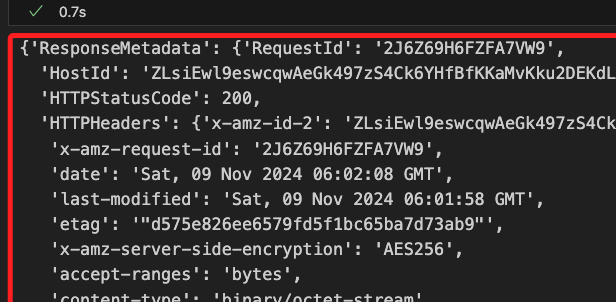
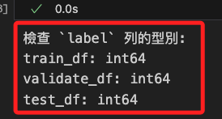
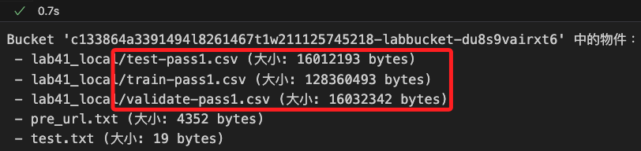
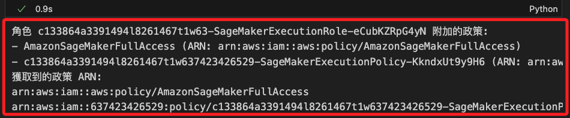
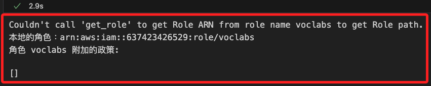
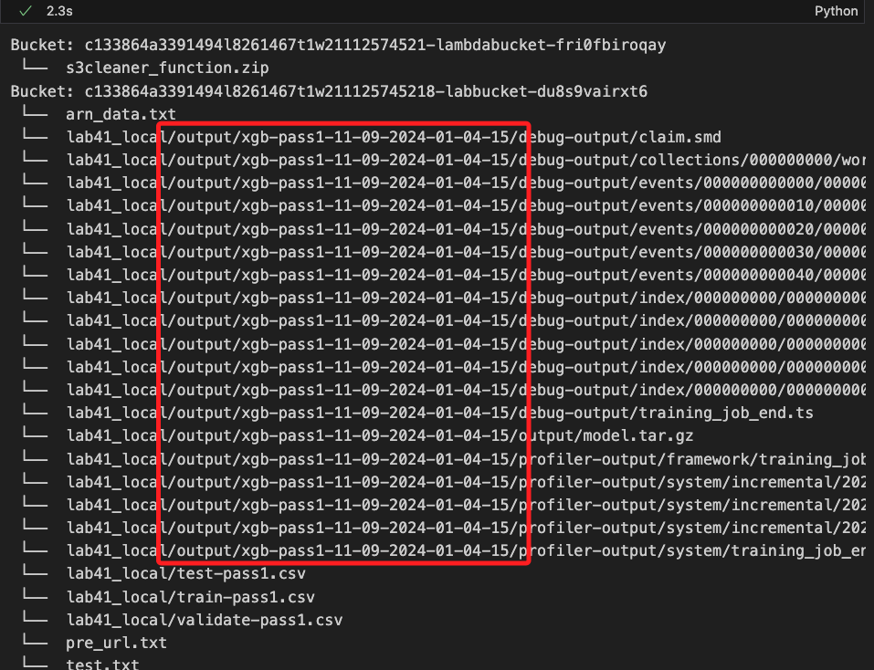
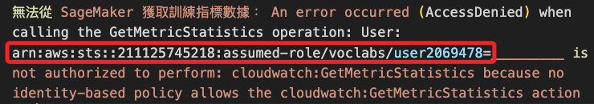
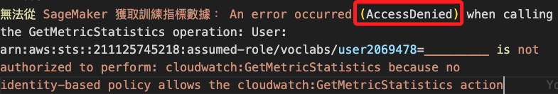
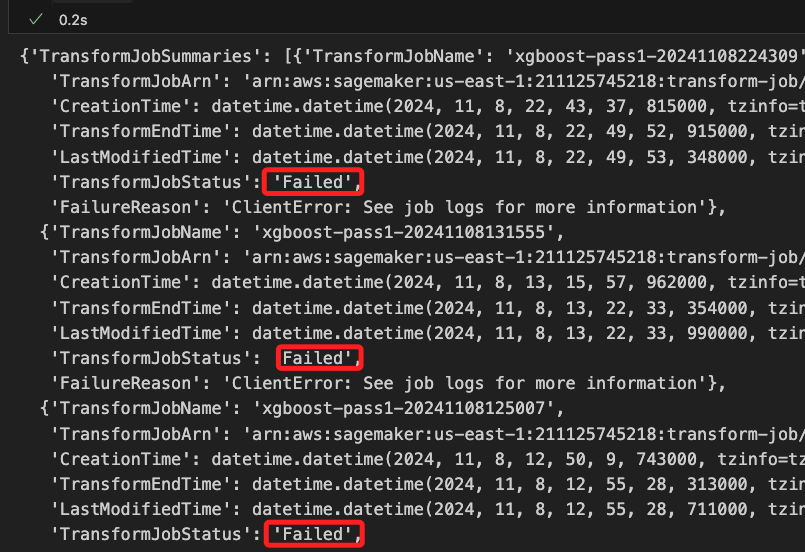
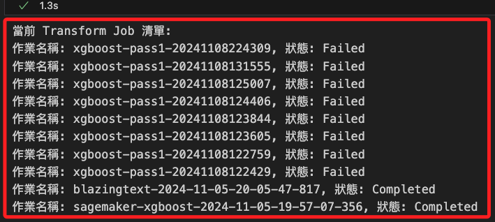

# Lab 4.1

<br>

## 運行第一次傳遞

_最低程度的處理_

<br>

1. 導入 `NLTK` 和 `re`。

    ```python
    import re
    from nltk.corpus import stopwords
    from nltk.stem import SnowballStemmer
    from nltk.tokenize import word_tokenize
    ```

<br>

2. 自訂義拆分資料集的函數，將資料集中 `80％` 數據用於訓練，另外用於驗證與測試的各佔 `10%`。

    ```python
    # train_test_split 用於資料集的分割
    from sklearn.model_selection import train_test_split

    def split_data(df):

        # 將資料集分割為訓練集、測試、驗證集
        train, test_and_validate = train_test_split(
            # 要分割的資料集
            df,
            # 這是 `測試+驗證` 的比例
            test_size=0.2,
            # 分割前是否隨機打亂資料
            shuffle=True,
            # 設定隨機種子，這可用於重現分割結果
            random_state=324
        )
        
        # 將 `測試集` 再分割為 `測試集` 和 `驗證集`
        test, validate = train_test_split(
            # 要分割的資料集
            test_and_validate,
            # 將集合分割兩部分各佔 `50%`，即測試和驗證各佔整體 `10%`
            test_size=0.5,
            shuffle=True,
            random_state=324
        )
        # 返回三個子集
        return train, validate, test
    ```

<br>

3. 調用自訂函數將數據拆分為三個資料子集 `train`、`validate`、`test`，並透過 `shape` 屬性查看拆分後的數據結構。

    ```python
    # 拆分
    train, validate, test = split_data(df)
    
    # 查看
    print(train.shape)
    print(test.shape)
    print(validate.shape)
    ```

    

<br>

4. 檢查欄位存在性；基於數據是經過轉換的，這裡做一次檢查確保資料無誤。

    ```python
    # 定義要檢查的欄位名稱
    required_columns = ['text', 'label']

    # 檢查每個資料集是否包含所需的欄位
    for name, dataset in zip(
        ['Train', 'Validate', 'Test'], 
        [train, validate, test]
    ):
        missing_columns = [
            col for col in required_columns if col not in dataset.columns
        ]
        
        if not missing_columns:
            print(f"{name} 資料集包含所有所需的欄位: {required_columns}")
        else:
            print(f"{name} 資料集缺少以下欄位: {missing_columns}")
    ```

    

<br>

## 關於魔術命令 `# %%time`

_以下步驟開始會使用到，在此先做個補充說明_

<br>

1. 在 `Jupyter Notebook` 中可透過該指令對該 cell 的執行進行計時，除可測量整個 cell 的執行時間，也會顯示 `CPU time` 處理器花費的時間，另外 `Wall time` 則是從 cell 開始執行到結束所經過的實際時間，包含所有的等待時間。

    ```python
    # %%time
    # 這裡是一些程式碼
    ```

<br>

2. 執行完此 cell 後，Jupyter Notebook 會顯示這段程式碼的執行時間。`# %%time` 只能用於 cell 的第一行，並且會計時整個 cell 的執行。如果只想計時單行程式碼，可以使用 `%time`。

<br>

## 組裝 `processing pipeline`

_`處理管道` 就是將數據處理步驟連接在一起的方式，使其可簡化數據流的管理和操作；其中包含多個處理步驟如數據清洗、轉換、特徵提取等，然後將其鏈接起來形成一個整體流程；以下對文本數據進行特徵提取和預處理，以便將其轉換為機器學習模型可以接受的格式。_

<br>

1. 導入必要庫。

    ```python
    # %%time
    # 導入文本特徵提取的 CountVectorizer
    from sklearn.feature_extraction.text import CountVectorizer
    # 導入 Pipeline，用於將多個處理步驟串聯
    from sklearn.pipeline import Pipeline
    # 導入 ColumnTransformer，用於選擇和轉換特定的列
    from sklearn.compose import ColumnTransformer
    ```

<br>

2. 建立管道。

    ```python
    # 定義文本特徵的名稱
    text_features = ['text']
    # 定義模型的目標變量名稱
    model_target = 'label'

    # 建立文本處理管道，包括 CountVectorizer 以提取文本特徵
    text_processor_0 = Pipeline([(
        'text_vect_0', 
        # 設置最大特徵數為 500
        CountVectorizer(max_features=500)
    )])
    ```

<br>

3. 建立預處理器。

    ```python
    # 定義數據預處理器，將文本處理管道應用於指定的文本特徵列
    data_preprocessor = ColumnTransformer([(
        'text_pre_0', 
        text_processor_0, 
        # 應用於 'text' 欄位
        text_features[0]
    )])
    ```

<br>

4. 輸出處理前的數據集形狀。

    ```python
    print(
        'Datasets shapes before processing: ', 
        train.shape, 
        validate.shape, 
        test.shape
    )
    ```

    

<br>

5. 進行數據轉換。

    ```python
    # 擬合並轉換訓練數據為數值矩陣
    train_matrix = data_preprocessor.fit_transform(train)
    # 對測試數據進行轉換
    test_matrix = data_preprocessor.transform(test)
    # 對驗證數據進行轉換
    validate_matrix = data_preprocessor.transform(validate)
    ```

<br>

6. 查看處理後的數據集形狀。

    ```python
    print(
        'Datasets shapes after processing: ', 
        train_matrix.shape, 
        validate_matrix.shape, 
        test_matrix.shape
    )
    ```

    

<br>

## 從 Sagemaker 寫入 S3

_這在雲端操作；因為訓練模型需要使用儲存在 S3 中 `CSV` 格式的數據集，所以在 Sagemaker 自訂函數處理相關工作，這是雲端對雲端的操作；這部分僅作說明不實作。_

<br>

1. 自訂寫入 S3 的函數。

    ```python
    # 初始化 S3 資源
    s3_resource = boto3.Session().resource('s3')

    # 定義上傳 CSV 文件的函數
    def upload_s3_csv(
        filename, folder, X_train, y_train, is_test=False
    ):
        # 建立一個 StringIO 對象，作為 CSV 的緩衝區
        csv_buffer = io.StringIO()
        
        # 將特徵矩陣轉換為 float32 類型，並展平為列表格式
        features = [
            t.toarray().astype('float32').flatten().tolist() 
            for t in X_train
        ]
        
        # 檢查是否為測試集
        if is_test:
            # 如果是測試集，直接使用特徵
            temp_list = features
        else:
            # 如果不是測試集，將標籤添加到特徵的第一列
            temp_list = np.insert(
                features, 0, y_train['label'], axis=1
            )
        
        # 將數據保存為 CSV 格式到緩衝區
        np.savetxt(csv_buffer, temp_list, delimiter=',')
        
        # 使用 S3 資源將 CSV 上傳至指定的 S3 Bucket 和文件路徑
        s3_resource.Bucket(bucket).Object(
            # 將文件路徑組合
            os.path.join(prefix, folder, filename)
        # 將 CSV 數據作為文件內容上傳
        ).put(Body=csv_buffer.getvalue())
    ```

<br>

2. 在官方範例中，對於上傳使用硬編碼指定了 Bucket，但這是會變動的，每次啟動 Lab 都會有新的值。

    ```python
    bucket = 'c133864a3391494l8261467t1w637423426529-labbucket-hcjcbnnncwhe'
    ```

<br>

3. 所以將前面步驟自動化步驟取得 Bucket 名稱 `bucket_name` 傳給 `bucket`；這在之前已經做過一次，但避免因為運行上一個代碼而覆蓋了資料；這裡可觀察輸出 `bucket` 的是否正確。

    ```python
    bucket = bucket_name
    bucket
    ```

<br>

4. 設置這次傳遞的文件名稱；特別注意，這是在 Lab 操作時所做的設置，在本地運行時將略作修改以便區分，這會在後續步驟進行。

    ```python
    prefix='lab41'
    train_file='train-pass1.csv'
    validate_file='validate-pass1.csv'
    test_file='test-pass1.csv'
    ```

<br>

5. 假如在雲端運行，可調用函數將數據上傳到 S3。

    ```python
    upload_s3_csv(train_file, 'train', train_matrix, train)
    upload_s3_csv(validate_file, 'validate', validate_matrix, validate)
    upload_s3_csv(test_file, 'test', test_matrix, test, True)
    ```

<br>

## 關於權限說明

_進行以下操作前，先説明 Lab 的權限規範_

<br>

1. 特別注意，Lab 所賦予的角色不具備直接寫入數據至 S3 的權限，要獲得寫入權限，必須透過 `SageMaker` 的 `get_execution_role` 函數來取得該角色的 ARN，並在 `SageMaker` 環境中運行該函數；若在本地環境執行將返回 Lab 角色的 ARN，而不是 SageMaker 的 ARN，這將限制本地環境對 S3 的存取權限。

<br>

2. 針對上述情況，接下來將使用 `Presigned URL` 來處理檔案上傳，此方法需透過在 `SageMaker` 環境中使用具有必要權限的 ARN 所生成的 `Presigned URL` 來完成上傳，這樣做可以在無法修改 IAM 設置且無法獲得 `PutObject` 權限的情況下，透過本地的 Jupyter Notebook 成功上傳檔案至 S3；這個變通的解決方案讓使用者能夠在有限的權限環境中進行檔案操作。

<br>

3. 這個生成的 `Presigned URL` 在特定時間內有效，可依據需求設定的有效期限為幾分鐘至幾小時。

<br>

## 建立預簽名 URL

_在雲端操作_

<br>

1. 在 Sagemaker 中建立新的 `.ipynb` 腳本，核心選擇 `conda_python3`。

    

<br>

2. 第一步先取得 `bucket` 名稱，這樣可使代碼具備自動化重用性。

    ```python
    import boto3

    # 初始化 S3 客戶端
    s3_client = boto3.client('s3')

    # 列出所有 S3 buckets 並篩選名稱包含 'labbucket' 的
    try:
        response = s3_client.list_buckets()
        # 只取出第一個名稱包含 'labbucket' 的 S3 bucket，若無則返回 None
        bucket_name = next((bucket['Name'] for bucket in response['Buckets'] if 'labbucket' in bucket['Name']), None)

        # 顯示結果
        if bucket_name:
            print("包含 'labbucket' 的 S3 Bucket：", bucket_name)
        else:
            print("找不到包含 'labbucket' 的 S3 Bucket。")
    except Exception as e:
        print(f"發生錯誤: {e}")

    # 配合官方範例，將命名為 `bucket`
    bucket = bucket_name
    bucket
    ```

    

<br>

3. 將前一個步驟取得的 bucket 名稱生成 `預簽名 URL`，另外 `key` 設置為文件名稱 `test.txt`，代表上傳後的文件將以該名稱存放在 Bucket 的根目錄中。

    ```python
    # 指定文件名稱
    s3_file_path = "test.txt"

    # 生成預簽名 URL，有效期設定為 1 小時
    presigned_url = s3_client.generate_presigned_url(
        'put_object',
        Params={
            'Bucket': bucket_name, 
            'Key': s3_file_path
        },
        # 設置 URL 有效期（秒）
        ExpiresIn=3600
    )

    print("預簽名 URL:", presigned_url)
    ```

    

<br>

4. 將 `預簽名 URL` 寫入文件 `pre_url.txt`。

    ```python
    with open("pre_url.txt", "w") as file:
        file.write(presigned_url)

    print("已生成預簽名 URL 並儲存至 pre_url.txt 文件。")
    ```

    

<br>

5. 將 `pre_url.txt` 儲存至 S3 Bucket，這是為了要讓本地進行讀取或下載。

    ```python
    with open("pre_url.txt", "rb") as file_data:
        s3_client.upload_fileobj(
            file_data, 
            bucket_name, 
            "pre_url.txt"
        )

    print("已成功將 pre_url.txt 上傳至 S3。")
    ```

    

<br>

6. 進入 Bucket 中確認文件已經寫入。

    

<br>

## 突破限制寫入 S3

_回到本地操作，先進行一個簡單的測試，確認可繞過在當前限制寫入 S3_

<br>

1. 設定路徑參數；在本地運行的部分對參數略作修改，檔名不變，`prefix` 部分添加尾綴作為識別 `lab41_local`。

    ```python
    prefix='lab41_local'
    train_file='train-pass1.csv'
    validate_file='validate-pass1.csv'
    test_file='test-pass1.csv'
    ```

<br>

2. 調用之前建立的函數 `list_s3_structure()` 查詢。

    ```python
    list_s3_structure(bucket_name)
    ```

    `

<br>

3. 取得 S3 的 `Presigned URL`。

    ```python
    import requests

    pre_url_file_key = 'pre_url.txt'

    # 取得 S3 中指定文件物件
    response = s3_client.get_object(
        Bucket=bucket_name, 
        Key=pre_url_file_key
    )
    # 讀出內容並儲存為變數 presigned_url
    presigned_url = response['Body'].read().decode('utf-8')

    # 輸出查看
    print(presigned_url)
    ```

    

<br>

4. 在當前路徑中建立 `test.txt` 文件，並將字串 `測試預簽名 URL` 寫入其中。

    ```python
    with open("test.txt", "w", encoding="utf-8") as file:
        file.write("測試預簽名 URL")

    print("文件 test.txt 已成功創建並寫入內容。")
    ```

    

<br>

5. 使用 `requests` 庫，通過 `Presigned URL` 將文件上傳至 S3。

    ```python
    # 本地文件路徑
    local_file_path = "test.txt"

    # 使用預簽名 URL 上傳文件
    with open(local_file_path, 'rb') as file_data:
        response = requests.put(
            presigned_url,
            data=file_data
        )

    # 確認上傳結果
    if response.status_code == 200:
        print("文件成功上傳至 S3")
    else:
        print("上傳失敗，狀態碼：", response.status_code)
        print("錯誤內容：", upload_response.text)
    ```

    

<br>

6. 進入 S3 查看是否確實寫入，確認完成代表以上程序是正確的。

    

<br>

7. 建立一個新的函數，查詢當前 S3 中完整的樹狀結構；與之前指定 Bucket 不同，這是查詢整個 S3 的結構。

    ```python
    def list_s3_bucket_structure(bucket_name):
        s3 = boto3.resource('s3')
        bucket = s3.Bucket(bucket_name)
        print(f"Bucket: {bucket_name}")
        
        has_objects = False
        for obj in bucket.objects.all():
            print(" └── ", obj.key)
            has_objects = True

        if not has_objects:
            print(" └── <此 bucket 為空>")


    buckets = s3_client.list_buckets()["Buckets"]

    if buckets:
        for bucket in buckets:
            list_s3_bucket_structure(bucket["Name"])
    else:
        print("當前為空的：沒有任何 S3 bucket")
    ```

    

<br>

## 再次建立預簽名 URL

_回到雲端；確認以上步驟可完成文件的寫入，以下正式建立 `預簽名 URL` 來寫入數據集。_

<br>

1. 建立四個預簽名 URL 並寫入到 Bucket 文件中。 

    ```python
    import os

    # 定義 Bucket 名稱和路徑
    prefix = 'lab41_local'
    train_file = 'train-pass1.csv'
    validate_file = 'validate-pass1.csv'
    test_file = 'test-pass1.csv'
    batch_in_file = 'batch-in.csv'

    def create_presigned_url(bucket, prefix, filename):
        # 生成預簽名 URL，有效期設定為 1 小時
        presigned_url = s3_client.generate_presigned_url(
            'put_object',
            Params={
                'Bucket': bucket, 
                'Key': os.path.join(prefix, filename)
            },
            # 設置 URL 有效期（秒）
            ExpiresIn=3600  
        )
        return presigned_url

    # 創建預簽名 URL
    urls = {
        'train_file': create_presigned_url(
            bucket_name, prefix, train_file
        ),
        'validate_file': create_presigned_url(
            bucket_name, prefix, validate_file
        ),
        'test_file': create_presigned_url(
            bucket_name, prefix, test_file
        ),
        'batch_in_file': create_presigned_url(
            bucket_name, prefix, batch_in_file
        )
    }

    # 將預簽名 URL 寫入到 pre_url.txt
    s3_client.put_object(
        Bucket=bucket_name,
        Key='pre_url.txt',
        # 將 URL 轉換為字串格式
        Body=str(urls)  
    )

    print("預簽名 URL 已成功寫入到 pre_url.txt")
    ```

    

<br>

## 回到本地電腦 

1. 讀取 S3 中的 `pre_url.txt` 並取其中的 `預簽名 URL`；解析前的完整 JSON 格式內容如下。

    ```python
    response = s3_client.get_object(
        Bucket=bucket_name, 
        Key=pre_url_file_key
    )
    response
    ```

    

<br>

2. 解析其中的 `預簽名網址`；可讀出四個鍵值對。

    ```python
    presigned_urls = eval(response['Body'].read().decode('utf-8'))
    presigned_urls
    ```

    

<br>

3. 檢查當前數據集的 `label` 欄位所在索引位置；為了確保模型訓練時可識別到正確的標籤，在下一個步驟中，會將 `label` 移到索引為 `0` 的第一個欄位。

    ```python
    print("訓練集 label 欄位置:", list(train.columns).index('label'))
    print("驗證集 label 欄位置:", list(validate.columns).index('label'))
    print("測試集 label 欄位置:", list(test.columns).index('label'))
    ```

    

<br>

## 處理並上傳數據

_特別注意，預簽名中的 `batch_in_file` 至此尚未用到_

<br>

1. 向量處理，將原始文本數據轉化為可供機器學習模型使用的結構化數據。

    ```python
    # 引入 TfidfVectorizer 進行文本向量化
    from sklearn.feature_extraction.text import TfidfVectorizer
    # io 庫來處理輸入輸出
    import io

    # 設置 TF-IDF 向量化器，並設定最大特徵數目為 500
    vectorizer = TfidfVectorizer(max_features=500)

    # 將訓練數據進行向量化，轉換文本數據為特徵矩陣
    train_matrix = vectorizer.fit_transform(train['text'])

    # 使用相同的向量化器將驗證數據進行轉換
    validate_matrix = vectorizer.transform(validate['text'])

    # 將測試數據進行轉換，使用與訓練相同的特徵
    test_matrix = vectorizer.transform(test['text'])

    # 將訓練數據的特徵矩陣轉換為 DataFrame，欄位名稱為 TF-IDF 特徵詞語
    train_df = pd.DataFrame(
        # 將矩陣轉換為數組格式以構建 DataFrame
        train_matrix.toarray(),
        # 使用向量化器獲得的特徵名稱作為欄位名稱
        columns=vectorizer.get_feature_names_out()
    )

    # 將標籤欄添加到訓練數據的 DataFrame 中，標籤用於表示文本的分類
    train_df['label'] = train['label'].values

    # 將驗證數據的特徵矩陣轉換為 DataFrame，並附加標籤欄
    validate_df = pd.DataFrame(
        # 將驗證數據轉換為數組格式以構建 DataFrame
        validate_matrix.toarray(),
        # 使用向量化器獲得的特徵名稱作為欄位名稱
        columns=vectorizer.get_feature_names_out()
    )
    # 添加驗證數據的標籤欄
    validate_df['label'] = validate['label'].values

    # 將測試數據的特徵矩陣轉換為 DataFrame，並附加標籤欄
    test_df = pd.DataFrame(
        # 將測試數據轉換為數組格式以構建 DataFrame
        test_matrix.toarray(),
        # 使用向量化器獲得的特徵名稱作為欄位名稱
        columns=vectorizer.get_feature_names_out()
    )
    # 添加測試數據的標籤欄
    test_df['label'] = test['label'].values
    ```

<br>

2. 轉型並調整數據順序。

    ```python
    # 確認標籤欄為整數類型
    train_df['label'] = train_df['label'].astype(int)
    validate_df['label'] = validate_df['label'].astype(int)
    test_df['label'] = test_df['label'].astype(int)

    # 將 label 列移動到第一欄
    train_df = train_df[
        ['label'] + [col for col in train_df.columns if col != 'label']
    ]
    validate_df = validate_df[
        ['label'] + [col for col in validate_df.columns if col != 'label']
    ]
    test_df = test_df[
        ['label'] + [col for col in test_df.columns if col != 'label']
    ]
    ```

<br>

3. 自訂上傳函數，使用 `預簽名 URL` 上傳文件；約略需要一分鐘。

    ```python
    # 自訂函數
    def save_csv_to_url(dataframe, url):
        # 將 DataFrame 儲存為 CSV 格式
        csv_buffer = io.StringIO()
        dataframe.to_csv(csv_buffer, index=False)

        # 使用預簽名 URL 上傳 CSV 文件
        response = requests.put(url, data=csv_buffer.getvalue())
        
        if response.status_code == 200:
            print(f"文件成功上傳至 S3：{url}")
        else:
            print(
                f"上傳失敗，狀態碼：{response.status_code}, 錯誤內容：{response.text}"
            )

    # 上傳數據集
    save_csv_to_url(train_df, presigned_urls['train_file'])
    save_csv_to_url(validate_df, presigned_urls['validate_file'])
    save_csv_to_url(test_df, presigned_urls['test_file'])
    ```

    

<br>

4. 再次確認 `label` 在每個 DataFrame 中的位置，可發現已經從索引 `1` 移動到索引 `0`；這在數句清洗階段是重要的步驟，尤其在不確定框架規範的情況下，將標籤放在索引 `0` 可與通用格式兼容，減少數據格式錯誤的機率。

    ```python
    print("訓練集 label 欄位置:", list(train_df.columns).index('label'))
    print("驗證集 label 欄位置:", list(validate_df.columns).index('label'))
    print("測試集 label 欄位置:", list(test_df.columns).index('label'))
    ```

    

<br>

5. 檢查三個數據集中 label 的型別。

    ```python
    print("檢查 `label` 列的型別：")
    print("train_df：", train_df['label'].dtype)
    print("validate_df：", validate_df['label'].dtype)
    print("test_df：", test_df['label'].dtype)
    ```

    

<br>

6. 自訂函數檢查上傳數據的資料型別及缺失值，同時顯示敘述統計資訊來觀察頻率分佈。

    ```python
    def check_dataframe_info(dataframe, name):
        print(f"檢查數據框 {name} 的資訊：")
        # 檢查資料型別和記憶體使用情況
        print(dataframe.info())
        print("\n數據範例：")
        # 查看前五行數據
        print(dataframe.head())
        print("\n描述統計：")
        # 檢查數值列的描述統計
        print(dataframe.describe())
        print("\n缺失值統計：")
        # 檢查各列缺失值數量
        print(dataframe.isnull().sum())
        print("\n" + "="*50 + "\n")

    # 檢查每個數據框
    check_dataframe_info(train_df, "train_df")
    check_dataframe_info(validate_df, "validate_df")
    check_dataframe_info(test_df, "test_df")
    ```

    

<br>

## 查看 S3 現況

1. 再次透過代碼查詢 S3 中的物件，這次會看到上傳的數據集，並顯示各物件的容量大小。

    ```python
    # 查詢 bucket 中的物件
    response = s3_client.list_objects_v2(Bucket=bucket_name)

    # 檢查 bucket 是否有內容
    if 'Contents' in response:
        print(f"Bucket '{bucket_name}' 中的物件：")
        for obj in response['Contents']:
            print(f" - {obj['Key']} (大小: {obj['Size']} bytes)")
    else:
        print(f"Bucket '{bucket_name}' 為空或不存在任何物件。")
    ```

    

<br>

2. 進入 S3 查看這個子資料夾 `lab41_local`，確實已將三個數據集上傳。

    

<br>

## 訓練之前

_進入雲端環境；因為在接下來的步驟中需要調用 `get_execution_role()`，所以必須在 Sagemaker 中運行。_

<br>

1. 取得 ARN 並寫入 S3 Bucket 文件 `arn_data.txt`，這是用於在本地讀取用的。

    ```python
    import sagemaker

    # 初始化 SageMaker 和 STS 客戶端
    sagemaker_session = sagemaker.Session()
    sts_client = boto3.client('sts')

    # 獲取當前帳戶的角色 ARN
    role_arn = sagemaker.get_execution_role()

    # 輸出角色 ARN
    print("SageMaker Notebook 中的角色 ARN:", role_arn)

    # 將角色 ARN 寫入到 S3 中的文件
    bucket_name = bucket
    s3_file_key = 'arn_data.txt'

    # 上傳 ARN 到 S3
    s3_client = boto3.client('s3')
    s3_client.put_object(
        Bucket=bucket_name,
        Key=s3_file_key,
        Body=role_arn
    )

    print(
        f"角色 ARN 已寫入到 S3 中的 {bucket_name}/{s3_file_key}"
    )
    ```

    

<br>

2. 完成後，在 Bucket 中可看到 `arn_data.txt`，這便是儲存了 ARN 資訊的文件。

    

<br>

## 回到本地電腦

1. 在本地讀取 S3 中的 `arn_data.txt` 文件，並將內容寫入變數 `arn` 中。

    ```python
    s3_file_key = 'arn_data.txt'

    # 讀取 S3 中的 arn_data.txt 文件
    response = s3_client.get_object(
        Bucket=bucket_name, Key=s3_file_key
    )

    # 將文件內容讀取到變數 arn 中
    role_arn = response['Body'].read().decode('utf-8')

    # 輸出獲取的 ARN
    print("讀取的角色 ARN:", role_arn)
    ```

    

<br>

2. 查看角色的附加政策。

    ```python
    from botocore.exceptions import ClientError

    def list_role_policies(role_arn):
        # 獲取角色名稱
        role_name = role_arn.split('/')[-1]
        iam_client = boto3.client('iam')

        try:
            # 獲取角色的附加政策
            policies = iam_client.list_attached_role_policies(RoleName=role_name)
            print(f"角色 {role_name} 附加的政策:")
            
            # 儲存政策 ARN 的列表
            policy_arns = []
            
            for policy in policies['AttachedPolicies']:
                print(
                    f"- {policy['PolicyName']} (ARN: {policy['PolicyArn']})"
                )
                # 將政策 ARN 儲存到列表中
                policy_arns.append(policy['PolicyArn'])
            
            # 返回政策 ARN 列表
            return policy_arns

        except ClientError as e:
            print(f"獲取角色政策時出現錯誤: {e}")
            return None

    # 調用函數並獲取政策 ARN
    policy_arns = list_role_policies(role_arn)

    # 輸出政策 ARN
    if policy_arns:
        print("獲取到的政策 ARN:")
        for arn in policy_arns:
            print(arn)
    ```

    

<br>

3. 將內容存入 JSON 文件中便於觀察；其中第一個政策允許所有 SageMaker 操作、允許所有 SageMaker Geospatial 操作、涵蓋了多種 S3 操作包括讀取和寫入、允許將角色傳遞給 AWS 服務；不過第一個政策並沒有明確列出對 Amazon Comprehend 或 Textract 的權限。

    ```python
    import json

    policy_arn = policy_arns[0]
    policy = iam_client.get_policy(PolicyArn=policy_arn)
    policy_version = iam_client.get_policy_version(
        PolicyArn=policy_arn,
        VersionId=policy['Policy']['DefaultVersionId']
    )

    # 取得 policy 文件內容
    policy_document = policy_version['PolicyVersion']['Document']

    # 將 policy 文件內容保存到 policy_1.json
    with open('policy_1.json', 'w') as file:
        json.dump(policy_document, file, indent=4)

    print(policy_document)
    ```

<br>

4. 第二個政策允許所有 Amazon Comprehend 操作、允許 S3 讀取操作、允許獲取角色和傳遞角色的權限，另外也對 Amazon Comprehend 和 Textract 直接授權。

    ```python
    policy_arn = policy_arns[1]
    policy = iam_client.get_policy(PolicyArn=policy_arn)
    policy_version = iam_client.get_policy_version(
        PolicyArn=policy_arn,
        VersionId=policy['Policy']['DefaultVersionId']
    )

    # 取得 policy 文件內容
    policy_document = policy_version['PolicyVersion']['Document']

    # 將 policy 文件內容保存到 policy_1.json
    with open('policy_2.json', 'w') as file:
        json.dump(policy_document, file, indent=4)

    print(policy_version['PolicyVersion']['Document'])
    ```

<br>

5. 觀察本地角色，這是透過 AWS CLI 所分配的，並不具備相關權限，與 SageMaker 為 Lab 環境所配置的 role 並不相同。

    ```python
    role_arn_local = sagemaker.get_execution_role()
    print(f'本地的角色：{role_arn_local}')
    list_role_policies(role_arn_local)
    ```

    

<br>

## 準備訓練

1. 安裝 `libomp`，在本地運行機器學習相關專案時，這個庫會在需要多線程並行計算的情況下被自動調用，例如使用 `XGBoost`、`Scikit-Learn` 或是 `TensorFlow` 等套件時。

    ```bash
    brew install libomp
    ```

<br>

2. `libomp` 是一個系統級的庫，可透過以下指令查看安裝狀況。

    ```bash
    brew info libomp
    ```

    

<br>

3. 安裝套件 `xgboost`。

    ```bash
    pip install xgboost
    ```

<br>

4. 驗證安裝。

    ```python
    import xgboost as xgb

    # 輸出 XGBoost 的版本
    print(xgb.__version__)
    ```

    

<br>

## 觀察 libomp 運作

_先略過_

<br>

## 建立模型估計器 `Estimator` 

_在 Lab 中使用了 XGBoost，這是梯度提升 `Gradient Boosting` 演算法的實現，用於各類機器學習和數據科學任務，尤其適合於結構化或標籤數據。_

<br>

1. 導入庫。 

    ```python
    from sagemaker.image_uris import retrieve
    import xgboost as xgb
    ```

<br>

2. 建立估計器所需一般參數；首先設定容器，並將容器版本改為 `1.2-2`。

    ```python
    container = retrieve(
        'xgboost',
        boto3.Session().region_name, 
        # '1.0-1'
        '1.2-2'
    )
    ```

<br>

3. 設置 S3 輸出路徑，特別注意，這個輸出目錄無需設置預簽名 URL。 

    ```python
    s3_output_location = f's3://{bucket_name}/{prefix}/output/'
    s3_output_location
    ```

    

<br>

4. 建立估計器的超參數，對於官方範例進行了一些修正；主要是移除 `silent` 參數，因為從 `XGBoost 1.0` 版本起，`silent` 參數已被移除，並由 `verbosity` 參數取代，這是用於設置日誌輸出級別，若使用 `silent` 會導致 `KeyError`；另外，改變評估指標，將 `eval_metric` 改為 `logloss`，這部分僅僅是測試，之後可改回來。

    ```python
    hyperparams = {
        "num_round": "42",
        "eval_metric": "logloss",
        #"eval_metric": "error",
        "objective": "binary:logistic",
        # "silent": 1,
        # 0: silent, 1: warning, 2: info, 3: debug
        "verbosity": 1,
        # 設定隨機種子
        "seed": 42
    }
    ```

<br>

5. 建立估計器。

    ```python
    xgb_model = sagemaker.estimator.Estimator(
        container,
        role=role_arn,
        instance_count=1,
        instance_type='ml.m5.2xlarge',
        output_path=s3_output_location,
        hyperparameters=hyperparams,
        sagemaker_session=sagemaker.Session()
    )
    ```

<br>

## 建立數據輸入管道

_先確認文件可訪問，然後建立管道_

<br>

1. 檢查文件確實可訪問。

    ```python
    from botocore.exceptions import ClientError

    def check_s3_file_exists(bucket_name, key):
        s3_client = boto3.client('s3')
        try:
            s3_client.head_object(Bucket=bucket_name, Key=key)
            return True
        except ClientError as e:
            if e.response['Error']['Code'] == '404':
                print(f"文件不存在: s3://{bucket_name}/{key}")
                return False
            else:
                print(f"無法訪問文件: s3://{bucket_name}/{key}, 錯誤: {e}")
                return False

    # 設定 S3 存儲桶和路徑
    prefix = 'lab41_local'
    train_file = 'train-pass1.csv'
    validate_file = 'validate-pass1.csv'

    # 檢查訓練和驗證文件
    train_key = f"{prefix}/{train_file}"
    validate_key = f"{prefix}/{validate_file}"

    print("檢查 S3 文件...")
    train_exists = check_s3_file_exists(bucket_name, train_key)
    validate_exists = check_s3_file_exists(bucket_name, validate_key)

    # 結果
    if train_exists:
        print(f"訓練文件可訪問: s3://{bucket_name}/{train_key}")
    if validate_exists:
        print(f"驗證文件可訪問: s3://{bucket_name}/{validate_key}")
    ```

    

<br>

2. 設定輸入管道 `data_channels`，也就是提供給模型數據的路徑，包含兩個數據管道，分別是 `訓練資料` 與 `驗證資料`；官方範例分別將兩個數據文件放入 `train` 及 `validate` 之中，這裡暫時先放在 `prefix` 根目錄中，註解部分就是官方範例原始設定。

    ```python
    train_channel = sagemaker.inputs.TrainingInput(
        # f's3://{bucket}/{prefix}/train/{train_file}',
        f's3://{bucket_name}/{prefix}/{train_file}',
        content_type='text/csv'
    )

    validate_channel = sagemaker.inputs.TrainingInput(
        # f's3://{bucket}/{prefix}/validate/{validate_file}',
        f's3://{bucket_name}/{prefix}/{validate_file}',
        content_type='text/csv'
    )
    # 組合為參數
    data_channels = {
        'train': train_channel, 
        'validation': validate_channel
    }
    ```

<br>

## 訓練模型

1. 建立工作名稱。

    ```python
    training_job_name = 'xgb-pass1-'+datetime.now().strftime("%m-%d-%Y-%H-%M-%S")
    training_job_name
    ```

    

<br>

2. 調用 `fit` 進行模型調適，這個步驟約略需要三分鐘。

    ```python
    xgb_model.fit(
        inputs=data_channels, 
        logs=False, 
        job_name=training_job_name
    )
    ```

    

<br>

3. 在這有個地方值得注意，雖然並未建立 `Output` 的預簽名 URL，但在 `fit` 的時候，寫入 S3 並無權限問題，這應該是設置了 `role_arn` 參數的關係，具體如何取得權限尚不可知。

    

<br>

4. 點擊進入，可看到以 `job_name` 命名的子目錄。

    

<br>

5. 查詢訓練後的 S3 結構，可看到訓練模型相關輸出位置都在 `job_name` 下的 `debug-output`、`output`、`profiler-output` 中；其中，`debug-output` 存放模型訓練過程中的調試信息，`profiler-output` 記錄系統性能的分析數據；特別注意，`output` 存放的是模型訓練的最終結果文件，也就是生成的模型 `model.tar.gz` 壓縮檔。

    ```python
    buckets = s3_client.list_buckets()["Buckets"]

    if buckets:
        for bucket in buckets:
            list_s3_bucket_structure(bucket["Name"])
    else:
        print("當前為空的：沒有任何 S3 bucket")
    ```

    

<br>

## 查詢任務指標

_監控模型的訓練過程，尤其是衡量模型的訓練和驗證效果，透過這些數據可繪製訓練過程中的指標變化圖，進一步分析模型隨著時間訓練的效果，並進行相應的超參數調整或其他優化操作。_

1. 確認當前的訓練工作名稱，這就是 `training_job_name` 變數的值。

    ```python
    xgb_model._current_job_name, training_job_name
    ```

    

<br>

2. 檢查是否具備 `cloudwatch:GetMetricStatistics` 權限；特別注意，這裡是檢查 `role_arn` 的權限，也就是 Sagemaker 角色權限，並非 Lab 角色權限。

    ```python
    # 要檢查的操作權限
    actions = ['cloudwatch:GetMetricStatistics']  

    # 建立 IAM 客戶端
    iam_client = boto3.client('iam')

    # 模擬角色權限
    response = iam_client.simulate_principal_policy(
        PolicySourceArn=role_arn,
        ActionNames=actions
    )

    # 分析回應結果
    for result in response['EvaluationResults']:
        action_name = result['EvalActionName']
        decision = result['EvalDecision']
        print(f"操作 '{action_name}' 的權限決策: {decision}")

        # 顯示詳細的拒絕原因
        if decision == 'explicitDeny':
            print("拒絕原因：", result['MatchedStatements'])
    ```

    

<br>

3. 查詢本地角色權限。

    ```python
    # 定義要檢查的操作權限
    _actions = [
        'cloudwatch:GetMetricStatistics',
        'cloudwatch:ListMetrics',
    ]

    # 獲取角色 ARN
    _role = role_arn_local

    # 模擬角色權限
    try:
        response = iam_client.simulate_principal_policy(
            PolicySourceArn=_role,
            ActionNames=_actions
        )

        # 分析回應結果
        for result in response['EvaluationResults']:
            action_name = result['EvalActionName']
            decision = result['EvalDecision']
            print(f"\n操作 '{action_name}' 的權限決策: {decision}")

            # 顯示拒絕原因和條款
            if decision == 'explicitDeny':
                print("拒絕原因條款：", result['MatchedStatements'])
            elif decision == 'allowed':
                print(f"'{action_name}' 被允許執行。")
            else:
                print(f"'{action_name}' 的權限決策未知或未設定明確拒絕。")

    except iam_client.exceptions.NoSuchEntityException:
        print("角色 ARN 無效，請確認角色名稱或帳號 ID。")
    except Exception as e:
        print(f"發生錯誤：{e}")
    ```

    

<br>

4. 替換其中的 Role 為 Sagemaker 的 role，就會得到與前面步驟相同的 `allowed` 結果。

    ```python
    _role = role_arn
    ```

    

<br>

## 嘗試使用 Lambda

_尚未實作；SageMaker SDK 並不直接支持在 TrainingJobAnalytics 中傳入 role 參數來繞過本地權限檢查，可嘗試使用 Lambda 或 API Gateway，將 TrainingJobAnalytics 查詢動作移到 Lambda 函數中，並通過 API 請求獲取結果。這樣可以利用 Lambda 函數的 IAM 角色來查詢訓練任務的指標數據。_

<br>

## 使用預簽名處理權限問題

_尚未實作；嘗試以預簽名方式取得 `Cloudwatch` 資訊提供本地_

<br>

## 任務指標

_尚無法解決，先跳過_

<br>

1. 顯示來自目前任務的指標。

    ```python
    import sagemaker
    from sagemaker.analytics import TrainingJobAnalytics

    try:
        analytics = TrainingJobAnalytics(
            xgb_model._current_job_name,
            metric_names=['train:error', 'validation:error']
        )
        df = analytics.dataframe()
        print(df)
    except Exception as e:
        print("無法從 SageMaker 獲取訓練指標數據：", e)
    ```

    

<br>

## 使用 test 資料集

_計算指標，這裡分別說明在雲端及本地的操作_

<br>

1. 在雲端，可透過雲端自訂函數將數據傳送至 S3。

    ```python
    upload_s3_csv('batch-in.csv', 'batch-in', test_matrix, test, True)
    ```

<br>

2. 在本地，使用以下代碼將數據集上傳到 S3，特別注意預簽名 URL 的時效；先使用向量化器 `vectorizer` 處理測試數據集，這個向量化器是在之前步驟中經建立的，這裡直接調用，最大特徵數設定為 `500`。

    ```python
    # 向量化測試數據
    test_matrix = vectorizer.fit_transform(test['text'])

    # 將向量化的測試數據轉換為 DataFrame
    batch_in_df = pd.DataFrame(
        # 轉換為陣列
        test_matrix.toarray(), 
        columns=vectorizer.get_feature_names_out()
    )

    # 將標籤欄附加至 DataFrame
    batch_in_df['label'] = test['label'].values

    # 確保標籤欄在第一欄位置
    batch_in_df = \
        batch_in_df[['label'] + [col for col in batch_in_df.columns \
        if col != 'label']]

    # 上傳函數：使用預簽名 URL 覆蓋上傳文件
    def save_csv_to_url(dataframe, url):
        # 將 DataFrame 儲存為 CSV 格式
        csv_buffer = io.StringIO()
        # 移除標題行
        dataframe.to_csv(
            csv_buffer, 
            index=False, 
            header=False
        )
        response = requests.put(
            url, 
            data=csv_buffer.getvalue()
        )
        
        if response.status_code == 200:
            print(f"文件成功上傳至 S3：{url}")
        else:
            print(
                f"上傳失敗，狀態碼：{response.status_code}, "
                f"錯誤內容：{response.text}"
            )

    # 上傳 `batch-in.csv` 文件
    save_csv_to_url(batch_in_df, presigned_urls['batch_in_file'])
    ```

    

<br>

3. 接下來要設定路徑參數，設定前先確認路徑變數內容正確。

    ```python
    bucket = bucket_name
    bucket, prefix
    ```

    

<br>

4. 設定路徑參數。

    ```python
    # 設定輸入
    batch_X_file='batch-in.csv'
    # 這是官方範例的設置，路徑帶有子資料夾
    # batch_input = f's3://{bucket}/{prefix}/batch-in/{batch_X_file}'
    # 這裡要使用這個路徑
    batch_input = f's3://{bucket}/{prefix}/{batch_X_file}'
    # 設定輸出
    batch_output = f's3://{bucket}/{prefix}/batch-out/'
    ```

<br>

## 進行轉換工作

_建立 `Transformer Job`；因為權限問題對於官方範例略作修改，避免調用日誌 API 進行檢查作業，這樣不會嘗試訪問 `logs:DescribeLogStreams` 權限，從而避免 `AccessDeniedException` 錯誤。_

<br>

1. 建立轉換器。

    ```python
    from sagemaker import Session
    import time

    # 在名稱中加上時間戳以確保使用 `唯一識別名稱`
    unique_job_name = \
        f"xgboost-pass1-{datetime.now().strftime('%Y%m%d%H%M%S')}"
    
    # 初始化轉換器
    xgb_transformer = xgb_model.transformer(
        # 設置執行轉換的實例數量為 1
        instance_count=1,           
        # 指定實例類型 ml.m5.2xlarge，適合處理大型數據
        instance_type='ml.m5.2xlarge',  
        # 設置為 MultiRecord 策略，允許在批次處理時合併多條記錄
        strategy='MultiRecord',     
        # 設定輸出文件中記錄使用 Line，將每條記錄按行存放
        assemble_with='Line',       
        # 指定輸出結果的 S3 路徑
        output_path=batch_output,
        # 指定角色
        role=role_arn
    )
    ```

    

<br>

2. 將模型名稱記錄下來。

    ```python
    model_name = xgb_transformer.model_name
    ```

<br>

3. 執行轉換任務。

    ```python
    xgb_transformer.transform(
        # 指定輸入數據的 S3 路徑
        data=batch_input,           
        # 指定數據類型為 S3Prefix，即以 S3 存儲路徑為前綴
        data_type='S3Prefix',       
        # 設定數據格式為 CSV 格式
        content_type='text/csv',    
        # 設定數據分割方式為 Line，即按行分割處理
        split_type='Line',          
        # 使用唯一的轉換任務名稱
        job_name=unique_job_name,
        # 不等待作業完成
        wait=False
    )
    ```

    

<br>

4. 等待轉換任務；這在進行中會在 `while` 迴圈中持續輸出直到狀態不再是 `InProgress`，換句話說，當失敗 `Failed` 的時候也是會結束回圈；相當耗時，約略七八分鐘，每 `30` 秒會檢查一次狀態。

    ```python
    # 建立 SageMaker Session
    session = Session()
    # 指定狀態
    status = 'InProgress'
    # 輸出訊息
    print(f"開始監控轉換作業狀態，作業名稱：{unique_job_name}")
    
    # 等待轉換任務完成，並完全避免日誌查詢
    while status == 'InProgress':
        response = session.sagemaker_client.describe_transform_job(TransformJobName=unique_job_name)
        status = response['TransformJobStatus']
        print(f"作業狀態: {status}")
        # 每 30 秒檢查一次狀態
        time.sleep(30)

    print(f"轉換任務最終狀態: {status}")
    ```

    

<br>

5. 最後 Job 失敗了。

    

<br>

6. 可查詢指定狀態的 Job，只需在 `list_transform_jobs` 方法中添加 `StatusEquals` 參數即可。

    ```python
    # 指定狀態
    _status = 'Failed'
    # 取得回應
    response = sagemaker_client.list_transform_jobs(
        StatusEquals=_status
    )
    ```

    

<br>

7. 確認當前的轉換工作的名稱。

    ```python
    unique_job_name
    ```

<br>

8. 檢查指定轉換工作的狀態。

    ```python
    def check_transform_job_status(job_name):
        try:
            # 使用 describe_transform_job 查詢指定名稱的 Transform Job 狀態
            response = sagemaker_client.describe_transform_job(
                TransformJobName=job_name
            )
            
            # 提取所需的資訊
            job_status = response['TransformJobStatus']
            failure_reason = response.get('FailureReason', 'N/A')
            
            print(f"作業名稱: {job_name}")
            print(f"狀態: {job_status}")
            if job_status == 'Failed':
                print(f"失敗原因: {failure_reason}")
        
        except sagemaker_client.exceptions.ResourceNotFoundException:
            print(f"未找到 Transform Job '{job_name}'。請檢查名稱是否正確。")

    # 使用指定的唯一名稱查詢作業狀態
    check_transform_job_status(unique_job_name)
    ```

    

<br>

9. 列出當前全部轉換工作；特別注意，AWS 有資源配額限制，在 `ml.m5.2xlarge` 類型的 `transform job` 實例數量限制為 `2` 個，假如 `InProgress` 已經達到限額也是出錯的。

    ```python
    # 列出當前的 Transform Jobs
    response = sagemaker_client.list_transform_jobs()

    # 顯示每個 Transform Job 的名稱及其狀態
    print("當前 Transform Job 清單:")
    for job in response['TransformJobSummaries']:
        job_name = job['TransformJobName']
        job_status = job['TransformJobStatus']
        print(f"作業名稱: {job_name}, 狀態: {job_status}")
    ```

    

<br>

## 關於超過限額

1. 若錯誤訊息顯示 `ResourceLimitExceeded` 代表超過限額，略作等待再執行。

    

<br>

2. 超過限額時，也可以調整 `instance_type` 參數，使用較小規格的實例通常限額較高。

    ```python
    xgb_transformer = xgb_model.transformer(
        instance_count=1,           
        # 使用較小規格的實例
        instance_type='ml.m5.xlarge',
        strategy='MultiRecord',     
        assemble_with='Line',       
        output_path=batch_output,
        role=role_arn
    )
    ```

<br>

## 繼續檢查錯誤 I

1. 查看作業的詳細資訊，使用 `describe_transform_job` 方法來取得資訊。

    ```python
    # 可使用當前 Job，或是手動輸入前一項的輸出來查看指定 Job
    failed_job_name = unique_job_name
    failed_job_details = sagemaker_client.describe_transform_job(
        TransformJobName=failed_job_name
    )
    print(
        "失敗原因:", 
        failed_job_details.get('FailureReason', '未提供失敗原因')
    )
    ```

    

<br>

## 繼續檢查錯誤 II

1. 查詢 `training_job_name`。

    ```python
    training_job_name
    ```

<br>

2. 重新組合 `file_key`。 

    ```python
    gz_file_name = 'model.tar.gz'
    file_key = f'{prefix}/output/{training_job_name}/output/{gz_file_name}'
    ```

<br>

3. 以本次失敗為例，失敗原因顯示 `NoSuchBucket`，表示在轉換作業中無法下載指定的模型數據文件，也就是指定的 S3 Bucket 不存在；以上做了修正。

    ```python
    import boto3
    from botocore.exceptions import NoCredentialsError, ClientError

    # 設定 S3 客戶端
    s3_client = boto3.client('s3')

    # 指定 bucket 名稱和 key
    # file_key = 'lab41_local/output/xgb-pass1-11-08-2024-16-21-08/output/model.tar.gz'

    def check_s3_object(bucket, key):
        try:
            # 嘗試檢查指定的 S3 物件是否存在
            s3_client.head_object(Bucket=bucket, Key=key)
            print(f"Bucket '{bucket}' 中的文件 '{key}' 存在。")
        except ClientError as e:
            # 如果文件不存在或發生權限錯誤，會拋出 ClientError
            if e.response['Error']['Code'] == '404':
                print(f"文件 '{key}' 在 Bucket '{bucket}' 中不存在 (404)。")
            elif e.response['Error']['Code'] == '403':
                print(f"無權訪問 Bucket '{bucket}' 或文件 '{key}' (403)。")
            else:
                print(f"無法檢查文件 '{key}'：{e}")
        except NoCredentialsError:
            print("找不到 AWS 憑證，請確認憑證設定。")

    # 執行檢查
    check_s3_object(bucket_name, file_key)
    ```

    _結果顯示存在_

    

<br>

4. 將此文件下載到本地。

    ```python
    import boto3

    # 設定 S3 客戶端
    s3_client = boto3.client('s3')

    # 本地儲存路徑
    local_path = 'model.tar.gz'

    # 下載文件
    s3_client.download_file(bucket_name, file_key, local_path)
    print("文件下載完成，儲存在本地:", local_path)
    ```

    

<br>

## 回到官方範例繼續

4. S3。

```python
s3 = boto3.client('s3')
obj = s3.get_object(
    Bucket=bucket, 
    Key=f'{prefix}/batch-in.csv.out'
)
target_predicted = pd.read_csv(
    io.BytesIO(obj['Body'].read()),sep=',',
    names=['class']
)

def binary_convert(x):
    threshold = 0.5
    if x > threshold:
        return 1
    else:
        return 0

target_predicted_binary = target_predicted['class'].apply(binary_convert)
```

<br>

5. 之後說明。

```python
plot_confusion_matrix(test['label'], target_predicted_binary)
```

<br>

6. 之後說明。

```python
print_metrics(test['label'], target_predicted_binary)
```

<br>

## 第二次传递：标准化文本

1. 可删除所有非索引字，但可能想保留可能影响情绪的非索引字，例如 __not__ 或 __don't__。


```python
# Get a list of stopwords from the NLTK library
stop = stopwords.words('english')

def remove_stopwords(stopwords):
    # Implement this function
    excluding = ['against', 'not', 'don', 'don\'t','ain', 'are', 'aren\'t']
    ### BEGIN_SOLUTION
    excluding = ['against', 'not', 'don', 'don\'t','ain', 'are', 'aren\'t', 'could', 'couldn\'t',
             'did', 'didn\'t', 'does', 'doesn\'t', 'had', 'hadn\'t', 'has', 'hasn\'t', 
             'have', 'haven\'t', 'is', 'isn\'t', 'might', 'mightn\'t', 'must', 'mustn\'t',
             'need', 'needn\'t','should', 'shouldn\'t', 'was', 'wasn\'t', 'were', 
             'weren\'t', 'won\'t', 'would', 'wouldn\'t']
    ### END_SOLUTION
    return [word for word in stop if word not in excluding]

# New stopword list
stopwords = remove_stopwords(stop)

```

## 添加清理步骤

1. 更新以下 `clean` 函数，以完成删除前导空格和尾随空格、删除任何 HTML 标记。

```python
snow = SnowballStemmer('english')
def clean(sent):
    # Implement this function
    sent = sent.lower()
    sent = re.sub('\s+', ' ', sent)
    ### BEGIN_SOLUTION
    sent = sent.strip()
    sent = re.compile('<.*?>').sub('',sent)
    ### END_SOLUTION
    filtered_sentence = []
    
    for w in word_tokenize(sent):
        # You are applying custom filtering here. Feel free to try different things.
        # Check if it is not numeric, its length > 2, and it is not in stopwords
        if(not w.isnumeric()) and (len(w)>2) and (w not in stopwords):  
            # Stem and add to filtered list
            filtered_sentence.append(snow.stem(w))
    final_string = " ".join(filtered_sentence) #final string of cleaned words
    return final_string
```

2. 使用之前创建的函数创建新的测试、验证和测试 DataFrame。

```python
# Uncomment the next line and implement the function call to split_data
#train, validate, test = 

### BEGIN_SOLUTION
train, validate, test = split_data(df)
### END_SOLUTION

print(train.shape)
print(test.shape)
print(validate.shape)
```

3. 管道已更新，以包含对之前定义的来自 `CountVectorizer`的 `clean`函数的调用。此函数需要更长的运行时间。


```python
from sklearn.feature_extraction.text import CountVectorizer
from sklearn.pipeline import Pipeline
from sklearn.compose import ColumnTransformer

text_features = ['text']
model_target = 'label'

text_processor_0 = Pipeline([
    ('text_vect_0', CountVectorizer(preprocessor=clean, max_features=500))
])

data_preprocessor = ColumnTransformer([
    ('text_pre_0', text_processor_0, text_features[0])
])

print('Datasets shapes before processing: ', train.shape, validate.shape, test.shape)
train_matrix = data_preprocessor.fit_transform(train)
test_matrix = data_preprocessor.transform(test)
validate_matrix = data_preprocessor.transform(validate)
print('Datasets shapes after processing: ', train_matrix.shape, validate_matrix.shape, test_matrix.shape)
```

4. 设置此传递的文件名。


```python
prefix='lab41'
train_file='train_pass2.csv'
validate_file='validate_pass2.csv'
test_file='test_pass2.csv'
```

## 将文件上载到 S3

1. 使用之前的代码将新文件上载到 Amazon S3。

```python
upload_s3_csv(train_file, 'train', train_matrix, train)
upload_s3_csv(validate_file, 'validate', validate_matrix, validate)
upload_s3_csv(test_file, 'test', test_matrix, test, True)
```

## 创建估算器并设置数据通道

1. 使用之前的代码设置估算器和数据通道。

```python
container = retrieve('xgboost',boto3.Session().region_name,'1.0-1')

hyperparams={
    "num_round":"42",
    "eval_metric": "error",
    "objective": "binary:logistic",
    "silent" : 1
}

xgb_model=sagemaker.estimator.Estimator(
    container,
    sagemaker.get_execution_role(),
    instance_count=1,
    instance_type='ml.m5.2xlarge',
    output_path=s3_output_location,
    hyperparameters = hyperparams,
    sagemaker_session=sagemaker.Session()
)

train_channel = sagemaker.inputs.TrainingInput(
    f's3://{bucket}/{prefix}/train/{train_file}',
    content_type='text/csv'
)

validate_channel = sagemaker.inputs.TrainingInput(
    f's3://{bucket}/{prefix}/validate/{validate_file}',
    content_type='text/csv'
)

data_channels = {
    'train': train_channel, 
    'validation': validate_channel
}

xgb_model.fit(
    inputs=data_channels, 
    logs=False, 
    job_name='xgb-pass2-'+datetime.now()\
        .strftime("%m-%d-%Y-%H-%M-%S")
)
```

2. 後補。

```python
sagemaker.analytics.TrainingJobAnalytics(
    xgb_model._current_job_name, 
    metric_names = ['train:error','validation:error']
).dataframe()
```

## 创建批处理转换器任务

1. 使用之前的代码创建一个转换器任务。

```python
xgb_transformer = xgb_model.transformer(
    instance_count=1,
    instance_type='ml.m5.2xlarge',
    strategy='MultiRecord',
    assemble_with='Line',
    output_path=batch_output
)

xgb_transformer.transform(
    data=batch_input,
    data_type='S3Prefix',
    content_type='text/csv',
    split_type='Line')

xgb_transformer.wait(logs=False)
```

2. 後補。

```python
s3 = boto3.client('s3')
obj = s3.get_object(
    Bucket=bucket, 
    Key="{}/batch-out/{}".\
        format(prefix,'batch-in.csv.out')
)
target_predicted = pd.read_csv(
    io.BytesIO(obj['Body'].read()),
    sep=',',
    names=['class']
)

def binary_convert(x):
    threshold = 0.5
    if x > threshold:
        return 1
    else:
        return 0

target_predicted_binary = target_predicted['class'].apply(binary_convert)
```

3. 後補。

```python
plot_confusion_matrix(test['label'], target_predicted_binary)
```

4. 後補。

```python
print_metrics(test['label'], target_predicted_binary)
```

5. 将创建一个超参数优化任务来优化模型。

## 创建估算器用于优化

1. 第一步是创建一个估算器用于优化。取消注释并完成以下估算器代码。

```python
# xgb = sagemaker.estimator.Estimator(....)
xgb = sagemaker.estimator.Estimator(
    container,
    role=sagemaker.get_execution_role(), 
    # make sure you have limit set for these instances
    instance_count= 1,
    instance_type='ml.m5.2xlarge', 
    output_path=f's3://{bucket}/{prefix}/output',
    sagemaker_session=sagemaker.Session()
)
```

2. 後補。

```python
xgb.set_hyperparameters(
    eval_metric='error',
    objective='binary:logistic',
    num_round=42,
    silent=1
)
```

## 创建超参数范围

1. 使用 [XGBoost 优化文档](https://docs.aws.amazon.com/sagemaker/latest/dg/xgboost-tuning.html)，将超参数范围添加到以下单元格中。


```python
from sagemaker.tuner import IntegerParameter, CategoricalParameter, ContinuousParameter, HyperparameterTuner

hyperparameter_ranges = {'alpha': ContinuousParameter(0,1000)}

hyperparameter_ranges = {
    'alpha': ContinuousParameter(0, 1000),
    'min_child_weight': ContinuousParameter(0, 120),
    'subsample': ContinuousParameter(0.5, 1),
    'eta': ContinuousParameter(0.1, 0.5),  
    'num_round': IntegerParameter(1,4000)
}
```

## 指定目标指标

1. 针对二元分类问题将 `objective_metric_name`和 `objective_type`更新为适当的值。

```python
objective_metric_name = '<INSERT_VALUE_HERE>'
objective_type = '<INSERT_VALUE_HERE>'

### BEGIN_SOLUTION
objective_metric_name = 'validation:error'
objective_type = 'Minimize'
### END_SOLUTION
```

2. 创建超参数优化任务。

```python
tuner = HyperparameterTuner(
    xgb,
    objective_metric_name,
    hyperparameter_ranges,
    # Set this to 10 or above depending upon budget & available time.
    max_jobs=10,
    max_parallel_jobs=1,
    objective_type=objective_type,
    early_stopping_type='Auto',
)
```

3. 运行优化任务。请注意，此任务可能需要大约 60 分钟的时间。

```python
tuner.fit(
    inputs=data_channels, 
    include_cls_metadata=False, 
    wait=False
)
```

4. 如果想在等待期间尝试第 7 节，请不要运行下一个单元格，而是转到第 7 节。

```python
tuner.wait()
```

5. 优化任务完成后，您可以查看来自优化任务的指标。

```python
from pprint import pprint
from sagemaker.analytics import HyperparameterTuningJobAnalytics

tuner_analytics = HyperparameterTuningJobAnalytics(
    tuner.latest_tuning_job.name,
    sagemaker_session=sagemaker.Session()
)

df_tuning_job_analytics = tuner_analytics.dataframe()

# Sort the tuning job analytics by the final metrics value
df_tuning_job_analytics.sort_values(
    by=['FinalObjectiveValue'],
    inplace=True,
    ascending=False if tuner.objective_type == "Maximize" else True
)

# Show detailed analytics for the top 20 models
df_tuning_job_analytics.head(20)
```
## 使用最佳超参数任务

1. 优化任务完成后，您可以从 實作HyperparameterTuner實作 对象中找到最佳优化任务。

```python
attached_tuner = HyperparameterTuner.attach(tuner.latest_tuning_job.name, sagemaker_session=sagemaker.Session())
best_training_job = attached_tuner.best_training_job()
```

2. 後補。

```python
from sagemaker.estimator import Estimator
algo_estimator = Estimator.attach(best_training_job)

best_algo_model = algo_estimator.create_model(
    env={'SAGEMAKER_DEFAULT_INVOCATIONS_ACCEPT':"text/csv"}
)
```

3. 通过数据处理管道运行测试数据，以测试模型。

```python
from sklearn.feature_extraction.text import CountVectorizer
from sklearn.pipeline import Pipeline
from sklearn.compose import ColumnTransformer

text_features = ['text']
model_target = 'label'

text_processor_0 = Pipeline([(
    'text_vect_0', 
    CountVectorizer(
        preprocessor=clean, max_features=500
    )
)])

data_preprocessor = ColumnTransformer([(
    'text_pre_0', 
    text_processor_0, 
    text_features[0]
)])

print('Datasets shapes before processing: ', train.shape, validate.shape, test.shape)
train_matrix = data_preprocessor.fit_transform(train)
test_matrix = data_preprocessor.transform(test)
validate_matrix = data_preprocessor.transform(validate)
print(
    'Datasets shapes after processing: ', 
    train_matrix.shape, 
    validate_matrix.shape, 
    test_matrix.shape
)
```

4. 使用来自超参数优化任务的最佳算法，以使用批处理转换的测试数据。

```python
upload_s3_csv('batch-in.csv', 'batch-in', test_matrix, test, True)

batch_output = f's3://{bucket}/{prefix}/batch-out/'
batch_input = f's3://{bucket}/{prefix}/batch-in/{batch_X_file}'

xgb_transformer = best_algo_model.transformer(
    instance_count=1,
    instance_type='ml.m5.2xlarge',
    strategy='MultiRecord',
    assemble_with='Line',
    output_path=batch_output
)
xgb_transformer.transform(
    data=batch_input,
    data_type='S3Prefix',
    content_type='text/csv',
    split_type='Line'
)
xgb_transformer.wait(logs=False)
```

5. 处理结果以计算类。

```python
s3 = boto3.client('s3')
obj = s3.get_object(
    Bucket=bucket, 
    Key=f'{prefix}/batch-out/batch-in.csv.out'
)
target_predicted = pd.read_csv(
    io.BytesIO(obj['Body'].read()),
    sep=',',
    names=['class']
)

def binary_convert(x):
    threshold = 0.5
    if x > threshold:
        return 1
    else:
        return 0

target_predicted_binary = target_predicted['class'].apply(binary_convert)

```

6. 绘制混淆矩阵并打印指标。

```python
plot_confusion_matrix(test['label'], target_predicted_binary)
```

7. 後補。

```python
print_metrics(test['label'], target_predicted_binary)
```

## 使用 BlazingText

_将使用 BlazingText，这是一种内置的 Amazon SageMaker 算法。BlazingText 可以在不做修改的情况下执行分类。将为 BlazingText 重新格式化数据。然后，将使用数据训练算法并将结果与之前的模型进行比较。_


1. 首先，获取算法容器。


```python
import sagemaker
from sagemaker.image_uris import retrieve

container = retrieve(
    'blazingtext',
    boto3.Session().region_name,"latest"
)
```

2. 为训练、验证和测试数据配置前缀。

```python
import io
    
prefix='lab41'
train_file='blazing_train.txt'
validate_file='blazing_validate.txt'
test_file='blazing_test.txt'
```

3. 提醒自己数据是什么样的。

```python
train.head()
```


4. BlazingText 需要采用以下格式的数据：

```bash
`__label__1` Caught this movie on the tube on a Sunday...
```

5. 以下两个单元格将 DataFrame 转换为正确的格式，然后将它们上载到 Amazon S3。

```python
blazing_text_buffer = io.StringIO()
train.to_string(buf=blazing_text_buffer, columns=['label','text'], header=False, index=False, formatters=
                         {'label': '__label__{}'.format})
s3r = boto3.resource('s3')
s3r.Bucket(bucket).Object(os.path.join(prefix, 'blazing', train_file)).put(Body=blazing_text_buffer.getvalue())
```

6. 後補。

```python
blazing_text_buffer = io.StringIO()
validate.to_string(
    buf=blazing_text_buffer, 
    columns=['label','text'], 
    header=False, 
    index=False, 
    formatters={'label': '__label__{}'.format}
)
s3r.Bucket(bucket).Object(
    os.path.join(prefix, 'blazing', validate_file)
).put(
    Body=blazing_text_buffer.getvalue()
)
```

## BlazingText 估算器

1. 通过指定缺失值来取消注释并完成估算器代码。

```python
bt_model = sagemaker.estimator.Estimator(
    container,
    sagemaker.get_execution_role(), 
    instance_count=1, 
    instance_type='ml.c4.4xlarge',
    volume_size = 30,
    max_run = 360000,
    input_mode= 'File',
    output_path=s3_output_location,
    sagemaker_session=sagemaker.Session()
)

```

2. 使用以下超参数。

```python
bt_model.set_hyperparameters(
    mode="supervised",
    epochs=10,
    min_count=2,
    learning_rate=0.05,
    vector_dim=10,
    early_stopping=True,
    patience=4,
    min_epochs=5,
    word_ngrams=2
)
```

3. 设置训练通道和验证通道。

```python
train_channel = sagemaker.inputs.TrainingInput(
    f's3://{bucket}/{prefix}/blazing/{train_file}',
    content_type='text/csv')

validate_channel = sagemaker.inputs.TrainingInput(
    f's3://{bucket}/{prefix}/blazing/{validate_file}',
    content_type='text/csv')

data_channels_3 = {
    'train': train_channel, 
    'validation': validate_channel
}
```

## 开始训练任务

1. 输入以下代码开始训练任务。（这个步骤可能需要花几分钟的时间。）

```python
bt_model.fit(inputs=data_channels_3, logs=False)
```

2. 训练任务完成后，请查看训练指标。

```python
sagemaker.analytics.TrainingJobAnalytics(
    bt_model._current_job_name, 
    metric_names = ['train:accuracy','validation:accuracy']
).dataframe()
```

3.  後補。

```python
pd.options.display.max_rows
pd.set_option('display.max_colwidth', None)
```

4. 後補。


```python
bt_test = test.copy()
bt_test.head()
```

5. 将数据集格式化为 BlazingText 所需的格式。

```python
# bt_test['text'].str.strip()
bt_test.replace(r'\\n','', regex=True, inplace = True)
bt_test.rename(columns={'text':'source'}, inplace=True)
bt_test.drop(columns='label', inplace=True)
```

6. 後補。

```python
print(bt_test.head().to_json(orient="records", lines=True))
```

7. 将文件上载到 Amazon S3。

```python
bt_file = 'bt_input.json'
blazing_text_buffer = io.StringIO()
bt_test.to_json(path_or_buf=blazing_text_buffer, orient="records", lines=True)
```

8. 後補。

```python
s3r.Bucket(bucket).Object(os.path.join(prefix, 'blazing', bt_file)).put(Body=blazing_text_buffer.getvalue())

```

9. 後補。


```python
batch_output = f's3://{bucket}/{prefix}/blazing/'
batch_input = f's3://{bucket}/{prefix}/blazing/{bt_file}'
```

10. 对测试数据使用批处理转换器。

```python
bt_transformer = bt_model.transformer(
    instance_count=1,
    instance_type='ml.m5.2xlarge',
   strategy='MultiRecord',
   assemble_with='Line',
   output_path=batch_output
)

bt_transformer.transform(
    data=batch_input,
    data_type='S3Prefix',
    content_type='application/jsonlines',
    split_type='Line'
)

bt_transformer.wait(logs=True)
```

11. 检索来自 Amazon S3 的结果。

```python
obj = s3.get_object(
    Bucket=bucket, 
    Key=f'{prefix}/blazing/bt_input.json.out'
)
```

12. 後補。

```python
target_predicted = pd.read_json(
    io.BytesIO(obj['Body'].read()),
    lines=True
)
```

13. 後補。

```python
target_predicted.head()
```

14. 重新格式化结果，以便计算混淆矩阵和指标。

```python
def binary_convert(label):
    label = label[0].replace('__label__','')
    return int(label)

target_predicted_binary = target_predicted['label'].apply(binary_convert)
```

15. 後補。

```python
plot_confusion_matrix(test['label'], target_predicted_binary)
```

16. 後補。

```python
print_metrics(test['label'], target_predicted_binary)
```

## 使用Comprehend


在本节中，您将使用 Amazon Comprehend 来计算情绪。Amazon Comprehend 为您提供了正面和负面的结果，还显示了中立和喜忧参半的结果。Amazon Comprehend 是一项托管的服务，在使用它之前需要较少的文本处理。您无需处理本节中的任何文本。

查看  `test` DataFrame 中的数据是什么样的。


```python
test.head()
```

Amazon Comprehend 的使用可以像 API 调用一样简单直接。

以下单元格输出了来自 Amazon Comprehend 的前五个结果。


```python
import boto3
import json

comprehend = boto3.client(service_name='comprehend')
for n in range(5):
    text = test.iloc[n]['text']
    response = comprehend.detect_sentiment(Text=text, LanguageCode='en')
    sentiment = response['Sentiment']
    print(f'{sentiment} - {text}')

```

您可以启动预测任务来处理多个项目。必须将输入格式化为每行的单个输入，然后上载到 Amazon S3。文本的最大大小为 5120，因此 `str.slice(0,5000)`函数用于修剪长文本。


```python
# Upload test file minus label to S3
def upload_comprehend_s3_csv(filename, folder, dataframe):
    csv_buffer = io.StringIO()
    
    dataframe.to_csv(csv_buffer, header=False, index=False )
    s3_resource.Bucket(bucket).Object(os.path.join(prefix, folder, filename)).put(Body=csv_buffer.getvalue())

comprehend_file = 'comprehend_input.csv'
upload_comprehend_s3_csv(comprehend_file, 'comprehend', test['text'].str.slice(0,5000))
test_url = f's3://{bucket}/{prefix}/comprehend/{comprehend_file}'
print(f'Uploaded input to {test_url}')
```

数据上载到 Amazon S3 后，您可以使用 `start_sentiment_detection_jon`函数开始任务。


### 挑战：配置 Amazon Comprehend 任务参数

在下一个单元格中，配置 Amazon Comprehend 任务参数。
– 在__input_data_config__中 - 
  –實作S3Uri實作：将 *`<S3_INPUT_GOES_HERE> `* 替换为之前定义的 `test_uri`
  –實作InputFormat實作：将 *`<INPUT_FORMAT_GOES_HERE> `* 替换为 `ONE_DOC_PER_LINE`
– 在__output_data config__ 中-  
  –實作S3Uri實作：将 *`<S3_OUTPUT_GOES_HERE> `* 替换为 `s3_output_location`
  –實作data_access_role_arn實作：将 *`arn:aws:iam::637423426529:role/service-role/c133864a3391494l8261467t1w-ComprehendDataAccessRole-qUxYBBIu9EvW `* 替换为*Lab详细信息*文件中的 Amazon Resource Name (ARN)


```python
input_data_config={
    'S3Uri': 'S3_INPUT_GOES_HERE',
    'InputFormat': 'INPUT_FORMAT_GOES_HERE'
},

output_data_config={
    'S3Uri': 'S3_OUTPUT_GOES_HERE'
},
data_access_role_arn = 'arn:aws:iam::637423426529:role/service-role/c133864a3391494l8261467t1w-ComprehendDataAccessRole-qUxYBBIu9EvW'

### BEGIN_SOLUTION
input_data_config={
    'S3Uri': test_url,
    'InputFormat': 'ONE_DOC_PER_LINE'
}
output_data_config={
    'S3Uri': s3_output_location
}
data_access_role_arn = 'arn:aws:iam::637423426529:role/service-role/c133864a3391494l8261467t1w-ComprehendDataAccessRole-qUxYBBIu9EvW'
### END_SOLUTION
```

现在，您已定义了任务参数，可以开始情绪检测任务。


```python
response = comprehend.start_sentiment_detection_job(
    InputDataConfig=input_data_config,
    OutputDataConfig=output_data_config,
    DataAccessRoleArn=data_access_role_arn,
    JobName='movie_sentiment',
    LanguageCode='en'
)

print(response['JobStatus'])
```

以下单元格将循环进行，直到任务结束。（这个步骤可能需要花几分钟的时间。）


```python
import time
job_id = response['JobId']
while True:
    job_status=(comprehend.describe_sentiment_detection_job(JobId=job_id))
    if job_status['SentimentDetectionJobProperties']['JobStatus'] in ['COMPLETED','FAILED']:
        break            
    else:
        print('.', end='')
    time.sleep(15)
print((comprehend.describe_sentiment_detection_job(JobId=job_id))['SentimentDetectionJobProperties']['JobStatus'])
```

任务完成后，您可以通过调用 `describe_sentiment_detection_job`函数返回任务的详细信息。


```python
output=(comprehend.describe_sentiment_detection_job(JobId=job_id))
print(output)
```

在 實作OutputDataConfig實作 部分，您应该会看到 `S3Uri`。提取该 URI 将为您提供必须从 Amazon S3 下载的文件。您可以使用结果来计算指标，方式与使用算法计算批处理转换结果的方式相同。


```python
comprehend_output_file = output['SentimentDetectionJobProperties']['OutputDataConfig']['S3Uri']
comprehend_bucket, comprehend_key = comprehend_output_file.replace("s3://", "").split("/", 1)

s3r = boto3.resource('s3')
s3r.meta.client.download_file(comprehend_bucket, comprehend_key, 'output.tar.gz')

# Extract the tar file
import tarfile
tf = tarfile.open('output.tar.gz')
tf.extractall()
```

应将提取的文件命名为 __output__。阅读此文件中的行。


```python
import json
data = ''
with open ('output', "r") as myfile:
    data = myfile.readlines()
```

将这些行添加到数组中。


```python
results = []
for line in data:
    json_data = json.loads(line)
    results.append([json_data['Line'],json_data['Sentiment']])
```

将数组转换为 Pandas DataFrame。


```python
c = pd.DataFrame.from_records(results, index='index', columns=['index','sentiment'])
c.head()
```

结果包含 實作NEGATIVE實作（负面）、實作POSITIVE實作（正面）、實作NEUTRAL實作（中立）和 實作MIXED實作（喜忧参半），而不是数值。要将这些结果与测试数据进行比较，可将它们映射到数值，如以下单元格所示。返回结果中的索引也是无序的。 `sort_index`函数应解决这个问题。


```python
class_mapper = {'NEGATIVE':0, 'POSITIVE':1, 'NEUTRAL':2, 'MIXED':3}
c['sentiment']=c['sentiment'].replace(class_mapper)
c = c.sort_index()
c.head()
```


```python
# Build list to compare for Amazon Comprehend
test_2 = test.reset_index()
test_3 = test_2.sort_index()
test_labels = test_3.iloc[:,2]
```

您可以使用 `plot_confusion_matrix`函数显示混淆矩阵。由于 Amazon Comprehend 的结果还包含__mixed__ 和 __neutral__，因此图表会有所不同。


```python
plot_confusion_matrix(test_labels, c['sentiment'])
```

用于打印指标的现有函数无法正常工作，因为您的数据维度太多。以下代码单元格将计算相同的值。


```python
cm = confusion_matrix(test_labels, c['sentiment'])

TN = cm[0,0]
FP = cm[0,1]
FN = cm[1,0]
TP = cm[1,1]

Sensitivity  = float(TP)/(TP+FN)*100
# Specificity or true negative rate
Specificity  = float(TN)/(TN+FP)*100
# Precision or positive predictive value
Precision = float(TP)/(TP+FP)*100
# Negative predictive value
NPV = float(TN)/(TN+FN)*100
# Fall out or false positive rate
FPR = float(FP)/(FP+TN)*100
# False negative rate
FNR = float(FN)/(TP+FN)*100
# False discovery rate
FDR = float(FP)/(TP+FP)*100
# Overall accuracy
ACC = float(TP+TN)/(TP+FP+FN+TN)*100

print(f"Sensitivity or TPR: {Sensitivity}%")    
print(f"Specificity or TNR: {Specificity}%") 
print(f"Precision: {Precision}%")   
print(f"Negative Predictive Value: {NPV}%")  
print( f"False Positive Rate: {FPR}%") 
print(f"False Negative Rate: {FNR}%")  
print(f"False Discovery Rate: {FDR}%" )
print(f"Accuracy: {ACC}%") 
```

# 恭喜！

您已经完成了本Lab内容，现在可以按照Lab指南中的说明结束本Lab内容。

*©2023 Amazon Web Services, Inc. 或其联属公司。保留所有权利。未经 Amazon Web Services, Inc. 事先书面许可，不得复制或转载本文的部分或全部内容。禁止因商业目的复制、出借或出售本文。所有商标均为各自所有者的财产。*

