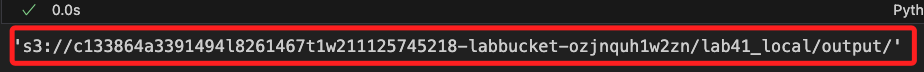
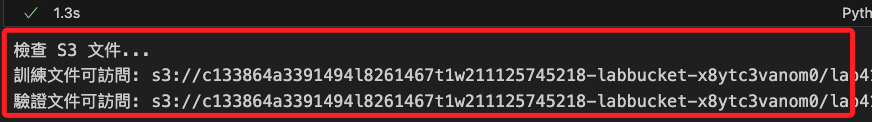
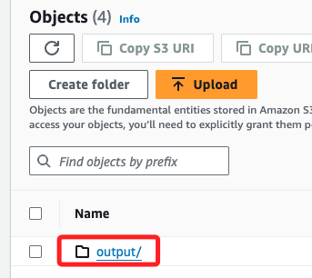
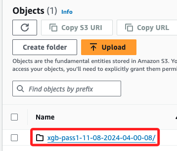

# Lab 4.1

_建立模型並開始訓練_

<br>

## 優化訓練環境

1. 安裝 `libomp`，在本地運行機器學習相關專案時，這個庫會在需要多線程並行計算的情況下被自動調用，例如使用 `XGBoost`、`Scikit-Learn` 或是 `TensorFlow` 等套件時。

    ```bash
    brew install libomp
    ```

<br>

2. `libomp` 是一個系統級的庫，可透過以下指令查看安裝狀況。

    ```bash
    brew info libomp
    ```

    

<br>

3. 安裝套件 `xgboost`。

    ```bash
    pip install xgboost
    ```

<br>

4. 驗證安裝。

    ```python
    import xgboost as xgb

    # 輸出 XGBoost 的版本
    print(xgb.__version__)
    ```

    

<br>

## 觀察 libomp 運作

_先略過_

<br>

## 建立模型估計器 `Estimator` 

_在 Lab 中使用了 XGBoost，這是梯度提升 `Gradient Boosting` 演算法的實現，用於各類機器學習和數據科學任務，尤其適合於結構化或標籤數據。_

<br>

1. 導入庫。 

    ```python
    from sagemaker.image_uris import retrieve
    import xgboost as xgb
    ```

<br>

2. 建立估計器所需一般參數；首先設定容器，並將容器版本改為 `1.2-2`。

    ```python
    container = retrieve(
        'xgboost',
        boto3.Session().region_name, 
        # '1.0-1'
        '1.2-2'
    )
    ```

<br>

3. 設置 S3 輸出路徑，特別注意，這個輸出目錄無需設置預簽名 URL。 

    ```python
    s3_output_location = f's3://{bucket_name}/{prefix}/output/'
    s3_output_location
    ```

    

<br>

4. 建立估計器的超參數，對於官方範例進行了一些修正；主要是移除 `silent` 參數，因為從 `XGBoost 1.0` 版本起，`silent` 參數已被移除，並由 `verbosity` 參數取代，這是用於設置日誌輸出級別，若使用 `silent` 會導致 `KeyError`；另外，改變評估指標，將 `eval_metric` 改為 `logloss`，這部分僅僅是測試，之後可改回來。

    ```python
    hyperparams = {
        "num_round": "42",
        "eval_metric": "logloss",
        #"eval_metric": "error",
        "objective": "binary:logistic",
        # "silent": 1,
        # 0: silent, 1: warning, 2: info, 3: debug
        "verbosity": 1,
        # 設定隨機種子
        "seed": 42
    }
    ```

<br>

5. 建立估計器。

    ```python
    from sagemaker import Session
    from sagemaker.estimator import Estimator

    sagemaker_session = Session()

    xgb_model = Estimator(
        container,
        role=role_arn,
        instance_count=1,
        instance_type='ml.m5.2xlarge',
        output_path=s3_output_location,
        hyperparameters=hyperparams,
        sagemaker_session=sagemaker_session
    )
    ```

<br>

## 建立數據輸入管道

_先確認文件可訪問，然後建立管道_

<br>

1. 檢查文件確實可訪問。

    ```python
    from botocore.exceptions import ClientError

    def check_s3_file_exists(bucket_name, key):
        s3_client = boto3.client('s3')
        try:
            s3_client.head_object(Bucket=bucket_name, Key=key)
            return True
        except ClientError as e:
            if e.response['Error']['Code'] == '404':
                print(f"文件不存在: s3://{bucket_name}/{key}")
                return False
            else:
                print(f"無法訪問文件: s3://{bucket_name}/{key}, 錯誤: {e}")
                return False

    # 設定 S3 儲存桶和路徑
    prefix = 'lab41_local'
    train_file = 'train-pass1.csv'
    validate_file = 'validate-pass1.csv'

    # 檢查訓練和驗證文件
    train_key = f"{prefix}/{train_file}"
    validate_key = f"{prefix}/{validate_file}"

    print("檢查 S3 文件...")
    train_exists = check_s3_file_exists(bucket_name, train_key)
    validate_exists = check_s3_file_exists(bucket_name, validate_key)

    # 結果
    if train_exists:
        print(f"訓練文件可訪問: s3://{bucket_name}/{train_key}")
    if validate_exists:
        print(f"驗證文件可訪問: s3://{bucket_name}/{validate_key}")
    ```

    

<br>

2. 設定輸入管道 `data_channels`，也就是提供給模型數據的路徑，包含兩個數據管道，分別是 `訓練資料` 與 `驗證資料`；官方範例分別將兩個數據文件放入 `train` 及 `validate` 之中，這裡暫時先放在 `prefix` 根目錄中，註解部分就是官方範例原始設定。

    ```python
    train_channel = sagemaker.inputs.TrainingInput(
        # f's3://{bucket}/{prefix}/train/{train_file}',
        f's3://{bucket_name}/{prefix}/{train_file}',
        content_type='text/csv'
    )

    validate_channel = sagemaker.inputs.TrainingInput(
        # f's3://{bucket}/{prefix}/validate/{validate_file}',
        f's3://{bucket_name}/{prefix}/{validate_file}',
        content_type='text/csv'
    )
    # 組合為參數
    data_channels = {
        'train': train_channel, 
        'validation': validate_channel
    }
    ```

<br>

## 訓練模型

1. 建立 `訓練工作` 名稱，以 `xgb-pass1-` 作為前綴，並取得時間作為後綴，完成後存入全域變數 `training_job_name`。

    ```python
    training_job_name = 'xgb-pass1-' + datetime.now().strftime("%m-%d-%Y-%H-%M-%S")
    training_job_name
    ```

    

<br>

2. 調用 `fit` 進行模型訓練，主要目的就是計算出最佳的模型參數；這個步驟約略需要三分鐘。

    ```python
    xgb_model.fit(
        inputs=data_channels, 
        logs=False, 
        job_name=training_job_name
    )
    ```

    

<br>

## 訓練完成後

_進入主控台觀察模型的輸出_

<br>

1. 特別注意，由於模型設置了 `role_arn` 參數，所以可在沒有建立 `預簽名網址` 狀況下，將訓練資訊寫入參數所指的路徑 `Output` 中。

    

<br>

2. 點擊進入，可看到以自定義 `training_job_name` 命名的子目錄；這是框架自動透過參數 `job_name` 取得並建立的。

    

<br>

3. 查詢訓練後的 S3 結構，可看到訓練模型相關輸出位置都在 `job_name` 下的 `debug-output`、`output`、`profiler-output` 中；其中，`debug-output` 存放模型訓練過程中的調試信息，`profiler-output` 記錄系統性能的分析數據；特別注意，`output` 存放的是模型訓練的最終結果文件，也就是生成的模型 `model.tar.gz` 壓縮檔。

    ```python
    buckets = s3_client.list_buckets()["Buckets"]

    if buckets:
        for bucket in buckets:
            list_s3_bucket_structure(bucket["Name"])
    else:
        print("當前為空的：沒有任何 S3 bucket")
    ```

    

<br>

___

_進入下一階段_