# Lab 4.1

_使用預簽名網址權限解決 Cloudwatch 權限問題_

<br>

## 說明

1. 在 SageMaker 的訓練過程中，模型績效指標數據如訓練錯誤率、驗證錯誤率等是儲存在 `CloudWatch` 中，而不是直接儲存在 S3。

<br>

2. 而 `S3` 在這個過程中是用來儲存 `訓練輸入數據`、`訓練輸出結果`、`模型檔案` 等，而非儲存即時的 `指標數據`。

<br>

3. 訓練作業會自動將指標數據上傳到 CloudWatch，並以 `CloudWatch 指標` 的形式提供，通過查看這些指標，便可監控模型的訓練表現；`CloudWatch 指標` 是一組度量，用於監控 AWS 資源和應用程序的運行狀況與效能，這些指標包括 `CPU 使用率`、`記憶體消耗`、`網絡流量`、`磁碟 I/O` 等，除可即時查看和分析系統性能，也可 `設定警報`、`執行自動化操作` 以及 `追蹤服務運行` 等。

<br>

4. 因為訓練的指標數據不會儲存在 S3，若要使用 `sagemaker.analytics.TrainingJobAnalytics` 分析訓練指標，需從 CloudWatch 中提取資料到 S3 或本地進行相關操作。

<br>

## 進入 CloudWatch 主控台

_會遇到權限問題_

<br>

1. 嘗試進入服務查看，顯示當前帳號沒有執行 `CloudWatch:DescribeAlarms` 操作的權限，也就是無法查看 `CloudWatch` 中的相關 `alarms` 資訊。

    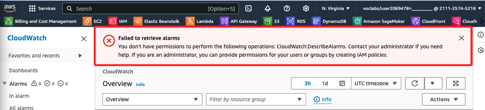

<br>

## 確認權限狀態

_透過代碼查詢各項相關權限_

<br>

1. 首先查看當前的 `訓練工作名稱`，確認這就是 `training_job_name` 變數的值。

    ```python
    xgb_model._current_job_name, training_job_name
    ```

    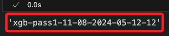

<br>

2. 查詢本地角色權限；結果顯示隱性拒絕了相關權限，也就是 `未經授權`。

    ```python
    # 定義要檢查的操作權限
    _actions = [
        'cloudwatch:GetMetricStatistics',
        'cloudwatch:ListMetrics',
    ]

    # 獲取角色 ARN
    _role = role_arn_local

    # 模擬角色權限
    try:
        response = iam_client.simulate_principal_policy(
            PolicySourceArn=_role,
            ActionNames=_actions
        )

        # 分析回應結果
        for result in response['EvaluationResults']:
            action_name = result['EvalActionName']
            decision = result['EvalDecision']
            print(f"\n操作 '{action_name}' 的權限決策: {decision}")

            # 顯示拒絕原因和條款
            if decision == 'explicitDeny':
                print("拒絕原因條款：", result['MatchedStatements'])
            elif decision == 'allowed':
                print(f"'{action_name}' 被允許執行。")
            else:
                print(f"'{action_name}' 的權限決策未知或未設定明確拒絕。")

    except iam_client.exceptions.NoSuchEntityException:
        print("角色 ARN 無效，請確認角色名稱或帳號 ID。")
    except Exception as e:
        print(f"發生錯誤：{e}")
    ```

    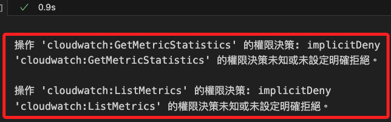

<br>

3. 替換其中的 `Role` 為 `Sagemaker` 的 `role`，就會得到 `allowed` 結果；表示在 Sagemaker 中是可以進行相關查詢的，這樣便提供了繞過未經授權的解決方案。

    ```python
    _role = role_arn
    ```

    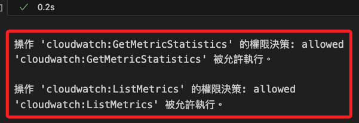

<br>

## 嘗試使用 Lambda

_尚未實作；可嘗試使用 `Lambda` 或 `API Gateway` 將 `TrainingJobAnalytics` 查詢動作移到 `Lambda` 函數中，並通過 `API` 請求獲取結果。_

<br>

## 查看任務績效指標

_使用官方範例模式進行訪問，明確得到無權限的結果_

<br>

1. 透過 `TrainingJobAnalytics` 模組取得當前訓練任務的績效指標，這些指標數據如前所述會存放在 `CloudWatch`，必須透過 CloudWatch 提供的 API 來讀取數據並進行分析。

    ```python
    import sagemaker
    from sagemaker.analytics import TrainingJobAnalytics

    try:
        analytics = TrainingJobAnalytics(
            xgb_model._current_job_name,
            metric_names=['train:error', 'validation:error']
        )
        df = analytics.dataframe()
        print(df)
    except Exception as e:
        print("無法從 SageMaker 獲取訓練指標數據：", e)
    ```

    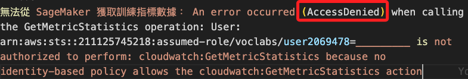

<br>

2. 從輸出也可看到當前 User 是 AWS CLI 所設置的權限，並非透過預簽名網址所取得的角色權限。

    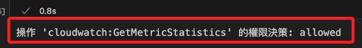

<br>

## 使用預簽名

_在雲端操作_

<br>

1. 取得最新任務名稱。

    ```python
    from sagemaker import Session
    import boto3
    from datetime import datetime, timedelta

    # 初始化 SageMaker Session
    sagemaker_session = Session()

    # 假設我們想查詢最新的訓練任務，使用 describe_training_jobs
    # 獲取最新的訓練任務名稱
    training_jobs = sagemaker_session.sagemaker_client.list_training_jobs(
        SortBy='CreationTime', 
        SortOrder='Descending', 
        MaxResults=1
    )

    # 確認訓練任務存在
    if training_jobs['TrainingJobSummaries']:
        latest_training_job = training_jobs['TrainingJobSummaries'][0]
        training_job_name = latest_training_job['TrainingJobName']
        print(f"最新的訓練任務名稱: {training_job_name}")
    else:
        raise ValueError("沒有找到任何訓練任務。")
    ```

    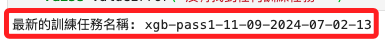

<br>

2. 嘗試列出訓練任務的可用指標名稱。

    ```python
    import boto3
    from sagemaker.analytics import TrainingJobAnalytics

    analytics = TrainingJobAnalytics(
        training_job_name=training_job_name
    )
    df = analytics.dataframe()

    # 提取唯一的指標名稱
    available_metrics = df['metric_name'].unique()
    print("所有可用指標:", available_metrics)
    ```

    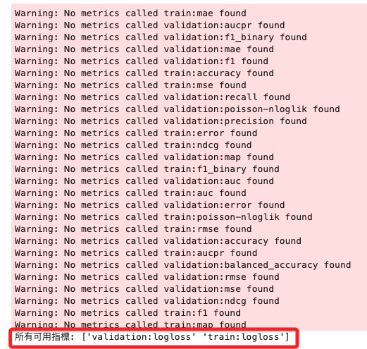

<br>

3. 根據可用指標查詢指標數據。

    ```python
    analytics = TrainingJobAnalytics(
        training_job_name=training_job_name,
        metric_names=list(available_metrics)
    )
    df = analytics.dataframe()
    print("可用指標數據:")
    print(df)
    ```

    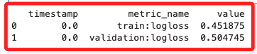

<br>

4. 將訓練任務的指標數據上傳至 S3 並生成一個 `預簽名 URL`，以便在本地或其他環境下載該指標文件。

    ```python
    import io

    # 顯示訓練指標數據
    print("訓練指標數據：")
    print(df)

    # 生成文件名稱和 S3 路徑
    timestamp = datetime.now().strftime("%Y%m%d%H%M%S")
    #
    file_name = f"{training_job_name}_metrics_{timestamp}.csv"
    s3_key = f"training-metrics/{file_name}"

    # 將 DataFrame 儲存為 CSV 格式
    csv_buffer = io.StringIO()
    df.to_csv(csv_buffer, index=False, encoding='utf-8')

    # 將 CSV 上傳到 S3
    s3_client.put_object(
        Bucket=bucket, 
        Key=s3_key, 
        Body=csv_buffer.getvalue()
    )

    # 生成預簽名 URL
    url = s3_client.generate_presigned_url(
        ClientMethod='get_object',
        Params={'Bucket': bucket_name, 'Key': s3_key},
        # URL 有效期（秒），這裡設置為 2 小時
        ExpiresIn=7200
    )
    print("\n預簽名 URL：", url)

    # 將預簽名 URL 寫入 S3 的 `pre_url.txt` 文件
    pre_url_key = "pre_url.txt"
    s3_client.put_object(
        Bucket=bucket_name,
        Key=pre_url_key,
        Body=url
    )
    print(f"\n預簽名 URL 已寫入 S3 文件 {pre_url_key}")
    ```

    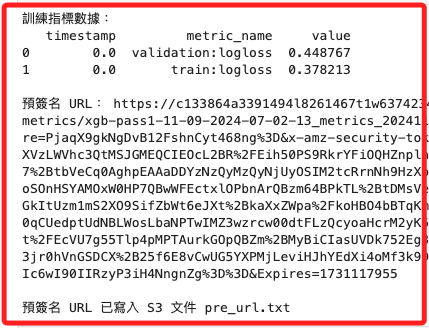

<br>

## 本地查看績效

_回到本機操作_

<br>

1. 首先確認一下 bucket。

    ```python
    bucket_name, bucket
    ```

<br>

2. 在本地運行以下代碼來下載文件。

    ```python
    pre_url_key = "pre_url.txt"

    # 從 S3 下載 `pre_url.txt` 文件，提取預簽名 URL
    response = s3_client.get_object(
        Bucket=bucket_name, Key=pre_url_key
    )
    url = response['Body'].read().decode('utf-8').strip()
    print("從 S3 獲取的預簽名 URL:", url)

    # 使用預簽名 URL 下載文件
    response = requests.get(url)

    if response.status_code == 200:
        # 獲取當前時間戳以用於文件命名
        timestamp = datetime.now().strftime("%Y%m%d%H%M%S")
        # 自動生成本地文件名稱
        local_file_name = f"{training_job_name}_metrics_{timestamp}.csv"
        
        # 將文件內容寫入本地文件
        with open(local_file_name, "wb") as file:
            file.write(response.content)
        print(f"\n指標數據已下載並儲存為 {local_file_name}")
        
        # 嘗試加載 CSV 文件到 DataFrame 中，並自動檢測壓縮和編碼格式
        try:
            df = pd.read_csv(
                local_file_name, compression='infer', encoding='utf-8'
            )
            print("\n本地訓練指標數據：")
            print(df)
        except UnicodeDecodeError:
            # 如果 UTF-8 失敗，嘗試使用其他常見的編碼格式
            try:
                df = pd.read_csv(local_file_name, compression='infer', encoding='ISO-8859-1')
                print("\n本地訓練指標數據：")
                print(df)
            except Exception as e:
                print("加載本地指標數據時發生錯誤：", e)
        except Exception as e:
            print("加載本地指標數據時發生錯誤：", e)
    else:
        print("下載失敗，狀態碼：", response.status_code)
    ```

    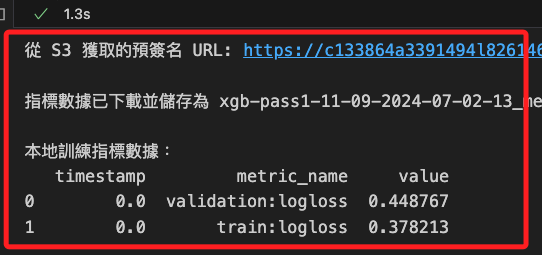

<br>

___

_進入下一步驟_
