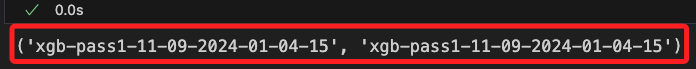
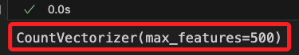

# Lab 4.1

<br>

## 說明

1. 在 SageMaker 的訓練過程中，模型績效指標數據如訓練錯誤率、驗證錯誤率等是儲存在 `CloudWatch` 中，而不是直接儲存在 S3。

<br>

2. 而 `S3` 在這個過程中是用來儲存 `訓練輸入數據`、`訓練輸出結果`、`模型檔案` 等，而非儲存即時的 `指標數據`。

<br>

3. SageMaker 訓練作業會將指標數據上傳到 Amazon CloudWatch，並以 CloudWatch 指標的形式提供，通過這些指標可在訓練中或結束後使用 CloudWatch 查看和監控模型的訓練表現；這些指標包括 `train:error` 和 `validation:error` 等。

<br>

4. 雖然訓練的指標數據不會儲存在 S3，如果需要保存或分析訓練的指標數據，還是可以手動將 CloudWatch 指標數據下載並儲存到 S3，或透過 SageMaker 提供的接口將其轉換為 DataFrame 進行下載。

<br>

5. 因此，若要使用 `sagemaker.analytics.TrainingJobAnalytics` 分析訓練指標，需從 CloudWatch 中提取資料。

<br>

## 進入主控台

1. 嘗試進入服務查看，顯示當前帳號沒有執行 `CloudWatch:DescribeAlarms` 操作的權限，也就是無法查看 `CloudWatch` 中的相關 `alarms` 資訊。

    

<br>

## 查詢任務指標

_監控模型的訓練過程，尤其是衡量模型的訓練和驗證效果，透過這些數據可繪製訓練過程中的指標變化圖，進一步分析模型隨著時間訓練的效果，並進行相應的超參數調整或其他優化操作。_

<br>

1. 確認當前的訓練工作名稱，這就是 `training_job_name` 變數的值。

    ```python
    xgb_model._current_job_name, training_job_name
    ```

    

<br>

2. 查詢本地角色權限。

    ```python
    # 定義要檢查的操作權限
    _actions = [
        'cloudwatch:GetMetricStatistics',
        'cloudwatch:ListMetrics',
    ]

    # 獲取角色 ARN
    _role = role_arn_local

    # 模擬角色權限
    try:
        response = iam_client.simulate_principal_policy(
            PolicySourceArn=_role,
            ActionNames=_actions
        )

        # 分析回應結果
        for result in response['EvaluationResults']:
            action_name = result['EvalActionName']
            decision = result['EvalDecision']
            print(f"\n操作 '{action_name}' 的權限決策: {decision}")

            # 顯示拒絕原因和條款
            if decision == 'explicitDeny':
                print("拒絕原因條款：", result['MatchedStatements'])
            elif decision == 'allowed':
                print(f"'{action_name}' 被允許執行。")
            else:
                print(f"'{action_name}' 的權限決策未知或未設定明確拒絕。")

    except iam_client.exceptions.NoSuchEntityException:
        print("角色 ARN 無效，請確認角色名稱或帳號 ID。")
    except Exception as e:
        print(f"發生錯誤：{e}")
    ```

    

<br>

3. 替換其中的 `Role` 為 `Sagemaker` 的 `role`，就會得到 `allowed` 結果。

    ```python
    _role = role_arn
    ```

    

<br>

## 嘗試使用 Lambda

_尚未實作；SageMaker SDK 並不直接支持在 TrainingJobAnalytics 中傳入 role 參數來繞過本地權限檢查，可嘗試使用 Lambda 或 API Gateway，將 TrainingJobAnalytics 查詢動作移到 Lambda 函數中，並通過 API 請求獲取結果。這樣可以利用 Lambda 函數的 IAM 角色來查詢訓練任務的指標數據。_

<br>

## 使用預簽名處理權限問題

_尚未實作；嘗試以預簽名方式取得 `Cloudwatch` 資訊提供本地_

<br>

## 查看任務績效指標

_尚無法解決，先跳過_

<br>

1. 透過 `TrainingJobAnalytics` 模組取得當前訓練任務的績效指標，這些指標數據如前所述會存放在 `CloudWatch`，必須透過 CloudWatch 提供的 API 來讀取數據並進行分析。

    ```python
    import sagemaker
    from sagemaker.analytics import TrainingJobAnalytics

    try:
        analytics = TrainingJobAnalytics(
            xgb_model._current_job_name,
            metric_names=['train:error', 'validation:error']
        )
        df = analytics.dataframe()
        print(df)
    except Exception as e:
        print("無法從 SageMaker 獲取訓練指標數據：", e)
    ```

    

<br>

2. 從輸出也可看到當前 User 是 AWS CLI 所設置的權限，並非透過預簽名網址所取得的角色權限。

    

<br>

## 在雲端操作

1. 取得最新任務名稱。

    ```python
    from sagemaker import Session
    import boto3
    from datetime import datetime, timedelta

    # 初始化 SageMaker Session
    sagemaker_session = Session()

    # 假設我們想查詢最新的訓練任務，使用 describe_training_jobs
    # 獲取最新的訓練任務名稱
    training_jobs = sagemaker_session.sagemaker_client.list_training_jobs(
        SortBy='CreationTime', 
        SortOrder='Descending', 
        MaxResults=1
    )

    # 確認訓練任務存在
    if training_jobs['TrainingJobSummaries']:
        latest_training_job = training_jobs['TrainingJobSummaries'][0]
        training_job_name = latest_training_job['TrainingJobName']
        print(f"最新的訓練任務名稱: {training_job_name}")
    else:
        raise ValueError("沒有找到任何訓練任務。")
    ```

    

<br>

2. 嘗試列出訓練任務的可用指標名稱。

    ```python
    import boto3
    from sagemaker.analytics import TrainingJobAnalytics

    analytics = TrainingJobAnalytics(
        training_job_name=training_job_name
    )
    df = analytics.dataframe()

    # 提取唯一的指標名稱
    available_metrics = df['metric_name'].unique()
    print("所有可用指標:", available_metrics)
    ```

    

<br>

3. 根據可用指標查詢指標數據。

    ```python
    analytics = TrainingJobAnalytics(
        training_job_name=training_job_name,
        metric_names=list(available_metrics)
    )
    df = analytics.dataframe()
    print("可用指標數據:")
    print(df)
    ```

    

<br>

## 嘗試重建估計器

_應該是無效的，這裡暫時保留，確定指標不是因為新的設置所生成後再刪除_

<br>

1. 改寫如下，建立 SageMaker 執行環境並啟用指標記錄。

    ```python
    from sagemaker import Session
    from sagemaker.estimator import Estimator

    # 建立 SageMaker 會話
    sagemaker_session = Session()

    # 建立 Estimator 並啟用 SageMaker Metrics
    xgb_model = Estimator(
        image_uri=container,
        role=role_arn,
        instance_count=1,
        instance_type='ml.m5.2xlarge',
        output_path=s3_output_location,
        hyperparameters=hyperparams,
        sagemaker_session=sagemaker_session,
        # 正確啟用 SageMaker Metrics
        enable_sagemaker_metrics=True
    )
    ```

<br>

2. 其他參數不變，但是 `training_job_name` 必須是唯一識別。

    ```python
    training_job_name = 'xgb-pass1-'+datetime.now().strftime("%m-%d-%Y-%H-%M-%S")
    training_job_name
    ```

<br>

3. 重新訓練。

    ```python
    xgb_model.fit(
        inputs=data_channels, 
        logs=False, 
        job_name=training_job_name
    )
    ```

<br>

## 進入雲端操作

_這連同重建模型一起刪除_

<br>

1. 取得當前執行環境中的 `訓練任務名稱`。

    ```python
    from sagemaker import Session
    import boto3
    from datetime import datetime, timedelta

    # 初始化 SageMaker Session
    sagemaker_session = Session()

    # 若要查詢最新的訓練任務，使用 describe_training_jobs
    # 獲取最新的訓練任務名稱
    training_jobs = sagemaker_session.sagemaker_client.list_training_jobs(
        SortBy='CreationTime', 
        SortOrder='Descending', 
        MaxResults=1
    )

    # 確認訓練任務存在
    if training_jobs['TrainingJobSummaries']:
        latest_training_job = training_jobs['TrainingJobSummaries'][0]
        training_job_name = latest_training_job['TrainingJobName']
        print(f"最新的訓練任務名稱: {training_job_name}")
    else:
        raise ValueError("沒有找到任何訓練任務。")
    ```

<br>

2. 設置 `CloudWatch` 查詢的時間範圍。

    ```python
    # 取得訓練任務的詳細資訊，包括開始時間和結束時間
    training_job_details = sagemaker_session.sagemaker_client.describe_training_job(
        TrainingJobName=training_job_name
    )

    # 設置查詢時間範圍
    start_time = training_job_details['TrainingStartTime']
    end_time = training_job_details.get('TrainingEndTime', datetime.utcnow())

    print(f"查詢時間範圍: {start_time} - {end_time}")
    ```

<br>

3. 查詢 `CloudWatch` 績效指標。

    ```python
    cloudwatch_client = boto3.client('cloudwatch')

    # 定義需要查詢的 CloudWatch 指標名稱
    metric_names = [
        'train:error', 'validation:error'
    ]

    # 查詢並收集每個指標的數據
    for metric_name in metric_names:
        response = cloudwatch_client.get_metric_statistics(
            Namespace='AWS/SageMaker',
            MetricName=metric_name,
            Dimensions=[{
                'Name': 'TrainingJobName',
                'Value': training_job_name
            }],
            StartTime=start_time,
            EndTime=end_time,
            Period=60,
            Statistics=['Average']
        )
        
        # 將結果轉換成數據框顯示
        if 'Datapoints' in response:
            print(f"{metric_name} 的數據點:")
            for datapoint in response['Datapoints']:
                print(
                    f"時間: {datapoint['Timestamp']}, "
                    f"值: {datapoint['Average']}"
                )
        else:
            print(f"{metric_name} 沒有數據。")
    ```

<br>

4. 完整查詢。

    ```python
    import boto3
    from datetime import datetime, timedelta

    # 建立 SageMaker 客戶端
    sagemaker_client = boto3.client('sagemaker')

    # 自動取得最近完成的訓練任務名稱
    def get_latest_training_job_name():
        response = sagemaker_client.list_training_jobs(
            # 僅獲取最近的任務
            MaxResults=1,
            SortBy='CreationTime',
            SortOrder='Descending'
        )
        if response['TrainingJobSummaries']:
            return response['TrainingJobSummaries'][0]['TrainingJobName']
        else:
            print("沒有找到任何訓練任務")
            return None

    # 取得最新的訓練任務名稱
    training_job_name = get_latest_training_job_name()

    if training_job_name:
        # 查詢訓練任務的詳細資訊
        training_job_details = sagemaker_client.describe_training_job(
            TrainingJobName=training_job_name
        )

        # 檢查 CloudWatch 指標記錄是否已啟用
        print("訓練任務名稱：", training_job_name)
        print("訓練任務的輸出設置：")
        print("OutputDataConfig：", training_job_details.get("OutputDataConfig"))
        print(
            "EnableMetrics：",
            training_job_details.get("EnableMetrics", "未設置")
        )

        # 設定查詢時間範圍，基於訓練開始和結束時間
        start_time = training_job_details.get('TrainingStartTime')
        end_time = training_job_details.get(
            'TrainingEndTime', datetime.utcnow()
        )

        # 檢查時間範圍
        print(f"查詢時間範圍：{start_time} - {end_time}")

        # 查詢 CloudWatch 指標
        cloudwatch_client = boto3.client('cloudwatch')
        metric_names = ['train:error', 'validation:error']

        for metric_name in metric_names:
            response = cloudwatch_client.get_metric_statistics(
                Namespace='AWS/SageMaker',
                MetricName=metric_name,
                Dimensions=[
                    {
                        'Name': 'TrainingJobName',
                        'Value': training_job_name
                    },
                ],
                StartTime=start_time,
                EndTime=end_time,
                Period=60,
                Statistics=['Average']
            )
            # 將結果顯示
            if 'Datapoints' in response and response['Datapoints']:
                print(f"{metric_name} 的數據點：")
                for datapoint in response['Datapoints']:
                    print(
                        f"  時間：{datapoint['Timestamp']}, "
                        f"值：{datapoint['Average']}"
                    )
            else:
                print(f"{metric_name} 沒有數據。")
    else:
        print("無法找到訓練任務來進行 CloudWatch 查詢。")
    ```

<br>

5. 從輸出的結果得知，並無設置指標記錄功能。

    

<br>

6. 回顧之前在建立估計器的步驟中，確實未加入相關設置。

    

<br>

7. 在建立 `Estimator` 的步驟中指定 `enable_sagemaker_metrics` 參數來啟用指標記錄，因為預設情況下，SageMaker 不會啟用這項功能。

    ```python
    # 建立 Estimator
    xgb_model = sagemaker.estimator.Estimator(    
        container,
        role=role_arn,
        instance_count=1,
        instance_type='ml.m5.2xlarge',
        output_path=s3_output_location,
        hyperparameters=hyperparams,
        sagemaker_session=sagemaker.Session(),

        # 啟用指標記錄
        enable_sagemaker_metrics=True
    )
    ```

<br>