# Lab 4.1

_使用 test 資料集進行數據序列化_

<br>

## 在雲端處理

_計算指標，這裡分別說明在雲端及本地的操作_

<br>

1. 在雲端，調用官方範例中自訂函數將數據傳送至 S3。

    ```python
    upload_s3_csv('batch-in.csv', 'batch-in', test_matrix, test, True)
    ```

<br>

2. 其中 'batch-in.csv' 是上傳至 S3 的文件名稱，'batch-in' 是指定 `batch-in` 的路徑，最終會組合成 `f's3://{bucket}/{prefix}/batch-in/batch-in.csv'`；特別強調，`batch-in.csv` 並不是一個已存在的文件，而是程式在內存中動態生成的；當最後一個參數設置為 `is_test=True`，生成後的內容僅包含特徵數據，上傳後將直接存在於 S3 中的指定路徑中。

<br>

3. 第三個參數 `test_matrix` 傳入的是測試數據的 `特徵矩陣`，被省略的參數名稱是 `X_train`。

<br>

4. 第四個參數省略的名瞠視 `y_train`，要傳入的就是測試數據集。

<br>

5. 最後一個參數省略的名稱是 `is_test`，該設置明確表示當前操作是否是測試數據集。如果 `is_test=True`，則不會在 CSV 中包含 `label`，此時只會上傳特徵數據作為測試之用。

<br>

## 上傳序列化數據

_使用預簽名 URL 將序列化數據上傳到 `batch_in_file` 所定義的 S3 key_

<br>

1. 檢查 `預簽名 URL` 是否依舊有效，這是因為 `預簽名網址` 是有時效性的，避免生成過久已經失效。

    ```python
    import requests

    def check_presigned_url(url):
        response = requests.get(url)
        if response.status_code == 200:
            print("預簽名 URL 有效。")
        else:
            print(f"預簽名 URL 無效，狀態碼：{response.status_code}")
            print(f"錯誤內容：{response.text}")

    check_presigned_url(url)
    ```

    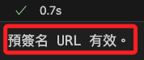

<br>

2. 使用之前步驟建立的 `向量化器 vectorizer` 處理測試數據集；因為不包含標籤，所以特徵數為 `500`。

    ```python
    # 向量化測試數據
    test_matrix = vectorizer.fit_transform(test['text'])

    # 將向量化的測試數據轉換為 DataFrame
    batch_in_df = pd.DataFrame(
        # 轉換為陣列
        test_matrix.toarray(), 
        columns=vectorizer.get_feature_names_out()
    )
    ```

<br>

3. 若要將標籤欄附加至 DataFrame，則需進行以下步驟，在這裡不需要。


    ```python
    # 添加標籤
    # batch_in_df['label'] = test['label'].values

    # 確保標籤欄在第一欄位置
    # batch_in_df = \
    #     batch_in_df[['label'] + [col for col in batch_in_df.columns \
    #     if col != 'label']]
    ```

<br>

4. 確認欄位名稱及數量。

    ```python
    # 查看前 10 個欄位名稱
    print("前 10 個欄位名稱:", batch_in_df.columns[:10].tolist())
    # 查看欄位總數
    print("欄位總數:", batch_in_df.shape[1])
    ```

    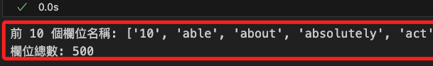

<br>

5. 自定義上傳函數並進行調用，使用預簽名 URL 上傳文件。

    ```python
    def save_csv_to_url(dataframe, url):
        # 將 DataFrame 儲存為 CSV 格式
        csv_buffer = io.StringIO()
        # 移除標題行
        dataframe.to_csv(
            csv_buffer, 
            index=False, 
            header=False
        )
        response = requests.put(
            url, 
            data=csv_buffer.getvalue()
        )
        
        if response.status_code == 200:
            print(f"文件成功上傳至 S3：{url}")
        else:
            print(
                f"上傳失敗，狀態碼：{response.status_code}, "
                f"錯誤內容：{response.text}"
            )

    # 上傳 `batch-in.csv` 文件
    save_csv_to_url(batch_in_df, presigned_urls['batch_in_file'])
    ```

    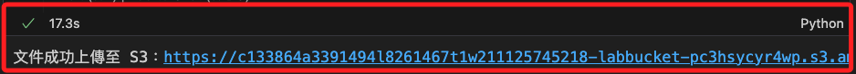

<br>

## 設定路徑參數

1. 設定前先確認路徑變數內容正確。

    ```python
    bucket = bucket_name
    bucket, prefix
    ```

    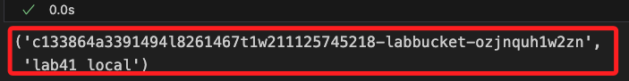

<br>

2. 設定路徑參數。

    ```python
    # 設定輸入
    batch_X_file='batch-in.csv'
    # 這是官方範例的設置，路徑帶有子資料夾
    # batch_input = f's3://{bucket}/{prefix}/batch-in/{batch_X_file}'
    # 這裡要使用這個路徑
    batch_input = f's3://{bucket}/{prefix}/{batch_X_file}'
    # 設定輸出
    batch_output = f's3://{bucket}/{prefix}/batch-out/'
    ```

<br>

## 建立轉換器

_建立 `Transformer Job`；因為權限問題對於官方範例略作修改，避免調用日誌 API 進行檢查作業，這樣不會嘗試訪問 `logs:DescribeLogStreams` 權限，從而避免 `AccessDeniedException` 錯誤。_

<br>

1. 設置參數並初始化轉換器；這裡特別說明，在初始化轉換器時，不要設置 `max_concurrent_transforms` 與 `max_payload` 時，系統會自動調整，除非有充分理由，參數都不用設置。

    ```python
    from sagemaker import Session
    import time

    # 在名稱中加上時間戳以確保使用 `唯一識別名稱`
    unique_job_name = \
        f"xgboost-pass1-{datetime.now().strftime('%Y%m%d%H%M%S')}"
    
    # 初始化轉換器
    xgb_transformer = xgb_model.transformer(
        # 設置執行轉換的實例數量為 1
        instance_count=1,           
        # 指定實例類型 ml.m5.2xlarge，適合處理大型數據
        instance_type='ml.m5.2xlarge',  
        # 設置為 MultiRecord 策略，允許在批次處理時合併多條記錄
        strategy='MultiRecord',     
        # 設定輸出文件中記錄使用 Line，將每條記錄按行存放
        assemble_with='Line',       
        # 指定輸出結果的 S3 路徑
        output_path=batch_output,
        # 角色應該可以不用設置
        # role=role_arn,
        # 指定可以同時運行的最大轉換作業數量
        # max_concurrent_transforms=2,
        # 設置每個請求允許的最大數據負載，以 MB 為單位
        # max_payload=15
    )
    ```

    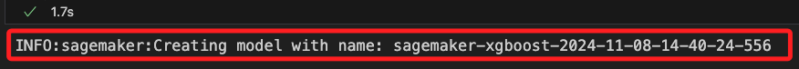

<br>

2. 將模型名稱記錄在變數 `model_name` 中。

    ```python
    model_name = xgb_transformer.model_name
    model_name
    ```

<br>

3. 另外在進行轉換器建立時也生成一個 `轉換工作名稱`，避免混淆也輸出查看一下。

    ```python
    unique_job_name
    ```

    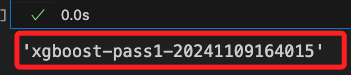

<br>

4. 以及之前訓練工作的名稱 `training_job_name`。

    ```python
    training_job_name
    ```

    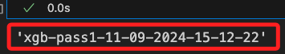

<br>

## 查看設置

_完成前一個步驟後，可觀察參數設置_

<br>

1. 透過 Python 內建的 `.__dict__` 屬性可做更深層的檢視；由下方的檢視得到一個重大資訊，就是在建立轉換器的時候不用再指定角色，因為在建立 `估計器（Estimator）` 物件時就設置了 role，這個角色在 `Estimator` 物件初始化後就與其綁定，在後續任何需要授權的操作中自動繼承，並且無法修改。

    ```python
    # 檢視 transformer 設置
    print(xgb_transformer.__dict__)
    ```

    _輸出_

    ```bash
    {
        # 模型的名稱
        'model_name': 'sagemaker-xgboost-2024-11-09-13-15-36-410', 
        # 批量處理時會將多條記錄合併
        'strategy': 'MultiRecord', 
        # 結果的 S3 輸出路徑
        'output_path': 's3://c133864a3391494l8261467t1w637423426529-labbucket-thwjkzq0oltf/lab41_local/batch-out/', 
        'accept': None, 
        # 每條記錄會按行存放在輸出文件中
        'assemble_with': 'Line', 
        'instance_count': 1, 
        'instance_type': 'ml.m5.2xlarge', 
        'max_concurrent_transforms': None, 
        'max_payload': None, 
        'tags': None, 
        'base_transform_job_name': 'sagemaker-xgboost', 
        '_current_job_name': None, 
        'latest_transform_job': None, 
        '_reset_output_path': False, 
        'sagemaker_session': <sagemaker.session.Session object at 0x316cbf5b0>, 
        'volume_kms_key': None, 
        'output_kms_key': None, 
        'env': None
    }
    ```

<br>

## 進行轉換工作

1. 執行 `轉換工作`，可透過參數設置 `wait=False` 讓工作在背景執行；這個過程使用 `xgb_transformer` 進行 `批次轉換（Batch Transformation`，將儲存在 S3 的 `CSV 格式數據` 輸入到 `預訓練模型` 中進行 `推理（inference）`。

    ```python
    xgb_transformer.transform(
        # 指定輸入數據的 S3 路徑
        data=batch_input,           
        # 指定數據類型為 S3Prefix，即以 S3 儲存路徑為前綴
        data_type='S3Prefix',       
        # 設定數據格式為 CSV 格式
        content_type='text/csv',    
        # 設定數據分割方式為 Line，即按行分割處理
        split_type='Line',          
        # 使用唯一的轉換任務名稱
        job_name=unique_job_name,
        # 不等待作業完成
        wait=False,
        # 假如存在忽略 label，只讀取特徵欄位
        # input_filter="$[1:]"
    )
    ```

    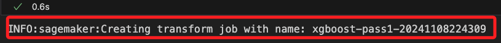

<br>

2. 監看 `轉換工作`；這在進行中會在 `while` 迴圈中持續輸出直到狀態不再是 `InProgress`，換句話說，當失敗 `Failed` 的時候也是會結束回圈；相當耗時，約略七八分鐘，每 `30` 秒會檢查一次狀態。

    ```python
    # 建立 SageMaker Session
    session = Session()
    # 指定狀態
    status = 'InProgress'
    # 輸出訊息
    print(f"開始監控轉換作業狀態，作業名稱：{unique_job_name}")
    
    # 等待轉換任務完成，並完全避免日誌查詢
    while status == 'InProgress':
        response = session.sagemaker_client.describe_transform_job(TransformJobName=unique_job_name)
        status = response['TransformJobStatus']
        print(f"作業狀態: {status}")
        # 每 30 秒檢查一次狀態
        time.sleep(30)

    print(f"轉換任務最終狀態: {status}")
    ```

    

<br>

3. 等候約六、七分鐘顯示完成。

    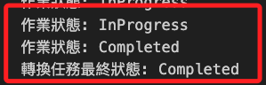

<br>

## 查看 CloudWatch Log

_進入雲端，使用 `CloudWatch` 檢查詳細的日誌，因為 SageMaker 的轉換任務會自動記錄在 CloudWatch Logs 中；無論成功或是失敗都可進行查看。_

<br>

1. 確認日誌組 `/aws/sagemaker/TransformJobs` 是否存在。

    ```python
    # 列出所有日誌組
    log_groups = logs_client.describe_log_groups()
    # 檢查是否存在
    if any(log_group['logGroupName'] == log_group_name for log_group in log_groups['logGroups']):
        print("日誌組存在。")
    else:
        print("日誌組不存在。")
    ```

<br>

2. 在雲端運行以下代碼進行檢查。

    ```python
    import boto3
    import time

    # 初始化 SageMaker 和 CloudWatch 客戶端
    session = boto3.Session()
    sagemaker_client = session.client('sagemaker')
    logs_client = session.client('logs')

    # 設置日誌組名稱
    log_group_name = '/aws/sagemaker/TransformJobs'

    # 自動檢索最新的轉換任務
    response = sagemaker_client.list_transform_jobs(
        SortBy='CreationTime',
        SortOrder='Descending',
        # 只取最新的任務
        MaxResults=1
    )

    # 確認是否找到轉換任務
    if not response['TransformJobSummaries']:
        print("無法找到任何轉換任務。")
    else:
        # 取得最新的轉換任務名稱
        latest_job_name = response['TransformJobSummaries'][0]['TransformJobName']
        print(f"最新的轉換任務名稱: {latest_job_name}")

        # 設置日誌流前綴
        log_stream_prefix = latest_job_name

        # 列出日誌流並查詢錯誤訊息
        log_streams = logs_client.describe_log_streams(
            logGroupName=log_group_name,
            logStreamNamePrefix=log_stream_prefix
        )

        # 輸出日誌訊息
        for log_stream in log_streams['logStreams']:
            log_stream_name = log_stream['logStreamName']
            log_events = logs_client.get_log_events(
                logGroupName=log_group_name,
                logStreamName=log_stream_name
            )
            for event in log_events['events']:
                print(event['message'])
    ```

<br>

## 發生失敗

1. Job 失敗時會顯示如下訊息，先觀察 CloudWatch，然後依據不同原因進行排除。

    

<br>

## 錯誤狀況一：數據不對稱

_特徵數與模型不合_

<br>

1. 日誌顯示無法評估所提供的有效負荷，因為 `csv` 推理資料有 `501` 個特徵，但訓練模型只有 `500` 個特徵。

    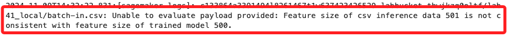

<br>

2. 先查看 `batch_input` 路徑。

    ```python
    batch_input
    ```

<br>

3. 查看 `batch_input` 數據的前十個欄位。

    ```python
    import boto3
    import pandas as pd
    from io import StringIO

    # 初始化 S3 客戶端
    s3_client = boto3.client('s3')

    # 提取 bucket 和 key
    s3_path = batch_input.replace("s3://", "").split("/", 1)
    bucket_name = s3_path[0]
    file_key = s3_path[1]

    # 從 S3 下載文件並僅讀取前幾行
    s3_object = s3_client.get_object(Bucket=bucket_name, Key=file_key)
    data_sample = pd.read_csv(StringIO(s3_object['Body'].read().decode('utf-8')), nrows=5)

    # 查看前 10 個欄位名稱
    print("前 10 個欄位名稱:", data_sample.columns[:10].tolist())

    # 可選：查看數據的前 5 行
    print(data_sample.head())
    ```

<br>

4. 顯示如下，這裡沒有顯示第一個欄位是否為 `label`，但從數值來看，只有 `0、1` 的數據應該是 label 無誤，不過這個錯誤應該從源頭處理，在前面上傳時就必須去除，之後再來重做。

    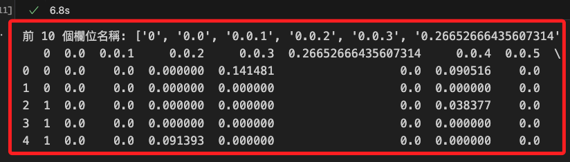

<br>

5. 若確認是數據問題，可在轉換任務中忽略 CSV 文件的第一欄位 `label`，只讀取剩餘的 `500` 個特徵欄位。

    ```python
    xgb_transformer.transform(
        # 指定輸入數據的 S3 路徑
        data=batch_input,           
        # 指定數據類型為 S3Prefix，即以 S3 存儲路徑為前綴
        data_type='S3Prefix',       
        # 設定數據格式為 CSV 格式
        content_type='text/csv',    
        # 設定數據分割方式為 Line，即按行分割處理
        split_type='Line',          
        # 使用唯一的轉換任務名稱
        job_name=unique_job_name,
        # 不等待作業完成
        wait=False,
        # 忽略 CSV 文件的第一列（label），只讀取特徵欄位
        input_filter="$[1:]"
    )
    ```

<br>

## 錯誤狀況二：關於數據量過大

1. 當錯誤訊息顯示 `The data value transmitted exceeds the capacity limit.`，表示轉換作業數據量超過了預設的允許範圍，透過增大 `max_payload` 限制來調整。

    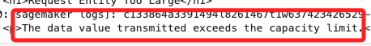

<br>

2. 修正數量限額，將數值由 `10` 提高到 `50`。

    ```python
    xgb_transformer = xgb_model.transformer(
        # 設置執行轉換的實例數量為 1
        instance_count=1,           
        # 指定實例類型 ml.m5.2xlarge，適合處理大型數據
        instance_type='ml.m5.2xlarge',
        # 設置為 MultiRecord 策略，允許在批次處理時合併多條記錄
        strategy='MultiRecord',     
        # 設定輸出文件中記錄使用 Line，將每條記錄按行存放
        assemble_with='Line',       
        # 指定輸出結果的 S3 路徑
        output_path=batch_output,
        #
        role=role_arn,
        max_concurrent_transforms=4,
        # 增加負載限制
        max_payload=50
    )
    ```

<br>

3. 這樣的設置會引發另一個錯誤，兩者乘積不可超過 100 MB。

    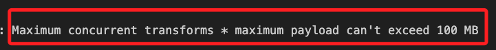

<br>

4. 重新調整如下。

    ```python
    xgb_transformer = xgb_model.transformer(
        # 設置執行轉換的實例數量為 1
        instance_count=1,           
        # 指定實例類型 ml.m5.2xlarge，適合處理大型數據
        instance_type='ml.m5.2xlarge',
        # 設置為 MultiRecord 策略，允許在批次處理時合併多條記錄
        strategy='MultiRecord',     
        # 設定輸出文件中記錄使用 Line，將每條記錄按行存放
        assemble_with='Line',       
        # 指定輸出結果的 S3 路徑
        output_path=batch_output,
        #
        role=role_arn,
        max_concurrent_transforms=1,
        # 增加負載限制
        max_payload=20
    )
    ```

<br>

## 錯誤狀況三：關於超過限額

1. 若錯誤訊息顯示 `ResourceLimitExceeded` 代表超過限額，略作等待再執行。

    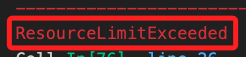

<br>

2. 超過限額時，也可以調整 `instance_type` 參數，使用較小規格的實例通常限額較高。

    ```python
    xgb_transformer = xgb_model.transformer(
        instance_count=1,           
        # 使用較小規格的實例
        instance_type='ml.m5.xlarge',
        strategy='MultiRecord',     
        assemble_with='Line',       
        output_path=batch_output,
        role=role_arn
    )
    ```

<br>

## 各項檢查方式

1. 查看工作詳細資訊，可使用 `describe_transform_job` 進行。

    ```python
    # 可使用當前 Job，或是手動輸入前一項的輸出來查看指定 Job
    failed_job_name = unique_job_name
    failed_job_details = sagemaker_client.describe_transform_job(
        TransformJobName=failed_job_name
    )
    print(
        "失敗原因:", 
        failed_job_details.get('FailureReason', '未提供失敗原因')
    )
    ```

    

<br>

2. 查詢指定狀態的 Job，只需在 `list_transform_jobs` 方法中添加 `StatusEquals` 參數即可。

    ```python
    # 指定狀態
    _status = 'Failed'
    # 取得回應
    response = sagemaker_client.list_transform_jobs(
        StatusEquals=_status
    )
    ```

    

<br>

3. 若要檢查當前 `轉換工作` 的狀態，先確認當前 `轉換工作的名稱`。

    ```python
    unique_job_name
    ```

<br>

4. 使用當前轉換工作名稱進行狀態檢查。

    ```python
    def check_transform_job_status(job_name):
        try:
            # 使用 describe_transform_job 查詢指定名稱的 Transform Job 狀態
            response = sagemaker_client.describe_transform_job(
                TransformJobName=job_name
            )
            
            # 提取所需的資訊
            job_status = response['TransformJobStatus']
            failure_reason = response.get('FailureReason', 'N/A')
            
            print(f"作業名稱: {job_name}")
            print(f"狀態: {job_status}")
            if job_status == 'Failed':
                print(f"失敗原因: {failure_reason}")
        
        except sagemaker_client.exceptions.ResourceNotFoundException:
            print(f"未找到 Transform Job '{job_name}'。請檢查名稱是否正確。")

    # 使用指定的唯一名稱查詢作業狀態
    check_transform_job_status(unique_job_name)
    ```

    

<br>

5. 列出當前全部轉換工作；特別注意，AWS 有資源配額限制，在 `ml.m5.2xlarge` 類型的 `transform job` 實例數量限制為 `2` 個，假如 `InProgress` 已經達到限額也是出錯的。

    ```python
    # 列出當前的 Transform Jobs
    response = sagemaker_client.list_transform_jobs()

    # 顯示每個 Transform Job 的名稱及其狀態
    print("當前 Transform Job 清單:")
    for job in response['TransformJobSummaries']:
        job_name = job['TransformJobName']
        job_status = job['TransformJobStatus']
        print(f"作業名稱: {job_name}, 狀態: {job_status}")
    ```

    

<br>

## 下載模型文件

_若要手動下載指定 file_key 文件到本地_

<br>

1. 查詢 `training_job_name`。

    ```python
    training_job_name
    ```

<br>

2. 重新組合 `file_key`。 

    ```python
    gz_file_name = 'model.tar.gz'
    file_key = f'{prefix}/output/{training_job_name}/output/{gz_file_name}'
    ```

<br>

3. 檢查指定 `file_key` 是否存在。

    ```python
    import boto3
    from botocore.exceptions import NoCredentialsError, ClientError

    # 設定 S3 客戶端
    s3_client = boto3.client('s3')

    # 指定 bucket 名稱和 key
    # file_key = 'lab41_local/output/xgb-pass1-11-08-2024-16-21-08/output/model.tar.gz'

    def check_s3_object(bucket, key):
        try:
            # 嘗試檢查指定的 S3 物件是否存在
            s3_client.head_object(Bucket=bucket, Key=key)
            print(f"Bucket '{bucket}' 中的文件 '{key}' 存在。")
        except ClientError as e:
            # 如果文件不存在或發生權限錯誤，會拋出 ClientError
            if e.response['Error']['Code'] == '404':
                print(f"文件 '{key}' 在 Bucket '{bucket}' 中不存在 (404)。")
            elif e.response['Error']['Code'] == '403':
                print(f"無權訪問 Bucket '{bucket}' 或文件 '{key}' (403)。")
            else:
                print(f"無法檢查文件 '{key}'：{e}")
        except NoCredentialsError:
            print("找不到 AWS 憑證，請確認憑證設定。")

    # 執行檢查
    check_s3_object(bucket_name, file_key)
    ```

    _結果顯示存在_

    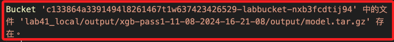

<br>

4. 將此 `file_key` 文件下載到本地。

    ```python
    import boto3

    # 設定 S3 客戶端
    s3_client = boto3.client('s3')

    # 本地儲存路徑
    local_path = 'model.tar.gz'

    # 下載文件
    s3_client.download_file(bucket_name, file_key, local_path)
    print("文件下載完成，儲存在本地:", local_path)
    ```

    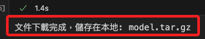

<br>

___

_進入下一階段_