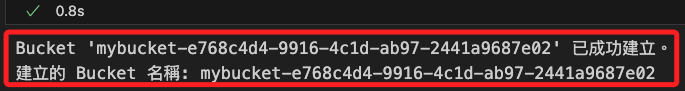
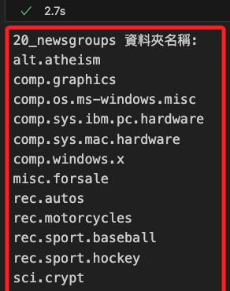
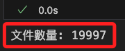
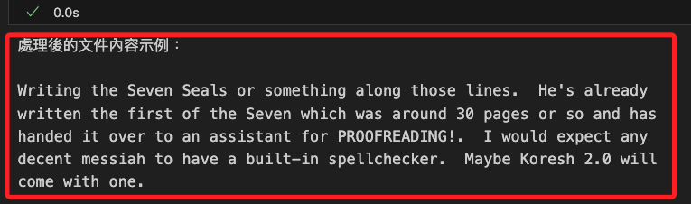
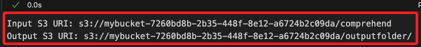

# Lab 6.1 官方範例

_以下操作比較特殊，因為無法在本地進行 Lab 專案的諸多操作，一定要在 Sagemaker 運行，這與我的學習目的不同，所以以下筆記將對官方範例進行改寫，以能在個人帳號中運行為目標。_

<br>

## 說明

1. 這個範例使用 `Comprehend` 實作 `主題建模`，數據是從數據集 [20 個新聞組] (https://archive.ics.uci.edu/ml/datasets/Twenty+Newsgroups) 中提取主題。

    

<br>

2. 以下實作分做幾個步驟，按進程為 `建立變量`、`導入數據`、`清洗數據`、`分析 Comprehend 任務輸出` 等主要階段。

<br>

## 關於數據集

1. 使用的 `20 個新聞組` 數據集是近 `20,000` 個 `新聞文件` 的集合，這些文件平均分佈在 `20` 個不同的 `新聞組` 中。

<br>

2. 此數據集常用於機器學習技術如 `文本分類` 和 `文本聚類` 的應用，在本範例中將了解如何使用 `神經主題模型 (NTM) 演算法` 從此組文檔中學到主題。

<br>

3. 數據集資訊可參考連結 [Tom Mitchell，*20 Newsgroups Data*，1999 年 9 月 9 日，由 UCI KDD Archive 發布](https://kdd.ics.uci.edu/databases/20newsgroups/20newsgroups.data.html)。

<br>

## 準備工作

_建立本地工作環境_

<br>

1. 建立專案資料夾。

    ```bash
    mkdir -p ~/Desktop/_test_ && cd ~/Desktop/_test_
    touch .env .gitignore ex01.ipynb
    echo ".env" >> .gitignore
    code .
    ```

<br>

2. 可進行 `AWS CLI` 設置，或在 `.env` 貼上以下內容，相關設置可在 `AWS` 主控台或是 `~/.aws` 中查詢，在此暫不贅述；若已設置可跳過此 `2、3` 兩步驟，直接進行下一個小節的檢查工作。

    ```bash
    aws_access_key_id = XXXXXXXXXXXXXXXXXXXXXXXXXX
    aws_secret_access_key = XXXXXXXXXXXXXXXXXXXXXXXXXX
    ```

<br>

3. 緊接著在下方貼上以下內容。

    ```bash
    AWS_ACCESS_KEY_ID=${aws_access_key_id}
    AWS_SECRET_ACCESS_KEY=${aws_secret_access_key}
    AWS_SESSION_TOKEN=${aws_session_token}
    AWS_DEFAULT_REGION=us-east-1
    ```

<br>

## 各項檢查

1. 在 `ex01.ipynb` 中選擇適當核心如 `envAWS`，貼上並運行以下代碼，確認設置是否正確。

    ```python
    import boto3

    # 載入 .env 檔案中的環境變數
    from dotenv import load_dotenv
    import os
    load_dotenv()

    # 建立 STS 客戶端
    sts_client = boto3.client("sts")

    # 呼叫 get_caller_identity 以取得當前 AWS 帳號資訊
    response = sts_client.get_caller_identity()
    account_id = response["Account"]

    print(f"AWS Account ID: {account_id}")
    ```

    (images/img_02.png)

<br>

2. 務必進入主控台確認是否與目標 Account 的 ID 相同。

    

<br>

3. 查看預設 S3 的內容；除了帳號本身的 Bucket 以外，尚未對這個專案準備任何的 Bucket。

    ```python
    import boto3

    # 建立 S3 資源對象
    s3 = boto3.resource('s3')

    def list_s3_bucket_structure(bucket_name):
        bucket = s3.Bucket(bucket_name)
        print(f"Bucket: {bucket_name}")
        
        has_objects = False
        for obj in bucket.objects.all():
            print(" └── ", obj.key)
            has_objects = True

        if not has_objects:
            print(" └── <此 bucket 為空>")

    # 取得所有 bucket 名稱並顯示每個 bucket 的樹狀結構
    s3_client = boto3.client("s3")
    buckets = s3_client.list_buckets()["Buckets"]

    if buckets:
        for bucket in buckets:
            list_s3_bucket_structure(bucket["Name"])
    else:
        print("當前為空的：沒有任何 S3 bucket")
    ```

    

<br>

4. 查詢是否有自訂義的 Role。

    ```python
    import boto3
    import re

    # 初始化 IAM 客戶端
    iam_client = boto3.client("iam")

    def list_strictly_custom_roles():
        try:
            # 列出所有角色
            roles = iam_client.list_roles()["Roles"]
            
            # 定義過濾條件，排除掉包含常見 AWS 系統角色名稱的角色
            aws_managed_patterns = [
                r"^AWSServiceRoleFor",         # 預設服務角色
                r"^AWSReservedSSO_",           # SSO 角色
                r"^rds-monitoring-role",       # RDS 監控角色
                r"^AWSOpsWorks",               # OpsWorks 相關角色
                r"^AWSCloudTrail",             # CloudTrail 相關角色
                r"^AWSConfig",                 # Config 服務角色
                r"^EMR_",                      # EMR 相關角色
                r"^AmazonEC2RoleforSSM"        # EC2 連接 SSM 的角色
            ]

            # 過濾條件設定
            pattern = re.compile("|".join(aws_managed_patterns))

            # 僅保留自定義角色
            custom_roles = [
                role for role in roles 
                if not pattern.search(role["RoleName"])
            ]

            # 輸出自定義角色名稱和 ARN
            if custom_roles:
                print("自定義 IAM 角色:")
                for role in custom_roles:
                    print(f"角色名稱: {role['RoleName']}, ARN: {role['Arn']}")
            else:
                print("沒有自定義 IAM 角色。")
                
        except Exception as e:
            print(f"無法取得角色列表。錯誤訊息：{e}")

    # 執行查詢
    list_strictly_custom_roles()
    ```

    

<br>

## 開始運行專案

_建立 Bucket_

<br>

1. 與官方代碼不同，這裡將修改適用於個人帳號，並且生成 `mybucket` 前綴的隨機 `bucket` 名稱。

    ```python
    import boto3
    import uuid

    # 初始化 S3 客戶端
    s3_client = boto3.client("s3")

    # 生成隨機命名的 bucket，並以 mybucket 為前綴
    def create_unique_bucket_name():
        unique_id = uuid.uuid4()
        return f"mybucket-{unique_id}"

    # 建立 bucket 並返回名稱
    def create_bucket():
        bucket_name = create_unique_bucket_name()
        try:
            s3_client.create_bucket(Bucket=bucket_name)
            print(f"Bucket '{bucket_name}' 已成功建立。")
            return bucket_name  # 返回 bucket 名稱字符串
        except Exception as e:
            print(f"無法建立 Bucket '{bucket_name}'。錯誤訊息：{e}")
            return None

    # 獲取創建的 bucket 名稱
    bucket_name = create_bucket()

    # 確認 bucket 名稱
    if bucket_name:
        print(f"建立的 Bucket 名稱: {bucket_name}")
    else:
        print("無法建立 Bucket。")
    ```

    

<br>

2. 可進入主控台查看。

    

<br>

## 建立 ARN

1. 使用 AWS Comprehend 需準備一個具備權限的 IAM 角色 ARN，並且不可使用 root 帳號的 ARN，以下代碼建立 Comprehend 使用的 IAM 角色，設定為允許 comprehend.amazonaws.com 服務假設該角色，並為角色附加 AmazonS3ReadOnlyAccess 和 ComprehendFullAccess 兩個必要策略，若角色已存在則直接取得並返回 ARN。

    ```python
    import json
    from botocore.exceptions import ClientError

    # 初始化 IAM 客戶端
    iam_client = boto3.client("iam")

    # 建立 IAM 角色並附加所需策略
    def create_comprehend_role(role_name="ComprehendDataAccessRole"):
        try:
            # 構建角色的信任策略
            assume_role_policy = {
                "Version": "2012-10-17",
                "Statement": [
                    {
                        "Effect": "Allow",
                        "Principal": {"Service": "comprehend.amazonaws.com"},
                        "Action": "sts:AssumeRole"
                    }
                ]
            }

            # 嘗試建立角色
            role = iam_client.create_role(
                RoleName=role_name,
                AssumeRolePolicyDocument=json.dumps(assume_role_policy),
                Description="Role for Comprehend data access"
            )

            # 附加所需的策略
            iam_client.attach_role_policy(
                RoleName=role_name,
                PolicyArn="arn:aws:iam::aws:policy/AmazonS3ReadOnlyAccess"
            )
            iam_client.attach_role_policy(
                RoleName=role_name,
                PolicyArn="arn:aws:iam::aws:policy/ComprehendFullAccess"
            )
            
            print(f"角色 '{role_name}' 已成功建立並附加必要的策略。")
            return role["Role"]["Arn"]
        except ClientError as e:
            if e.response['Error']['Code'] == 'EntityAlreadyExists':
                # 如果角色已存在，則取得其 ARN
                role_arn = iam_client.get_role(RoleName=role_name)["Role"]["Arn"]
                print(f"角色 '{role_name}' 已存在。使用現有角色的 ARN。")
                return role_arn
            else:
                print(f"無法建立或獲取角色 '{role_name}'。錯誤訊息：{e}")
                return None

    # 建立或取得角色 ARN
    data_access_role_arn = create_comprehend_role()

    # 輸出確認
    if data_access_role_arn:
        print(f"Data Access Role ARN: {data_access_role_arn}")
    else:
        print("無法取得 Data Access Role ARN。")
    ```

    

<br>

## 下載並解壓縮數據

_這裡是解壓縮下載的文檔然後取出所需的資料集壓縮檔，特別注意，取出的文檔依舊是個壓縮檔。_

<br>

1. 在資料集部分，Lab 已將數據儲存在 S3 的 Bucket 中，在這裡將自行從數據集官網下載；下載後會進行解壓縮，保留並移動其中 `20_newsgroups.tar.gz` 到當前目錄中，其餘刪除；這就是 Lab 中使用的壓縮文件。

    ```python
    import requests
    import zipfile
    import os
    import shutil

    # 要下載的 URL
    url = "https://archive.ics.uci.edu/static/public/113/twenty+newsgroups.zip"
    local_zip = "twenty_newsgroups.zip"
    target_file = "20_newsgroups.tar.gz"

    # 下載文件
    def download_file(url, filename):
        with requests.get(url, stream=True) as response:
            response.raise_for_status()
            with open(filename, 'wb') as file:
                for chunk in response.iter_content(chunk_size=8192): 
                    file.write(chunk)
        print(f"文件已下載並儲存為 {filename}")

    # 解壓縮並保留指定文件
    def extract_and_clean(zip_filename, target_file, destination="."):
        temp_dir = os.path.join(destination, "temp_extracted")
        
        # 建立臨時資料夾進行解壓縮
        os.makedirs(temp_dir, exist_ok=True)
        
        # 解壓縮至臨時資料夾
        with zipfile.ZipFile(zip_filename, 'r') as zip_ref:
            zip_ref.extractall(temp_dir)
        
        # 尋找並移動目標文件
        target_path = os.path.join(temp_dir, target_file)
        if os.path.exists(target_path):
            shutil.move(target_path, os.path.join(destination, target_file))
            print(f"{target_file} 已移動到當前資料夾")
        else:
            print(f"未找到 {target_file}")

        # 刪除臨時資料夾
        shutil.rmtree(temp_dir)
        print("臨時解壓縮資料夾已刪除")

    # 運行下載和處理
    download_file(url, local_zip)
    extract_and_clean(local_zip, target_file)

    # 刪除 zip 檔
    os.remove(local_zip)
    print("下載的壓縮檔已刪除")
    ```

    

<br>

## 解壓縮數據集

_接下來要進行數據集的解壓縮_

<br>

1. 使用代碼進行解壓縮工作，同時輸出解壓縮後的子資料夾列表。

    ```python
    import tarfile
    import os

    # 解壓縮 .tar.gz 文件
    with tarfile.open('20_newsgroups.tar.gz', 'r:gz') as tar:
        # 壓縮檔案內已經設定路徑，這裡無需再指定 path 參數
        tar.extractall()

    # 列出解壓縮後的內層資料夾名稱
    print("20_newsgroups 內層資料夾名稱:")
    for folder_name in sorted(os.listdir('20_newsgroups')):
        folder_path = os.path.join('20_newsgroups', folder_name)
        if os.path.isdir(folder_path):
            print(folder_name)
    ```

    

<br>

2. 統計總文件數量，如前面描述的近 `20,000` 筆。

    ```python
    data_dir = '20_newsgroups'

    folders = [
        os.path.join(data_dir, f) for f in sorted(os.listdir(data_dir)) if os.path.isdir(os.path.join(data_dir, f))
    ]
    file_list = [
        os.path.join(d, f) for d in folders for f in os.listdir(d)
    ]
    print('文件數量:', len(file_list))
    ```

    

<br>

## 數據清洗

_檢查數據並執行一些標準的 `NLP` 數據清洗工作。_

<br>

1. 顯示 *指定文件* 的內容。

    ```python
    file_path = "20_newsgroups/comp.graphics/37917"

    # 打開文件並讀取內容
    with open(file_path, "r") as file:
        content = file.read()

    # 輸出文件內容
    print(content)
    ```

    _輸出_

    ```bash
    Path: cantaloupe.srv.cs.cmu.edu!crabapple.srv.cs.cmu.edu!fs7.ece.cmu.edu!europa.eng.gtefsd.com!howland.reston.ans.net!usc!elroy.jpl.nasa.gov!nntp-server.caltech.edu!andrey
    From: andrey@cco.caltech.edu (Andre T. Yew)
    Newsgroups: comp.graphics
    Subject: Re: 16 million vs 65 thousand colors
    Date: 3 Apr 1993 19:51:06 GMT
    Organization: California Institute of Technology, Pasadena
    Lines: 28
    Message-ID: <1pkpraINNck9@gap.caltech.edu>
    References: <1993Mar26.210323.27802@midway.uchicago.edu> <dotzlaw-020493084300@murphy.biochem.umanitoba.ca> <d9hh.733845825@dtek.chalmers.se>
    NNTP-Posting-Host: punisher.caltech.edu
    
    d9hh@dtek.chalmers.se (Henrik Harmsen) writes:
    
    >1-4 bits per R/G/B gives horrible machbanding visible in almost any picture.
    
    >5 bits per R/G/B (32768, 65000 colors) gives visible machbanding
    
    >color-gradient picture has _almost_ no machbanding. This color-resolution is 
    
    >see some small machbanding on the smooth color-gradient picture, but all in all,
    >There _ARE_ situiations where you get visible mach-banding even in
    >a 24 bit card. If
    >you create a very smooth color gradient of dark-green-white-yellow
    >or something and turn
    >up the contrast on the monitor, you will probably see some mach-banding.
    
        While I don't mean to damn Henrik's attempt to be helpful here,
    he's using a common misconception that should be corrected.
    
        Mach banding will occur for any image.  It is not the color
    quantization you see when you don't have enough bits.  It is the
    human eye's response to transitions or edges between intensities.
    The result is that colors near the transistion look brighter on
    the brighter side and darker on the darker side.
    
    --Andre
    
    -- 
                Andre Yew andrey@cco.caltech.edu (131.215.139.2)
    ```

<br>

2. 每個新聞組文檔都可能包含以下部分；特別注意，*消息* 就是這個 Lab 希望提取主題的正文。

    ```bash
    頁眉 - 包含標準的新聞組頁眉信息，應將其移除。

    引用文本 - 上一條消息的文本，通常有 ">" 或 "|" 前綴，並且有時以 `writes*`、`wrote`、`said` 或 `says` 開頭。

    消息 - 這就是任務希望從中提取主題的消息正文。

    頁腳 – 通常是以簽名結尾的消息。
    ```

<br>

3. 觀察好數據後，先定義三個函數用來清洗數據，分別是 `移除頁眉`、`移除引用文本` 和 `移除頁腳`。

    ```python
    # 匯入正則表達式模組
    import re

    # 移除新聞組文件中的頁眉
    def strip_newsgroup_header(text):
        # 使用 partition 函數將文本分為三部分，遇到第一個空行（\n\n）分割
        _before, _blankline, after = text.partition('\n\n')
        # 返回空行之後的部分，即去除頁眉的文本
        return after

    # 定義正則表達式，用於匹配常見的引用格式
    _QUOTE_RE = re.compile(
        r'(writes in|writes:|wrote:|says:|said:'
        r'|^In article|^Quoted from|^\||^>)'
    )

    # 定義函數以移除新聞組文件中的引用文字
    def strip_newsgroup_quoting(text):
        # 將文本逐行分割，並過濾掉符合引用格式的行
        good_lines = [
            line for line in text.split('\n') if not _QUOTE_RE.search(line)
        ]
        # 將過濾後的行重新合併為單一文本，行間以換行符號連接
        return '\n'.join(good_lines)

    # 定義函數以移除新聞組文件中的頁腳
    def strip_newsgroup_footer(text):
        # 將文本分割為每一行，並去除多餘的空白行
        lines = text.strip().split('\n')
        # 從最後一行開始，逐行檢查
        for line_num in range(len(lines) - 1, -1, -1):
            line = lines[line_num]
            # 如果該行為空白行或僅包含破折號，則認為是頁腳的開始
            if line.strip().strip('-') == '':
                break

        # 如果找到了頁腳，返回頁腳以上的所有內容
        if line_num > 0:
            return '\n'.join(lines[:line_num])
        else:
            # 如果沒有找到頁腳，返回原文本
            return text
    ```

<br>

4. 運行以上三個函數來清洗數據，也就是 `移除頁眉、頁腳和引號`。

    ```python
    data = []
    for f in file_list:
        with open(f, 'rb') as fin:
            content = fin.read().decode('latin1')   
            content = strip_newsgroup_header(content)
            content = strip_newsgroup_quoting(content)
            content = strip_newsgroup_footer(content)
            data.append(content)
    ```

<br>

5. 列出第一筆處理後的資料內容觀察結果。

    ```python
    print("處理後的文件內容示例：")
    print(data[0])
    ```

    

<br>

6. 確認無誤後，將所有清洗過的數據存入文件 `comprehend_input.txt` 中，每行包含一個文檔。

    ```python
    with open('comprehend_input.txt','w', encoding='UTF-8') as cf:
        for line in data:
            line = line.strip()
            line = re.sub('\n',' ',line)
            line = re.sub('\r',' ',line)
            cf.write(line+'\n')
    ```

<br>

7. 將文件的內容以逐行輸出。

    ```python
    # 文件路徑
    file_path = 'comprehend_input.txt'

    # 讀取並逐行輸出
    try:
        with open(file_path, 'r', encoding='utf-8') as file:
            for i, line in enumerate(file):
                # 去除每行的換行符並顯示
                print(line.strip())
                # 設定僅顯示前 20 行
                if i >= 20:
                    # 最末行顯示提示
                    print("... (顯示前 20 行)")
                    break
    except Exception as e:
        print(f"發生錯誤：{str(e)}")
    ```

<br>

8. 可對儲存後的文件 `comprehend_input.txt` 稍作觀察。

    

<br>

## 上傳數據

_需要將數據上傳到 `S3 Bucket`，這樣 `Comprehend` 才能使用數據。_

<br>

1. 檢查 Bucket 是否存在，若不存在則建立新的 Bucket；當然，這個 Bucket 在前面步驟已經建立，所以會顯示 `already exists`。

    ```python
    from botocore.exceptions import ClientError

    # 初始化 S3 資源
    s3 = boto3.resource('s3')

    # 檢查並建立 bucket
    def ensure_bucket_exists(bucket_name):
        try:
            s3.meta.client.head_bucket(Bucket=bucket_name)
            print(f"Bucket '{bucket_name}' already exists.")
        except ClientError:
            # 若 bucket 不存在，則建立它
            print(
                f"Bucket '{bucket_name}' "
                "does not exist. Creating now..."
            )
            s3.create_bucket(Bucket=bucket_name)
            print(f"Bucket '{bucket_name}' created successfully.")

    # 確保 bucket 存在
    ensure_bucket_exists(bucket_name)
    ```

    

<br>

2. 將數據上傳到 `S3`；大約 `15` 秒完成。

    ```python
    def upload_file_to_s3(bucket_name, file_name, s3_path):
        try:
            # 上傳文件到 S3
            s3.Bucket(bucket_name).upload_file(file_name, s3_path)
            print("上傳完成：", s3_path)
        except ClientError as e:
            print(f"上傳失敗。錯誤訊息：{e}")

    # 調用函數並指定 bucket、文件名稱和 S3 路徑
    upload_file_to_s3(
        bucket_name,
        'comprehend_input.txt',
        'comprehend/newsgroups/comprehend_input.txt'
    )
    ```

    

<br>

3. 上傳後重新運行前面的檢查代碼。

    ```python
    buckets = s3_client.list_buckets()["Buckets"]

    if buckets:
        for bucket in buckets:
            list_s3_bucket_structure(bucket["Name"])
    else:
        print("當前為空的：沒有任何 S3 bucket")
    ```

    

<br>

## 估算成本

_因為使用個人帳號，所以在進行建模之前先估算成本_

<br>

1. 針對要上傳的文件 `comprehend_input.txt` 進行 `Comprehend` 主題建模費用估算。

    ```python
    import os

    # 設定文件資料夾的路徑
    data_dir = '20_newsgroups'

    '''設定費用'''
    # 固定費率為 1 美元
    fixed_cost_per_task = 1.00
    # 前 100 MB 每 MB 的費率
    cost_per_mb_first_100mb = 0.004
    # 超過 100 MB 的每 MB 費率
    cost_per_mb_additional = 0.004
    # 每小時訓練費用（美元）
    training_cost_per_hour = 3.00

    # 預估訓練時數，以小時為單位
    training_hours = 0.5

    # 計算資料夾中所有文件的總字元數和大小（MB）
    def calculate_total_characters_and_size(data_dir):
        total_characters = 0
        total_size_in_bytes = 0

        for dirpath, dirnames, filenames in os.walk(data_dir):
            for filename in filenames:
                file_path = os.path.join(dirpath, filename)
                with open(file_path, 'r', encoding='latin1') as file:
                    content = file.read()
                    total_characters += len(content)
                total_size_in_bytes += os.path.getsize(file_path)

        # 將位元組轉換為 MB
        total_size_in_mb = total_size_in_bytes / (1024 * 1024)
        return total_characters, total_size_in_mb

    # 獲取文件的總字元數和總大小
    total_characters, total_size_in_mb = \
        calculate_total_characters_and_size(data_dir)

    # Comprehend 主題建模的成本估算
    if total_size_in_mb <= 100:
        comprehend_cost = fixed_cost_per_task + (
            total_size_in_mb * cost_per_mb_first_100mb
        )
    else:
        additional_mb = total_size_in_mb - 100
        comprehend_cost = (
            fixed_cost_per_task + \
            (100 * cost_per_mb_first_100mb) + \
            (additional_mb * cost_per_mb_additional)
        )

    # 訓練時間費用，根據 `training_hours` 計算
    training_cost = training_hours * training_cost_per_hour

    # 總預估費用
    total_cost = comprehend_cost + training_cost

    # 輸出結果
    print(f"總字元數量: {total_characters}")
    print(f"文件總大小: {total_size_in_mb:.2f} MB")
    print(f"訓練時數: {training_hours} 小時")
    print(f"預估的 Comprehend 主題建模費用: ${total_cost:.2f}")
    ```

    

<br>

## 主題建模簡介

_主要功能_

<br>

1. 快速理解大規模文本數據的內容概況：透過主題建模生成的主要主題詞彙，可以了解數據集中最常見的討論話題，這樣即使面對龐大的文本數據，仍可透過這些主題迅速掌握數據的概況；在新聞或評論分析中，主題建模可幫助快速理解熱門討論點，例如 `科技`、`政治`、`經濟` 等主題詞彙。

<br>

2. 分類和分群：將文本按主題分群後，可以用於自動分類文檔、客戶評價或技術支持內容，從而優化工作流程。例如，若主題分析結果包含 `產品問題` 或 `客戶需求`，可以根據這些主題詞將支持請求或評價自動分類。

<br>

3. 推薦系統：主題建模的結果可用於推薦系統，例如在內容推薦中，根據用戶對不同主題的興趣進行相似內容推薦。例如，若用戶閱讀的文章主題多集中於 `健康`、`運動`，可推薦相似主題的內容來提升用戶體驗。

<br>

4. 情感與主題結合分析：將主題建模與情感分析結合，可了解用戶對於不同主題的情感反應。例如，分析客戶對於 `價格` 主題的情感是正面還是負面，有助於針對性地改善服務。

<br>

5. 提高搜索與資訊檢索效果：使用主題來標記或標籤文檔後，搜尋引擎或資訊檢索系統可以依據主題提升準確度，讓用戶更容易找到特定主題的內容。

<br>

6. 如何評估效果：您可以基於生成的主題和各主題所涵蓋的文本比例，判斷生成的主題是否符合預期、是否具有意義。例如，若主題詞與數據實際內容吻合，且有助於上述應用情境的提升，則主題建模結果可視為具有實用價值。

<br>

## Comprehend 主題建模的輸出

_兩個文件_

<br>

1. `topic-terms.csv`：列出每個主題的前 `10` 個關鍵詞，可用於標籤化各主題。

<br>

2. `doc-topics.csv`：每個文檔所對應的主題和比例，用於分析文檔與主題的相關性。

<br>

## 進行 Comprehend

1. 設定 Comprehend 主題檢測工作的相關參數。

    ```python
    import uuid

    # 主題數量，表示 Comprehend 要識別的主題數目
    number_of_topics = 20

    # S3 路徑
    input_s3_url = f"s3://{bucket_name}/comprehend"

    # 輸入文件的格式，每行作為單個文件進行處理
    input_doc_format = "ONE_DOC_PER_LINE"

    # 輸入數據的配置字典，包括 S3 路徑和文件格式
    input_data_config = {
        "S3Uri": input_s3_url,
        "InputFormat": input_doc_format
    }

    # 輸出文件的 S3 路徑，主題檢測結果將儲存在此路徑下
    output_s3_url = f"s3://{bucket_name}/outputfolder/"

    # 輸出數據的配置字典，指定 S3 儲存位置
    output_data_config = {
        "S3Uri": output_s3_url
    }

    # 生成工作的唯一識別 ID
    job_uuid = uuid.uuid1()

    # 加入 UUID 組合主題檢測工作名稱
    job_name = f"top-job-{job_uuid}"

    # 確認輸出正確的 S3 URI
    print("Input S3 URI:", input_s3_url)
    print("Output S3 URI:", output_s3_url)
    ```

    _輸出_

    

<br>

2. 開始 `Comprehend` 主題檢測任務；特別注意這個函數中的 `DataAccessRoleArn` 參數，必須設定 Lab 提供的角色來獲取權限，這在後續 Lab 中會提供角色 ARN，但不會再交代這個函數設定。

    ```python
    # 客戶端
    comprehend_client = boto3.client(service_name='comprehend')

    # 啟動主題檢測工作
    start_topics_detection_job_result = comprehend_client.start_topics_detection_job(
        # 指定要識別的主題數量
        NumberOfTopics=number_of_topics,
        # 提供輸入數據的配置
        InputDataConfig=input_data_config,
        # 設定工作名稱
        JobName=job_name,
        # 輸出數據的配置
        OutputDataConfig=output_data_config,
        # 設定資料訪問的角色 ARN，用於允許 Comprehend 存取 S3 上的數據
        DataAccessRoleArn=data_access_role_arn
    )
    ```

<br>

3. 獲取任務狀態並等待任務完成，這個過程相當耗時，在 Sagemaker 中需 `25–35` 分鐘的時間；本機尚未實測。

    ```python
    # 因為這段代碼會運行很久，透過代碼讓程式暫停指定的秒數以顯示進行狀態
    from time import sleep

    # 透過 JobId 確認目前的工作狀態
    job = comprehend_client.describe_topics_detection_job(
        JobId=start_topics_detection_job_result['JobId']
    )

    # 初始化等待時間計數，單位為 `秒`
    waited = 0

    # 設定超時時間，單位為 `分鐘`
    timeout_minutes = 40

    # 透過 while 檢查工作的狀態是否完成
    while job['TopicsDetectionJobProperties']['JobStatus'] != 'COMPLETED':
        # 每次迴圈暫停 30 秒再進行下一次狀態檢查，沒耐心的話可自訂短一點
        sleep(30)
        # 累計已等待的時間，每次 30 秒
        waited += 30

        # 檢查是否已超過自訂的上限時間
        # 若超時則透過語法 assert 終止程式並提示錯誤
        assert waited // 30 < timeout_minutes, "Job timed out after %d seconds." % waited
        
        # 印出 `.` 表示程式正在等待完成
        print('.', end='')

        # 再次查詢工作狀態，更新 job 資訊
        job = comprehend_client.describe_topics_detection_job(
            JobId=start_topics_detection_job_result['JobId']
        )

    # 工作完成
    print('Ready')
    ```

<br>

4. 任務完成，下載結果。

    ```python
    # 取得 Comprehend 工作輸出文件的 S3 URI
    topic_comprehend_output_file = job['TopicsDetectionJobProperties']['OutputDataConfig']['S3Uri']

    # 輸出文件的名稱
    print(f'output filename: {topic_comprehend_output_file}')

    # 移除 S3 URI 的開頭，並拆分出 bucket 名稱和檔案路徑
    topics_comprehend_bucket, topics_comprehend_key = topic_comprehend_output_file.replace("s3://", "").split("/", 1)

    # 顯示從 S3 路徑解析出的檔案路徑（key）
    print(topics_comprehend_key)

    # 建立 S3 資源物件
    s3r = boto3.resource('s3')

    # 從指定的 S3 bucket 下載主題檢測輸出文件到本地，並命名為 'output.tar.gz'
    s3r.meta.client.download_file(
        topics_comprehend_bucket, 
        topics_comprehend_key, 
        'output.tar.gz'
    )
    ```

    _輸出_

    ```bash
    output filename: s3://c133864a3391500l8216998t1w753251772626-labbucket-m0jhfwhqvfik/outputfolder/753251772626-TOPICS-5199ae6b337b522fab6a70844842b5ea/output/output.tar.gz
    outputfolder/753251772626-TOPICS-5199ae6b337b522fab6a70844842b5ea/output/output.tar.gz
    ```

<br>

5. 利用 tarfile 進行解壓縮。

    ```python
    import tarfile
    tf = tarfile.open('output.tar.gz')
    tf.extractall()
    ```

<br>

## 分析 Comprehend 輸出

_Comprehend 下載的壓縮文件包含兩個文件_

<br>

1. `topic-terms.csv` 列出集合中的主題。對於每個主題，此列表包含前 10 個詞語（按權重）；`doc-topics.csv` 列出與主題關聯的文件及其比例。每個文件可以與多個主題關聯。

<br>

2. 將 `topic-terms.csv` 文件加載到 pandas DataFrame 中。

    ```python
    import pandas as pd
    dftopicterms = pd.read_csv("topic-terms.csv")
    ```

<br>

3. 查看前幾行。

    ```python
    dftopicterms.head()
    ```

<br>

4. 輸出每個主題及其熱門詞語。

    ```python
    for t in range(0, number_of_topics):
        rslt_df = dftopicterms.loc[dftopicterms['topic'] == t]
        topic_list = rslt_df['term'].values.tolist()
        print(f'Topic {t:2} - {topic_list}')
    ```

    _輸出_

    ```bash
    Topic  0 - [
        'people', 'thing', 'government', 'force', 'kill', 'live', 'associate', 'gun', 'law', 'moral'
    ]
    Topic  1 - [
        'find', 'source', 'information', 'stuff', 'code', 'delete', 'site', 'ftp', 'image', 'advance'
    ]
    # 以下省略
    ```

<br>

5. 在上一個 CELL 的輸出中選擇一個描述每個主題的詞語，在以下 CELL 中將佔位符文本替換為決定用來描述每個主題的詞語。

    ```python
    colnames = pd.DataFrame({
        'topics': [
            'topic 0', 'topic 1', 'topic 2', 'topic 3', 'topic 4', 
            'topic 5', 'topic 6', 'topic 7', 'topic 8', 'topic 9',
            'topic 10', 'topic 11', 'topic 12', 'topic 13', 
            'topic 14', 'topic 15', 'topic 16', 'topic 17', 
            'topic 18', 'topic 19'
        ]
    })
    ```

<br>

6. 接著，讀取 `doc-topics.csv` 文件。

    ```python
    dfdoctopics = pd.read_csv("doc-topics.csv")
    dfdoctopics.head()
    ```

<br>

7. 為了簡化可視化，選擇 `5` 篇文章進行繪製。

    ```python
    to_chart = dfdoctopics.loc[dfdoctopics['docname'].isin([
        'newsgroups:1000', 'newsgroups:2000', 
        'newsgroups:3000', 'newsgroups:4000', 
        'newsgroups:5000'
    ])]
    ```

<br>

8. 然後，使用 `pivot_table` 函數將 docname 列中的值映射到實際列。

    ```python
    to_chart = to_chart.pivot_table(
        values='proportion', 
        index='topic', 
        columns='docname'
    )
    to_chart.head()
    ```

<br>

9. 最後，繪製新聞組文件的主題。某些文檔具有單一主題，而其他文檔則具有多個主題的組合；加入魔法指令 `%matplotlib inline` 可讓 `Matplotlib` 繪製的圖表直接在 Notebook 的輸出區域中顯示。

    ```python
    import matplotlib.pyplot as plt
    %matplotlib inline

    fs = 12
    to_chart.plot(kind='bar', figsize=(16, 4), fontsize=fs)
    plt.ylabel('Topic assignment', fontsize=fs+2)
    plt.xlabel('Topic ID', fontsize=fs+2)
    ```

<br>

## 刪除所有資源的腳本

1. 刪除。

    ```python
    # 刪除 S3 Bucket 及內容
    def delete_bucket(bucket_name):
        try:
            bucket = s3.Bucket(bucket_name)
            # 刪除 Bucket 中的所有物件
            bucket.objects.all().delete()
            bucket.delete()
            print(f"Bucket '{bucket_name}' 及其內容已刪除。")
        except ClientError as e:
            if e.response['Error']['Code'] == 'NoSuchBucket':
                print(f"Bucket '{bucket_name}' 不存在，無需刪除。")
            else:
                print(f"無法刪除 Bucket '{bucket_name}'。錯誤訊息：{e}")

    # 刪除 Comprehend 任務
    def delete_comprehend_jobs():
        try:
            jobs = comprehend_client.list_topics_detection_jobs()
            for job in jobs['TopicsDetectionJobPropertiesList']:
                if job['JobStatus'] == 'IN_PROGRESS':
                    comprehend_client.stop_topics_detection_job(JobId=job['JobId'])
                    print(f"停止中的 Comprehend 任務: {job['JobId']}")
            print("Comprehend 任務已停止或清除。")
        except ClientError as e:
            print(f"無法列出或停止 Comprehend 任務。錯誤訊息：{e}")

    # 刪除 IAM 角色及其策略
    def delete_iam_role(role_arn):
        try:
            # 提取角色名稱
            role_name = role_arn.split('/')[-1]
            policies = iam_client.list_attached_role_policies(RoleName=role_name)
            for policy in policies['AttachedPolicies']:
                iam_client.detach_role_policy(RoleName=role_name, PolicyArn=policy['PolicyArn'])
            iam_client.delete_role(RoleName=role_name)
            print(f"IAM 角色 '{role_name}' 及其策略已刪除。")
        except ClientError as e:
            if e.response['Error']['Code'] == 'NoSuchEntity':
                print(f"IAM 角色 '{role_name}' 不存在，無需刪除。")
            else:
                print(f"無法刪除 IAM 角色 '{role_name}'。錯誤訊息：{e}")

    # 執行刪除操作
    delete_bucket(bucket_name)
    delete_comprehend_jobs()
    delete_iam_role(data_access_role_arn)

    print("所有資源已刪除。")
    ```

<br>

___

_END_